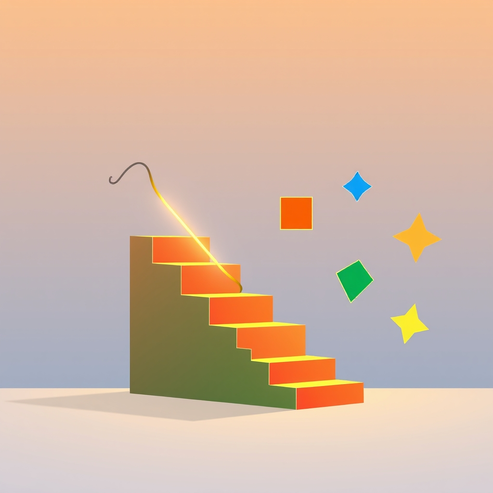

[Home](../index.md) > [Books](./index.md)  
# 📉➡️👍 Better Than Before: What I Learned About Making and Breaking Habits - to Sleep More, Quit Sugar, Procrastinate Less, and Generally Build a Happier Life  
  
[🛒 Better Than Before: What I Learned About Making and Breaking Habits - to Sleep More, Quit Sugar, Procrastinate Less, and Generally Build a Happier Life. As an Amazon Associate I earn from qualifying purchases.](https://amzn.to/4556LsH)  
  
## 🤖 AI Summary  
### 📖 Book Report: Better Than Before 🌟  
  
**TL;DR:** "Better Than Before" offers a framework for understanding and changing habits based on individual tendencies, focusing on the "Four Tendencies" to tailor habit-formation strategies. 🚀  
  
### 🧐 New or Surprising Perspective 💡  
  
Gretchen Rubin's book provides a unique perspective by shifting the focus from generic habit-formation advice to personalized strategies based on individual "Tendencies." 🤯 It suggests that there isn't a one-size-fits-all approach to habits, and understanding your inherent response to expectations is crucial for lasting change. This challenges the common assumption that willpower alone is sufficient for habit change. 🤩  
  
### 📚 Deep Dive: Topics, Methods, and Research 🔬  
  
* **The Four Tendencies:** Rubin introduces four personality types: Upholder, Questioner, Obliger, and Rebel. 🎭 These types are defined by how individuals respond to inner and outer expectations.  
    * **Upholders:** Meet both inner and outer expectations. ✅  
    * **Questioners:** Meet inner expectations but question outer ones. 🤔  
    * **Obligers:** Meet outer expectations but struggle with inner ones. 🤝  
    * **Rebels:** Resist all expectations, both inner and outer. 💥  
* **Strategies for Habit Change:** The book explores various strategies such as monitoring, scheduling, and accountability, tailored to each tendency. 📊  
* **Habit Foundations:** Rubin discusses the importance of foundational habits like sleep, movement, and decluttering. 🛌🏃🧹  
* **Mental Models:** The "Four Tendencies" framework itself is a significant mental model, offering a new lens through which to understand human behavior and habit formation. 🧠  
* **Research:** Rubin draws from her own observations, interviews, and anecdotal evidence rather than rigorous scientific studies. While not heavily research-backed, it provides valuable practical insights. 🧐  
  
### 💡 Prominent Examples 🌟  
  
* **Obligers and Accountability:** Rubin emphasizes the importance of external accountability for Obligers, suggesting techniques like joining groups or hiring coaches. 🧑‍🏫  
* **Questioners and Information:** For Questioners, providing detailed explanations and justifications for habits is crucial. 🧐  
* **Rebels and Identity:** Rebels respond best when habits align with their sense of identity and freedom. 🎸  
* **Upholders and Systems:** Upholders thrive with structured systems and routines. 🗓️  
  
### 🛠️ Practical Takeaways and Step-by-Step Advice 📝  
  
1.  **Identify Your Tendency:** Take the "Four Tendencies" quiz on Gretchen Rubin's website to understand your personality type. 📝  
2.  **Tailor Your Strategies:**  
    * **Obligers:** Find external accountability. Join a group, hire a coach, or tell someone your goals. 🗣️  
    * **Questioners:** Research and understand the "why" behind your habits. Gather data and seek justifications. 🔍  
    * **Rebels:** Link habits to your identity and values. Focus on freedom and choice. 🗽  
    * **Upholders:** Create structured routines and systems. Use checklists and schedules. 📅  
3.  **Focus on Foundations:** Prioritize foundational habits like sleep, movement, and decluttering. 🛌🏃🧹  
4.  **Monitor Your Progress:** Track your habits and make adjustments as needed. Use apps, journals, or spreadsheets. 📈  
5.  **Use the Strategy of Distinctions:** Understand the difference between monitoring and scheduling, or abstaining and moderating, and which works best for you. 🧐  
  
### 🧐 Critical Analysis 🧐  
  
"Better Than Before" is a highly accessible and practical guide to habit change. However, it relies heavily on anecdotal evidence and Rubin's observations rather than rigorous scientific research. 🧐 While the "Four Tendencies" framework is insightful, it may oversimplify human behavior. 🤷‍♀️ Rubin's writing is engaging and relatable, making the book enjoyable to read. 📖 Author credentials include being a well known writer in the area of happiness and habits. Many reviews are positive, and the book is a New York Times bestseller. 🏆  
  
### 📚 Additional Book Recommendations 🌟  
  
* **Best Alternate Book on the Same Topic:** "[Atomic Habits](./atomic-habits.md)" by James Clear. This book provides a more scientifically backed and detailed approach to habit formation. ⚛️  
* **Best Tangentially Related Book:** "[Drive: The Surprising Truth About What Motivates Us](./drive-the-surprising-truth-about-what-motivates-us.md)" by Daniel H. Pink. This book explores the science of motivation, which is closely related to habit formation. 🚗  
* **Best Diametrically Opposed Book:** "[The Power of Habit](./the-power-of-habit.md)" by Charles Duhigg. While also about habits, it focuses more on the neuroscience of habits and less on individual tendencies. 🧠  
* **Best Fiction Book Incorporating Related Ideas:** "[👨‍🚀🔴✨ The Martian](./the-martian.md)" by Andy Weir. This book illustrates how structured routines and problem-solving habits can lead to survival in extreme circumstances. 🚀  
* **Best More General Book:** "The Happiness Project" by Gretchen Rubin. This is a great starting point to learn more about Gretchen Rubin's work, and the foundations of happiness. 😊  
* **Best More Specific Book:** "[Tiny Habits](./tiny-habits.md): The Small Changes That Change Everything" by BJ Fogg. This book provides a very specific methodology for habit formation. 🤏  
* **Best More Accessible Book:** "The Little Book of Hygge: Danish Secrets to Happy Living" by Meik Wiking. This book offers a lighthearted and accessible approach to creating a happier life through simple habits and rituals. 🕯️  
* **Best More Rigorous Book:** "[Thinking, Fast and Slow](./thinking-fast-and-slow.md)" by Daniel Kahneman. This book delves into the cognitive biases and mental processes that influence decision-making and habits. 🧠  
  
## 💬 [Gemini](https://gemini.google.com) Prompt  
> Summarize the book: Better Than Before: What I Learned About Making and Breaking Habits - to Sleep More, Quit Sugar, Procrastinate Less, and Generally Build a Happier Life. Start with a TL;DR - a single statement that conveys a maximum of the useful information provided in the book. Next, explain how this book may offer a new or surprising perspective. Follow this with a deep dive. Catalogue the topics, methods, and research discussed. Be sure to highlight any significant theories, theses, or mental models proposed. Summarize prominent examples discussed. Emphasize practical takeaways, including detailed, specific, concrete, step-by-step advice, guidance, or techniques discussed. Provide a critical analysis of the quality of the information presented, using scientific backing, author credentials, authoritative reviews, and other markers of high quality information as justification. Make the following additional book recommendations: the best alternate book on the same topic; the best book that is tangentially related; the best book that is diametrically opposed; the best fiction book that incorporates related ideas; the best book that is more general or more specific; and the best book that is more rigorous or more accessible than this book. Format your response as markdown, starting at heading level H3, with inline links, for easy copy paste. Use meaningful emojis generously (at least one per heading, bullet point, and paragraph) to enhance readability. Do not include broken links or links to commercial sites.