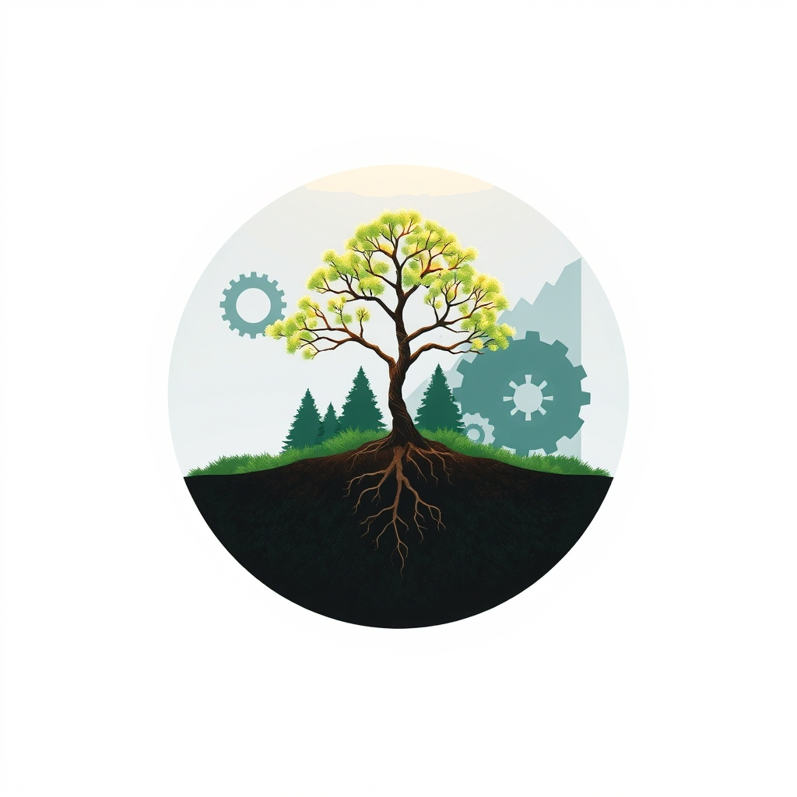

[Home](../index.md) > [Books](./index.md)  
# 🧠💰🌍 Beyond Growth: The Economics of Sustainable Development  
  
[🛒 Beyond Growth: The Economics of Sustainable Development. As an Amazon Associate I earn from qualifying purchases.](https://amzn.to/4iXp87F)  
  
🌍💡📉 Challenge the prevailing dogma of perpetual economic growth. Sustainable development requires a qualitative improvement within a finite ecological system, rather than quantitative expansion that inevitably leads to ruin.  
  
## 🤖 AI Summary  
  
### 🧠 Core Philosophy: Economy as Subsystem  
* 🌎 **Finite Planet:** Economy is an open, growing subsystem of a finite, non-growing, materially closed ecosystem.  
* 🚧 **Limits to Growth:** Physical laws, like thermodynamics (entropy), impose practical limits on economic growth, particularly throughput (resource consumption to waste).  
* 🤔 **Sustainable Growth Oxymoron:** Quantitative expansion (growth) is distinct from qualitative improvement (development); sustainable growth is contradictory.  
* 🎯 **Goal of Economy:** Optimize good for an optimum number of people over the long run, within ecological limits.  
  
### 📝 Critique of Conventional Economics  
* 📉 **GDP Flaws:** Gross Domestic Product (GDP) primarily measures throughput consumption, not net value or true welfare, often increasing environmental and social costs faster than benefits.  
* 📚 **Resource Misconception:** Traditional microeconomics aggregates to macro-level, viewing resources as more abundant than reality; natural capital is the limiting factor for wealth production.  
* ⚛️ **Ignoring Entropy:** Standard economic models ignore the physical reality of entropy and the economy's dependence on low-entropy natural resources.  
  
### 📜 Policy Imperatives for Sustainable Development  
* ➡️ **Shift from Growth to Development:** Replace quantitative expansion with qualitative improvement as the path of progress.  
* ⚖️ **Steady-State Economy:** Target an economy where capital stocks remain constant and population growth is sustainable.  
* 📊 **Accounting Reform:** Stop counting natural capital consumption as income; treat it as a cost, especially for non-renewable or over-exploited resources.  
* 💰 **Taxation Shift:** Tax labor and income less; tax resource throughput more.  
* 🤝 **Wealth Redistribution:** Address poverty through redistribution of wealth and income.  
* 👨‍👩‍👧‍👦 **Population Control:** Essential for managing demands on a finite planet.  
* ⚙️ **Resource Productivity:** Focus on technical improvements in resource efficiency.  
* ✨ **Alternative Indicators:** Utilize measures like the Index of Sustainable Economic Welfare (ISEW) instead of GNP/GDP to reflect quality of life.  
  
## ⚖️ Evaluation  
* 👨‍🏫 Herman Daly is widely considered the dean of ecological economics and a prominent advocate for rethinking economic assumptions in response to environmental crises.  
* 📖 The book's central premise, that continuous growth is impossible and undesirable, draws on a multidisciplinary approach combining economics, ecology, sociology, political science, and physics.  
* 🚧 Daly challenges the World Bank's predominant mantra of market-based economic growth as a solution for sustainable development and poverty reduction.  
* 🚫 His argument for development without growth directly contradicts the conventional understanding of sustainable development, which often conflates growth and development.  
* 📈 The concept of uneconomic growth, where environmental and social costs outweigh production benefits, is a core argument supported by empirical observations since the mid-20th century.  
* 🌍 Critics of perpetual growth, including Daly, emphasize that the global economy is overshooting several critical planetary boundaries (e.g., climate change, land-use, biodiversity loss).  
* 💧 While mainstream economics often views sustainable development as incorporating economic growth, Daly argues this watering down of the term serves to avoid fundamental systemic change.  
* 🙏 The book provides a philosophical and ethical dimension often absent from standard economic texts, discussing the necessity for a religious renewal to overcome resistance to changing economic paradigms.  
* 🏗️ Daly's work on the steady-state economy laid the foundation for the emergent field of ecological economics.  
  
## 🔍 Topics for Further Understanding  
* 🛠️ Operationalizing a steady-state economy in diverse national and regional contexts.  
* 🚀 The role of technological innovation in decoupling welfare from resource throughput.  
* 💸 Specific policy mechanisms for global wealth redistribution and their political feasibility.  
* 🧘‍♀️ Cultural shifts and changes in societal values required for a post-growth transition.  
* 🤝 The intersection of post-growth economics with theories of justice and equity for developing nations.  
* ✅ Detailed analysis of alternative welfare metrics beyond ISEW, such as the Genuine Progress Indicator (GPI) or subjective well-being indices.  
* 🏦 Strategies for transitioning financial systems to support a steady-state or degrowth economy.  
  
## ❓ Frequently Asked Questions (FAQ)  
  
### 💡 Q: What is the main argument of Beyond Growth: The Economics of Sustainable Development?  
✅ A: Beyond Growth: The Economics of Sustainable Development argues that perpetual economic growth is fundamentally unsustainable on a finite planet and instead advocates for a steady-state economy focused on qualitative development (improvement) rather than quantitative growth (expansion) of material throughput.  
  
### 💡 Q: Who is the author of Beyond Growth: The Economics of Sustainable Development?  
✅ A: The author of Beyond Growth: The Economics of Sustainable Development is Herman E. Daly.  
  
### 💡 Q: What is the difference between growth and development according to Beyond Growth: The Economics of Sustainable Development?  
✅ A: In Beyond Growth: The Economics of Sustainable Development, growth refers to a quantitative increase in the physical scale of the economy (more throughput), while development refers to qualitative improvement without necessarily increasing physical scale, remaining within environmental regenerative and absorptive capacities.  
  
### 💡 Q: Why does Beyond Growth: The Economics of Sustainable Development criticize GDP?  
✅ A: Beyond Growth: The Economics of Sustainable Development criticizes GDP because it primarily measures the consumption of resources (throughput) rather than true net value or welfare, often increasing environmental and social costs faster than real benefits, particularly in wealthy nations.  
  
### 💡 Q: What is a steady-state economy as proposed in Beyond Growth: The Economics of Sustainable Development?  
✅ A: A steady-state economy, as proposed in Beyond Growth: The Economics of Sustainable Development, is an economy where the stock of physical wealth and human population are maintained at a constant, sustainable level, with development focusing on qualitative improvement rather than quantitative expansion.  
  
## 📚 Book Recommendations  
  
### ➕ Similar  
* 🌱 Prosperity Without Growth by Tim Jackson  
* [🍩🌍 Doughnut Economics: Seven Ways to Think Like a 21st-Century Economist](./doughnut-economics-seven-ways-to-think-like-a-21st-century-economist.md) by Kate Raworth  
* [📉🌍⏳ Limits to Growth: The 30-Year Global Update](./limits-to-growth-the-30-year-global-update.md) by Donella Meadows, Dennis Meadows, Jørgen Randers, William W. Behrens III  
  
### 🆚 Contrasting  
* 🌐 The World is Flat by Thomas L. Friedman  
* 📈 The Age of Sustainable Development by Jeffrey D. Sachs  
* ♻️ Environmental Economics and Management: Theory, Policy, and Applications by Scott J. Callan, Janet M. Thomas  
  
### 🔗 Related  
* [🤏🧑 Small Is Beautiful: Economics as if People Mattered](./small-is-beautiful-economics-as-if-people-mattered.md) by E.F. Schumacher  
* 🌊 Deep Economy by Bill McKibben  
* 🌍 This Changes Everything by Naomi Klein  
  
## 🫵 What Do You Think?  
🤔 Do you believe a post-growth economy is a feasible and desirable alternative for human progress, or is economic growth still essential for poverty reduction and societal well-being? What societal values would need to shift for such a transition to occur?