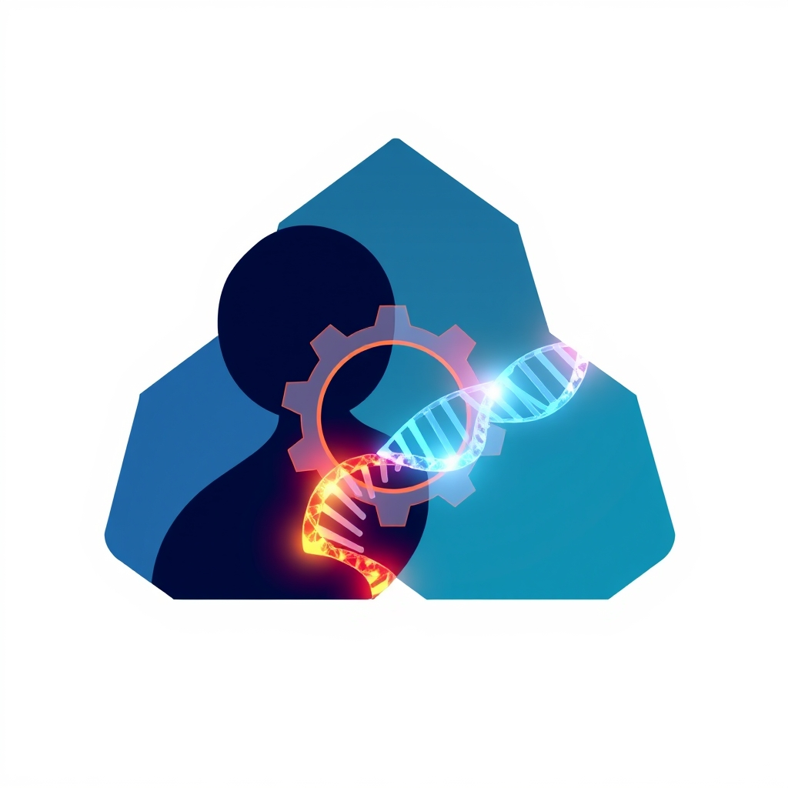

[Home](../index.md) > [Books](./index.md)  
# 🧑‍🤝‍🧑⚙️🧬 Beyond the Science: How People, Process, and Systems Transform the Business of Life Sciences  
  
[🛒 Beyond the Science: How People, Process, and Systems Transform the Business of Life Sciences. As an Amazon Associate I earn from qualifying purchases.](https://amzn.to/4p4mZJB)  
  
🔬 Achieving excellence in drug and device development: scientific breakthroughs alone are insufficient without robust operational frameworks.  
  
## 🤖 AI Summary: Beyond the Science Life Sciences book summary  
  
### 🎯 Core Philosophy  
* 🤝 **Holistic Approach:** Scientific expertise must integrate with exceptional people, effective processes, and well-structured systems for true transformation in life sciences.  
* 🏆 **Beyond Good Enough:** The demanding nature of patient care necessitates continuous optimization and a culture of excellence.  
* 🧠 **Experience-Driven Insights:** Lessons from navigating real-world challenges, such as economic downturns, underscore the criticality of operational rigor.  
  
### 🧑‍🤝‍🧑 People & Culture  
* 🏢 **Team Building:** Recruit A-players driven by a passion for improving patient lives.  
* 🏁 **Goal Setting:** Define clear objectives to optimize team function and inspire innovation.  
* ⚖️ **Ethical Rigor:** Foster cultures that balance groundbreaking innovation with unwavering ethical standards.  
* 💪 **Cohesion & Resilience:** Maintain team unity and effectiveness, especially during challenging periods.  
  
### ⚙️ Processes & Systems  
* 🚀 **Operational Optimization:** Develop robust processes and implement cutting-edge systems.  
* 🧪 **Clinical Trials:** Design efficient protocols to manage complexity.  
* 🛡️ **Risk & Compliance:** Implement strategies for effective risk management and quality assurance.  
* 💡 **Technology Integration:** Leverage emerging technologies like AI and wearables to reshape clinical development.  
  
## ⚖️ Evaluation  
  
* 🌎 **Holistic Viewpoint:** The book's emphasis on people, process, and systems aligns with broader industry calls for Operational Excellence in life sciences, which encompasses optimizing business processes, improving efficiency, and driving continuous improvement beyond scientific R&D.  
* 🚧 **Addressing Industry Challenges:** The focus on streamlining operations directly addresses critical challenges in the pharmaceutical industry, such as long development cycles, strict regulatory requirements, and the need to reduce time-to-market.  
* 💻 **Digital Transformation Integration:** The book's forward-looking perspective on integrating emerging technologies like AI and wearables into clinical development reflects current trends and strategic imperatives within the life sciences sector. Many companies are embracing a holistic approach to digital transformation, moving beyond fragmented initiatives.  
* 🌱 **Culture of Continuous Improvement:** The importance of fostering an innovative, ethical, and continuously improving culture is widely recognized as essential for sustainable growth and competitiveness in the pharma industry.  
* 🧑‍💼 **Talent Management:** The book's focus on building A-player teams and addressing the human element resonates with industry concerns about talent shortages in specialized areas like AI and data engineering, highlighting the need for upskilling and attracting skilled professionals.  
  
## 🔍 Topics for Further Understanding  
  
* 🧑‍💻 The ethical implications and governance frameworks for AI in drug discovery and personalized medicine.  
* 🌐 Strategies for navigating global regulatory harmonization challenges in an increasingly internationalized life sciences landscape.  
* 🛠️ Detailed methodologies for implementing Lean/Six Sigma principles specifically within biopharmaceutical manufacturing and supply chains.  
* 🔒 The role of cybersecurity and data privacy in advanced digital transformation initiatives within highly regulated environments.  
* 🙋 Exploring the impact of patient-centric design and engagement models on clinical trial success and product development.  
* 🌳 Sustainable practices and environmental, social, and governance (ESG) considerations in the life sciences value chain.  
  
## ❓ Frequently Asked Questions (FAQ)  
  
### 💡 Q: What is the primary focus of Beyond the Science: How People, Process, and Systems Transform the Business of Life Sciences?  
✅ A: Beyond the Science: How People, Process, and Systems Transform the Business of Life Sciences primarily focuses on the critical interplay of human talent, optimized operational processes, and robust technological systems necessary to achieve success and innovation in pharmaceutical and medical device development, moving beyond pure scientific discovery.  
  
### 💡 Q: Who is the target audience for Beyond the Science: How People, Process, and Systems Transform the Business of Life Sciences?  
✅ A: The target audience for Beyond the Science: How People, Process, and Systems Transform the Business of Life Sciences includes pharmaceutical executives, clinical research professionals, and entrepreneurs in life sciences who are involved in drug and device development and seek to enhance organizational effectiveness.  
  
### 💡 Q: What unique insights does Beyond the Science: How People, Process, and Systems Transform the Business of Life Sciences offer?  
✅ A: Beyond the Science: How People, Process, and Systems Transform the Business of Life Sciences offers unique, behind-the-scenes insights drawn from decades of experience, demonstrating how operational excellence and a strong corporate culture are as crucial as scientific expertise for bringing life-changing treatments to patients.  
  
### 💡 Q: Does Beyond the Science: How People, Process, and Systems Transform the Business of Life Sciences cover emerging technologies?  
✅ A: Yes, Beyond the Science: How People, Process, and Systems Transform the Business of Life Sciences concludes with an exploration of how emerging technologies, such as artificial intelligence and wearables, are influencing and reshaping the future of clinical development.  
  
## 📚 Book Recommendations  
  
### 📖 Similar Books  
- [👍➡️👍👍 Good to Great: Why Some Companies Make the Leap...And Others Don't](./good-to-great.md) by Jim Collins  
- [📈⚙️♾️ The Goal: A Process of Ongoing Improvement](./the-goal.md) by Eliyahu M. Goldratt  
- 🚦 Lean Thinking by James P. Womack and Daniel T. Jones  
  
### 📖 Contrasting Books  
- [💡🤖💰💥🏢📉 The Innovator's Dilemma: When New Technologies Cause Great Firms to Fail](./the-innovators-dilemma.md) by Clayton M. Christensen  
- [🤔🐇🐢 Thinking, Fast and Slow](./thinking-fast-and-slow.md) by Daniel Kahneman  
  
### 📖 Related Books  
- 🧬 The Digital Transformation of the Life Sciences Industry by Inder Singh  
- 💊 Pharma 4.0: Digital Transformation in the Pharmaceutical Industry by Jens-Dominik Müller  
- 🔬 Research Methodology: Tools and Techniques by C.R. Kothari  
  
## 🫵 What Do You Think?  
❓ What aspect of people, process, or systems do you believe is currently the biggest bottleneck in life sciences innovation, and why? Share your insights on how organizations can best integrate these three pillars for future success!