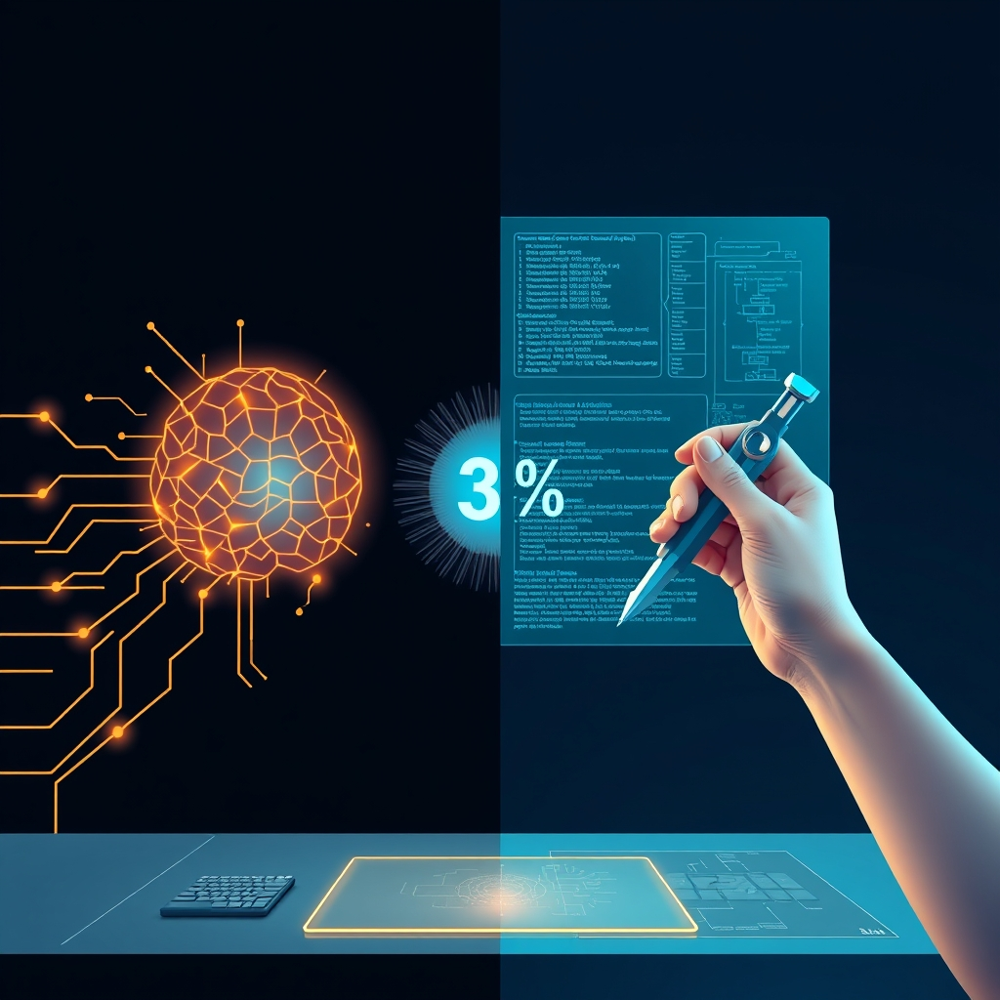

[Home](../index.md) > [Books](./index.md)  
# 🧑‍💻🤖 Beyond Vibe Coding: From Coder to AI-Era Developer  
  
[🛒 Beyond Vibe Coding: From Coder to AI-Era Developer. As an Amazon Associate I earn from qualifying purchases.](https://amzn.to/48XR5cy)  
  
🚀💡 Beyond Vibe Coding: From Coder to AI-Era Developer champions the evolution of developers from mere code writers to strategic AI collaborators, advocating for a disciplined AI-assisted engineering approach to harness AI's 70% productivity gains while expertly managing the critical human-driven 30% of development.  
  
## 🏆 Addy Osmani's AI-Era Developer Strategy  
  
### 🧠 Core Philosophy: Human-AI Collaboration  
* ➡️ Shift Focus: From direct code writing to intent-driven workflow, directing AI.  
* 🤝 Embrace AI as Partner: Not a replacement; augment human capabilities.  
* 🚫 Move Beyond Vibe Coding: Transition from prompt-first, exploratory AI use to structured AI-assisted engineering.  
  
### ⚙️ Practical Implementation: The 70/30 Rule  
* 🤖 Leverage AI for 70%: Automate routine tasks, code generation, initial drafts, bug detection, testing.  
* 🧑‍💻 Human for 30%: Focus on critical thinking, architecture, design, debugging, security, maintainability, complex edge cases.  
* 🏗️ Structured AI Interaction:  
    * 🎯 Formulate clear goals and constraints for AI.  
    * 🗺️ Request a plan before AI implementation (Plan Mode).  
    * ✍️ Enhance prompts to generate structured specifications.  
    * 📜 Write explicit SPECs or mini-PRDs for AI to follow.  
  
### 🔑 Essential Skills for AI-Era Developers  
* 🧐 Critical Evaluation: Review AI-generated code critically.  
* 🗣️ Prompt Engineering: Master communicating effectively with AI.  
* 📐 System Design & Architecture: Guide AI contributions within a coherent whole.  
* 🐛 Debugging & Refinement: Understand and fix AI-generated issues.  
* 🛡️ Security & Ethical Considerations: Address vulnerabilities and biases in AI output.  
* 📚 Continuous Learning: Adapt to rapidly evolving AI tools and techniques.  
* 📊 Data Literacy: Understand how data drives AI systems.  
  
### 🔮 Future-Proofing  
* 🌐 Explore Multi-Agent Systems: Understand AI-driven software workflows.  
* 🤔 Stay Skeptical: Always verify and review AI-generated code.  
  
## ⚖️ Critical Evaluation  
  
* 🤖 AI's Role: Augmentation, Not Replacement: The book's premise that AI will augment, rather than fully replace, software developers aligns with industry consensus. Reports consistently indicate AI enhances productivity and automates routine tasks, allowing developers to focus on higher-level problem-solving and creative aspects.  
* 💯 70% Problem Validation: The concept that AI can achieve approximately 70% of a functional application efficiently, but the remaining 30% requires deep human expertise for debugging, security, and maintainability, is widely echoed in expert discussions. This highlights the ongoing necessity for human oversight and specialized engineering knowledge.  
* ✍️ Emphasis on Prompt Engineering & Critical Review: The book stresses prompt engineering and critical evaluation of AI-generated code. This is supported by the rise of prompt engineering as a crucial skill and the recognized need for human developers to understand, refine, and own AI outputs to prevent errors, security flaws, and maintainability issues.  
* 👨‍💻 Skills for the AI Era: Osmani's focus on skills like critical thinking, problem-solving, system design, and ethical understanding is consistent with current analyses of in-demand skills for developers in the AI era, which prioritize uniquely human abilities and a broader technical understanding beyond mere coding.  
  
✅ Verdict: Beyond Vibe Coding provides a timely and practical roadmap for developers navigating the AI transformation. Its core claim—that effective AI integration demands a disciplined, human-centric approach to AI-assisted engineering rather than uncritical vibe coding—is robustly supported by evolving industry practices and expert consensus, offering a highly relevant strategy for future-proofing developer careers.  
  
## 🔍 Topics for Further Understanding  
  
* 🤖 Advanced AI/ML Model Fine-Tuning for Code Generation  
* Ethics Ethical AI Development: Bias Detection and Mitigation in Automated Code  
* 🏗️ AI's Role in Software Architecture Evolution and Refactoring Complex Systems  
* ⚙️ Implementing and Managing Multi-Agent AI Systems in Production Environments  
* ⚖️ The Legal and IP Implications of AI-Generated Code  
* 📚 Personalized Learning Paths for Developers Adapting to AI-First Workflows  
* 💰 Economic Models and Compensation Structures for AI-Augmented Developer Teams  
  
## ❓ Frequently Asked Questions (FAQ)  
  
### 💡 Q: What is vibe coding and why is it problematic?  
✅ A: Vibe coding is a prompt-first, exploratory approach where developers use natural language to generate code with large language models, focusing on speed and initial output. It can be problematic because, while fast, it often leads to a 70% problem where the final 30% (debugging, security, maintainability) becomes exponentially harder without deep engineering knowledge, risking unreliable or vulnerable code.  
  
### 💡 Q: How does AI-assisted engineering differ from vibe coding?  
✅ A: AI-assisted engineering is a more structured and disciplined approach. It combines AI's generative power with traditional engineering rigor, emphasizing clear specifications, critical review of AI output, and human control over the entire development lifecycle, rather than just accepting AI suggestions.  
  
### 💡 Q: Will AI replace software developers?  
✅ A: The consensus, reinforced by the book, is that AI will not entirely replace software developers. Instead, it will transform roles, automating routine tasks and elevating developers to become AI collaborators who focus on higher-level design, problem-solving, and strategic orchestration.  
  
### 💡 Q: What are the most crucial skills for developers in the AI era?  
✅ A: Essential skills include critical thinking, problem-solving, adaptability, continuous learning, data literacy, prompt engineering, system design, and a strong understanding of AI/ML fundamentals, ethics, and security.  
  
## 📚 Book Recommendations  
  
### ➕ Similar  
* [🤖🏗️ AI Engineering: Building Applications with Foundation Models](./ai-engineering-building-applications-with-foundation-models.md) by Chip Huyen: Focuses on the practical aspects of building and deploying AI systems, complementing the strategic shift in development.  
* 🤝 Working with AI: Real Stories from Developers and Designers by Cassie Kozyrkov: Offers practical insights and case studies on human-AI collaboration in various contexts.  
  
### ➖ Contrasting  
* [🦄👤🗓️ The Mythical Man-Month: Essays on Software Engineering](./the-mythical-man-month.md) by Frederick Brooks Jr.: A classic on software project management challenges, providing a foundational perspective on team dynamics and planning that AI tools aim to optimize.  
* 👨‍💻 Structure and Interpretation of Computer Programs by Harold Abelson and Gerald Jay Sussman: Emphasizes deep understanding of programming fundamentals and abstraction, contrasting with AI's potential to abstract away implementation details.  
  
### 🔗 Related  
* [💾⬆️🛡️ Designing Data-Intensive Applications: The Big Ideas Behind Reliable, Scalable, and Maintainable Systems](./designing-data-intensive-applications.md) by Martin Kleppmann: Essential for understanding the data infrastructure that often underpins AI-driven applications.  
* [🗑️✨ Refactoring: Improving the Design of Existing Code](./refactoring-improving-the-design-of-existing-code.md) by Martin Fowler: Guides on improving code quality, a critical skill when refining AI-generated code.  
* [🤔🐇🐢 Thinking, Fast and Slow](./thinking-fast-and-slow.md) by Daniel Kahneman: Explores cognitive biases and decision-making, relevant for understanding human limitations and critical evaluation in AI-assisted workflows.  
  
## 🫵 What Do You Think?  
❓ How has AI already changed your daily development workflow, and what's the single most critical skill you believe developers need to master for the next five years?