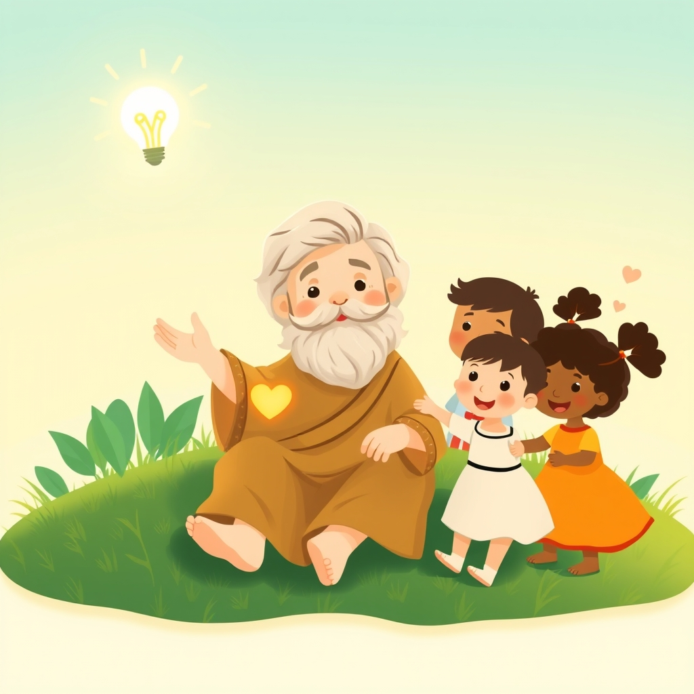

[Home](../index.md) > [Books](./index.md)  
# 🤔👶😊 Big Ideas for Little Philosophers: Happiness with Aristotle  
  
[🛒 Big Ideas for Little Philosophers: Happiness with Aristotle. As an Amazon Associate I earn from qualifying purchases.](https://amzn.to/3ZLGBaU)  
  
## 📚 Book Report: Big Ideas for Little Philosophers: Happiness with Aristotle  
  
### 📝 Summary  
  
"Big Ideas for Little Philosophers: Happiness with Aristotle" is a board book that introduces very young children to the ancient Greek philosopher Aristotle and his ideas on happiness. 💭 It simplifies complex philosophical concepts, primarily focusing on Aristotle's belief that 😃 happiness (eudaimonia, or flourishing) is achieved through living a good life filled with 🧑‍🤝‍🧑 true friends. 📖 The book aims to make philosophy accessible and engaging for young minds, encouraging them to ask big 🤔 questions about the world and their own lives.  
  
### 💡 Key Concepts  
  
* 🤔 **What is a Philosopher?** 📖 The book begins by defining a philosopher simply as someone who ❤️ loves wisdom and seeks knowledge that helps them live better and be happy.  
* 😃 **Aristotle's View on Happiness:** 💡 It presents Aristotle's core idea that a happy life is closely tied to having 🧑‍🤝‍🧑 true friends.  
* 🧑‍🤝‍🧑 **The Role of Friendship:** 🤝 The book emphasizes the importance of friends who not only share fun 🎉 times but also help each other be good people.  
* ❤️ **Self-Love:** 🥰 It also touches on the Aristotelian idea that loving oneself is necessary for being able to ❤️ love others and be happy.  
  
### 👶 Target Audience  
  
👶 This book is specifically designed for the youngest readers, including toddlers and preschoolers (ages 0-5). 🧱 Its board book format makes it durable and easy for little hands to handle. ✍️ The simple language and engaging illustrations are tailored to capture the attention and spark the curiosity of this age group.  
  
### ✨ Overall Impression  
  
" Happiness with Aristotle" successfully distills profound philosophical ideas into a format digestible for very young children. 🧑‍🤝‍🧑 By focusing on relatable concepts like friendship and self-worth, it provides a gentle introduction to Aristotelian ethics and the idea that 😃 happiness is an active pursuit connected to virtuous living and meaningful relationships. 📚 The book serves as a wonderful starting point for parents and educators to initiate conversations about important life concepts with young children.  
  
## ➕ Additional Book Recommendations  
  
### 📚 Similar Books (More Philosophy for Kids)  
  
* 📚 **Other Books in the "Big Ideas for Little Philosophers" Series:** 🌍 Explore more philosophers and their core ideas presented in the same accessible board book format.  
    * ⚖️ *Equality with Simone de Beauvoir*  
    * [❓🏛️👶 Truth with Socrates](./big-ideas-for-little-philosophers-truth-with-socrates.md)  
    * [🤔👶💭 Imagination with René Descartes](./big-ideas-for-little-philosophers-imagination-with-rene-descartes.md)  
    * ❤️ *Kindness with Confucius*  
    * 💞 *Love with Plato*  
* 🦸 **Ordinary People Change the World Series by Brad Meltzer:** 📚 While not strictly philosophy, this biography series introduces young readers to historical figures who embodied important virtues and ideas.  
* **[👶📚 Baby University Series](./baby-university-complete-for-babies-board-book-set.md) by Chris Ferrie:** 🔬 This series introduces complex scientific concepts using simple language and illustrations for babies and toddlers, similar in approach to making "big ideas" accessible.  
* 😂 **Plato and the Platypus Walk into a Bar... by Thomas Cathcart and Daniel Klein (Adapted for Young Readers):** 🤣 While the original is for adults, simplified versions or similar concept books that use humor to introduce philosophical ideas could be a good fit for slightly older children.  
* 🤔 **"Big Ideas for Curious Minds: An Introduction to Philosophy" by The School of Life:** 🧑‍🏫 Aimed at slightly older children, this book covers a range of philosophical topics in an engaging way.  
  
### 🔄 Contrasting Books (Different Perspectives on Happiness or Related Concepts)  
  
* 🧘 **Books on Mindfulness and Emotions:** 🧠 Books focusing on understanding and managing emotions from a psychological perspective offer a different lens on well-being compared to a purely philosophical one.  
    * 🐸 *Sitting Still Like a Frog: Mindfulness Exercises for Kids (and Their Parents)* by Eline Snel  
    * 😡 *Anh's Anger* by Gail Silver  
    * 😔 *Today I Feel Silly & Other Moods That Make My Day* by Jamie Lee Curtis  
* 🌍 **Books Introducing Different Philosophical Traditions:** 🕉️ Explore ideas of happiness or the good life from non-Western philosophies.  
    * 🧘 Books introducing basic concepts of Eastern philosophies like Buddhism or Taoism in a child-friendly way.  
    * 🧘‍♀️ *Happy Philosophy for You and Your Kids* by Layback Lani (Series 2 mentions synthesizing ideas from Ayurveda, Taoism, Unani, and Macrobiotics).  
* ❓ **Books Questioning Conventional Notions of Happiness:** 😔 Stories that subtly encourage critical thinking about what truly leads to happiness, perhaps contrasting 💰 material wealth with experiences or relationships.  
  
### 🎭 Creatively Related Books (Exploring Themes of Virtue, Friendship, and Living Well Through Story)  
  
* 😇 **Books on Virtues and Character:** 📖 These books often use stories to illustrate concepts Aristotle would associate with a good life.  
    * 📚 *The Children's Book of Virtues* edited by William J. Bennett.  
    * 🪣 *Have You Filled a Bucket Today? A Guide to Daily Happiness for Kids* by Carol McCloud (focuses on kindness and its impact on well-being).  
    * 🎁 *The Quiltmaker's Gift* by Jeff Brumbeau (explores the joy of generosity).  
    * 🧑‍🤝‍🧑 Books specifically about friendship and its value.  
* ❓ **Stories Encouraging Inquiry and Asking Questions:** ❓ Aligned with the idea of children as "little philosophers" who ask big questions.  
    * [👦🟣🖍️ Harold and the Purple Crayon](./harold-and-the-purple-crayon.md) by Crockett Johnson (explores imagination and creativity).  
    * 🌍 Books that encourage curiosity about the world.  
* 🦊 **Fables and Folktales:** 👵 Many traditional stories offer simple moral lessons and insights into human nature and the consequences of different actions, often touching on themes relevant to living a good life.  
* 🤝 **Books on Social-Emotional Learning (SEL):** ❤️ These books help children develop self-awareness, self-management, social awareness, relationship skills, and responsible decision-making, all of which contribute to a flourishing life.  
* **[🤴 The Little Prince](./the-little-prince.md) by Antoine de Saint-Exupéry:** 🌟 While for slightly older children (or to be read with adults), this classic is deeply philosophical and touches on themes of friendship, love, and what is truly important in life, resonating with some of Aristotle's ideas on meaningful relationships.  
* 👨‍⚖️ **Books on Ethics for Children:** ✅ More direct introductions to ethical reasoning and making good choices.  
    * 🤔 *Ethics for Kids: 40 Fun Projects That Help You Explore Good and Evil, Right and Wrong, and More* by Sharon Kaye.  
* 🌟 **Biographies of People Who Lived Virtuous or Meaningful Lives:** 📖 Stories of individuals who exemplified courage, kindness, perseverance, and other virtues.  
  
## 💬 [Gemini](../software/gemini.md) Prompt (gemini-2.5-flash-preview-04-17)  
> Write a markdown-formatted (start headings at level H2) book report, followed by a plethora of additional similar, contrasting, and creatively related book recommendations on Big Ideas for Little Philosophers: Happiness with Aristotle. Be thorough in content discussed but concise and economical with your language. Structure the report with section headings and bulleted lists to avoid long blocks of text.  
  
## 🐦 Tweet  
<blockquote class="twitter-tweet" data-theme="dark">
🤔👶😊 Big Ideas for Little Philosophers: Happiness with Aristotle  👶 Children | 🤝 Friendship | ❤️ Self-Love | 💡 Philosophical Concepts<a href="https://t.co/eVZFnGnVCR">https://t.co/eVZFnGnVCR</a>
&mdash; Bryan Grounds (@bagrounds) <a href="https://twitter.com/bagrounds/status/1937990473043550388?ref_src=twsrc%5Etfw">June 25, 2025</a></blockquote> 