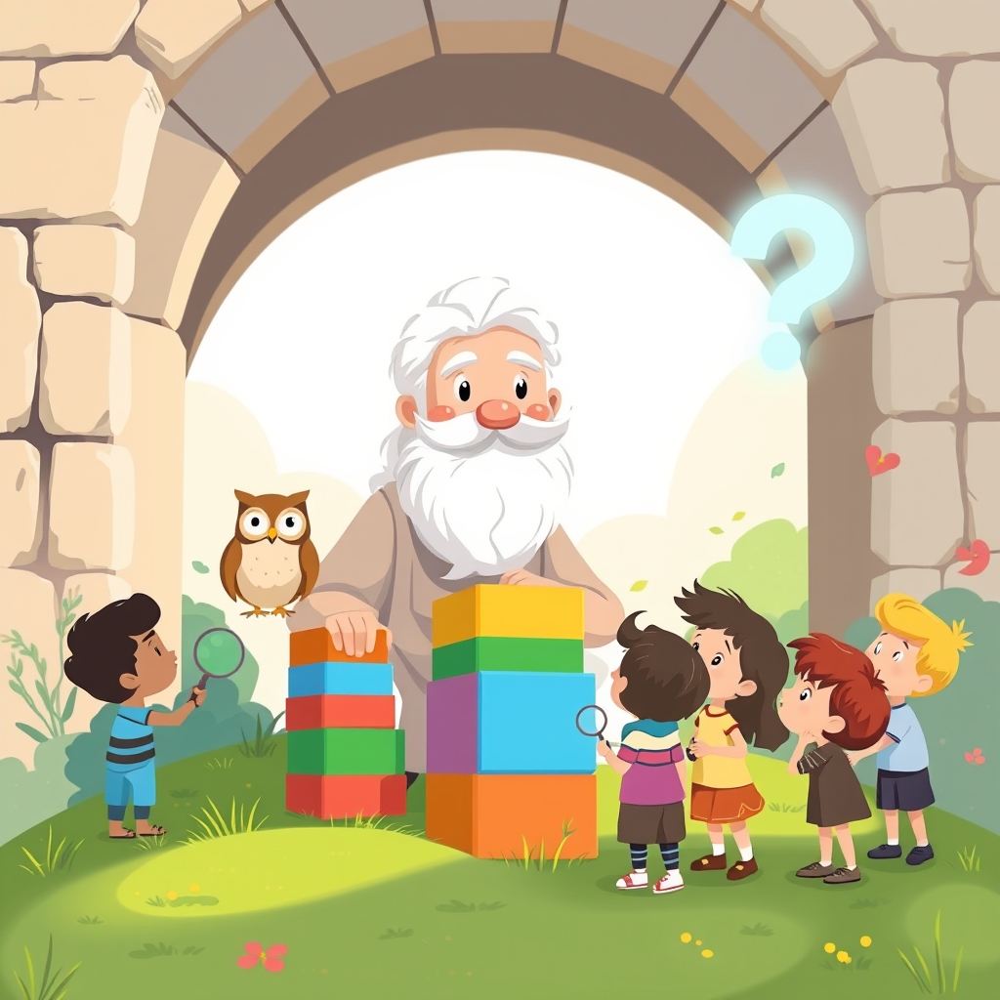

[Home](../index.md) > [Books](./index.md)  
# ❓🏛️👶 Big Ideas for Little Philosophers: Truth with Socrates  
  
[🛒 Big Ideas for Little Philosophers: Truth with Socrates. As an Amazon Associate I earn from qualifying purchases.](https://amzn.to/3G9KUWP)  
  
## 📚 Book Report: 🧠 Big Ideas for Little Philosophers: 🗣️ Truth with Socrates  
  
*🌟 *Big Ideas for Little Philosophers: Truth with Socrates*, ✍️ authored by Duane Armitage and Maureen McQuerry and 🎨 illustrated by Robin Rosenthal, is a 👶 board book designed to introduce very young children to fundamental philosophical concepts through the lens of historical thinkers. 🔎 This particular installment focuses on the idea of truth as explored by the ancient Greek philosopher Socrates.  
  
### 📜 Content Summary  
  
* 💡 **Introduction to Philosophy:** 🧐 The book begins by defining a philosopher in simple terms: "👤 A philosopher is a person who loves wisdom. 🧠 Wisdom means knowing things that help you live better and be happy."  
* 🗣️ **Socrates and Truth:** 🏛️ It introduces Socrates and his belief that being truthful and asking questions leads to wisdom.  
* 🔑 **Key Concepts:** 💯 The book explores the importance of honesty, even when it is difficult or frightening. 🤔 It also emphasizes the value of asking questions to understand the world around us and to learn and grow.  
* 🖼️ **Accessible Presentation:** 💭 Complex ideas about truth and inquiry are presented in a simple, accessible way using bold illustrations and relatable scenes that connect these concepts to children's lives. 👀 The illustrations are engaging and provide much to observe and discuss.  
  
### 📐 Structure and Style  
  
* 🧱 **Board Book Format:** 📚 As a board book, it is sturdy and suitable for very young children, while the content also makes it appropriate for older children.  
* ✍️ **Simple Language:** 🗣️ The text uses simple language to convey important philosophical meanings.  
* 🎨 **Engaging Illustrations:** 🦊 Robin Rosenthal's illustrations feature appealing caricatures of philosophers and diverse children, making the concepts visually engaging. 🐾 Each philosopher is accompanied by a unique animal companion.  
  
### ✨ Overall Impression  
  
*💯 *Truth with Socrates* successfully distills Socrates' core ideas about truth and questioning into a format that is easily digestible for young minds. 🚀 It serves as an excellent starting point for parents and educators to initiate conversations with children about abstract but crucial concepts like honesty and the pursuit of understanding.  
  
## ➕ Additional Book Recommendations  
  
### 🗂️ Similar Books (Introduction to Philosophy for Children)  
  
* 📚 **Other Books in the *Big Ideas for Little Philosophers* Series:** 🌟 This series covers other prominent philosophers and their core ideas, such as Love with Plato, [🤔👶😊 Happiness with Aristotle](./big-ideas-for-little-philosophers-happiness-with-aristotle.md), Imagination with René Descartes, Kindness with Confucius, and Equality with Simone de Beauvoir.  
* 💭 ***Big Ideas for Curious Minds: An Introduction to Philosophy*** by The School of Life: 🌍 Uses everyday situations to explain philosophical concepts in a kid-friendly way.  
* 🤔 ***Philosophy for Kids: Key Ideas Clearly Explained*** by David A. White: 💡 Introduces philosophical concepts through engaging stories and discussions.  
* ❓ ***I Wonder: A Book of Questions with No Answers*** by Annaka Harris: 🧐 Encourages curiosity and philosophical thinking through a series of open-ended questions.  
* 🔤 ***Q Is for Question: An ABC of Philosophy*** by Tiffany Poirier: 📜 A rhyming introduction to philosophical questions.  
  
### 🆚 Contrasting Books (Exploring Different Philosophical Ideas or Approaches)  
  
* ⚖️ **Books on Different Ethical Frameworks:** ✅ While *Truth with Socrates* focuses on intellectual virtue and honesty, books exploring other ethical viewpoints could offer contrast. ❤️ Look for books discussing empathy, compassion, or different systems of rules or beliefs.  
* 🧮 **Books Introducing Logic and Reasoning:** ❓ While Socrates used questioning, books explicitly about logical structures or reasoning could provide a different approach to seeking understanding. 🍎 The *Philosophy for Children* curriculum, which includes novels like *Harry Stottlemeier's Discovery* (reasoning) and *Elfie* (thinking), focuses on developing philosophical inquiry skills.  
* 😃 **Books Exploring Different Conceptions of "Good" or "Happiness":** ☀️ Contrasting with Aristotle's view on happiness (covered in another book in the series), other philosophical or cultural perspectives on what constitutes a good life could be explored.  
  
### 🎨 Creatively Related Books (Sparking Philosophical Thought Through Story)  
  
* **[🤴 The Little Prince](./the-little-prince.md)** by Antoine de Saint-Exupéry: 🦊 A classic novella rich in philosophical reflections on human nature, truth, and what is essential.  
* 🐻 ***Winnie-the-Pooh*** by A. A. Milne: 🍯 Contains subtle undercurrents of philosophical and psychological insights within simple narratives.  
* 🔎 ***Through the Looking-Glass*** by Lewis Carroll: 🐇 Explores logic, language, and perception in a whimsical and mind-bending way.  
* 🧙 ***The Wizard of Oz*** by L. Frank Baum: 🌈 Offers reflections on courage, wisdom, and the nature of home and desires.  
* 🐸 ***Frog and Toad Together*** by Arnold Lobel: 🍪 The story "Cookies" can be used to discuss concepts like willpower and self-control. 🤝 Other stories touch on friendship and free will.  
* 🏠 ***The Big Orange Splot*** by Daniel Manus Pinkwater: 🎨 Can spark discussions about individualism and conformity.  
* 😟 ***Pierre: A Cautionary Tale*** by Maurice Sendak: 🐊 Can be interpreted through a philosophical lens, potentially touching on themes of apathy or consequence.  
* 🦸 ***Adventures in Philosophy: Stories and Quests for Thinking Heroes*** by Brendan O'Donoghue: 📜 Introduces philosophical ideas through diverse stories and fables from various cultures.  
* 👩‍🏫 ***Thinking Through Stories: Children, Philosophy, and Picture Books*** by Thomas E. Wartenberg: 🤓 While for adults, this book discusses how to use various children's picture books to engage children in philosophical discussions. 📚 He also authored *Big Ideas for Little Kids: Teaching Philosophy Through Children's Literature*.  
* 👴 ***Wise Guy: The Life and Philosophy of Socrates*** by M. D. Usher: 🗣️ An engaging introduction to Socrates specifically for young readers.  
  
## 💬 [Gemini](../software/gemini.md) Prompt (gemini-2.5-flash-preview-04-17)  
> Write a markdown-formatted (start headings at level H2) book report, followed by a plethora of additional similar, contrasting, and creatively related book recommendations on Big Ideas for Little Philosophers: Truth with Socrates. Be thorough in content discussed but concise and economical with your language. Structure the report with section headings and bulleted lists to avoid long blocks of text.