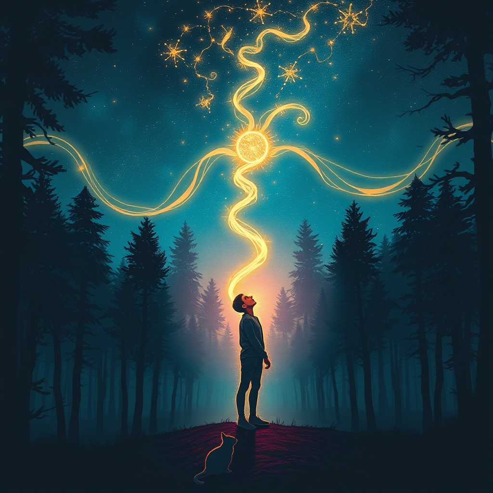

[Home](../index.md) > [Books](./index.md)  
# 🪄 Big Magic: Creative Living Beyond Fear  
  
[🛒 Big Magic: Creative Living Beyond Fear. As an Amazon Associate I earn from qualifying purchases.](https://amzn.to/4842OVY)  
  
## 📖 Book Report: ✨ Big Magic: Creative Living Beyond Fear by Elizabeth Gilbert  
  
### ✍️ Introduction  
* 👤 **Author:** Elizabeth Gilbert (known for *Eat, Pray, Love*)  
* 📚 **Title:** *Big Magic: Creative Living Beyond Fear*  
* 🎭 **Genre:** Self-help, focused on creativity and inspiration  
* 💡 **Main Idea:** To guide readers toward embracing a creative life driven by curiosity rather than fear, regardless of whether it involves traditional arts. Gilbert explores inspiration, fear, and the necessary attitudes and habits for creative living.  
  
### 🔑 Key Concepts  
* 🎨 **Living Creatively:** Defined not by profession, but by choosing curiosity over fear as the driving force in life. It's about pursuing things that bring you joy and make you feel alive. 🎉  
* 😨 **Fear and Courage:** Fear is an inherent part of the creative process and shouldn't (and can't) be eliminated. Instead, acknowledge fear but don't let it make decisions. 💪 Courage means proceeding with creative pursuits despite fear.  
* ✨ **Ideas as Entities:** Gilbert presents a somewhat mystical view of ideas as external, energetic life forms seeking human collaborators. 🤝 If you don't act on an idea, it may move on to someone else. 🏃‍♀️  
* ✅ **Permission and Authenticity:** You don't need external validation or permission to live creatively or pursue an idea. 💯 Authenticity and being true to your own path are crucial.  
* 🚀 **Persistence Over Perfection:** The creative process involves frustration and challenges; persistence is key. 🎯 Aiming for "done" is better than getting stuck seeking unattainable perfection. 🏆 Success isn't guaranteed, and the reward should come from the process itself.  
* ❓ **Curiosity as a Guide:** Follow your fascinations and obsessions without demanding they lead to conventional success or pay the bills. 🧭 Curiosity keeps inspiration engaged.  
* 😄 **Creativity Beyond Suffering:** Challenges the "suffering artist" trope, arguing that creativity doesn't require agony and can be approached with joy and lightness. ☀️  
  
### 🎯 Target Audience  
* 🤔 Anyone feeling hesitant or fearful about pursuing creative interests, whether artistic or otherwise.  
* 💖 Individuals looking to infuse their daily lives with more passion, curiosity, and mindfulness.  
* 🚧 People seeking inspiration and motivation to overcome creative blocks or self-doubt.  
  
### 💭 Overall Impression/Takeaway  
* ✨ *Big Magic* is an uplifting, encouraging, and often humorous guide that aims to demystify creativity and make it accessible.  
* 📖 It blends personal anecdotes, philosophical musings, and practical advice, advocating for a more joyful, curious, and less fear-driven approach to life and creative expression. 🌻  
* 🌟 The central message is that everyone possesses inherent creativity, and embracing it leads to a richer, more "amplified" life. 🚀  
  
## 📚 Book Recommendations  
### 👍 Similar Reads (Focus on Inspiration & Overcoming Fear)  
* 🎨 **[The Artist's Way](./the-artists-way.md)** by Julia Cameron: A classic, structured 12-week program for uncovering and recovering your creative self. Often cited as an inspiration for *Big Magic*. 🗓️ It offers practical tools like "Morning Pages" and "Artist Dates".  
* ⚔️ **[The War of Art](./the-war-of-art.md)** by Steven Pressfield: Focuses on overcoming "Resistance," the internal force that blocks creativity. 🛑 It's a concise, powerful kickstart for anyone procrastinating on their creative work. 🚀  
* 📝 **[🐦🕊️ Bird by Bird: Some Instructions on Writing and Life](./bird-by-bird.md)** by Anne Lamott: Offers humorous, honest, and practical advice on writing and managing the inner critic, emphasizing taking things one step at a time. 🐦  
* 🧑‍🎨 **Steal Like an Artist** by Austin Kleon: A short, visual book arguing that creativity involves remixing existing ideas and embracing influence, challenging the need for pure originality. 🖼️  
* 🧘 **[The Creative Act: A Way of Being](./the-creative-act.md)** by Rick Rubin: Explores the creative process from a philosophical and almost spiritual perspective, similar to Gilbert's sense of wonder, emphasizing creativity as inherent to being human. ✨  
  
### 👎 Contrasting Perspectives (Focus on Structure, Discipline, or Critical Views)  
* ⚙️ **[Atomic Habits](./atomic-habits.md)** by James Clear: While not strictly about creativity, it focuses on building consistent habits, offering a more structured, systems-based approach compared to Gilbert's emphasis on inspiration and magic. 📈  
* 🧠 **[Deep Work](./deep-work.md)** by Cal Newport: Argues for the importance of focused, distraction-free work sessions to produce high-quality creative output, emphasizing concentration and discipline over fluid inspiration. 🧘‍♀️  
* 💻 **[The Design of Everyday Things](./the-design-of-everyday-things.md)** by Don Norman: Focuses on the practical application of design principles for usability, offering a more analytical and user-centered view of creation, contrasting with Gilbert's internal, passion-driven focus. 💡  
* 🌍 **[Range](./range.md): Why Generalists Triumph in a Specialized World** by David Epstein: Challenges the idea of early specialization (often pushed in creative fields) and argues for the power of broad experience and interdisciplinary thinking. 🔭  
* 💸 **Scratch: Writers, Money, and the Art of Making a Living** edited by Manjula Martin: Presents essays and interviews discussing the practical, financial realities of a writing life, contrasting with Gilbert's advice to not burden creativity with paying the bills. ✍️  
  
### 🌟 Creatively Related (Broader Themes, Memoirs, Fiction)  
* ✍️ **[📜 On Writing: A Memoir of the Craft](./on-writing.md)** by Stephen King: Part memoir, part practical writing guide, offering King's personal story alongside concrete advice on the craft. 📖  
* 🌊 **[Flow: The Psychology of Optimal Experience](./flow-the-psychology-of-optimal-experience.md)** by Mihaly Csikszentmihalyi: Explores the state of "flow," where one is fully immersed in an activity, offering a psychological perspective on deep engagement that complements creative pursuits. 🧠  
* **[🪢🌾 Braiding Sweetgrass: Indigenous Wisdom, Scientific Knowledge, and the Teachings of Plants](./braiding-sweetgrass.md)** by Robin Wall Kimmerer: While focused on ecology and Indigenous wisdom, its themes of wonder, interconnectedness, and finding meaning resonate with Gilbert's sense of magic and living a life attuned to deeper forces. 🌎  
* 🎨 **Art Matters** by Neil Gaiman, illustrated by Chris Riddell: A short, passionate manifesto on the importance of art and creativity in the world. ❤️  
* 🎭 **Memoirs by Artists/Creatives:** Biographies or memoirs of individuals known for their creativity can offer diverse perspectives on the process, struggles, and joys (e.g., Patti Smith's *Just Kids*, Twyla Tharp's *[The Creative Habit: Learn It and Use It for Life](./the-creative-habit.md)*). 📚  
  
## 💬 [Gemini](../software/gemini.md) Prompt (gemini-2.5-pro-exp-03-25)  
> Write a markdown-formatted (start headings at level H2) book report, followed by a plethora of additional similar, contrasting, and creatively related book recommendations on Big Magic. Be thorough in content discussed but concise and economical with your language. Structure the report with section headings and bulleted lists to avoid long blocks of text.  
  
## 🦋 Bluesky    
<blockquote class="bluesky-embed" data-bluesky-uri="at://did:plc:i4yli6h7x2uoj7acxunww2fc/app.bsky.feed.post/3mhgz5ul5jw27" data-bluesky-cid="bafyreifto25qi4s263f4jtychuwjphvhs6jmp6l6jabh34jqxkuirkki6a">
🪄 Big Magic: Creative Living Beyond Fear  
  
#AI Q: ✨ Does fear stop you from pursuing a passion project?  
  
✨ Creative Process | 🌻 Joyful Pursuits | 💪 Overcoming Fear | 💡 Inspiration  
https://bagrounds.org/books/big-magic
&mdash; <a href="https://bsky.app/profile/did:plc:i4yli6h7x2uoj7acxunww2fc?ref_src=embed">Bryan Grounds (@bagrounds.bsky.social)</a> <a href="https://bsky.app/profile/did:plc:i4yli6h7x2uoj7acxunww2fc/post/3mhgz5ul5jw27?ref_src=embed">2026-03-19T22:06:26.637Z</a></blockquote>  
  
## 🐘 Mastodon    
<blockquote class="mastodon-embed" data-embed-url="https://mastodon.social/@bagrounds/116258110588007273/embed" style="background: #282c37; border-radius: 8px; border: 1px solid #393f4f; margin: 0; max-width: 540px; min-width: 270px; overflow: hidden; padding: 0;"> <a href="https://mastodon.social/@bagrounds/116258110588007273" target="_blank" style="align-items: center; color: #d9e1e8; display: flex; flex-direction: column; font-family: system-ui, -apple-system, BlinkMacSystemFont, 'Segoe UI', Oxygen, Ubuntu, Cantarell, 'Fira Sans', 'Droid Sans', 'Helvetica Neue', Roboto, sans-serif; font-size: 14px; justify-content: center; letter-spacing: 0.25px; line-height: 20px; padding: 24px; text-decoration: none;"> <svg xmlns="http://www.w3.org/2000/svg" xmlns:xlink="http://www.w3.org/1999/xlink" width="32" height="32" viewBox="0 0 79 75"><path d="M63 45.3v-20c0-4.1-1-7.3-3.2-9.7-2.1-2.4-5-3.7-8.5-3.7-4.1 0-7.2 1.6-9.3 4.7l-2 3.3-2-3.3c-2-3.1-5.1-4.7-9.2-4.7-3.5 0-6.4 1.3-8.6 3.7-2.1 2.4-3.1 5.6-3.1 9.7v20h8V25.9c0-4.1 1.7-6.2 5.2-6.2 3.8 0 5.8 2.5 5.8 7.4V37.7H44V27.1c0-4.9 1.9-7.4 5.8-7.4 3.5 0 5.2 2.1 5.2 6.2V45.3h8ZM74.7 16.6c.6 6 .1 15.7.1 17.3 0 .5-.1 4.8-.1 5.3-.7 11.5-8 16-15.6 17.5-.1 0-.2 0-.3 0-4.9 1-10 1.2-14.9 1.4-1.2 0-2.4 0-3.6 0-4.8 0-9.7-.6-14.4-1.7-.1 0-.1 0-.1 0s-.1 0-.1 0 0 .1 0 .1 0 0 0 0c.1 1.6.4 3.1 1 4.5.6 1.7 2.9 5.7 11.4 5.7 5 0 9.9-.6 14.8-1.7 0 0 0 0 0 0 .1 0 .1 0 .1 0 0 .1 0 .1 0 .1.1 0 .1 0 .1.1v5.6s0 .1-.1.1c0 0 0 0 0 .1-1.6 1.1-3.7 1.7-5.6 2.3-.8.3-1.6.5-2.4.7-7.5 1.7-15.4 1.3-22.7-1.2-6.8-2.4-13.8-8.2-15.5-15.2-.9-3.8-1.6-7.6-1.9-11.5-.6-5.8-.6-11.7-.8-17.5C3.9 24.5 4 20 4.9 16 6.7 7.9 14.1 2.2 22.3 1c1.4-.2 4.1-1 16.5-1h.1C51.4 0 56.7.8 58.1 1c8.4 1.2 15.5 7.5 16.6 15.6Z" fill="currentColor"/></svg> 
Post by @bagrounds@mastodon.social
 
View on Mastodon
 </a> </blockquote>   
