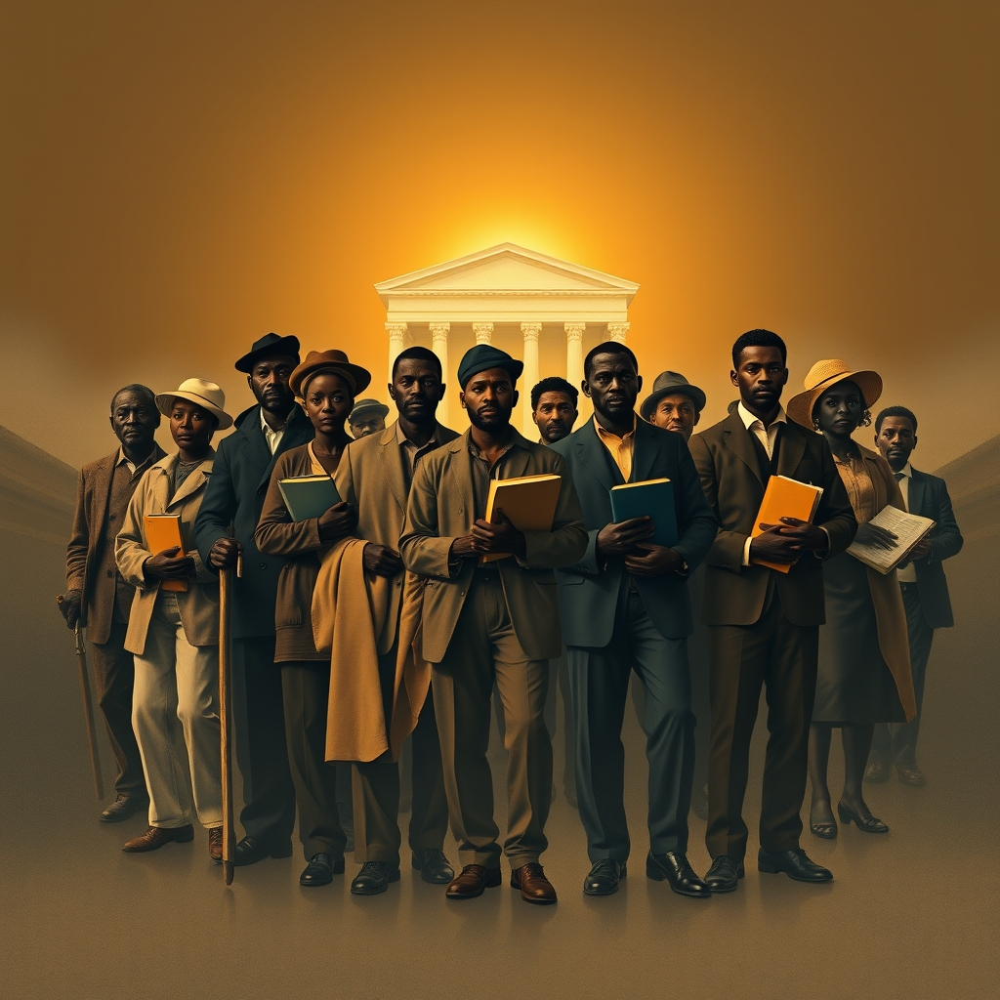

[Home](../index.md) > [Books](./index.md)  
# 🧑🏿‍🤝‍🧑🏿🏛️ Black Reconstruction in America (The Oxford W. E. B. Du Bois): An Essay Toward a History of the Part Which Black Folk Played in the Attempt to Reconstruct Democracy in America, 1860-1880  
  
[🛒 Black Reconstruction in America (The Oxford W. E. B. Du Bois): An Essay Toward a History of the Part Which Black Folk Played in the Attempt to Reconstruct Democracy in America, 1860-1880. As an Amazon Associate I earn from qualifying purchases.](https://amzn.to/47M6gmX)  
  
✊🏾 Black agency, particularly through a general strike of enslaved people, was central to the Union victory. Reconstruction was a failed attempt at interracial democracy, thwarted by white supremacy and a missed opportunity for cross-racial labor solidarity 📜💔.  
  
## 🏆 W. E. B. Du Bois's Black Reconstruction History  
  
### 🏛️ Reclaiming Historical Narrative  
* 🚫 **Challenge Dunning School:** Directly refutes prevailing racist historical views blaming Black people for Reconstruction's failures.  
* ✊🏾 **Emphasize Black Agency:** Centers the experiences and actions of Black people, especially freed slaves, as pivotal to the era.  
* 📖 **Correct Misinterpretations:** Exposes propaganda and inaccuracies in mainstream historiography regarding African Americans during Reconstruction.  
  
### 💰 Economic & Class Analysis  
* 🏭 **Slavery as Economic Engine:** Identifies slavery as fundamental to the Southern plantation economy and a core cause of the Civil War.  
* 🚶🏾‍♀️ **General Strike Theory:** Argues enslaved people engaged in a mass withdrawal of labor, crippling the Confederacy and aiding the Union war effort.  
* 🧠 **Psychological Wage of Whiteness:** Explains how white workers received social and psychological benefits from racism, hindering class solidarity with Black workers.  
* 🤝 **Missed Labor Coalition:** Highlights the failure of poor white and Black workers to unite against the planter class as a critical turning point.  
  
### 🕊️ Vision for Democracy  
* ✨ **Reconstruction's Promise:** Frames Reconstruction as a significant, albeit unfinished, effort toward a worker-ruled, interracial democracy.  
* 🏫 **Democratic Achievements:** Points to public education systems and Black political participation as key successes of the era.  
* 💔 **Overthrow by Violence:** Documents how white supremacist violence, economic exploitation, and political fraud ended Reconstruction.  
  
## ⚖️ Critical Evaluation  
  
* 👨‍🏫 **Pioneering Revisionist History:** Du Bois's work is widely acknowledged as the definitive text challenging the racist Dunning School of thought, fundamentally altering Reconstruction historiography. 🗣️ Eric Foner, a prominent historian, calls it a monumental study that anticipated the findings of modern scholarship.  
* 🎯 **Emphasis on Black Agency:** Scholars affirm Du Bois's groundbreaking focus on enslaved people as active agents in their own liberation and in shaping Reconstruction, particularly through the general strike concept, though some contemporary scholarship debates the degree of coordination of this strike.  
* ⚒️ **Marxist Interpretation:** The book offers a materialist and class analysis of race under capitalism, viewing the Civil War as a social revolution from below and exposing the economic underpinnings of racial oppression. 🕰️ This perspective was radical for its time and laid a foundation for later Marxist-influenced scholarship.  
* 📢 **Early Reception and Later Influence:** Despite receiving positive reviews initially, Black Reconstruction was largely ignored by white historians upon publication due to the dominance of the Dunning School. 🚀 However, it gained immense influence in the 1960s and beyond, becoming a foundational text of revisionist African American historiography and a must-read for scholars across disciplines.  
* 🚧 **Limitations and Criticisms:** Some early critics, including white writers and even Black journalists, expressed reservations or outright dismissed Du Bois's work as biased or lacking in certain evidence, partly due to the challenges Black historians faced in accessing resources. ⏱️ Modern scholarship has occasionally tempered some claims by highlighting continuities in white political goals during Reconstruction. 🤔 Du Bois is also sometimes critiqued for being unsympathetic to poor whites in the South.  
  
✅ **Final Verdict:** Du Bois's Black Reconstruction in America is a foundational, indispensable, and profoundly influential work that fundamentally reshaped the understanding of the Reconstruction era. 💯 Its core claim—that Black Americans were central to the era's democratic promise and that its failure was a tragic defeat for multiracial democracy rooted in white supremacy and economic class divisions—has been overwhelmingly affirmed and built upon by subsequent scholarship, solidifying its status as a classic.  
  
## 🔍 Topics for Further Understanding  
  
* 🏠 The socio-economic realities of freedmen's families and communities post-Reconstruction.  
* 🚫 The rise and impact of Jim Crow laws and segregation across different Southern states.  
* 👩🏾‍💼 The role of Black women's activism and labor during and after Reconstruction.  
* 🌍 Comparative analyses of post-emancipation societies in other parts of the world (e.g., the Caribbean, Brazil).  
* 💔 The psychological and cultural impacts of Reconstruction's failure on both Black and white Americans into the 20th century.  
* ✊🏾 The influence of Du Bois's Marxist analysis on later civil rights and labor movements.  
* 📉 The evolution of the Dunning School and its eventual dismantling in academia.  
  
## ❓ Frequently Asked Questions (FAQ)  
  
### 💡 Q: What is the main argument of Black Reconstruction in America?  
✅ A: Du Bois argues that Black Americans, particularly freed slaves, were central to the Civil War's outcome through a general strike and that Reconstruction was a radical, albeit ultimately failed, attempt to establish an interracial democracy in the South, sabotaged by white supremacy and a divided working class.  
  
### 💡 Q: Why is Black Reconstruction in America important?  
✅ A: It is important because it fundamentally challenged and overturned the prevailing racist historical narrative (the Dunning School) that blamed Black people for Reconstruction's failures, instead emphasizing Black agency and the era's unfulfilled promise for American democracy.  
  
### 💡 Q: How did Du Bois challenge Reconstruction historiography?  
✅ A: Du Bois challenged it by providing extensive evidence from primary sources to demonstrate the political and economic contributions of Black Americans, framing the era as a revolutionary struggle for democracy and economic justice, rather than a corrupt failure caused by Black incompetence.  
  
### 💡 Q: What was the role of Black labor in Reconstruction?  
✅ A: Black labor played a critical role, initially through a general strike during the Civil War that weakened the Confederacy, and then through efforts by freedpeople to gain fair wages and economic independence, often clashing with white employers over exploitative systems like sharecropping.  
  
### 💡 Q: Who were some key Black leaders during Reconstruction?  
✅ A: Notable Black leaders during Reconstruction included Hiram Revels and Blanche K. Bruce (U.S. Senators from Mississippi), Robert Smalls (U.S. Representative), Jonathan Jasper Wright (South Carolina Supreme Court Justice), and state legislators like Francis Cardozo (SC) and Tunis Campbell (GA), who advocated for public education and civil rights.  
  
## 📚 Book Recommendations  
  
### 📖 Similar  
* Reconstruction: America's Unfinished Revolution by Eric Foner  
* Stony the Road: Reconstruction, White Supremacy, and the Rise of Jim Crow by Henry Louis Gates Jr.  
* The Second Founding: How the Civil War and Reconstruction Remade the Constitution by Eric Foner  
  
### ⚔️ Contrasting  
* The Tragic Era: The Revolution After Lincoln by Claude G. Bowers  
* A Consuming Fire: The Fall of the Confederacy in the Mississippi Delta by John Barry Ryan  
* A Short History of Reconstruction by Eric Foner (a condensed version of his larger work, often used for contrast with Du Bois's length and specific emphasis)  
  
### 🔗 Related  
* The Souls of Black Folk by W. E. B. Du Bois  
* The Warmth of Other Suns: The Epic Story of America's Great Migration by Isabel Wilkerson  
* American Slavery, American Freedom: The Ordeal of Colonial Virginia by Edmund S. Morgan  
  
## 🫵 What Do You Think?  
  
🤔 Which of Du Bois's arguments resonates most powerfully with contemporary issues of racial and economic justice? ❓ How might a different outcome during Reconstruction have shaped American society today? 🗣️ Share your insights below!