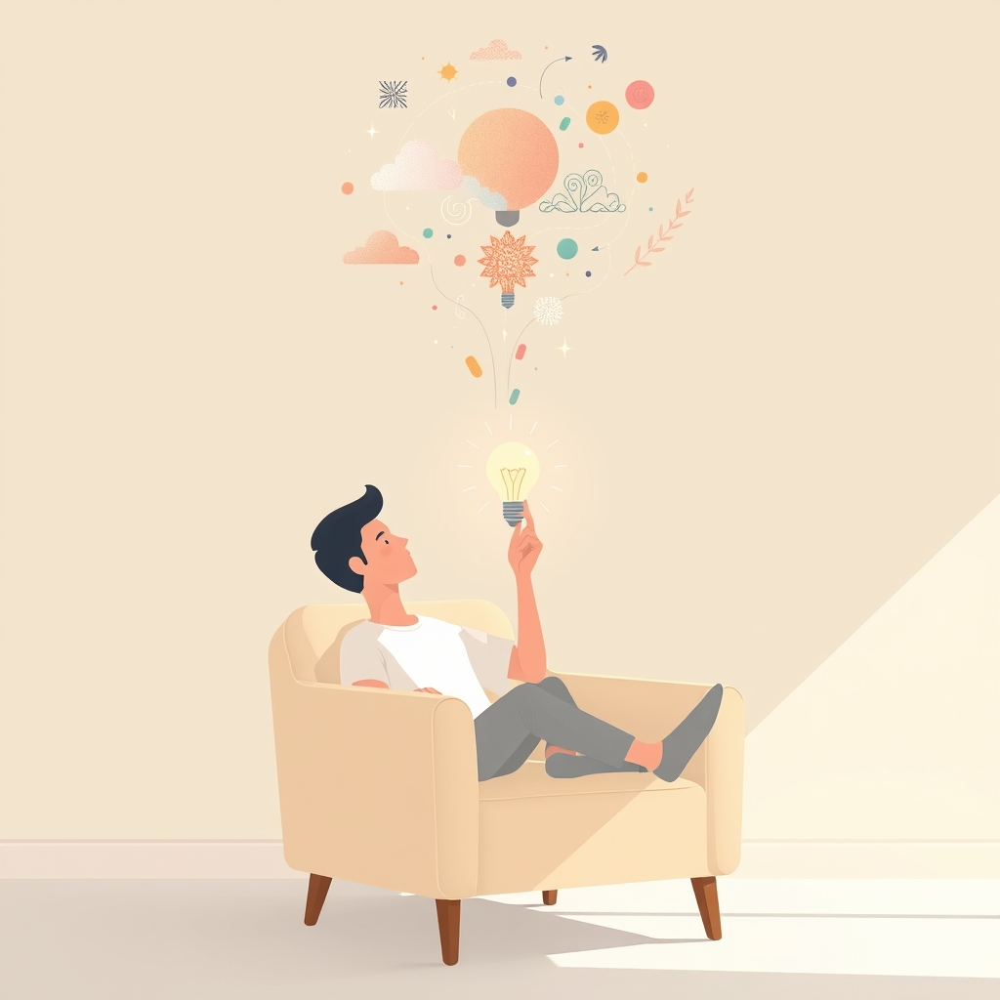

[Home](../index.md) > [Books](./index.md)  
# 🥱🤓 Bored and Brilliant: How Spacing Out Can Unlock Your Most Productive and Creative Self  
  
[🛒 Bored and Brilliant: How Spacing Out Can Unlock Your Most Productive and Creative Self. As an Amazon Associate I earn from qualifying purchases.](https://amzn.to/3FA2N0J)  
  
## 📖 Book Report: 🤯 Bored and Brilliant  
  
### ✍️ Introduction  
📖 "Bored and Brilliant: 💡 How Spacing Out Can Unlock Your Most Productive and Creative Self" by 👩‍💼 Manoush Zomorodi explores the detrimental effects of constant digital stimulation on our minds. 🎧 Zomorodi, host of the WNYC podcast "Note to Self," argues that our deliberate avoidance of boredom hinders our ability to think creatively and deeply. 🗓️ The book originated from a 2015 project where thousands of her listeners participated in challenges designed to help them disconnect from devices and rediscover the benefits of letting their minds wander.  
  
### 🔑 Key Themes/Arguments  
* 😴 **Boredom as a Catalyst for Creativity:** 🧠 Zomorodi posits that boredom isn't a state to be avoided but rather a crucial "gateway to mind-wandering." 🤔 This mental state allows our brains to make novel connections, fostering creativity and problem-solving.  
* 📱 **The Cost of Constant Connectivity:** 🌐 While technology offers convenience, it comes at the price of our attention. 🕹️ Devices and apps are often designed to be addictive, keeping us constantly engaged and preventing the mental downtime necessary for deeper thought.  
* 🧘 **Mind-Wandering vs. Mindfulness:** 💭 The book distinguishes between active mindfulness and the passive, associative thinking that occurs during mind-wandering or "spacing out," emphasizing the unique creative benefits of the latter.  
* ⏳ **Reclaiming Downtime:** 🗓️ Zomorodi advocates for intentionally creating space for boredom in our daily lives to improve focus, productivity, and overall well-being.  
  
### ⚙️ Structure/Methodology  
* 🔬 **Research Synthesis:** 📚 The book blends neuroscience and cognitive psychology research on attention, boredom, and creativity.  
* 🗣️ **Expert Interviews:** 👨‍🏫 Zomorodi incorporates insights from experts in technology, psychology, and neuroscience.  
* 💪 **The "Bored and Brilliant Challenge":** The core of the book builds on the week-long challenge presented to Zomorodi's podcast listeners. 🗓️ Each chapter often corresponds to a daily challenge aimed at reducing device dependence and encouraging boredom. 📱 Examples include tracking phone use, deleting distracting apps, or taking a "fakeation" (unplugging for a set period).  
* 🗣️ **Personal Anecdotes and Listener Stories:** 💬 The author shares her own experiences and testimonials from listeners who participated in the challenge, illustrating the real-world impact of the concepts.  
  
### ✨ Key Takeaways/Impact  
* 🎯 **Value Your Attention:** 💰 Recognize that your attention is a valuable resource constantly being targeted by technology companies.  
* 🧘 **Embrace "Doing Nothing":** 😴 Intentionally schedule unstructured time to allow your mind to wander without digital distractions.  
* 📱 **Manage Technology Mindfully:** ✅ Implement practical strategies (like those in the challenge) to control device usage rather than letting devices control you.  
* 🤯 **Boredom Fosters Brilliance:** 💡 Understand that moments of boredom are not wasted time but opportunities for the brain to process information, make connections, and generate original ideas.  
  
### ✅ Conclusion  
📖 "Bored and Brilliant" serves as both a critique of our digitally saturated lives and a practical guide to reclaiming mental space. 🧠 Zomorodi compellingly argues that by strategically embracing boredom and managing our relationship with technology, we can enhance our creativity, productivity, and overall quality of life.  
  
## 📚 Book Recommendations  
  
### 🤓 Similar Reads (Focus on Digital Minimalism, Attention, Creativity)  
* **[📱⬇️🧘 Digital Minimalism: Choosing a Focused Life in a Noisy World](./digital-minimalism-choosing-a-focused-life-in-a-noisy-world.md)** by ✍️ Cal Newport: Argues for a philosophy of technology use where tools are intentionally selected to support deeply held values, advocating for a decluttering process similar to Zomorodi's challenges.  
* **[🤿💼 Deep Work: Rules for Focused Success in a Distracted World](./deep-work.md) by ✍️ Cal Newport: Explores the importance of distraction-free concentration for producing high-quality work and achieving mastery.  
* **[📱💔 How to Break Up with Your Phone: The 30-Day Plan to Take Back Your Life](./how-to-break-up-with-your-phone-the-30-day-plan-to-take-back-your-life.md)** by 👩‍💼 Catherine Price: Offers a practical plan to create a healthier relationship with your smartphone, reducing addiction and reclaiming attention.  
* 🤯 **Stolen Focus: 😞 Why You Can't Pay Attention—and How to Think Deeply Again** by ✍️ Johann Hari: Investigates the societal, technological, and environmental factors diminishing our collective attention spans and offers solutions.  
* **[📱🧠 The Shallows: What the Internet Is Doing to Our Brains](./the-shallows-what-the-internet-is-doing-to-our-brains.md)** by ✍️ Nicholas Carr: Explores the neurological impact of the internet, arguing that its constant stimulation encourages shallow thinking over deep contemplation.  
* 🎯 **Attention Span: 🧠 A Groundbreaking Way to Restore Balance, Happiness and Productivity** by 👩‍💼 Gloria Mark: Delves into decades of research on how technology affects attention, presenting findings on distraction, multitasking, and different attention states.  
  
### 🤔 Contrasting Perspectives (Alternative Views on Technology/Productivity)  
* 📱 **Irresistible: 🧲 The Rise of Addictive Technology and the Business of Keeping Us Hooked** by ✍️ Adam Alter: While detailing the addictive nature of technology like Zomorodi, Alter focuses more on the psychological mechanisms and business strategies behind it. 🤝 It complements *Bored and Brilliant* by providing a deeper dive into *why* technology is so hard to put down.  
* 🪝 **Hooked: 🔨 How to Build Habit-Forming Products** by ✍️ Nir Eyal: Written from the perspective of product design, this book explains *how* technology is made addictive. ↔️ It offers a contrasting viewpoint by focusing on the creation rather than the user's management of addictive tech. ✍️ (Note: Eyal later wrote *Indistractable* to help users combat these hooks).  
* 🌐 **The New Digital Age: 🚀 Reshaping the Future of People, Nations and Business** by ✍️ Eric Schmidt & ✍️ Jared Cohen: Offers a more optimistic, macro-level view of technology's transformative potential across various aspects of society, contrasting with Zomorodi's focus on the personal cognitive costs.  
  
### 🎨 Creatively Related (Exploring Outcomes and Adjacent Concepts)  
* 👩‍🎨 **[The Artist's Way](./the-artists-way.md)** by 👩‍💼 Julia Cameron: A classic guide to unlocking creativity through practices like "Morning Pages" and "Artist Dates," which encourage introspection and observation, akin to the outcomes Zomorodi suggests boredom can foster.  
* ✨ **[🪄 Big Magic: Creative Living Beyond Fear](./big-magic.md)** by 👩‍💼 Elizabeth Gilbert: Explores the nature of inspiration and creativity, encouraging readers to embrace curiosity and approach creative endeavors with joy and less pressure – a potential outcome of the mental space Zomorodi advocates for.  
* 🌊 **[Flow: The Psychology of Optimal Experience](./flow-the-psychology-of-optimal-experience.md)** by ✍️ Mihaly Csikszentmihalyi: While *Bored and Brilliant* focuses on the benefits of *under*-stimulation (boredom), *Flow* explores the state of complete absorption in an activity, representing a different type of focused mental state often linked to high productivity and creativity.  
* 🧘 **The Power of Now: 🙏 A Guide to Spiritual Enlightenment** by ✍️ Eckhart Tolle: Focuses on presence and disidentification from the constant stream of thought, offering a spiritual path to managing the mental "noise" that technology often exacerbates.  
* 🚶 **The Wander Society** by 👩‍💼 Keri Smith: Encourages aimless exploration and observation of one's surroundings as a way to engage with the world differently, aligning with the idea of finding value in less structured, non-goal-oriented time.  
  
## 💬 [Gemini](../software/gemini.md) Prompt (gemini-2.5-pro-exp-03-25)  
> Write a markdown-formatted (start headings at level H2) book report, followed by a plethora of additional similar, contrasting, and creatively related book recommendations on Bored and Brilliant How Time Spent Doing Nothing Changes Everything. Be thorough in content discussed but concise and economical with your language. Structure the report with section headings and bulleted lists to avoid long blocks of text.