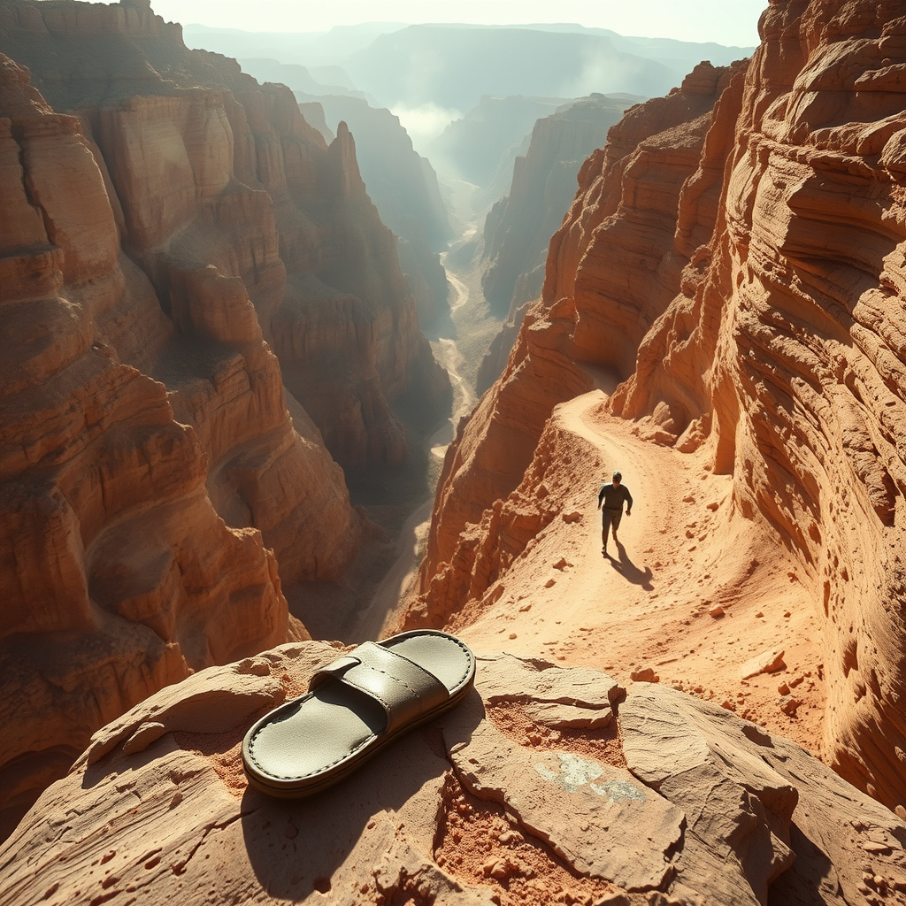

[Home](../index.md) > [Books](./index.md)  
# 🏃‍♂️⛰️ Born to Run: A Hidden Tribe, Superathletes, and the Greatest Race the World Has Never Seen  
  
[🛒 Born to Run: A Hidden Tribe, Superathletes, and the Greatest Race the World Has Never Seen. As an Amazon Associate I earn from qualifying purchases.](https://amzn.to/41R4BdG)  
  
## 📚 Book Report: Born to Run: A Hidden Tribe, Superathletes, and the Greatest Race the World Has Never Seen  
  
### 📖 Summary  
  
🏃‍♂️ Christopher McDougall's Born to Run chronicles his personal quest to understand why he, like so many other runners, suffered from persistent injuries. ⛰️ This journey leads him deep into Mexico's Copper Canyons in search of the elusive Tarahumara (Rarámuri) Indians, a reclusive tribe renowned for their extraordinary ability to run ultra-distances—sometimes hundreds of miles—in simple sandals 🩴 or barefoot 👣, seemingly without injury.  
  
✍️ The narrative expertly weaves together McDougall's personal experiences, investigative journalism, and scientific inquiry. 👨‍💼 He introduces a colorful cast of eccentric American ultrarunners who are equally fascinated by the Tarahumara's secrets. 🧬 The book delves into the "endurance running hypothesis," a scientific theory suggesting that humans evolved to be exceptional long-distance runners, capable of persistence hunting prey to exhaustion. 🦶 This theory posits that specific human anatomical features, such as elastic foot arches and efficient cooling systems, are adaptations for endurance running. 🏁 The culmination of McDougall's odyssey is a climactic 50-mile race through the treacherous Copper Canyons, pitting the Tarahumara against a band of elite American ultrarunners.  
  
### 🔑 Key Themes  
  
* 🏃‍♀️ **The Endurance Running Hypothesis:** A central argument is that humans are inherently "born to run." 🧬 Our bodies possess unique evolutionary adaptations for long-distance running, making it a fundamental part of our species' survival and development.  
* 👟 **Critique of Modern Running Culture and Footwear:** McDougall challenges the conventional wisdom surrounding modern running shoes, arguing that heavily cushioned footwear may paradoxically contribute to, rather than prevent, injuries by altering natural biomechanics and weakening the foot. 👣 The book advocates for barefoot or minimalist running as a more natural and injury-free approach, inspired by the Tarahumara's practices.  
* 🇲🇽 **Tarahumara Culture and the Joy of Running:** The book extensively explores the lifestyle, simple diet 🌽, and spiritual connection 🙏 to running within the Tarahumara community. 🏞️ For them, running is not just a sport but a way of life, integral to communication, transportation 🚚, and communal celebration 🎉, contributing to their remarkable health and serenity.  
* 💪 **Human Potential and Resilience:** Through the stories of both the Tarahumara and the American ultrarunners, the book celebrates the extraordinary limits of human endurance, mental fortitude 🧠, and the deep connection between the mind and body in overcoming perceived physical barriers.  
  
### ✍️ Author's Purpose and Message  
  
❓ McDougall's primary purpose was to answer his initial query about running injuries and, in doing so, to fundamentally challenge and reshape prevailing beliefs about running. ✅ His overarching message is that running is our birthright—an innate human ability designed for joy and health, not pain. 👣 He asserts that by embracing our natural running form, adopting a more minimalist approach to footwear, and reconnecting with the inherent pleasure of movement, individuals can overcome injuries and unlock their full physical and mental potential, much like the Tarahumara.  
  
### 📈 Impact and Reception  
  
📅 Published in 2009, Born to Run became a best-selling non-fiction book 🏆, selling over three million copies, and profoundly impacted the running world. 👣 It is widely credited with igniting the barefoot and minimalist running movement, prompting a significant re-evaluation of running shoe design, running form, and training methodologies. 🗣️ The book inspired countless individuals to take up running or reconsider their approach to the sport, advocating for a return to a more natural and intuitive style of movement. 🤔 While celebrated for its engaging storytelling and inspiring message, some of its scientific claims and narrative style have drawn critique.  
  
## 📚 Book Recommendations  
  
### 📖 Similar Books  
  
* 🇰🇪 **Running with the Kenyans** by Adharanand Finn: This book offers a direct exploration of another culture deeply intertwined with exceptional running performance. 🌍 Finn moves his family to Kenya to immerse himself in the training and lifestyle that produce many of the world's fastest runners, seeking to understand their secrets, much like McDougall sought to understand the Tarahumara.  
* 🌱 **Eat & Run** by Scott Jurek: A memoir by one of the legendary ultrarunners featured in Born to Run, Jurek shares his personal journey through the world of extreme endurance, his philosophy on plant-based nutrition, and practical advice for aspiring long-distance athletes. 🧠 It provides a deeper dive into the mindset and preparation of an ultrarunner.  
* 🧬 **The Story of the Human Body: Evolution, Health, and Disease** by Daniel Lieberman: Written by a Harvard evolutionary biologist whose work is referenced in Born to Run, this book provides a comprehensive scientific look at human evolution, including the adaptations that make us natural endurance runners. 🔬 It offers a more academic, yet accessible, foundation for the "endurance running hypothesis."  
  
### ⚖️ Contrasting Books  
  
* 🪑 **Sitting Is a New Smoking: How to Save Your Life by Reducing Sitting Time** by Anoop Chauhan and Amit Sharma: This title stands in stark contrast by highlighting the detrimental health impacts of inactivity and prolonged sitting ⏰, which is the antithesis of the constant movement and running advocated in Born to Run. ⚠️ It emphasizes the opposite problem and different solutions for modern health crises.  
* 🍔 **Why We Get Fat: And What to Do About It** by Gary Taubes: While Born to Run focuses on the benefits of exercise for health and leanness, Taubes's book argues that diet 🍕, specifically carbohydrate intake, is the primary driver of obesity and metabolic disease. 🥗 It presents a contrasting view on the most effective levers for health and weight management, shifting focus away from exercise intensity.  
* 🤕 **The Myth of Normal: Trauma, Illness, and Healing in a Toxic Culture** by Gabor Maté: This book offers a broad critique of modern Western culture's impact on health and well-being, suggesting that societal pressures and unaddressed trauma contribute to widespread physical and mental illness. 😞 It contrasts the almost idyllic picture of the Tarahumara's serene and healthy existence, presenting a deeper, more systemic analysis of why modern people struggle.  
  
### 🎨 Creatively Related Books  
  
* **[🌌 Cosmos](./cosmos.md)** by Carl Sagan: This seminal work connects humanity to the vastness of the universe, our evolutionary past, and the sense of wonder in discovery. ✨ It resonates with the primal connection to nature and the profound feeling of being part of something larger, a sentiment often described by runners pushing their limits, similar to the spiritual dimensions of running explored in Born to Run.  
* 🏡 **Walden** by Henry David Thoreau: A classic exploration of living simply and self-sufficiently in nature 🌲, deliberately detaching from societal conventions to find deeper meaning. 🤔 This echoes McDougall's quest for an authentic, uncomplicated running experience and the Tarahumara's lifestyle, which questions the complexities and perceived necessities of modern life.  
* **[✨🧙‍♂️⚗️ The Alchemist](./the-alchemist.md)** by Paulo Coelho: This allegorical novel tells the story of a young shepherd boy who journeys to find his "personal legend," encountering challenges and wisdom along the way. 💫 It metaphorically relates to the transformative personal quests undertaken by ultrarunners and McDougall himself, emphasizing intuition, perseverance, and the discovery of profound truths through an arduous journey.  
  
## 💬 [Gemini](https://gemini.google.com) Prompt (gemini-2.5-flash)  
> Write a markdown-formatted (start headings at level H2) book report, followed by similar, contrasting, and creatively related book recommendations on Born to Run: A Hidden Tribe, Superathletes, and the Greatest Race the World Has Never Seen. Never quote or italicize titles. Be thorough but concise. Use section headings and bulleted lists to avoid long blocks of text.