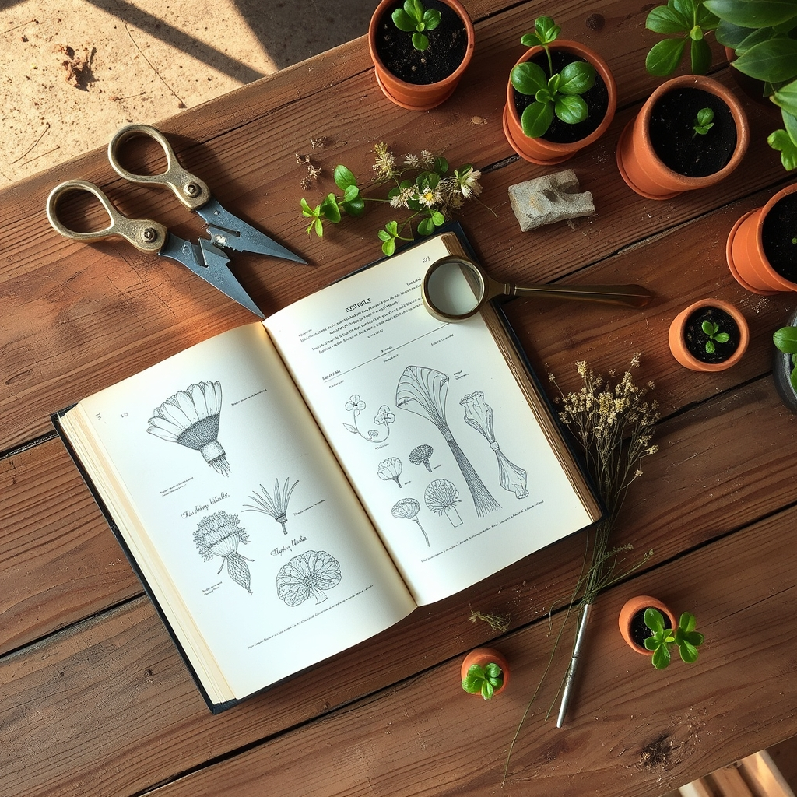

[Home](../index.md) > [Books](./index.md)  
# 🌿🧑‍🌾 Botany for Gardeners  
  
[🛒 Botany for Gardeners. As an Amazon Associate I earn from qualifying purchases.](https://amzn.to/4jt9qQg)  
  
## 📖 Book Report: Botany for Gardeners  
  
### ℹ️ Overview  
  
* 🌿 **Title:** Botany for Gardeners  
* ✍️ **Author:** Brian Capon.  
* 📅 **Original Publication:** 1990, with several updated editions since (e.g., 3rd, 4th).  
* 🎯 **Main Focus:** To explain the science of botany – how plants function, grow, reproduce, and are structured – in a way that is accessible and relevant to home gardeners.  
  
### 🔑 Key Themes/Content  
  
* 🌱 **Plant Structure:** Covers plant organization from the cellular level upwards.  
* 💧 **Plant Physiology:** Explains essential functions like photosynthesis, respiration, water absorption, and nutrient roles.  
* 📈 **Growth & Development:** Discusses how plants grow, including concepts like geotropism and responses to light.  
* 🌸 **Reproduction:** Details the processes of plant reproduction.  
* 🧬 **Genetics & Adaptation:** Touches upon plant genetics and how plants adapt to different environments.  
* 🗂️ **Taxonomy:** Later editions include updates on plant classification and nomenclature.  
  
### 🧑‍🌾 Target Audience & Style  
  
* 👥 **Audience:** Aimed at home gardeners, horticulture students, and anyone interested in understanding plants beyond basic care, without requiring a science background.  
* 🖋️ **Style:** Written in an understandable and engaging manner, avoiding overly dense scientific jargon often found in traditional textbooks. 📝 It originated from lecture notes for non-science students. 📸 It uses illustrations and photographs to clarify concepts.  
  
### 👍 Strengths  
  
* 🤝 **Accessibility:** Successfully bridges the gap between complex botanical science and practical gardening interest.  
* 💡 **Clarity:** Explains complex processes clearly, often answering the "why" behind common gardening practices (like pruning).  
* 🌎 **Comprehensive:** Covers a wide range of botanical topics relevant to gardeners.  
* 🖼️ **Well-Illustrated:** Includes helpful diagrams and photos.  
* 🏆 **Enduring Popularity:** A bestseller for decades, indicating its lasting value and effectiveness.  
  
### 👎 Potential Weaknesses  
  
* 📚 **Not Light Reading:** While accessible, it's still a science book, not a casual read for pleasure for most.  
* 🤯 **May Be Too Detailed for Some:** Contains more information than a casual gardener might strictly need.  
  
### 💭 Overall Impression  
  
"Botany for Gardeners" 🪴 is widely regarded as an essential reference book for gardeners seeking a deeper understanding of how plants work. 🔬 It translates complex scientific concepts into digestible information, enhancing the gardener's appreciation and knowledge of their plants. 📖 Its clear explanations, logical structure, and helpful illustrations make it a highly recommended resource. ✅  
  
## 📚 Book Recommendations  
  
### 🪴 Similar Reads (Accessible Botany for Gardeners)  
  
* 🎨 **RHS Botany for Gardeners: The Art and Science of Gardening Explained:** A beautifully illustrated book covering similar ground, perhaps with more emphasis on botanical art and history alongside the science. 📖 It's described as very readable and good for beginners or those wanting background knowledge without being bogged down in technical terms.  
* 🧪 **Plant Science for Gardeners: Essentials for Growing Better Plants (Garden Science Series, 2) by Robert Pavlis:** Part of a series aimed at explaining garden science concepts clearly.  
* 🔤 **Practical Botany for Gardeners: Over 3000 Botanical Terms Explained and Explored by Geoff Hodge:** Focuses on explaining botanical terms, potentially an easier read than Capon's but noted as possibly Eurocentric.  
  
### 🧐 Contrasting Perspectives (Deeper Dives & Different Angles)  
  
* 🌿 **Plant Systematics by Michael Simpson:** A more technical textbook focusing on the morphology, evolution, and classification of plant families, suitable for those wanting advanced detail.  
* 🌳 **Morphology and Evolution of Vascular Plants by Foster and Gifford:** A recommended advanced text focusing on evolutionary relationships and morphology.  
* 🎓 **Advanced Botany (Multi-volume series) by Dr. Sanjeev Pandey:** University-level textbooks covering biochemistry, physiology, ecology, phytogeography, genetics, cell biology, molecular biology, etc., for serious students.  
* 👁️ **The Botany of Desire: A Plant's-Eye View of the World by Michael Pollan:** Explores the relationship between humans and plants from the perspective of the plants themselves, focusing on how certain species have co-evolved with human desires. 📖 Less a technical manual, more a narrative exploration.  
  
### ✨ Creatively Related (Expanding the Botanical Horizon)  
  
* 🌍 **Soil Science for Gardeners by Robert Pavlis:** Focuses specifically on the science of soil, the rhizosphere, and building soil health – crucial for plant growth but distinct from pure botany.  
* 🧑‍🤝‍🧑 **Ethnobotany Books (e.g., Ethnobotany for Beginners, [🪢🌾 Braiding Sweetgrass: Indigenous Wisdom, Scientific Knowledge, and the Teachings of Plants](./braiding-sweetgrass.md)):** Explore the relationship between people and plants, including traditional knowledge, cultural uses, and folklore.  
* 🖍️ **Botanical Illustration Books (Various authors like Christabel King, Valerie Oxley, Wendy Hollender, Bobbi Angell):** Focus on the art of depicting plants accurately and beautifully, combining artistic skill with scientific observation.  
* 📜 **The Signature of All Things by Elizabeth Gilbert:** A historical novel centered around a 19th-century female botanist, bringing the field to life through narrative.  
* ✍️ **A Botanist's Vocabulary: 1300 Terms Explained and Illustrated:** A reference focusing purely on defining botanical terminology.  
* 📜 **Latin for Gardeners: Over 3,000 Plant Names Explained and Explored:** Delves into the meaning and origin of scientific plant names.  
  
## 💬 [Gemini](../software/gemini.md) Prompt (gemini-2.5-pro-exp-03-25)  
> Write a markdown-formatted (start headings at level H2) book report, followed by a plethora of additional similar, contrasting, and creatively related book recommendations on Botany for Gardeners. Be thorough in content discussed but concise and economical with your language. Structure the report with section headings and bulleted lists to avoid long blocks of text.