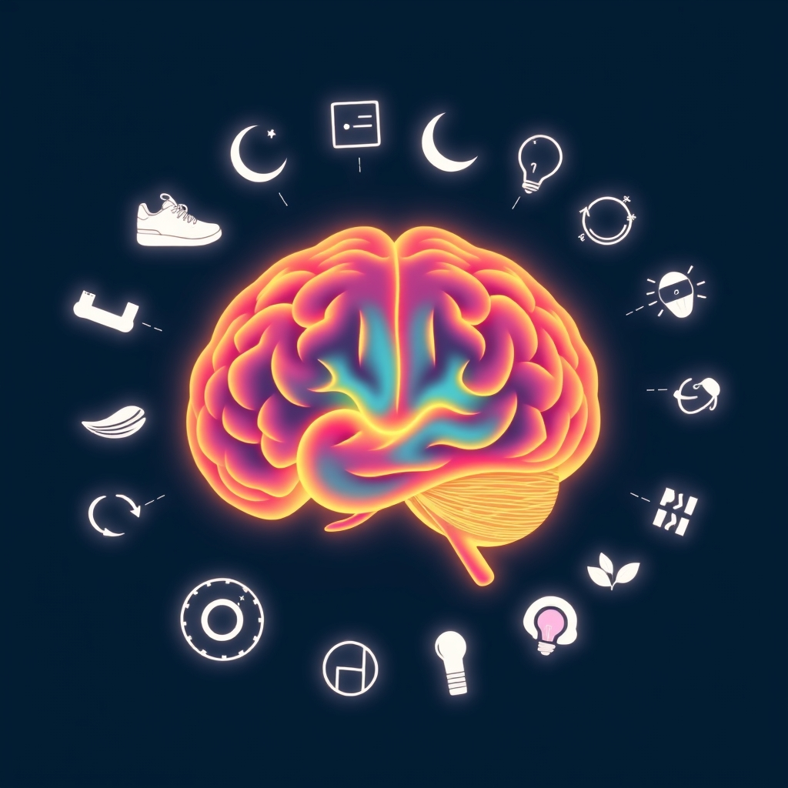

[Home](../index.md) > [Books](./index.md)  
# 🧠💡📈🏠🏢🧑‍🎓 Brain Rules: 12 Principles for Surviving and Thriving at Work, Home, and School  
  
[🛒 Brain Rules: 12 Principles for Surviving and Thriving at Work, Home, and School. As an Amazon Associate I earn from qualifying purchases.](https://amzn.to/3TQGlUy)  
  
## 🧠 Book Report: Brain Rules by John Medina  
  
*Brain Rules: 12 Principles for Surviving and Thriving at Work, Home, and School* by John Medina is a guide to 🧭 understanding how our brains work and how we can leverage this knowledge to improve our lives, particularly in 📚 learning and 🏭 productivity environments. 👨‍🔬 Medina, a molecular biologist, translates complex neuroscience research into accessible language, using 🗣️ anecdotes and 😂 humor to illustrate his points. The book is structured around 1️⃣2️⃣ 12 key "brain rules," each supported by 🔬 peer-reviewed scientific studies.  
  
### 💡 Core Concepts  
  
The central premise of *Brain Rules* is that our brains evolved over ⏳ millions of years to solve problems in a constantly 🏃 moving, 🏞️ unpredictable outdoor environment, and understanding this 📜 evolutionary history is key to optimizing brain function today. Medina argues that modern environments, like 🏢 offices and 🏫 classrooms, are often not conducive to how our brains are naturally wired to learn and operate. By applying the 1️⃣2️⃣ 12 brain rules, individuals, schools, and businesses can create more brain-friendly environments and habits.  
  
### 🧠 The 12 Brain Rules  
  
The book dedicates a chapter to each principle, explaining the science behind it and offering practical applications. Some of the key rules include:  
  
* 🏃 **Exercise Boosts Brain Power:** Physical activity is crucial for cognitive function, improving 🧠 memory, 🧐 attention, and 🧩 problem-solving skills. Our brains evolved for movement, and regular 🏋️ exercise increases blood flow and stimulates brain-derived neurotrophic factor (BDNF), a protein essential for neuron health and connections.  
* 😴 **Sleep Well, Think Well:** Adequate sleep is essential for effective thinking and 🧠 memory consolidation. 😫 Sleep loss negatively impacts 🧐 attention, 💽 working memory, 😔 mood, and 🧮 logical reasoning. The brain is active during sleep, ⏪ replaying what was learned during the day.  
* 😫 **Stressed Brains Don't Learn the Same Way:** 😟 Chronic stress impairs learning, 🧠 memory, and cognitive processes. While ⚡ acute stress can sometimes boost learning, ⏳ prolonged stress is debilitating and can damage areas like the hippocampus, crucial for 🧠 memory.  
* 🧬 **Every Brain is Wired Differently:** No two brains are exactly alike; our experiences and learning shape our neural pathways uniquely.  
* 🥱 **We Don't Pay Attention to Boring Things:** Attention is influenced by 😥 emotion, ❓ meaning, and whether information is considered important or ✨ novel. The brain is not designed for multitasking; it focuses on concepts sequentially. ⏳ Attention typically wanes after about 10 minutes, suggesting the need for ⏸️ breaks or 🔄 shifts in focus.  
* 🔁 **Repeat to Remember (Short-Term Memory) and Remember to Repeat (Long-Term Memory):** 🧠 Memory formation involves stages of encoding, storing, retrieving, and forgetting. ⏳ Repeated exposure to information at timed intervals is crucial for moving information from working memory to long-term memory.  
* 🖐️ **Stimulate More of the Senses:** Engaging multiple senses simultaneously enhances learning and recall. Our senses evolved to work together.  
* 👁️ **Vision Trumps All Other Senses:** Vision is the most dominant sense and significantly impacts how we perceive and process information.  
* 🔎 **Exploration:** 👶 Humans are natural explorers, driven by curiosity from infancy, which is fundamental for cognitive development and lifelong learning.  
  
Medina provides practical tips at the end of each chapter for applying these rules in various settings.  
  
## 📚 Additional Book Recommendations  
  
### 🔬 Similar Books (Popular Science, Applied Neuroscience)  
  
* ***Your Brain at Work: Strategies for Overcoming Distraction, Regaining Focus, and Working Smarter All Day Long*** by David Rock: Focuses on using neuroscience to improve productivity and manage distractions in the workplace.  
* ***Limitless: Develop a New Relationship with Your Brain, Learn Anything Faster, and Unlock Your Exceptional Life*** by Jim Kwik: Provides strategies based on neuroscience to improve 🧠 memory, 📚 learning, and 📖 reading speed.  
* ***A Whole New Mind: Why Right-Brainers Will Rule the Future*** by Daniel H. Pink: Argues that the future belongs to individuals with "right-brain" qualities like creativity, empathy, and big-picture thinking, complementing the logical "left-brain" focus of the past era.  
* **[🤔🐇🐢 Thinking, Fast and Slow](./thinking-fast-and-slow.md)** by Daniel Kahneman: Explores the two systems that drive the way we think: the fast, intuitive system and the slow, logical system, and how they affect our decisions.  
* **[🌱🧘🏼‍♀️🏆 Mindset: The New Psychology of Success](./mindset.md)** by Carol S. Dweck: While not strictly neuroscience, it delves into the impact of mindset (fixed vs. growth) on learning and achievement, which has implications for brain plasticity.  
* **[🧠🔒 Make It Stick: The Science of Successful Learning](./make-it-stick.md)** by Peter C. Brown, Henry L. Roediger III, Mark A. McDaniel: Examines research-backed learning strategies that are more effective than common but inefficient methods.  
* **[⚛️🔄 Atomic Habits: An Easy & Proven Way to Build Good Habits & Break Bad Ones](./atomic-habits.md)** by James Clear: Focuses on the science of habit formation and how small changes can lead to remarkable results, relevant to implementing brain-friendly practices.  
  
### ⚖️ Contrasting Books (Different Perspectives, Critiques)  
  
* ***The Idiot Brain: What Your Head Is Really Up To*** by Dean Burnett: A humorous look at the flaws and quirks of the brain, offering a less idealized view than some popular science books.  
* ***Great Myths of the Brain*** by Christian Jarrett: Debunks common misconceptions about the brain and neuroscience.  
* ***The Extended Phenotype: The Long Reach of the Gene*** by Richard Dawkins: A classic evolutionary biology text that presents a gene-centric view of evolution, which could offer a contrasting perspective to purely brain-focused explanations of behavior.  
* ***Against Empathy: The Case for Rational Compassion*** by Paul Bloom: Argues against empathy as a reliable moral guide, suggesting a more rational approach to compassion, which could contrast with perspectives emphasizing emotional intelligence derived from brain studies.  
  
### 🎨 Creatively Related Books (Adjacent Fields, Deeper Dives, or Different Formats)  
  
* **[👶🧠😊📈📚 Brain Rules for Baby: How to Raise a Smart and Happy Child from Zero to Five](./brain-rules-for-baby.md)** by John Medina: Applies the brain rules specifically to early childhood development.  
* **[🕳️🧠👶🏽 The Whole-Brain Child: 12 Revolutionary Strategies to Nurture Your Child's Developing Mind](./the-whole-brain-child.md)** by Daniel J. Siegel and Tina Payne Bryson: Focuses on integrating different parts of a child's brain to promote healthy development and emotional intelligence.  
* **[🚫🎭🧠 No-Drama Discipline: The Whole-Brain Way to Calm the Chaos and Nurture Your Child's Developing Mind](./no-drama-discipline.md)** by Daniel J. Siegel and Tina Payne Bryson: Applies a similar whole-brain approach to parenting and discipline.  
* ***Bringing Up Bébé: One American Mother Discovers the Wisdom of French Parenting*** by Pamela Druckerman: Explores cultural differences in parenting styles, offering a different lens on child development and behavior compared to a purely neuroscientific one.  
* ***How We Learn: The Surprising Truth About When, Where, and Why It Happens*** by Benedict Carey: Investigates less intuitive but highly effective learning strategies based on psychological research.  
* ***Oliver Sacks' works*** (e.g., *The Man Who Mistook His Wife for a Hat*): Case studies of neurological disorders that offer profound insights into the complexities and mysteries of the human brain and mind through compelling narratives.  
* **[♾️📐🎶🥨 Gödel, Escher, Bach: An Eternal Golden Braid](./godel-escher-bach.md)** by Douglas Hofstadter: A Pulitzer Prize-winning book exploring common themes in the lives and works of mathematician Kurt Gödel, artist M. C. Escher, and composer Johann Sebastian Bach, delving into concepts of intelligence, consciousness, and complexity, often through creative and unexpected connections.  
* ***Proust and the Squid: The Story and Science of the Reading Brain*** by Maryanne Wolf: Explores the neuroscience and history of reading, providing a deep dive into a specific and crucial cognitive function.  
* **[🤫🧠 Subliminal: How Your Unconscious Mind Rules Your Behavior](./subliminal-how-your-unconscious-mind-rules-your-behavior.md)** by Leonard Mlodinow: Explores the powerful influence of the unconscious mind on our perceptions, decisions, and behavior, adding another layer to understanding human action beyond conscious thought.  
  
## 💬 [Gemini](../software/gemini.md) Prompt (gemini-2.5-flash-preview-04-17)  
> Write a markdown-formatted (start headings at level H2) book report, followed by a plethora of additional similar, contrasting, and creatively related book recommendations on Brain Rules: 12 Principles for Surviving and Thriving at Work, Home, and School. Be thorough in content discussed but concise and economical with your language. Structure the report with section headings and bulleted lists to avoid long blocks of text.