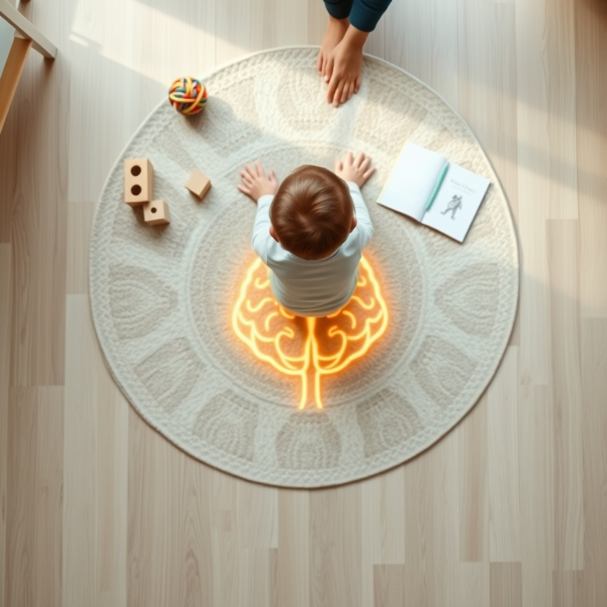

[Home](../index.md) > [Books](./index.md)  
# 👶🧠😊📈📚 Brain Rules for Baby: How to Raise a Smart and Happy Child from Zero to Five  
  
[🛒 Brain Rules for Baby: How to Raise a Smart and Happy Child from Zero to Five. As an Amazon Associate I earn from qualifying purchases.](https://amzn.to/4km3BoW)  
  
## 🤖 AI Summary  
### Brain Rules for Baby: Summary & Analysis 👶🧠  
**TL;DR:** Nurturing a baby's brain development involves focusing on practical, science-backed strategies related to sleep, nutrition, emotional connection, and exploration, rather than chasing fleeting "genius baby" fads.  
  
**New/Surprising Perspective:** 🤯 While many parenting books focus on rigid schedules and achieving specific milestones, "Brain Rules for Baby" emphasizes the importance of understanding the underlying science of brain development. It reveals how seemingly simple actions, like ensuring adequate sleep or fostering emotional security, have profound, long-term impacts on a child's cognitive abilities and emotional well-being. It also debunks many common myths about early childhood education and emphasizes the significant role of parental stress and health.  
  
### Deep Dive 🔬  
**Topics Covered:**  
* **Pregnancy:** 🤰 Nutrition, stress management, and environmental factors impacting fetal brain development.  
* **Birth to Age 5:** 👶 Sleep, nutrition, emotional regulation, language acquisition, social skills, and cognitive development.  
* **Parental Brain:** 🧠 The effects of parenting on the adult brain and the importance of parental well-being.  
* **Environmental Influence:** 🌳 The impact of environment, including stress and social interactions, on a child's brain.  
  
**Methods & Research Discussed:**  
* The author, Dr. John Medina, draws heavily on neuroscience, developmental psychology, and behavioral studies. 📊  
* He cites numerous peer-reviewed research papers and presents findings in an accessible manner.  
* Emphasis on longitudinal studies that demonstrate the long-term effects of early experiences.  
* He utilizes brain imaging studies to illustrate the neurological basis of various behaviors. 🧠  
  
**Significant Theories/Theses/Mental Models:**  
* **12 Brain Rules Applied to Baby Development:** 📝 The book adapts the 12 brain rules from Medina's previous book, [🧠💡📈🏠🏢🧑‍🎓 Brain Rules: 12 Principles for Surviving and Thriving at Work, Home, and School](./brain-rules-12-principles-for-surviving-and-thriving-at-work-home-and-school.md), to the context of early childhood.  
* **Stress as a Brain Killer:** 🤯 Chronic stress, both in parents and children, has detrimental effects on brain development.  
* **The Importance of Emotional Connection:** ❤️ Secure attachment and emotional responsiveness are crucial for healthy brain development.  
* **Exploration as Learning:** 🗺️ Children learn best through active exploration and play.  
  
**Practical Takeaways:**  
* **Sleep:** 😴 Prioritize consistent sleep schedules for both parents and babies. Create a dark, quiet environment for sleep.  
    * Establish a regular bedtime routine.  
    * Ensure age-appropriate sleep durations.  
* **Nutrition:** 🍎 Focus on a healthy, balanced diet for pregnant women and young children.  
    * Emphasize whole foods, fruits, and vegetables.  
    * Limit processed foods and sugary drinks.  
* **Emotional Connection:** 🤗 Respond promptly and consistently to your baby's needs.  
    * Engage in frequent eye contact and physical touch.  
    * Practice empathetic communication.  
* **Exploration:** 🏞️ Provide opportunities for safe and stimulating exploration.  
    * Encourage play-based learning.  
    * Limit screen time.  
    * Talk with your child, and read aloud. 📚  
* **Stress Management:** 🧘‍♀️ Practice stress-reduction techniques, such as mindfulness or exercise.  
    * Ensure adequate support systems are in place.  
  
**Critical Analysis:**  
* Dr. John Medina is a developmental molecular biologist with a strong background in brain research, lending credibility to his claims. 🧑‍🔬  
* The book is grounded in scientific evidence and presented in a clear and engaging style.  
* Reviews from reputable sources generally praise the book's accessibility and practical advice. 👍  
* While the book simplifies complex scientific concepts, it does so without sacrificing accuracy.  
* The book is highly regarded for its ability to bridge the gap between scientific research and practical parenting advice.  
  
### Book Recommendations 📚  
* **Best Alternate Book on the Same Topic:** [🕳️🧠👶🏽 The Whole-Brain Child: 12 Revolutionary Strategies to Nurture Your Child's Developing Mind](./the-whole-brain-child.md) by Daniel J. Siegel and Tina Payne Bryson. This book provides a practical, step-by-step approach to integrating a child's developing brain. 🧠  
* **Best Tangentially Related Book:** [🧑‍🎓🌱 How Children Succeed: Grit, Curiosity, and the Hidden Power of Character](./how-children-succeed-grit-curiosity-and-the-hidden-power-of-character.md) by Paul Tough. This book explores the importance of non-cognitive skills, such as grit and resilience, in children's development. 🌟  
* **Best Diametrically Opposed Book:** "Bringing Up Bébé" by Pamela Druckerman. This book offers a contrasting perspective, advocating for a more structured and less child-centered approach to parenting. 🇫🇷  
* **Best Fiction Book That Incorporates Related Ideas:** "Room" by Emma Donoghue. This novel explores the impact of environment and parental love on a child's development in extreme circumstances. 🚪  
* **Best Book That Is More General:** [🤱🏼🤿🪞🌱 Parenting from the Inside Out: How a Deeper Self-Understanding Can Help You Raise Children Who Thrive](./parenting-from-the-inside-out-how-a-deeper-self-understanding-can-help-you-raise-children-who-thrive.md) by Daniel J. Siegel and Mary Hartzell. This book delves into the impact of a parent's own experiences on their parenting style. 💖  
* **Best Book That Is More Specific:** "What Every Parent Needs to Know About the Developing Brain" by Margot Sunderland. This book contains very specific and detailed information on the brain. 🧠  
* **Best Book That Is More Rigorous:** "Developmental Cognitive Neuroscience" by Mark H. Johnson. This textbook provides a comprehensive and in-depth exploration of the neuroscience of child development. 🤓  
* **Best Book That Is More Accessible:** "[The Happiest Baby On The Block](./the-happiest-baby-on-the-block.md)" by Harvey Karp. This book presents a simplified approach to soothing babies and promoting sleep. 👶💤  
  
## 💬 [Gemini](https://gemini.google.com) Prompt  
> Summarize the book: Brain Rules for Baby. Start with a TL;DR - a single statement that conveys a maximum of the useful information provided in the book. Next, explain how this book may offer a new or surprising perspective. Follow this with a deep dive. Catalogue the topics, methods, and research discussed. Be sure to highlight any significant theories, theses, or mental models proposed. Emphasize practical takeaways, including detailed, specific, concrete, step-by-step advice, guidance, or techniques discussed. Provide a critical analysis of the quality of the information presented, using scientific backing, author credentials, authoritative reviews, and other markers of high quality information as justification. Make the following additional book recommendations: the best alternate book on the same topic; the best book that is tangentially related; the best book that is diametrically opposed; the best fiction book that incorporates related ideas; the best book that is more general or more specific; and the best book that is more rigorous or more accessible than this book. Format your response as markdown, starting at heading level H3, with inline links, for easy copy paste. Use meaningful emojis generously (at least one per heading, bullet point, and paragraph) to enhance readability. Do not include broken links or links to commercial sites.