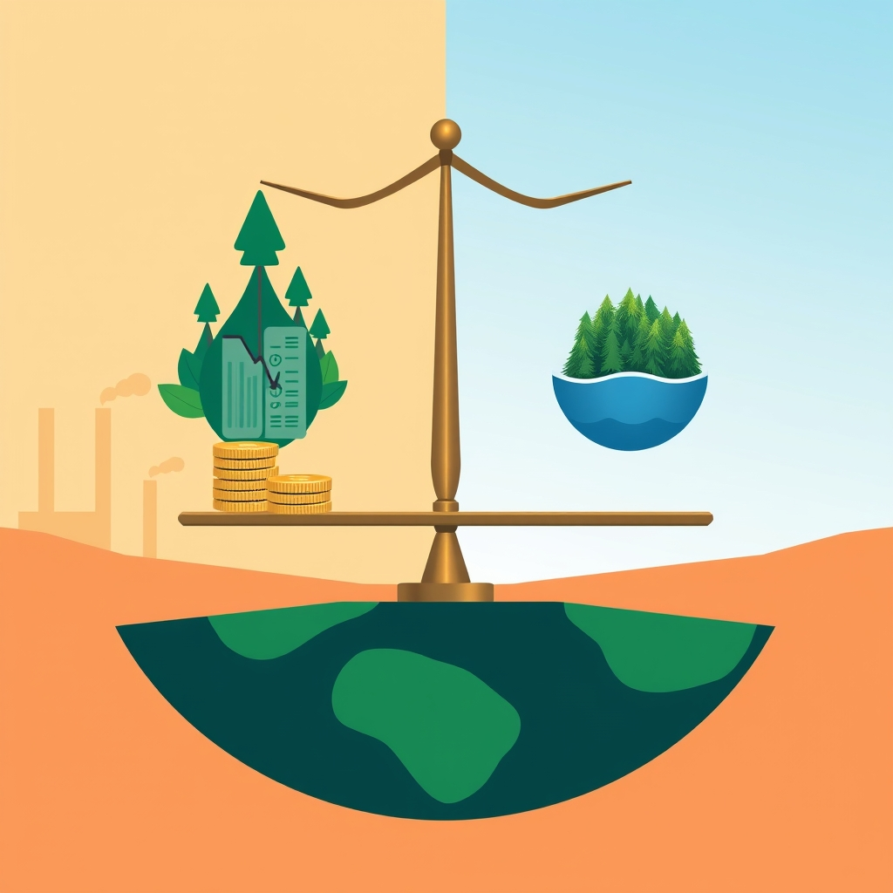

[Home](../index.md) > [Books](./index.md)  
# 💰🌎🌡️ Can We Afford the Future?: The Economics of a Warming World  
  
[🛒 Can We Afford the Future?: The Economics of a Warming World. As an Amazon Associate I earn from qualifying purchases.](https://amzn.to/3LBIVwF)  
  
🌱💰🌍 A re-evaluation of climate change economics arguing that solutions are affordable and essential, challenging conventional models that undervalue environmental protection and necessitate urgent, large-scale investment in low-carbon technologies.  
  
## 🏆 Ackerman's Climate Economics Strategy  
  
### 💡 Rethink Economic Fundamentals  
* 🤔 **Challenge Assumptions:** Critically examine conventional economic theories that devalue priceless environmental benefits.  
* ⏳ **Prioritize Future:** Shift focus from short-term financial costs to long-term planetary well-being.  
* 🌳 **Integrate Environment:** Recognize the environment as core to economic planning, not an externality.  
  
### 🔥 Implement Urgent Action  
* ⚡ **Immediate Response:** Advocate for large-scale, immediate actions over slow, gradual approaches to climate change.  
* 💸 **Massive Investment:** Support significant investment in new, low-carbon technologies and industries.  
* 🛡️ **"Life Insurance" Mindset:** Frame climate protection spending as essential "life insurance for the planet".  
  
### 🚦 Policy Redirection  
* 📈 **Better Economics:** Construct an economic framework that accurately accounts for climate risks and the benefits of protection.  
* ✅ **Affordability:** Emphasize that climate solutions are affordable and the alternative is unthinkable.  
  
## ⚖️ Critical Evaluation  
  
* 🚨 **Urgency of Action:** Ackerman's call for immediate, large-scale action aligns with a strong consensus among climate economists. 📊 Surveys indicate that the costs of inaction on climate change are perceived as higher than the costs of action, with a median estimate for a net negative impact on the global economy by 2025.  
* 📉 **Flaws in Conventional Economics:** Ackerman critiques arbitrary assumptions in traditional economic theories that undervalue climate protection. 🌍 This aligns with broader discussions in environmental economics that highlight the need to address externalities (unaccounted costs or benefits) and value environmental goods and services, moving beyond solely GDP-focused metrics.  
* 🤝 **Affordability of Solutions:** Ackerman argues climate solutions are affordable and necessary. 🧑‍💼 Expert economists generally concur that aggressive emissions reductions are economically desirable and that bold climate mitigation strategies are likely to be economically justified. 🤔 The debate often shifts to the *how* rather than *if* we can afford it.  
* ⚙️ **Mechanism Effectiveness (Carbon Pricing):** While Ackerman broadly advocates for investment in low-carbon technologies, concrete mechanisms like carbon pricing are widely discussed. 🧾 Research confirms that carbon pricing mechanisms (taxes and cap-and-trade) can significantly reduce emissions, with studies showing reductions from 5% to 21% in initial years. 💡 This supports the idea that market-based solutions can be effective components of an affordable climate strategy.  
  
## 🔍 Topics for Further Understanding  
  
* 🗳️ The Political Economy of Climate Action and Policy Implementation Challenges  
* 🧠 Behavioral Economics and Consumer Choice in Low-Carbon Transitions  
* ⚖️ Equity and Just Transition Frameworks in Climate Policy  
* 🏭 Detailed Sectoral Decarbonization Pathways (e.g., heavy industry, agriculture, shipping)  
* 🌱 The Role of Green Finance and Sustainable Investment Vehicles  
* 🧪 Advanced Geoengineering and Carbon Dioxide Removal Technologies  
* 🌳 Measuring and Valuing Natural Capital in National Accounts  
* 🌍 The Intersection of Climate Change and Geopolitical Stability  
  
## ❓ Frequently Asked Questions (FAQ)  
  
### 💡 Q: What is the main argument of Can We Afford the Future?: The Economics of a Warming World?  
✅ A: Frank Ackerman argues that solutions to climate change are not only affordable but essential, and that conventional economic models often fail to grasp the urgency and value of climate protection due to flawed assumptions.  
  
### 💡 Q: Is climate action is too expensive?  
✅ A: No, quite the opposite. Ackerman contends that the costs of climate protection are affordable, and the costs of inaction are "unthinkable".  
  
### 💡 Q: How does Ackerman propose we address climate change economically?  
✅ A: He advocates for a "better economics" that accurately values the benefits of climate protection and calls for massive investment in new, low-carbon technologies and industries, viewing such investment as "life insurance for the planet".  
  
### 💡 Q: Is there a consensus among economists on the economics of climate change?  
✅ A: Yes, there is a strong consensus among expert climate economists that climate change is hurting the global economy, and that cutting carbon pollution is economically desirable, often through market-based mechanisms like carbon pricing.  
  
## 📚 Book Recommendations  
  
### 📖 Similar  
* 🌍 Net Zero: How We Stop Causing Climate Change by Dieter Helm  
* 💰 The Carbon Crunch by Dieter Helm  
* [🍩🌍 Doughnut Economics: Seven Ways to Think Like a 21st-Century Economist](./doughnut-economics-seven-ways-to-think-like-a-21st-century-economist.md) by Kate Raworth  
  
### 📖 Contrasting  
* 🚨 Apocalypse Never: Why Environmental Alarmism Hurts Us All by Michael Shellenberger  
* 🤔 The Skeptical Environmentalist by Bjørn Lomborg  
  
### 📖 Related  
* 🌳 Natural Capital by Dieter Helm  
* 🌱 Legacy: How to Build the Sustainable Economy by Dieter Helm  
* [🤔🐇🐢 Thinking, Fast and Slow](./thinking-fast-and-slow.md) by Daniel Kahneman  
  
## 🫵 What Do You Think?  
🤔 What aspect of the economic argument for climate action resonates most with you, and what challenges do you foresee in shifting economic paradigms?