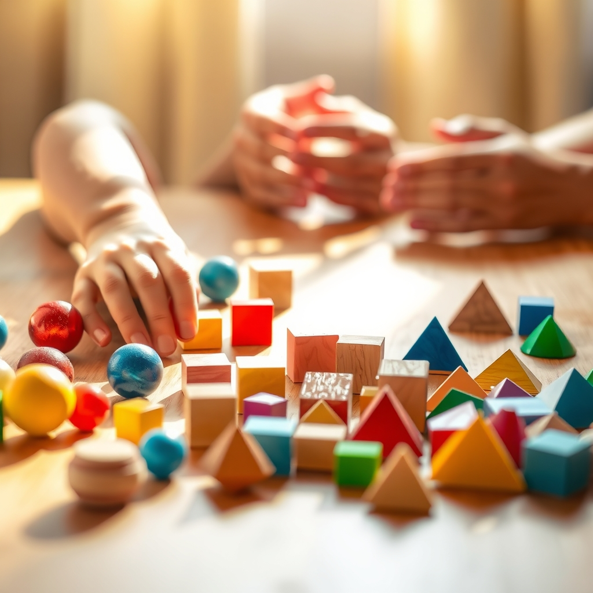

[Home](../index.md) > [Books](./index.md)  
# 👶🧠➕ Children are Born Mathematicians: Supporting Mathematical Development, Birth to Age 8  
  
[🛒 Children are Born Mathematicians: Supporting Mathematical Development, Birth to Age 8. As an Amazon Associate I earn from qualifying purchases.](https://amzn.to/4kuBJ2Q)  
  
Young children are innately equipped with mathematical abilities, emphasizing the critical role of responsive caregivers and stimulating environments in fostering these foundational skills from birth through age eight. 🧠 The book champions a constructivist approach, advocating for active learning, hands-on experiences, and thoughtful questioning over rote memorization to build a deep understanding of mathematical concepts. 📈 It stresses that early mathematical experiences positively impact long-term attainment in math and other learning areas.  
  
## 🤖 AI Summary  
  
### 🧠 Core Philosophy  
* 👶 **Innate Mathematical Capacity:** Children possess an inherent ability to understand foundational mathematical concepts from birth.  
* 🏗️ **Constructivist Learning:** Children actively construct mathematical knowledge through interaction with their environment and others.  
* 🌱 **Developmental Process:** Math learning is a continuous developmental journey, not solely about formal instruction.  
  
### 🔑 Key Principles  
* 🌳 **Environment as Teacher:** Rich, stimulating environments are crucial for mathematical exploration.  
* 🤝 **Adult as Facilitator:** Adults guide and promote concept development through experiences and questioning, not direct teaching.  
* 🎲 **Play-Based Learning:** Integrate math into play, daily routines, and social interactions.  
* 🎯 **Meaningful Experiences:** Focus on practical, purposeful experiences over abstract tasks.  
  
### 👣 Actionable Steps (Birth to Age 8)  
* 👶 **Infants & Toddlers (Birth-3):**  
    * 🖐️ **Sensory Exploration:** Offer contrasting colors, tactile objects, and sounds to stimulate brain development.  
    * 🗣️ **Math Talk:** Use everyday language (e.g., more, empty, full, big, little, round) during routines.  
    * 🔢 **Counting & Quantifying:** Count objects, body parts; use how many questions.  
    * 🔺 **Shapes & Spatial Relations:** Provide shape sorters, blocks, and talk about position (in, on, under).  
    * 🔁 **Patterns:** Point out and create simple patterns in daily life and songs.  
    * 🗂️ **Sorting & Classifying:** Group objects by color, size, or type.  
* 📚 **Preschool & Kindergarten (3-5):**  
    * 🖐️ **Hands-on Activities:** Utilize puzzles, games, building blocks, and art to explore math.  
    * 🧩 **Problem-Solving:** Encourage logical reasoning and systematic approaches to everyday problems.  
    * 📏 **Measurement & Comparison:** Explore size, weight, quantity (big/small, taller/shorter) through cooking, sorting.  
    * ➕ **Number Sense:** Develop one-to-one correspondence, numeral recognition, simple addition/subtraction.  
    * 💬 **Mathematical Language:** Ask open-ended questions that stimulate thinking (e.g., What happens next?).  
* 🏫 **Grade School (5-8):**  
    * 💡 **Project-Based Learning:** Engage in projects and experiences that apply mathematical concepts.  
    * 🤔 **Conceptual Understanding:** Prioritize comprehension over rote answers.  
    * 🌐 **Curriculum Integration:** Weave math into all subjects and daily activities.  
  
## ⚖️ Evaluation  
  
* 🔬 **Strong Research Foundation:** The book aligns with extensive research indicating that children are born with fundamental numerical and spatial understanding and that early mathematical experiences significantly predict later academic success.  
* 🌱 **Developmentally Appropriate Practices:** The 3 E approach (environment, experience, and explanation) and chronological view of math development from birth to age 8 are well-supported by early childhood education principles, emphasizing playful and integrated learning over formal worksheets in early years.  
* 🏗️ **Constructivist Alignment:** The book's emphasis on children actively constructing knowledge through interaction and exploration resonates with leading educational theories (e.g., Piaget, Bruner).  
* 🤝 **Facilitator Role of Adults:** The recommendation for adults to act as facilitators through questioning and providing stimulating environments is a widely accepted best practice in early childhood math education.  
* 🧘‍♀️ **Holistic Development:** The integration of mathematical learning with other developmental domains, such as language and social-emotional skills, is supported by research showing their interconnectedness.  
* ⚖️ **Nuance on Born Mathematicians:** While the core idea that children have innate capacities is strong, some sources distinguish between number sense (innate perception of quantity) and counting (a human invention requiring teaching), suggesting a more nuanced view where innate ability provides a foundation upon which complex mathematical thinking is built through experience and instruction.  
  
## 🔍 Topics for Further Understanding  
  
* 🌍 **The impact of cultural differences on early mathematical development and pedagogical approaches.**  
* 🧩 **Specific interventions for children exhibiting early signs of mathematical learning difficulties (dyscalculia).**  
* 📱 **The role of digital tools and educational technology in supporting early mathematical development.**  
* 🚀 **Advanced strategies for fostering mathematical creativity and problem-solving beyond basic concepts.**  
* 🧠 **The connection between executive functions (e.g., working memory, cognitive flexibility) and early math achievement.**  
* 😟 **The longitudinal effects of parental math anxiety on children's mathematical confidence and achievement.**  
  
## ❓ Frequently Asked Questions (FAQ)  
  
### 💡 Q: What is the main premise of Children are Born Mathematicians: Supporting Mathematical Development, Birth to Age 8?  
✅ A: Children are Born Mathematicians argues that children possess innate mathematical abilities from birth, and effective early childhood education should focus on nurturing these natural capacities through active engagement, exploration, and responsive adult interaction rather than formal instruction.  
  
### 💡 Q: How can parents support their child's mathematical development at home, according to Children are Born Mathematicians?  
✅ A: Parents can support mathematical development by integrating math talk into daily routines, engaging children in play-based activities that involve counting, sorting, identifying shapes and patterns, and providing a stimulating environment for exploration.  
  
### 💡 Q: Does Children are Born Mathematicians advocate for early formal math instruction?  
✅ A: No, Children are Born Mathematicians emphasizes a constructivist and developmentally appropriate approach, suggesting that for infants, toddlers, preschoolers, and kindergarteners, math is best learned through hands-on experiences, play, and interactions rather than formal, abstract instruction.  
  
### 💡 Q: What specific math concepts are covered in Children are Born Mathematicians for the birth to age 8 range?  
✅ A: The book covers fundamental concepts such as number and operations (counting, quantity, addition/subtraction), shapes and spatial relationships (geometry), measurement (size, weight, volume, time), patterns, and data analysis/classification, all introduced developmentally.  
  
### 💡 Q: What is the 3 E approach mentioned in Children are Born Mathematicians?  
✅ A: The 3 E approach refers to Environment, Experience, and Explanation, outlining how math is presented to different age groups. For infants and toddlers, the focus is on a mathematically interactive environment; for preschoolers and kindergarteners, it's hands-on experiences; and for grade school children, it combines environment and experience with more traditional educational methods.  
  
## 📚 Book Recommendations  
  
### 📖 Similar Books  
* [🧒🔢 The Young Child and Mathematics](./the-young-child-and-mathematics.md) by Juanita V. Copley  
* 📊 Mathematics Learning in Early Childhood: Paths Toward Excellence and Equity by National Research Council  
* 🧠 Big Ideas of Early Mathematics: What Teachers of Young Children Need to Know by The Erikson Institute Early Math Collaborative  
  
### 👎 Contrasting Books  
* 🚫 Why Johnny Can't Add: The Failure of the New Math by Morris Kline (focuses on traditional/computational approaches)  
* 📜 The Core Knowledge Series (emphasizes specific content knowledge at each grade level)  
  
### ➕ Related Books  
* [🌱🧘🏼‍♀️🏆 Mindset: The New Psychology of Success](./mindset.md) by Carol S. Dweck (growth mindset in learning)  
* [🧑‍🎓🌱 How Children Succeed: Grit, Curiosity, and the Hidden Power of Character](./how-children-succeed-grit-curiosity-and-the-hidden-power-of-character.md) by Paul Tough (non-cognitive skills)  
* 🧐 NurtureShock: New Thinking About Children by Po Bronson and Ashley Merryman (dispelling parenting myths, including some related to learning)  
  
## 🫵 What Do You Think?  
  
🤔 Which early math concept do you believe is most overlooked in traditional education, and how have you seen play-based learning effectively foster it? 💬 Share your insights below!