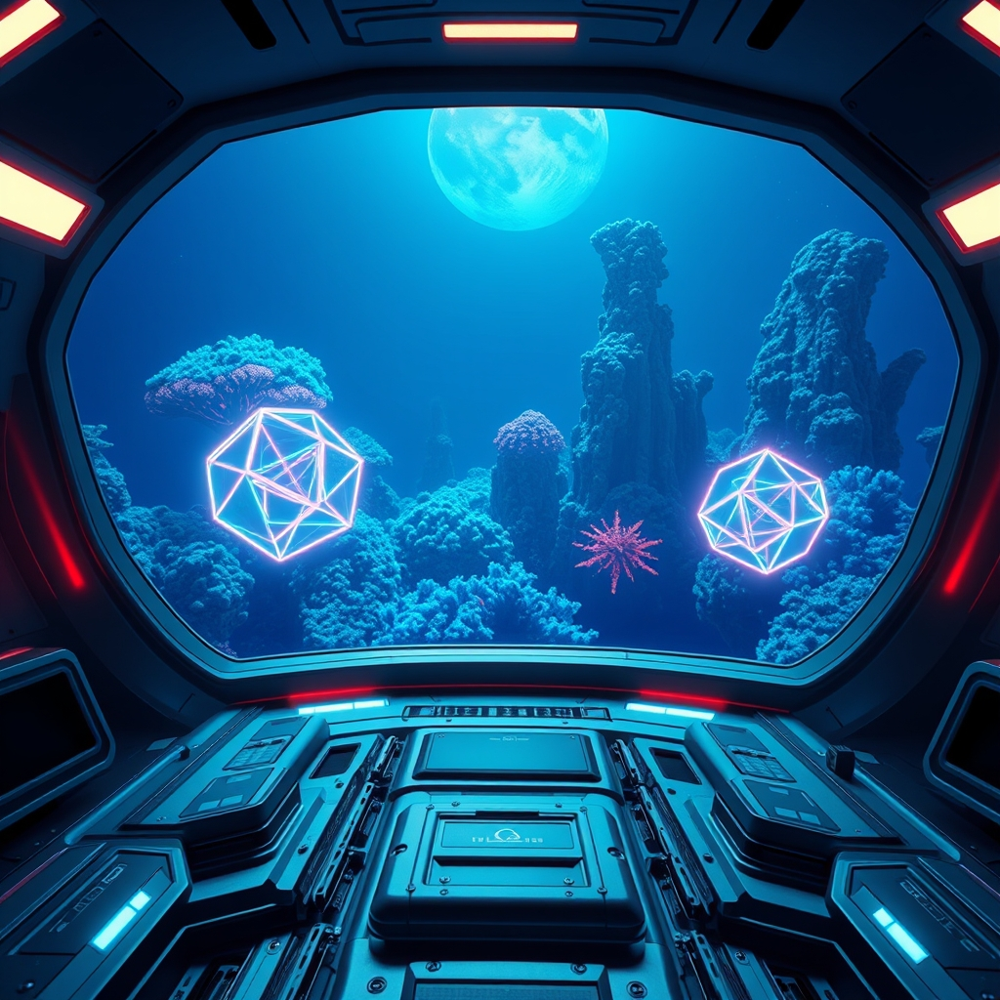

[Home](../index.md) > [Books](./index.md)  
# 🏚️👶 Children of Ruin  
  
[🛒 Children of Ruin. As an Amazon Associate I earn from qualifying purchases.](https://amzn.to/4cjR2Jv)  
  
## 🤖 AI Summary  
🌌 This sweeping space opera masterfully examines the staggering difficulty of communication between radically different forms of consciousness across vast reaches of time and space.  
  
## 🗺️ Context  
  
* ✍️ Author: Adrian Tchaikovsky  
* 📚 Genre: Hard Science Fiction  
* 📖 Series: Children of Time Series Book Two  
  
## ⭐ Assessment  
  
* 🧬 Core Appeal: An intellectually stimulating deep dive into speculative evolution and the complex logistics of interstellar terraforming efforts.  
* 🧠 Thematic Core: Explores the profound philosophical challenges of recognizing sentience and establishing cooperation between species with divergent neurological structures.  
* ✍️ Writing Style: Features a highly technical and descriptive prose style that emphasizes scientific realism and grand, multi-generational perspectives.  
* 🎭 Reader Experience: While the dense exposition and clinical tone require significant focus, they build a meticulously detailed universe that delivers immense satisfaction for fans of hard science.  
* 🏆 Critical Standing: Widely praised for its immense imaginative scope and its ability to modernize classic first-contact tropes with contemporary biological theories.  
  
## ❓ Frequently Asked Questions (FAQ)  
  
### ❓ Q: Do I need to read Children of Time before reading Children of Ruin?  
A: 🤓 While the narrative introduces a fresh cast and a new star system, the foundational world-building and previous evolutionary milestones are essential for fully grasping the overarching history of this universe.  
  
### ❓ Q: What kind of alien life is featured in Children of Ruin?  
A: 🤓 The story focuses on the development of highly intelligent, aquatic-based civilizations and the discovery of biological entities that challenge traditional definitions of individuality.  
  
### ❓ Q: Does Children of Ruin have elements of other genres?  
A: 🤓 The exploration of certain mysterious and potentially hostile environments introduces a distinct layer of cosmic horror and psychological tension to the primary science fiction framework.  
  
## 📚 Recommendations  
  
### 📖 Non-Fiction  
* 🐙 Other Minds: The Octopus, the Sea, and the Deep Origins of Consciousness by Peter Godfrey-Smith  
* 🧬 The Ancestor's Tale by Richard Dawkins  
  
### ❤️ If You Loved This  
* 🕷️ Children of Time by Adrian Tchaikovsky  
* 🛸 Embassytown by China Miéville  
  
### ↔️ Similar But Different  
* 🪐 The Mote in God's Eye by Larry Niven and Jerry Pournelle  
* 🌌 To Sleep in a Sea of Stars by Christopher Paolini  
  
## 🫵 What Do You Think?  
  
* 🧬 Does the idea of communicating with a species that thinks in colors and textures fascinate or frustrate you?  
* 🌌 If humanity encountered a life form that viewed our existence as a threat, do you believe peaceful cooperation would even be possible?