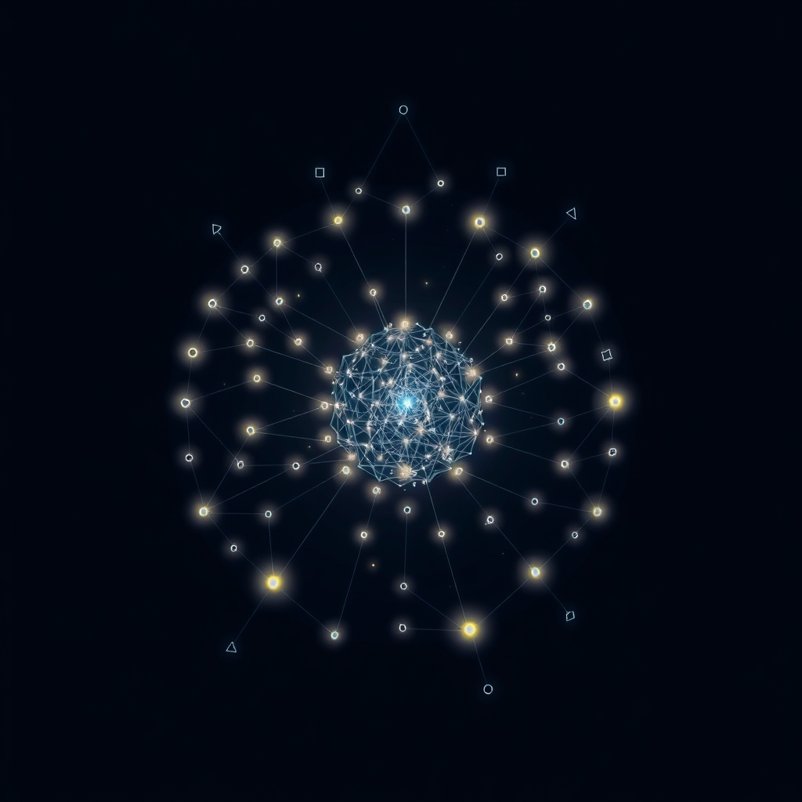

[Home](../index.md) > [Books](./index.md)  
# 🌐🧭❓🔍🗺️ Complexity: A Guided Tour  
  
[🛒 Complexity: A Guided Tour. As an Amazon Associate I earn from qualifying purchases.](https://amzn.to/3Svi7i6)  
  
## 🤖 AI Summary  
### Complexity: A Guided Tour by Melanie Mitchell 📚  
**TL;DR:** Complexity science explores how simple rules and interactions can lead to emergent, complex, and often unpredictable behaviors in diverse systems, from cells to societies. 🤯  
  
#### **A New or Surprising Perspective 🤔**  
Melanie Mitchell's "Complexity: A Guided Tour" offers a surprisingly accessible and integrated view of complexity science. It demystifies often intimidating concepts by weaving together historical context, real-world examples, and clear explanations. Unlike many texts that focus solely on one aspect of complexity (e.g., chaos theory or cellular automata), Mitchell provides a broad, interconnected narrative. She reveals how seemingly disparate fields like physics, biology, computer science, and social science are united by shared principles of emergence, adaptation, and information processing. This holistic approach reveals the underlying unity of complex systems, fostering a deeper appreciation for their ubiquity and importance. 🌟  
  
#### **Deep Dive: Topics, Methods, Research, and Theories 🔬**  
* **Introduction to Complexity:**  
    * Defines complexity as the study of how large networks of interacting parts give rise to emergent, collective behavior. 🌐  
    * Explores the limitations of traditional reductionism in understanding complex systems. 🚫✂️  
    * Highlights the importance of understanding emergence, adaptation, and information processing. 💡  
* **Cellular Automata and Emergence:**  
    * Discusses the Game of Life and other cellular automata as simple models that generate complex patterns. 🎮  
    * Explains how local rules can lead to global, unpredictable behavior. 📈  
    * Introduces the concept of emergent properties that are not present in individual components. 🐣➡️🦋  
* **Chaos Theory and Nonlinear Dynamics:**  
    * Explores the concept of sensitive dependence on initial conditions (the butterfly effect). 🦋  
    * Introduces attractors, fractals, and other concepts from nonlinear dynamics. 🌀  
    * Discusses the limitations of prediction in chaotic systems. 🔮❌  
* **Networks and Connectivity:**  
    * Explores the structure and dynamics of complex networks, including small-world networks and scale-free networks. 🕸️  
    * Discusses the role of connectivity in information flow and robustness. 🤝  
    * Explains how network topology influences system behavior. 🌐🔗  
* **Evolution and Adaptation:**  
    * Discusses evolutionary algorithms and genetic algorithms as examples of adaptive systems. 🧬  
    * Explores how evolution can lead to the emergence of complex structures and behaviors. 🐒➡️🧑‍💻  
    * Introduces the concept of [Self-Organization](../topics/self-organization.md) in biological systems. 🌿  
* **Information and Computation:**  
    * Explores the relationship between information, computation, and complexity. 💻  
    * Discusses the role of information in self-organization and adaptation. ℹ️  
    * Introduces concepts from algorithmic information theory. 🔢  
* **Cognitive Science and Artificial Intelligence:**  
    * Discusses how complexity science informs our understanding of cognition and intelligence. 🧠  
    * Explores the potential for building intelligent systems based on principles of complexity. 🤖  
    * Discusses the limitations and potential of neural networks. 🧠⚡  
* **Social and Economic Systems:**  
    * Applies complexity science to understanding social and economic phenomena. 🏙️💰  
    * Discusses the emergence of collective behavior in human societies. 👥  
    * Explores the dynamics of markets and other complex social systems. 📈📉  
  
#### **Significant Theories, Theses, and Mental Models 🧠**  
* **Emergence:** The idea that complex patterns and behaviors can arise from simple interactions. ✨  
* **[Self-Organization](../topics/self-organization.md):** The spontaneous emergence of order in complex systems. 🔄  
* **Adaptation:** The ability of complex systems to change and evolve in response to their environment. 🌿➡️🌳  
* **Information Processing:** The role of information in shaping the behavior of complex systems. ℹ️  
* **Nonlinear Dynamics:** The study of systems where small changes can have large and unpredictable effects. 🌀  
  
#### **Critical Analysis 🧐**  
Melanie Mitchell is a highly respected computer scientist and complexity researcher. Her work is well-regarded in the scientific community. "Complexity: A Guided Tour" is praised for its clarity, accessibility, and comprehensive coverage. It effectively translates complex scientific concepts into understandable language for a general audience. The book is heavily referenced, and the information presented is backed by scientific research. Authoritative reviews consistently highlight its value as an introductory text. The explanations are clear and well-structured, and the examples are relevant and engaging. 💯  
  
#### **Practical Takeaways 💡**  
* Recognize that complex systems are everywhere, from your own body to the global economy. 🌐  
* Appreciate the limitations of prediction in complex systems and the importance of adaptation. 🔮❌➡️✅  
* Understand how simple rules can lead to emergent behavior. 🎮➡️📈  
* Consider the role of networks and connectivity in information flow and robustness. 🤝  
* Apply principles of complexity to problem-solving and decision-making. 🛠️  
  
#### **Book Recommendations 📚**  
* **Best Alternate Books on the Same Topic:**  
    * [💥🌀➡️⏳⚖️🕰️ ️ Sync: How Order Emerges From Chaos In The Universe, Nature, And Daily Life](./sync.md) by Steven Strogatz. 🤝🔄  
    * Complex Adaptive Systems: An Introduction to Computational Models of Social Life by John H. Miller and Scott E. Page – A rigorous yet accessible introduction to modeling complex systems.  
* **Best Tangentially Related Book:** [🌐🔗🧠📖 Thinking in Systems: A Primer](./thinking-in-systems.md) by Donella H. Meadows. ⚙️  
* **Best Diametrically Opposed Books:**  
    * [🧬🎭👁️ The Case Against Reality: Why Evolution Hid the Truth from Our Eyes](./the-case-against-reality-why-evolution-hid-the-truth-from-our-eyes.md) by Donald D. Hoffman. 👁️‍🗨️  
    * [⚫🦢🎲 The Black Swan: The Impact of the Highly Improbable](./the-black-swan-the-impact-of-the-highly-improbable.md) by Nassim Nicholas Taleb – Challenges the predictability of systems and emphasizes rare, disruptive events over emergent order.  
* **Best Fiction Books Incorporating Related Ideas:**  
    * [🌌3️⃣⚛️ The Three-Body Problem](./the-three-body-problem.md) by Liu Cixin. 🌌  
    * [❄️💻💥 Snow Crash](./snow-crash.md) by Neal Stephenson – A cyberpunk novel where the interplay of technology, culture, and individuals mirrors complex adaptive systems.  
* **Best More General Book:** [📜🌍⏳ Sapiens: A Brief History of Humankind](./sapiens-a-brief-history-of-humankind.md) by Yuval Noah Harari. 🧑‍🤝‍🧑  
* **Best More Specific Book:** "Networks: An Introduction" by Mark Newman. 🕸️  
* **Best More Rigorous Book:** [🦋🌀💥🤖 Nonlinear Dynamics and Chaos: With Applications to Physics, Biology, Chemistry, and Engineering](./nonlinear-dynamics-and-chaos.md): by Steven H. Strogatz. 🌀  
* **Best More Accessible Book:** "Tangled Nets: How to Solve Your Organization's Toughest Problems Without Changing Everything" by Anne Loehr. 🕸️  
  
## 💬 [Gemini](https://gemini.google.com) Prompt  
> Summarize the book: Complexity: A Guided Tour by Melanie Mitchell. Start with a TL;DR - a single statement that conveys a maximum of the useful information provided in the book. Next, explain how this book may offer a new or surprising perspective. Follow this with a deep dive. Catalogue the topics, methods, and research discussed. Be sure to highlight any significant theories, theses, or mental models proposed. Provide a critical analysis of the quality of the information presented, using scientific backing, author credentials, authoritative reviews, and other markers of high quality information as justification. Emphasize practical takeaways. Make the following additional book recommendations: the best alternate book on the same topic; the best book that is tangentially related; the best book that is diametrically opposed; the best fiction book that incorporates related ideas; the best book that is more general or more specific; and the best book that is more rigorous or more accessible than this book. Format your response as markdown, starting at heading level H3, with inline links, for easy copy paste. Use meaningful emojis generously (at least one per heading, bullet point, and paragraph) to enhance readability. Do not include broken links or links to commercial sites.  
  
## 📝🐒 Human Notes  
- [Gödel, Escher, Bach: An Eternal Golden Braid](./godel-escher-bach.md)  
