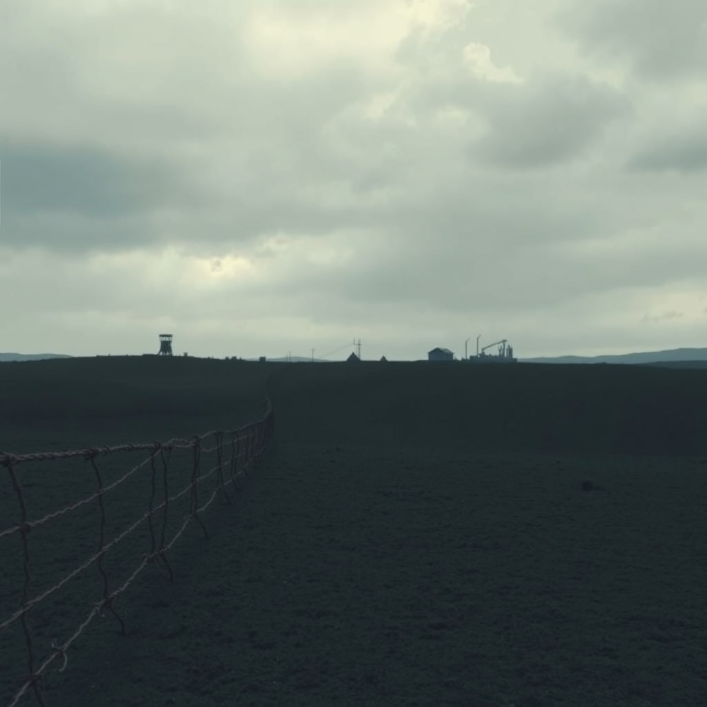

[Home](../index.md) > [Books](./index.md)  
# ⛓️🏕️📜 Concentration Camps: A Short History  
  
[🛒 Concentration Camps: A Short History. As an Amazon Associate I earn from qualifying purchases.](https://amzn.to/3IePtzH)  
  
## 📚 Book Report: 🧱 Concentration Camps: A Short History  
  
✍️ Dan Stone's *🧱 Concentration Camps: A Short History* offers a concise yet comprehensive exploration of the origins, development, and varied uses of concentration camps throughout modern history. 🧐 This book challenges the common perception that 🧱 concentration camps are solely a product of the Nazi regime, arguing instead that they are a recurring feature employed by diverse states, including liberal democracies, in times of perceived crisis.  
  
### ℹ️ Overview  
  
🌍 The book provides a global historical perspective on 🧱 concentration camps, tracing their emergence from late 19th and early 20th-century colonial wars through to their use in the 20th century and beyond. 🔍 Stone examines different camp systems, highlighting both their similarities and differences, and places the infamous Nazi camps within this broader context.  
  
### 🔑 Key Themes  
  
* 🤔 **Challenging the Definition:** 🗣️ Stone critiques traditional definitions of 🧱 concentration camps, such as the one offered by Patrick Gordon Walker in 1945, and proposes his own working definition that is tested throughout the book. 🚫 He argues that a 🧱 concentration camp does not have to resemble those of the National Socialists.  
* 🗺️ **Global History of Internment:** 📜 The book demonstrates that 🧱 concentration camps have been utilized across various political systems and geographical locations, including in the Philippines, the Boer War, the Ottoman Empire, by the Nazis, the Soviet Union (Gulag), the United States (Japanese-American internment), Franco's Spain, Britain (for Jewish DPs), and during decolonization wars.  
* 🏛️ **Concentration Camps as a Modern State Tool:** 🔨 Stone posits that the rise of the modern state and its ability to control populations facilitated the creation of this extreme institution. 🚫 Camps serve the purpose of removing populations perceived as threatening by the state.  
* ➡️ **Beyond the Nazi Model:** 🇩🇪 While acknowledging the horrific nature of the Nazi camps, the book emphasizes that they evolved from earlier traditions and that other regimes have also employed similar systems of internment.  
  
### 📜 Content Discussion  
  
📖 The book begins by engaging with the difficulty of defining "🧱 concentration camp" and analyzes different historical understandings. 🔍 It then delves into various examples:  
  
* ⛺ **Early Camps:** 🗣️ Discussion of camps used in colonial conflicts (like in the Philippines and the Boer War) and during World War I for the internment of civilians and POWs, which served as precursors to later systems.  
* 🇩🇪 **The Nazi System:** 🕰️ While situated within the global history, the Nazi 🧱 concentration camps, which began operating shortly after 1933, are examined, noting their evolution from primarily holding political opponents (Communists, Social Democrats) to encompassing a wide range of targeted groups including Jews, Jehovah's Witnesses, Roma, homosexuals, and others. ✝️✡️🏳️‍🌈 The book also touches on the distinction and connection between 🧱 concentration and extermination camps within the Nazi system.  
* 🇷🇺 **The Soviet Gulag:** ⛏️ Stone includes the Soviet Gulag system in his analysis, noting the challenges in visualizing these camps due to a dearth of photographic material compared to the Nazi camps. 📸 He also highlights differences among the various types of Soviet camps.  
* 🌍 **Other Examples:** 📚 The book explores less frequently discussed instances of internment, such as the American internment of Japanese citizens during World War II and camps used in other historical conflicts and by liberal democracies. 🇺🇸🇯🇵  
  
❓ Stone's approach encourages readers to question the nature and continued existence of such camps in the modern world. 🤔 The book is noted for raising thought-provoking questions rather than providing definitive answers, making it a valuable starting point for students and those interested in the topic.  
  
## 📚 Further Reading  
  
### 📖 Similar Histories and Comparative Analyses  
  
* ***One Long Night: A Global History of Concentration Camps*** by Andrea Pitzer: 🌍 Similar to Stone's work, this book provides a broad, global history of 🧱 concentration camps from the late 19th century to the present, examining their use across different states and conflicts.  
* ***KL: A History of the Nazi Concentration Camps*** by Nikolaus Wachsmann: 🇩🇪 While focusing specifically on the Nazi system, this comprehensive work offers a deep dive into the origins, development, and daily life within the camps, providing a detailed historical account that complements Stone's broader overview.  
  
### ⚖️ Contrasting Perspectives and Specific Focuses  
  
* ***Night*** by Elie Wiesel: 😢 A powerful and widely acclaimed memoir offering a deeply personal account of one individual's experience in the Nazi 🧱 concentration and extermination camps, providing a stark contrast to historical overviews.  
* ***Survival in Auschwitz*** by Primo Levi: 🥺 Another essential memoir by a Holocaust survivor, offering a poignant and philosophical reflection on the dehumanizing effects of the camps and the struggle for survival.  
* ***The Theory and Practice of Hell*** by Eugen Kogon: ✍️ Written by a former Buchenwald inmate, this book provides an early and systematic analysis of the Nazi camp system based on direct experience and observation.  
* ***If This Is a Woman*** by Sarah Helm: 👩‍👧‍👦 A comprehensive history specifically focusing on the Ravensbrück 🧱 concentration camp for women, offering a detailed look at the experiences of female prisoners.  
* ***Time Stood Still: My Internment in England, 1914-1918*** by Paul Cohen-Portheim: 🇬🇧 A memoir about being held in a civilian internment camp in Britain during World War I, providing insight into an earlier form of internment discussed in Stone's book.  
* ***Looking Like the Enemy: My Story of Imprisonment in Japanese-American Internment Camps*** by Mary Matsuda Gruenewald: 🇺🇸🇯🇵 A memoir detailing the author's experience in American internment camps during World War II, offering a personal perspective on a different context of state-sponsored internment.  
  
### 🎨 Creatively Related Works (Fiction, Poetry, Art)  
  
* **Fiction:**  
    * ***The Book Thief*** by Markus Zusak: 📖 A historical novel narrated by Death, telling the story of a young girl in Nazi Germany who finds solace in stolen books, offering a unique and moving perspective on the impact of the regime and the Holocaust. 👧🇩🇪  
    * ***The Tattooist of Auschwitz*** by Heather Morris: 💉 A novel based on the true story of a prisoner who was forced to tattoo identification numbers on inmates at Auschwitz.  
    * ***The Boy in the Striped Pajamas*** by John Boyne: 👦 A fictional story about the unlikely friendship between the son of a Nazi commandant and a Jewish boy in Auschwitz, exploring themes of innocence and the horrors of the Holocaust.  
* **Poetry:**  
    * "O the Chimneys" by Nelly Sachs: 🏭 A powerful poem reflecting on the Holocaust and the chimneys of the crematoria in 🧱 concentration camps.  
    * "The Butterfly" by Pavel Friedmann: 🦋 A poignant poem written in Theresienstadt 🧱 concentration camp, symbolizing the lost beauty and life within the ghetto walls.  
    * Poetry by Primo Levi: ✍️ Levi's poetry, like his prose, reflects his experiences in Auschwitz and the profound impact of the Holocaust.  
* **Art:**  
    * Art from the Holocaust: 🖼️ Various online collections and exhibitions, such as those from Yad Vashem and the Imperial War Museums, showcase art created by victims and survivors within camps and ghettos, offering a visual testimony to their experiences. Artists like Felix Nussbaum, Charlotte Salomon, and those who documented life in camps like Theresienstadt created significant bodies of work despite unimaginable conditions. Post-Holocaust art by artists like Anselm Kiefer also grapples with the legacy of the camps.  
  
## 💬 [Gemini](../software/gemini.md) Prompt (gemini-2.5-flash-preview-04-17)  
> Write a markdown-formatted (start headings at level H2) book report, followed by a plethora of additional similar, contrasting, and creatively related book recommendations on Concentration Camps: A Short History. Be thorough in content discussed but concise and economical with your language. Structure the report with section headings and bulleted lists to avoid long blocks of text.