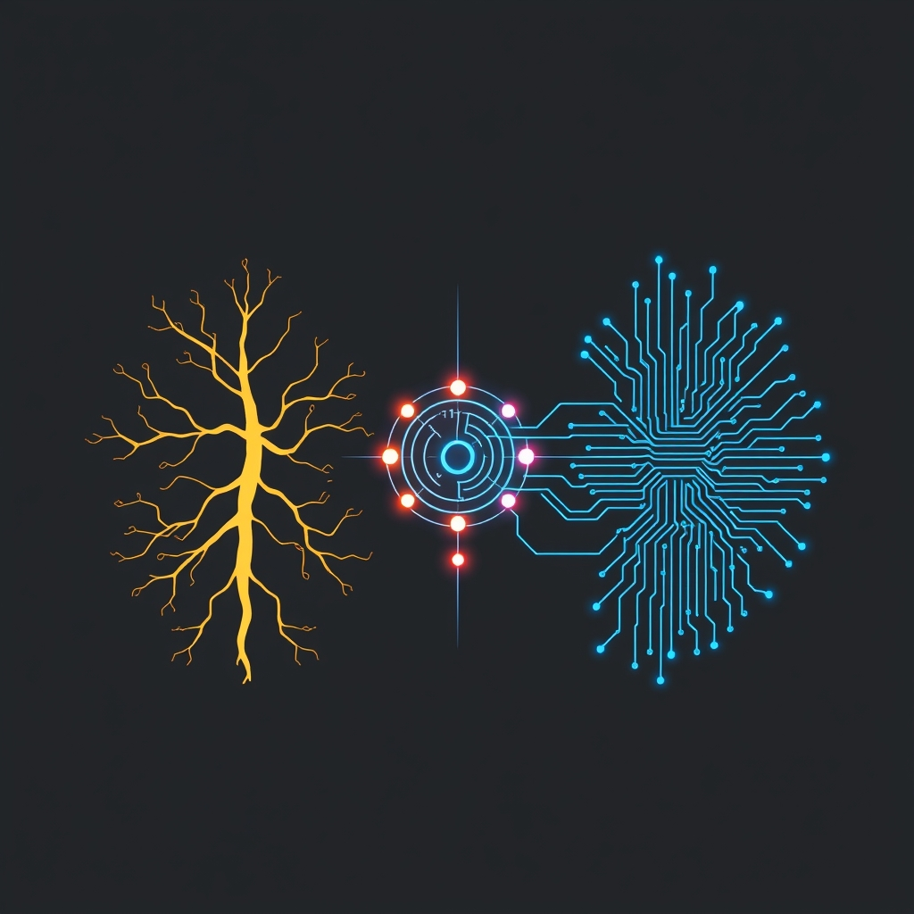

[Home](../index.md) > [Books](./index.md)  
# 🤖🗣️🐒⚙️ Cybernetics: or Control and Communication in the Animal and the Machine  
  
[🛒 Cybernetics: or Control and Communication in the Animal and the Machine. As an Amazon Associate I earn from qualifying purchases.](https://amzn.to/3FmVo4Z)  
  
## 🤖 AI Summary  
*Cybernetics* (1948) by Norbert Wiener explores the study of systems, feedback, control, and communication in both living organisms and machines. It emphasizes how systems regulate themselves through feedback loops and highlights the role of information in controlling behavior across biological, mechanical, and social systems. The book lays the foundation for fields like systems theory, artificial intelligence, and robotics.  
  
---  
  
### Books on Related Topics  
1. **"[Thinking in Systems](./thinking-in-systems.md): A Primer" by Donella H. Meadows**  
   An accessible introduction to systems thinking, explaining how systems work and how feedback loops influence complex behaviors in real-world scenarios.  
  
2. **"The Human Use of Human Beings" by Norbert Wiener**  
   A reflection on the societal implications of cybernetics, focusing on the ethical and social challenges posed by automation and information technology.  
  
3. **"Introduction to Cybernetics" by W. Ross Ashby**  
   A foundational text in cybernetics that delves into the technical aspects of feedback, control, and self-regulation in complex systems.  
  
### More Recommendations:  
1. **Alternate on the same topic**:  
   *The Cybernetics of Human Learning and Performance* by W. Ross Ashby  
   This book expands on the concepts Wiener introduced, particularly the application of cybernetics to learning systems and human behavior.  
  
2. **Tangentially related**:  
   [🔬🔄 The Structure of Scientific Revolutions](./the-structure-of-scientific-revolutions.md) by Thomas S. Kuhn  
   While not about cybernetics directly, Kuhn's exploration of paradigm shifts in science resonates with Wiener's ideas on systems thinking and change.  
  
3. **Diametrically opposed**:  
   *The Myth of the Machine* by Lewis Mumford  
   Mumford critiques the mechanistic approach to human society, arguing that technological determinism can alienate humanity, opposing the optimistic view of cybernetics.  
  
4. **Fiction book incorporating related ideas**:  
   *The Moon Is a Harsh Mistress* by Robert A. Heinlein  
   This science fiction novel features themes of systems, feedback loops, and self-regulation in the context of a sentient computer and a lunar rebellion, reflecting cybernetic ideas in a fictional setting.  
