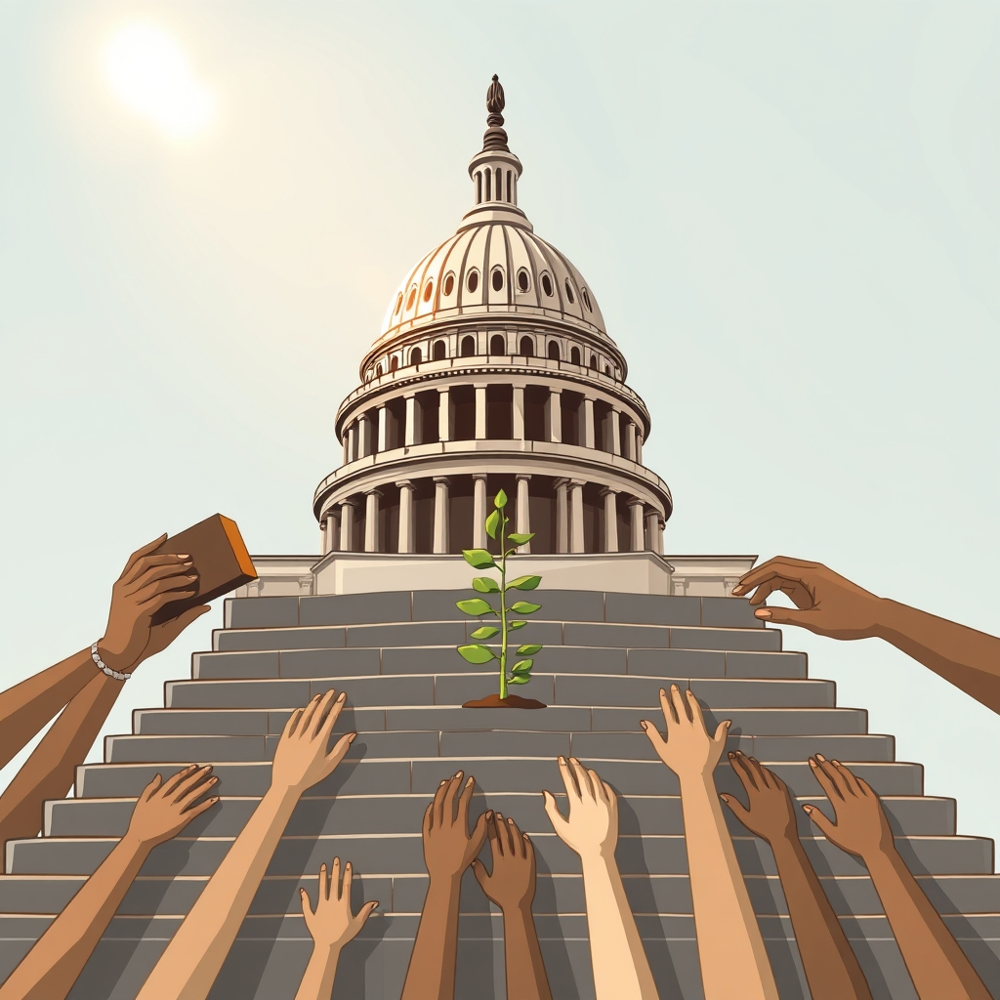

[Home](../index.md) > [Books](./index.md)  
# 🏛️🛡️ Democracy or Else: How to Save America in 10 Easy Steps  
  
[🛒 Democracy or Else: How to Save America in 10 Easy Steps. As an Amazon Associate I earn from qualifying purchases.](https://amzn.to/4qS3Mfk)  
  
## 📚 Book Report: 🇺🇸 Democracy or Else: 🤕 How to Save America in 10 Easy Steps  
  
### 📝 Overview  
  
* ✍️ **Authors:** 🗣️ Jon Favreau, 🗣️ Jon Lovett, 🗣️ Tommy Vietor, and 👨‍💻 Josh Halloway (Hosts/Founders of Pod Save America / Crooked Media).  
* 📅 **Publication Date:** 🗓️ June 25, 2024.  
* 🎯 **Core Thesis:** 💥 Amidst political chaos, 😔 widespread cynicism, and ⚠️ perceived threats to American democracy, this book aims to provide a 🪜 practical, step-by-step guide for ordinary citizens to get ℹ️ informed, 🤝 involved, and ✅ make a tangible difference in the political process without succumbing to despair.  
  
### 🔑 Key Themes and Arguments  
  
* 🩺 **Diagnosis:** 😔 Acknowledges the current climate of political dread, 💔 dysfunction, and 🗣️ the feeling among many that their voices don't matter.  
* 💊 **Prescription:** 🪜 Focuses on actionable steps individuals can take, emphasizing practical engagement over abstract theory.  
* 🎭 **Tone:** 😂 Mixes humor, 😃 optimism (without being overly pollyannaish), and 🙇 self-deprecation, reflecting the style of the Pod Save America podcast.  
* 🥅 **Goal:** 💪 To empower citizens, from political novices to seasoned activists, by demystifying political engagement and offering concrete avenues for participation.  
  
### 🔟 The "10 Easy Steps" (Focus Areas)  
  
While the specific chapter titles aren't fully detailed in the search results, the core actions covered include:  
  
* 📰 **Getting Informed:** 🧭 Navigating the media landscape and identifying reliable information sources.  
* 💸 **Effective Donating:** 💡 Understanding where financial contributions can have the most impact.  
* 🤝 **Volunteering Strategically:** 🙋 Finding meaningful volunteer opportunities.  
* ✊ **Organizing and Protesting:** 📢 Practical advice on collective action.  
* 🏃 **Running for Office:** ✅ Encouraging and guiding potential candidates.  
* 🔋 **Sustaining Engagement:** ❤️ Maintaining involvement and hope without burnout or losing social connections.  
* 🧠 **Understanding Key Political Concepts:** 🤔 Includes insights from various experts (e.g., Hillary Clinton, Stacey Abrams) sprinkled throughout.  
  
### 👍 Strengths and 👎 Weaknesses  
  
* 👍 **Strengths:**  
    * ✅ Highly accessible and practical guide for political engagement.  
    * 😂 Humorous and engaging tone, likely appealing to fans of the authors' podcast and potentially drawing in new audiences.  
    * 🗳️ Provides concrete actions beyond just voting.  
    * 🧑‍⚖️ Features insights from various political figures and experts.  
    * 💰 Profits often support political action groups (e.g., Vote Save America).  
* 👎 **Weaknesses:**  
    * 🪜 The "Easy Steps" framing might downplay the significant challenges involved in political change.  
    * 👂 Some reviewers note the content might feel familiar or rehashed for regular listeners of the authors' podcast.  
    * 📅 Humor and contemporary references might date the book quickly or not appeal to all readers.  
    * 🤓 Some find it potentially too simplified or "dumbed down" for those seeking deep political analysis.  
    * ⚖️ Primarily focuses on engagement within the existing (largely two-party) system from a progressive viewpoint.  
  
### 🎯 Target Audience and 🏁 Conclusion  
  
* 🧑‍🤝‍🧑 **Audience:** 🎯 Aimed broadly at anyone feeling concerned about American democracy and looking for ways to get involved, particularly those new to political action, young people, and listeners of Pod Save America. 💡 It caters to those seeking practical steps and encouragement rather than deep historical or theoretical analysis.  
* 🏁 **Conclusion:** "Democracy or Else" serves as an energetic, accessible, and often humorous call to action. 🗣️ It emphasizes that individual participation matters and provides a starting roadmap for those wanting to translate concern into concrete political engagement, particularly from a progressive perspective. 🗺️  
  
## 📚 Book Recommendations  
### 🤝 Similar Books (Practical Guides & Modern Diagnosis/Reform)  
  
* **[🏛️☀️⬆️ Democracy Awakening: 📝 Notes on the State of 🇺🇸 America](./democracy-awakening.md)** by 🧑‍🏫 Heather Cox Richardson: 📜 Offers historical context alongside analysis of the current political moment, emphasizing democratic threats and civic responsibility.  
* 🔄 **Democracy in Retrograde: 🛠️ How to Make Changes Big and Small in Our Country and in Our Lives** by 🫂 Sami Sage: 🤝 Similar focus on practical steps and maintaining hope for democracy, framed partly as self-help.  
* 🧩 **Solving Public Problems: 🛠️ A Practical Guide to Fix Our Government and Change Our World** by 👩‍💻 Beth Simone Noveck: 💻 Focuses on how governments can leverage technology, data, and citizen input to address challenges.  
* **[📜🤝 The Bill of Obligations: The Ten Habits of Good Citizens](./the-bill-of-obligations.md)** by 👨‍💼 Richard Haass: ✅ Argues for expanding the definition of citizenship to include obligations alongside rights for democracy to thrive.  
* 🛡️ **Saving Democracy** by 👨‍💼 Kevin O'Leary: 🩺 Diagnoses political ills and proposes a plan combining town halls and the internet to empower citizens (note: this appears distinct from the more recent podcast book).  
  
### ⚔️ Contrasting Books (Different Angles & Critiques)  
  
* 📉 **10% Less Democracy: 🤔 Why You Should Trust Elites a Little More and the Masses a Little Less** by 👨‍🏫 Garett Jones: 🚫 Argues against hyper-democratic participation, suggesting more deference to expert elites might be beneficial.  
* 😡 **White Rural Rage: ⚠️ The Threat to American Democracy** by 👨‍🏫 Tom Schaller and 👨‍🏫 Paul Waldman: 😠 Explores the specific grievances and political power of white rural voters and why they might turn against democratic norms.  
* 💔 **Breaking the Two-Party Doom Loop: 🏛️ The Case for Multiparty Democracy in America** by 👨‍🏫 Lee Drutman: 🏛️ Argues that the fundamental problem is the two-party system itself and advocates for structural reforms like multi-party democracy.  
* 🧠 **[The Righteous Mind](./the-righteous-mind.md): 🤔 Why Good People Are Divided by Politics and Religion** by 👨‍🏫 Jonathan Haidt: 🧠 Explores the psychological roots of political division, suggesting moral intuitions, not just policy disagreements, drive conflict.  
* 🔎 **Democracy Hypocrisy: 🇺🇸 Examining America's Fragile Democratic Convictions** (Democracy Fund Report, authors include 👨‍💼 Joe Goldman & 👨‍🏫 Lee Drutman): 📊 Uses survey data to show how support for democratic norms can be inconsistent and influenced by partisanship.  
  
### 💡 Creatively Related Books (Broader Context & Inspiration)  
  
* 💀 **[How Democracies Die](./how-democracies-die.md)** by 👨‍🏫 Steven Levitsky and 👨‍🏫 Daniel Ziblatt: 🏛️ Comparative analysis drawing historical parallels to show how democracies erode from within. (Their *Tyranny of the Minority* is also relevant).  
* ⚠️ **Four Threats: 🇺🇸 The Recurring Crises of American Democracy** by 👩‍🏫 Suzanne Mettler and 👨‍🏫 Robert C. Lieberman: ⏳ Examines historical moments when US democracy faced severe challenges (political polarization, racism/nativism, economic inequality, executive power).  
* 🔦 **Democracy in Darkness: 🤫 Secrecy and Transparency in the Age of Revolutions** by 👩‍🏫 Katlyn Carter: 📜 Historical perspective on the early debates in America and France about transparency and secrecy in representative government.  
* ⛪ **Sacred Foundations: 🏰 The Religious and Medieval Roots of the Modern State** by 👩‍🏫 Anna Grzymala-Busse: 📜 Explores the deep historical origins (including religious and medieval) of concepts like representation and law that underpin modern states and democracy.  
* 📢 **The Persuaders: 🗣️ At the Front Lines of the Fight for Hearts, Minds, and Democracy** by 👨‍💼 Anand Giridharadas: 📰 Insider account of activists and politicians working to build coalitions and fight disinformation.  
* 💰 **Capitalism v. Democracy: 💸 Money in Politics and the Free Market Constitution** by 👨‍🏫 Timothy K. Kuhner: ⚖️ Examines the tensions between capitalism and democratic ideals, particularly concerning money in politics.  
  
  
## 💬 [Gemini](../software/gemini.md) Prompt (gemini-2.5-pro-exp-03-25)  
> Write a markdown-formatted (start headings at level H2) book report, followed by a plethora of additional similar, contrasting, and creatively related book recommendations on Democracy or Else How to Save America in 10 Easy Steps. Be thorough in content discussed but concise and economical with your language. Structure the report with section headings and bulleted lists to avoid long blocks of text..  
  
