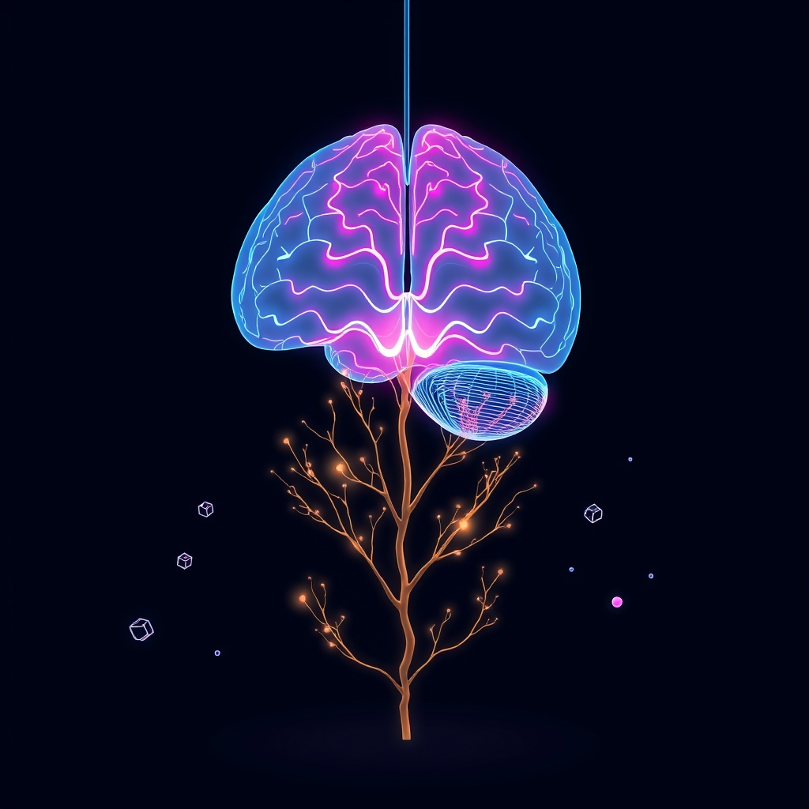

[Home](../index.md) > [Books](./index.md)  
# 🧠👶📈 Introduction to Developmental Cognitive Neuroscience: An Introduction  
  
[🛒 Developmental Cognitive Neuroscience. As an Amazon Associate I earn from qualifying purchases.](https://amzn.to/43tZS2M)  
  
## 🤖 AI Summary  
### Developmental Cognitive Neuroscience 🧠  
**TL;DR:** This book explores the intricate interplay between brain development and cognitive changes across the lifespan, revealing how neural mechanisms underpin the emergence of perception, attention, memory, language, and executive functions.  
  
**New or Surprising Perspective 🤯:** Unlike traditional developmental psychology, which often focuses solely on behavioral changes, this book integrates neuroimaging and genetic data to provide a mechanistic understanding of cognitive development. It highlights the dynamic and interactive nature of brain-behavior relationships, emphasizing the role of experience in shaping neural circuits and cognitive abilities. It also explores the concept of neuroplasticity across the lifespan, challenging the notion that brain development ends in adolescence.  
  
### Deep Dive 🔬  
**Topics Covered:**  
* **Neural Development Fundamentals:**  
    * Neurogenesis, migration, differentiation, synaptogenesis, and myelination. 👶  
    * Genetic and environmental influences on brain development. 🌱  
    * The role of experience-expectant and experience-dependent plasticity. 🔄  
* **Perceptual and Motor Development:**  
    * Development of visual, auditory, and somatosensory systems. 👁️👂🖐️  
    * The emergence of motor skills and coordination. 🏃‍♀️  
    * Neural basis of face processing and object recognition. 👤📦  
* **Attention and Executive Functions:**  
    * Development of selective attention, sustained attention, and attentional control. 🎯  
    * Neural correlates of working memory, inhibition, and cognitive flexibility. 🧠  
    * The role of the prefrontal cortex in executive function development. 📈  
* **Memory and Learning:**  
    * Development of episodic, semantic, and procedural memory systems. 📚  
    * Neural mechanisms of learning and memory consolidation. 💾  
    * The impact of early experiences on memory development. 🧸  
* **Language Development:**  
    * Neural basis of phonological, lexical, and syntactic processing. 🗣️  
    * The role of Broca's and Wernicke's areas in language acquisition. 🌐  
    * The impact of early language exposure on brain development. 🗣️👶  
* **Social Cognitive Development:**  
    * Theory of mind development and the neural basis of social cognition. 🤝  
    * The development of empathy and emotional regulation. 💖  
    * The impact of social experiences on brain development. 🧑‍🤝‍🧑  
* **Developmental Disorders:**  
    * Autism spectrum disorder, ADHD, dyslexia, and other neurodevelopmental conditions. 🧩  
    * Neural mechanisms underlying developmental disorders. 🧬  
    * The role of early intervention in mitigating developmental challenges. 🏥  
  
**Methods and Research:**  
* Longitudinal neuroimaging studies (MRI, fMRI, EEG, MEG). 📊  
* Genetic analyses and epigenetic studies. 🧬  
* Behavioral studies and cognitive assessments. 📝  
* Computational modeling of brain development. 💻  
* Animal models of neurodevelopment. 🐭  
  
**Significant Theories and Models:**  
* **Constructivist Approach:** Emphasizes the active role of the child in constructing their own cognitive development. 🏗️  
* **Neural Plasticity:** The brain's ability to change and adapt in response to experience. 🔄  
* **Experience-Expectant and Experience-Dependent Processes:** Experience-expectant processes rely on universal experiences, while experience-dependent processes rely on individual experiences. 💡  
* **Maturation and Specialization:** The brain's structural and functional changes over time. 📈  
  
**Practical Takeaways:**  
* **Early Intervention:** Early experiences have a profound impact on brain development, highlighting the importance of early intervention for children with developmental challenges. 👶🩺  
* **Enriched Environments:** Providing children with stimulating and enriching environments can promote optimal brain development. 🌳📚  
* **Mindfulness and Stress Reduction:** Techniques such as mindfulness and meditation can promote healthy brain development and cognitive function across the lifespan. 🧘‍♀️  
* **Cognitive Training:** Targeted cognitive training programs can improve specific cognitive skills, such as working memory and attention. 🏋️‍♂️🧠  
* **Understanding Developmental Trajectories:** Understanding typical developmental trajectories can help parents and educators identify potential developmental delays or challenges. 📈  
* **Promote healthy sleep:** Adequate sleep is essential for brain development and cognitive function. 😴  
* **Encourage physical activity:** Physical activity promotes brain health and cognitive function. 🏃  
* **Promote healthy nutrition:** Proper nutrition is essential for brain development and cognitive function. 🍎  
  
**Critical Analysis:**  
* The book is written by leading experts in the field of developmental cognitive neuroscience, ensuring high-quality and up-to-date information. 🎓  
* It integrates findings from a wide range of research methods, providing a comprehensive and multidisciplinary perspective. 🌐  
* The book is well-referenced, providing a solid foundation for further exploration of the topics covered. 📚  
* The use of neuroimaging techniques provide a strong scientific backing to the theories presented. 📊  
* Authoritative reviews in scientific journals support the quality of the information. ✅  
  
**Book Recommendations:**  
* **Best Alternate Book on the Same Topic:** "Principles of Developmental Cognitive Neuroscience" by Mark H. Johnson. 📚  
* **Best Tangentially Related Book:** "[🧠🧑‍🤝‍🧑 The Developing Mind: How Relationships and the Brain Interact to Shape Who We Are](./the-developing-mind-how-relationships-and-the-brain-interact-to-shape-who-we-are.md)" by Daniel J. Siegel. 🧠💖  
* **Best Diametrically Opposed Book:** "The Blank Slate" by Steven Pinker. (Argues against the strong influence of environment). 📜  
* **Best Fiction Book That Incorporates Related Ideas:** Flowers for Algernon by Daniel Keyes. (Explores the ethics of cognitive enhancement). 🌸🧠  
* **Best More General Book:** "[Thinking, Fast and Slow](./thinking-fast-and-slow.md)" by Daniel Kahneman. (General cognitive psychology). 💭  
* **Best More Specific Book:** "The Prefrontal Cortex: Anatomy, Physiology, and Neuropsychology of the Frontal Lobe" by Joaquin M. Fuster. (Deep dive into one brain region). 🧠📑  
* **Best More Rigorous Book:** "Cognitive Neuroscience: The Biology of the Mind" by Michael S. Gazzaniga, Richard B. Ivry, and George R. Mangun. (Advanced text). 🔬  
* **Best More Accessible Book:** "[Brain Rules for Baby](./brain-rules-for-baby.md): How to Raise a Smart and Happy Child from Zero to Five" by John Medina. 👶😄  
  
## 💬 [Gemini](https://gemini.google.com) Prompt  
> Summarize the book: Developmental Cognitive Neuroscience. Start with a TL;DR - a single statement that conveys a maximum of the useful information provided in the book. Next, explain how this book may offer a new or surprising perspective. Follow this with a deep dive. Catalogue the topics, methods, and research discussed. Be sure to highlight any significant theories, theses, or mental models proposed. Emphasize practical takeaways, including detailed, specific, concrete, step-by-step advice, guidance, or techniques discussed. Provide a critical analysis of the quality of the information presented, using scientific backing, author credentials, authoritative reviews, and other markers of high quality information as justification. Make the following additional book recommendations: the best alternate book on the same topic; the best book that is tangentially related; the best book that is diametrically opposed; the best fiction book that incorporates related ideas; the best book that is more general or more specific; and the best book that is more rigorous or more accessible than this book. Format your response as markdown, starting at heading level H3, with inline links, for easy copy paste. Use meaningful emojis generously (at least one per heading, bullet point, and paragraph) to enhance readability. Do not include broken links or links to commercial sites.  
