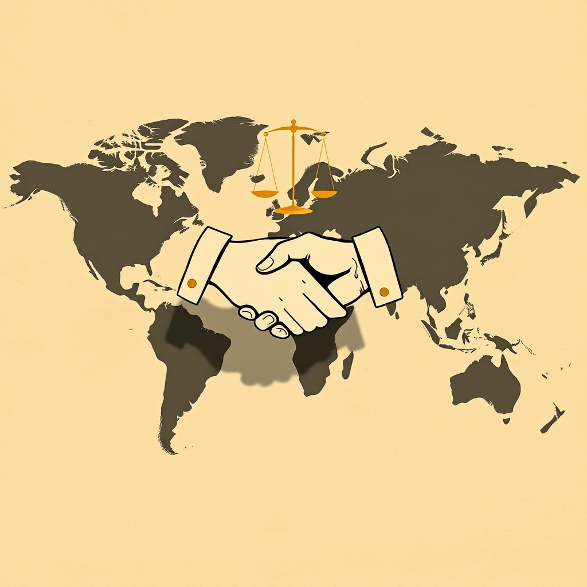

[Home](../index.md) > [Books](./index.md)  
# 🤝🌍 Diplomacy  
  
[🛒 Diplomacy. As an Amazon Associate I earn from qualifying purchases.](https://amzn.to/3U9t21C)  
  
## 📖 Book Report: Diplomacy by Henry Kissinger  
  
### 📝 Summary  
  
📖 Henry Kissinger's *Diplomacy* is a comprehensive historical analysis of international relations and the evolution of diplomatic practice from the 17th century to the end of the Cold War. 👨‍🏫 Drawing on his vast knowledge as both a scholar and a practitioner, Kissinger examines how different states and leaders have pursued their national interests through negotiation, 🤝 statecraft, and the maintenance of a balance of power. 🌍 The book provides a sweeping overview of major diplomatic events and the strategies employed by key historical figures, offering insights into the challenges and opportunities inherent in foreign policy.  
  
### 🔑 Key Themes  
  
* ⚖️ **Balance of Power:** A central concept, tracing its origins in European diplomacy and its importance in maintaining international stability.  
* 🤔 **Realpolitik vs. Idealism:** The book contrasts the pragmatic pursuit of national interests (Realpolitik) with approaches rooted in moral principles and universal values (Idealism), often exemplified by American foreign policy, particularly the Wilsonian tradition.  
* 📜 **Historical Evolution of Diplomacy:** An examination of how diplomatic methods and goals have changed over centuries, from the age of absolutism and the Concert of Europe to the Cold War.  
* 🇺🇸 **The American Experience:** A significant portion is dedicated to the unique trajectory of US foreign policy, oscillating between isolationism and interventionism and the tension between its ideals and pragmatic interests.  
* 👑 **The Role of Leaders:** Analysis of influential leaders like Metternich, Bismarck, Theodore Roosevelt, Woodrow Wilson, and others, and their impact on shaping the international landscape through diplomacy.  
  
### 🏗️ Structure  
  
🗓️ The book is structured chronologically and thematically, moving through different eras and regions of the world, though with a strong initial focus on European history and the development of the nation-state system. ✍️ It blends historical narrative with strategic analysis and includes personal reflections and anecdotes from Kissinger's own experiences as US National Security Advisor and Secretary of State.  
  
### 👍 Strengths  
  
* 🌍 **Comprehensive Scope:** Offers a broad and detailed historical account of international relations and diplomacy.  
* 👨‍💼 **Authoritative Insight:** Written by a figure with direct, high-level experience in diplomacy, providing unique perspectives.  
* ✍️ **Engaging Style:** Despite its academic depth, the book is noted for its accessible and often engaging writing style.  
* 🧠 **Conceptual Framework:** Provides a strong framework, particularly through the lens of Realpolitik and the balance of power, for understanding historical events.  
  
### 👎 Criticisms  
  
* 🇪🇺 **Eurocentrism:** The narrative heavily favors European and later American diplomatic history, with less attention given to other regions or non-state actors.  
* 🧍 **Focus on Individuals:** Critics argue the book sometimes emphasizes the role of great statesmen over deeper structural forces in international relations.  
* 🧐 **Historical Interpretation:** Some interpretations of historical events and figures are viewed as reflecting Kissinger's own political beliefs and potentially minimizing controversial aspects of US foreign policy under his tenure.  
* 📢 **Claiming Influence:** Accusations that the book occasionally overstates Kissinger's personal impact on historical outcomes.  
  
## 📚 Book Recommendations  
  
### 🤝 Similar Books  
  
* ***World Order*** by Henry Kissinger: 🌍 Continues Kissinger's analysis into the post-Cold War era, examining different concepts of order that have emerged across various civilizations and regions.  
* ***The Tragedy of Great Power Politics*** by John J. Mearsheimer: ⚔️ Presents a theory of "offensive realism," arguing that states are driven by a fear of others and the pursuit of maximizing their power in a zero-sum game, using historical examples to support this perspective.  
* ***The Grand Chessboard: American Primacy and its Geostrategic Imperatives*** by Zbigniew Brzezinski: 🗺️ Analyzes geopolitics from the perspective of maintaining US global dominance, focusing on key regions and strategies.  
* ***A World Restored: Metternich, Castlereagh, and the Problems of Peace 1812-22*** by Henry Kissinger: 🕊️ Based on Kissinger's doctoral thesis, this book delves into the diplomacy of the post-Napoleonic era and the Congress of Vienna, focusing on the efforts to restore a balance of power.  
* ***The Cold War: A New History*** by John Lewis Gaddis: ❄️ A comprehensive history of the Cold War, offering insights into the diplomatic strategies and interactions between the major powers.  
  
### 🆚 Contrasting Books  
  
* ***The Sleepwalkers: How Europe Went to War in 1914*** by Christopher Clark: 🚶 Provides a detailed examination of the complex political and diplomatic factors that led to World War I, offering a multi-national perspective on the failure of diplomacy.  
* ***Satow's Diplomatic Practice*** by Sir Ivor Roberts (editor): 📜 A foundational text offering a practical and technical guide to the conduct of diplomacy, contrasting with Kissinger's more historical and theoretical approach.  
* ***Paris 1919: Six Months That Changed the World*** by Margaret MacMillan: 🇫🇷 Focuses on the Paris Peace Conference after WWI, detailing the complex negotiations and their far-reaching consequences, offering a different historical case study than those emphasized by Kissinger.  
* ***The Evolution of Diplomatic Method*** by Harold Nicolson: 📈 Explores the historical development of diplomatic techniques and ethics, providing a perspective that complements or contrasts with Kissinger's focus on power politics.  
  
### ✨ Creatively Related Books  
  
* ***History of the Peloponnesian War*** by Thucydides: 🏛️ An ancient classic offering timeless insights into power, strategy, and the interactions between states, providing a foundational text for understanding international relations.  
* ***The Prince*** by Niccolo Machiavelli: 👑 A seminal work on political power and statecraft, offering a pragmatic, often ruthless, perspective that resonates with aspects of Realpolitik discussed by Kissinger.  
* ***Bargaining with the Devil: When to Negotiate, When to Fight*** by Robert Mnookin: 😈 Explores the complexities of high-stakes negotiations, drawing on examples from international relations and other fields.  
* ***Talleyrand*** by Duff Cooper: 🇫🇷 A biography of the influential French diplomat Charles Maurice de Talleyrand-Périgord, offering insights into the art of diplomacy through the life of a master practitioner.  
* ***A Memory Called Empire*** by Arkady Martine: 🚀 A science fiction novel that uses an imperial setting to explore themes of identity, cultural assimilation, and political maneuvering, offering a creative lens on diplomatic challenges.  
* ***Outpost: Life on the Frontlines of American Diplomacy*** by Christopher R. Hill: 🇺🇸 Provides a firsthand account of modern American diplomacy from the perspective of a career diplomat in various global hotspots.  
  
## 💬 [Gemini](../software/gemini.md) Prompt (gemini-2.5-flash-preview-04-17)  
> Write a markdown-formatted (start headings at level H2) book report, followed by a plethora of additional similar, contrasting, and creatively related book recommendations on Diplomacy. Be thorough in content discussed but concise and economical with your language. Structure the report with section headings and bulleted lists to avoid long blocks of text.  
  
## 🐦 Tweet  
<blockquote class="twitter-tweet" data-theme="dark">
🤝🌍 Diplomacy  A comprehensive historical analysis of international relations and the evolution of diplomatic practice from the 17th century to the end of the Cold War.  🏛️ International Relations | 📜 Statecraft | 🤝 Negotiation | 🇺🇸 US Foreign Policy<a href="https://t.co/jpPBfCGqsk">https://t.co/jpPBfCGqsk</a>
&mdash; Bryan Grounds (@bagrounds) <a href="https://twitter.com/bagrounds/status/1944182793447387241?ref_src=twsrc%5Etfw">July 12, 2025</a></blockquote> 