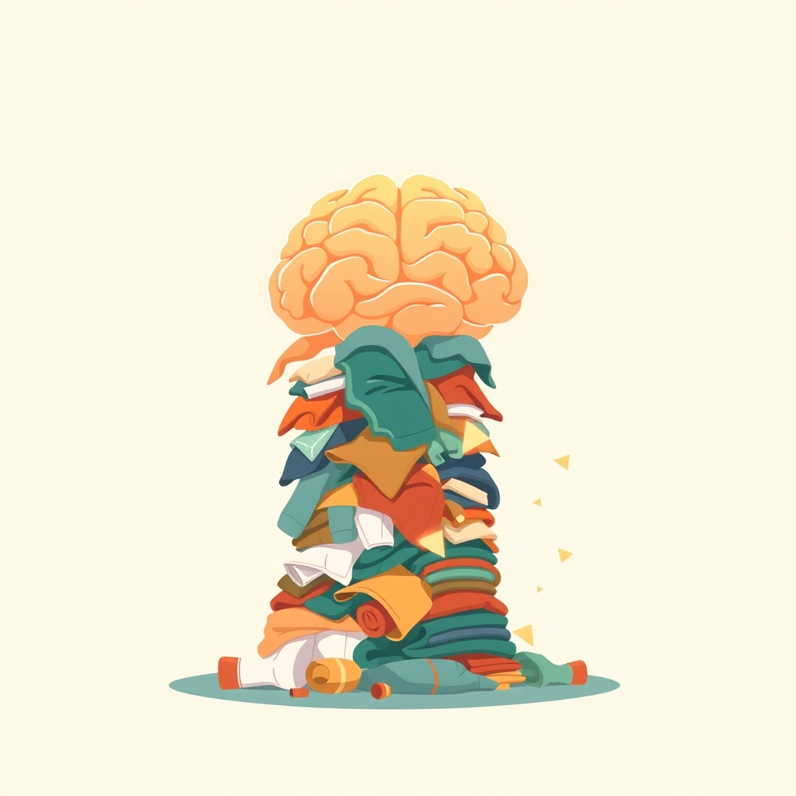

[Home](../index.md) > [Books](./index.md)  
# 😳🧠🤝 Dirty Laundry: Why Adults with ADHD Are So Ashamed and What We Can Do to Help  
  
[🛒 Dirty Laundry: Why Adults with ADHD Are So Ashamed and What We Can Do to Help. As an Amazon Associate I earn from qualifying purchases.](https://amzn.to/3ZcLiK1)  
  
💖🧠💡 An empowering, witty guide to understanding and destigmatizing adult ADHD, fostering self-compassion, and providing practical strategies for both individuals with ADHD and their loved ones.  
  
## 🤖 AI Summary  
### 🧭 Core Philosophy  
* 🛑 **Shame Reduction:** ADHD traits are neurological differences, not moral failings. Normalize struggles.  
* 🤗 **Self-Compassion:** Cultivate kindness towards oneself, recognizing shared human experience of imperfection.  
* ✨ **Neurodiversity Affirmation:** Embrace ADHD as a valid, often advantageous, way of being. Focus on strengths.  
* 🤝 **Partnership/Support:** Loved ones play a crucial role through understanding, empathy, and practical, non-judgmental assistance.  
* 💡 **Reframing:** Transform perceived negatives (e.g., impulsivity, hyperfocus) into potential strengths with conscious management.  
  
### 🚀 Actionable Steps  
* 🔍 **Identify Symptoms:** Recognize common ADHD manifestations (time blindness, impulsivity, hyperfocus, financial struggles, relationships, hygiene, task avoidance).  
* 🗣️ **Personal Anecdotes:** Share experiences openly to foster connection and reduce isolation.  
* 🧠 **Self-Knowledge:** Understand how *your* ADHD brain operates; discard rigid societal expectations.  
* 💬 **Communication:** Be explicit with loved ones about ADHD challenges and needs (e.g., I'm not great at texting, let's meet for coffee instead.).  
* 🛠️ **Practical Strategies:**  
    * ⏰ Time-checks from partners for appointments.  
    * ⏸️ Planned breaks during hyperfocus.  
    * ⚙️ Develop systems *for* your brain, not against it (e.g., for household tasks).  
    * 🎨 Channel impulsive creativity productively.  
* 🙏 **Challenge Self-Criticism:** Replace harsh self-judgment with acceptance and self-kindness.  
* 🫂 **Seek Community:** Connect with others who understand the ADHD experience.  
  
## ⚖️ Evaluation  
* 🎯 **Addresses a Critical Gap:** The book directly tackles the pervasive shame and self-stigma experienced by adults with ADHD, a topic often overlooked in more symptom-focused guides.  
* ❤️‍🩹 **Emphasis on Self-Compassion:** Research strongly supports the book's focus on self-compassion, indicating lower levels in adults with ADHD are linked to poorer mental health outcomes (depression, anxiety, stress) and that increasing self-compassion may improve well-being.  
* 🌈 **Neurodiversity-Affirming:** Aligns with the neurodiversity movement by promoting acceptance of ADHD as a neurological difference rather than solely a deficit, highlighting potential strengths like creativity, adventurousness, and courage.  
* 📖 **Relatability and Accessibility:** The use of personal anecdotes from both a neurodivergent and neurotypical perspective makes the content highly relatable and practical for both individuals with ADHD and their partners.  
* 🗣️ **Stigma Acknowledgment:** The book acknowledges how societal misconceptions and public stereotypes contribute significantly to internalized stigma and shame for adults with ADHD.  
* 💖 **Practicality for Relationships:** Provides tangible advice for partners on how to offer compassionate support without enabling or feeling overburdened.  
  
## 🔍 Topics for Further Understanding  
* 🧬 Neurobiological underpinnings of emotional dysregulation in ADHD beyond shame.  
* 🩹 Specific therapeutic modalities (e.g., CBT, DBT adapted for ADHD) that explicitly address internalized shame.  
* 🌍 The intersectionality of ADHD and other marginalized identities regarding shame and stigma.  
* 💼 Strategies for advocating for ADHD accommodations in professional and academic settings.  
* ⏳ Long-term impact of early childhood experiences and misdiagnosis on adult ADHD shame.  
* 🗺️ Detailed frameworks for developing personalized, ADHD-friendly organizational systems.  
  
## ❓ Frequently Asked Questions (FAQ)  
### 💡 Q: What is Dirty Laundry: Why Adults with ADHD Are So Ashamed and What We Can Do to Help about?  
✅ 📚 A: Dirty Laundry: Why Adults with ADHD Are So Ashamed and What We Can Do to Help is a guide by Richard Pink and Roxanne Emery that uses personal stories and practical advice to help adults with ADHD navigate their symptoms, overcome shame, and build self-compassion, also offering insights for their neurotypical loved ones.  
  
### 💡 Q: Who are the authors of Dirty Laundry: Why Adults with ADHD Are So Ashamed and What We Can Do to Help?  
✅ ✍️ A: The authors of Dirty Laundry: Why Adults with ADHD Are So Ashamed and What We Can Do to Help are Richard Pink and Roxanne Emery, a couple known for their viral social media presence, ADHD_Love, where they share their experiences with ADHD from both neurotypical and neurodivergent perspectives.  
  
### 💡 Q: How does Dirty Laundry: Why Adults with ADHD Are So Ashamed and What We Can Do to Help address ADHD shame?  
✅ ✨ A: Dirty Laundry: Why Adults with ADHD Are So Ashamed and What We Can Do to Help addresses ADHD shame by normalizing common symptoms through relatable anecdotes, encouraging self-kindness, and reframing ADHD traits as differences rather than flaws, ultimately guiding readers toward self-acceptance and destigmatization.  
  
### 💡 Q: Does Dirty Laundry: Why Adults with ADHD Are So Ashamed and What We Can Do to Help offer advice for partners of individuals with ADHD?  
✅ 🤝 A: Yes, Dirty Laundry: Why Adults with ADHD Are So Ashamed and What We Can Do to Help provides tips and perspectives for partners, parents, or friends of individuals with ADHD on how to better understand, support, and communicate with their neurodivergent loved ones with compassion and honesty.  
  
## 📚 Book Recommendations  
### ➕ Similar Books  
* 💪 A Radical Guide for Women with ADHD by Sari Solden & Michelle Frank: Focuses on self-acceptance and strategies for women with ADHD, addressing self-doubt and burnout.  
* 💡 You Mean I'm Not Lazy, Stupid or Crazy?! The Classic Self-Help Book for Adults with Attention Deficit Disorder by Kate Kelly & Peggy Ramundo: A foundational resource offering validation and practical advice for adults with ADHD.  
* [🧠🧭⚡ Your Brain's Not Broken: Strategies for Navigating Your Emotions and Life with ADHD](./your-brains-not-broken-strategies-for-navigating-your-emotions-and-life-with-adhd.md) by Dr. Tamara Rosier: Offers tools for managing frustration, rejection sensitivity, and impulsivity.  
  
### ↔️ Contrasting Books  
* [🏎️🦋🐿️✨ Driven to Distraction: Recognizing and Coping with Attention Deficit Disorder from Childhood Through Adulthood](./driven-to-distraction.md) by Edward M. Hallowell, M.D., and John J. Ratey, M.D.: A comprehensive, more clinical overview of ADHD, its varied forms, diagnosis, and treatment options.  
* [🧠⬆️💼🏠❤️ Taking Charge of Adult ADHD: Proven Strategies to Succeed at Work, at Home, and in Relationships](./taking-charge-of-adult-adhd.md) by Russell A. Barkley, Ph.D.: Provides science-based, step-by-step strategies for managing common ADHD symptoms like attention difficulties and emotional control, often from a deficit-oriented perspective.  
* 🧘 The Mindfulness Prescription for Adult ADHD by Lidia Zylowska, M.D.: An 8-step program for strengthening attention, managing emotions, and achieving goals through mindfulness, offering a non-medication approach.  
  
### 🔗 Related Books  
* [🧹🌊😵‍💫 How to Keep House While Drowning: A Gentle Approach to Cleaning and Organizing](./how-to-keep-house-while-drowning.md) by KC Davis: A compassionate, shame-free approach to managing care tasks and household chores, highly beneficial for ADHDers struggling with overwhelm.  
* ⚖️ Emotional Regulation for Adults with ADHD by Mason Davis: Offers techniques and strategies, including mindfulness and CBT, to manage emotions and enhance focus.  
* 🎯 The Adult's Guide to Stronger Executive Functions by ADDitude: Focuses on strategies for motivation, emotional regulation, working memory, and prioritization.  
  
## 🫵 What Do You Think?  
🤔 Which dirty laundry item do you find most challenging to address?