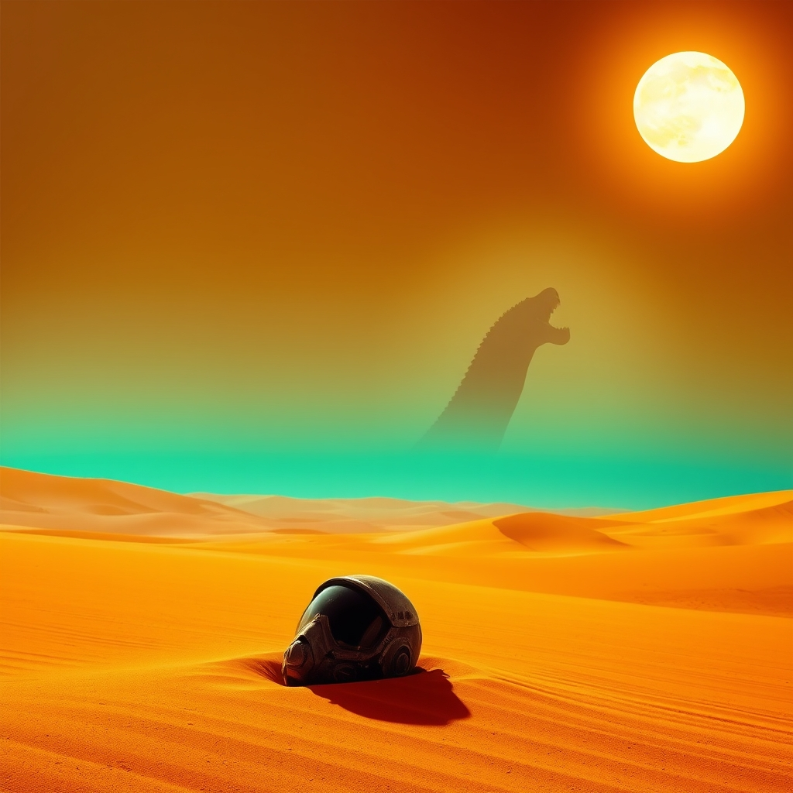

[Home](../index.md) > [Books](./index.md)  
# 🏜️🐛 Dune  
  
[🛒 Dune. As an Amazon Associate I earn from qualifying purchases.](https://amzn.to/47VKBce)  
  
🪐 A landmark novel of political intrigue and ecological vision, *Dune* is essential reading for fans of complex world-building and philosophical science fiction.  
  
## 🗺️ Context  
* ✍️ **Author:** Frank Herbert  
* 📚 **Genre:** Science fiction, space opera, philosophical fiction  
* 📖 **Series:** First in the **Dune Chronicles**.  
  
## ⭐ Assessment  
* 💡 **Core Appeal:** **Intricate world-building** blends strategy, politics, and **timely resource-control themes**.  
* 🧠 **Thematic Core:** Explores dangerous ecology, politics, and religion intersections; **critiques the messiah myth**.  
* 🖋️ **Writing Style:** Dense prose relies on **inner monologues** for depth/exposition.  
* 👍 **Reader Experience:** Dense setup demands patience; builds **unparalleled realism**. Protagonist focus critiques **charismatic leadership**.  
* 🏆 **Critical Standing:** Genre landmark, **Hugo/Nebula winner**. Best-selling, highly influential sci-fi.  
  
## ❓ Frequently Asked Questions (FAQ)  
  
### ❓ Q: Is Dune hard to read?  
A: 🤓 Many find early chapters challenging due to **complex political factions** and specialized terms, but the narrative clarifies concepts as the story progresses.  
  
### ❓ Q: Do I need to read the sequels after the first Dune?  
A: 📚 **Dune** functions as a **standalone**, providing a complete arc, but Herbert wrote five direct sequels to continue the epic narrative.  
  
### ❓ Q: How long is Dune?  
A: 📏 **Dune** is **400 to 500 pages** and its dense content often makes it feel like a longer read.  
  
## 📚 Recommendations  
  
### 📖 Non-Fiction  
  
* 📜 **The Sabres of Paradise** by Lesley Blanch: Historical narrative; direct inspiration for *Dune's* culture and language.  
* 🌍 **Silent Spring** by Rachel Carson: Explores real-world environmentalism, mirroring the core conflict.  
  
### ❤️ If You Loved This  
  
* 👑 **A Game of Thrones** by George R.R. Martin: Features similar feudal structure, high-stakes political intrigue, and power struggles.  
* **[🏗️🧱🌍 Foundation](./Foundation.md)** by Isaac Asimov: Foundational sci-fi saga dealing with future humanity and manipulated socio-historical forces.  
  
### ↔️ Similar But Different  
  
* 👽 **The Left Hand of Darkness** by Ursula K. Le Guin: Offers a deep, critical anthropological study of alien culture and environment.  
* 🐪 **Seven Pillars of Wisdom** by T E Lawrence: Non-fiction historical blueprint for the outsider leading desert people trope.  
  
## 🫵 What Do You Think?  
  
🤔 What do you love most about Dune? Is there a novel you love even more?