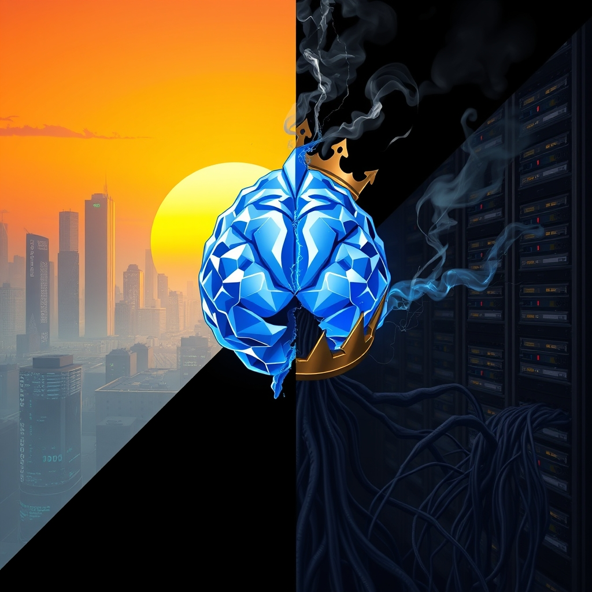

[Home](../index.md) > [Books](./index.md)  
# 🤖👑 Empire of AI: Dreams and Nightmares in Sam Altman's OpenAI  
  
[🛒 Empire of AI: Dreams and Nightmares in Sam Altman's OpenAI. As an Amazon Associate I earn from qualifying purchases.](https://amzn.to/3Hyx3K0)  
  
## 📚 Book Report: 🤖 Empire of AI: 🌃 Dreams and 😨 Nightmares in Sam Altman's OpenAI  
  
### 📖 Introduction  
  
🤖 Empire of AI: 🌃 Dreams and 😨 Nightmares in Sam Altman's OpenAI by Karen Hao is an 🔍 in-depth look at the company at the 🚀 forefront of the current artificial intelligence surge, OpenAI, and its prominent figure, Sam Altman. 📅 Released in May 2025, the book draws on ✍️ extensive reporting and 🗣️ interviews to examine OpenAI's history, culture, and its pursuit of artificial general intelligence (AGI). 👩‍💻 Hao, an award-winning journalist who has covered AI for years, provides a 🧐 critical perspective on the company's transformation from a non-profit with a safety-focused mission to a commercially driven entity.  
  
### 🔑 Key Themes Discussed  
  
* 🔄 **The Evolution of OpenAI:** 📜 The book chronicles OpenAI's journey from its origins as a non-profit aiming to benefit humanity to its current structure, which includes a for-profit arm.  
* 🧠 **The Pursuit of AGI:** 🎯 A central theme is OpenAI's fervent belief in and pursuit of artificial general intelligence, systems that would match or surpass human cognitive abilities. 🎭 The book explores the "messianic undertones" of this quest within the company culture.  
* 👨‍💼 **Sam Altman's Influence:** 💼 The book examines the role of Sam Altman, highlighting his drive and influence in shaping OpenAI's direction, including the company's focus on models excelling at code generation.  
* 🤫 **Culture of Secrecy and Devotion:** 🕵️‍♀️ Hao investigates the internal culture of OpenAI, noting its secrecy and the deep devotion among some employees to the AGI mission.  
* ⚖️ **Contradictions and Tensions:** 💥 The narrative reveals the inherent contradictions and tensions within OpenAI, particularly between its initial altruistic goals and the realities of a competitive, resource-intensive industry.  
* 💰 **Resource Demands and Global Impact:** 🌍 The book sheds light on the significant resources required by the AI industry, such as high-end chips, massive datasets, and substantial energy and water, and the global impact of these demands, including the exploitation of labor in the Global South.  
* 💪 **Power Consolidation and Threat to Democracy:** 🏛️ Hao argues that the current AI paradigm is leading to an unprecedented consolidation of economic and political power in the hands of a few companies, which she sees as a threat to democracy and global inequality.  
* 🚪 **The Altman Ouster Event:** 🚨 The book delves into the dramatic events of November 2023, when Sam Altman was briefly removed as CEO by the board, offering a behind-the-scenes look at the power struggles and ideological clashes within the company.  
  
### 🤔 Critique and Analysis  
  
👩‍💻 Hao's reporting, based on over 300 🗣️ interviews, ✉️ correspondence, and 📁 documents, provides a deeply researched and often critical look at OpenAI. 🧐 Reviewers note that the book offers a "skeptical look" at where the company is headed and challenges the dominant narrative surrounding AI development. 📰 It is described as a "corrective to tech journalism that rarely leaves Silicon Valley," incorporating viewpoints beyond the industry's insiders, such as data laborers and activists. 👍 While some praise its thoroughness and critical perspective, 👎 others suggest a "tendentious narrative slant" and a focus that might overlook some positive aspects of generative AI. 📜 The book explicitly draws parallels between the AI industry's expansion and historical colonial empires, particularly referencing the East India Company.  
  
### 📝 Conclusion  
  
🤖 Empire of AI presents a 📚 comprehensive and 🧐 critical examination of OpenAI under Sam Altman, positioning the company's rapid growth and pursuit of AGI within a broader context of power consolidation and global impact. 🌐 By highlighting the internal dynamics, resource demands, and the potential for increased inequality, Karen Hao's book serves as an important, albeit sometimes controversial, contribution to the ongoing conversation about the future of artificial intelligence and its societal implications.  
  
## 📚 Additional Book Recommendations  
  
### 📖 Similar Books (Focus on AI Companies, Leaders, and Development)  
  
* 👨‍💼 **The Optimist: Sam Altman, OpenAI, and the Race to Invent the Future** by Keach Hagey. This book offers a different perspective on Sam Altman and OpenAI, reportedly gaining access to Altman and his inner circle. 📖 Reading both Hao's and Hagey's books can provide a more rounded view of the subject.  
* 👨‍💻 **Genius Makers: The Mavericks Who Brought AI to Google, Facebook, and the World** by Cade Metz. Explores the personalities and rivalries among the leading researchers who have shaped the field of AI, including figures relevant to OpenAI's origins.  
* 🧠 **Applied Minds: How Engineers Think** by Guru Madhavan. While not solely about AI, this book delves into the mindset of engineers and problem-solvers in various fields, offering insight into the kind of thinking that drives technological development at companies like OpenAI.  
* 👩‍💻 **The Worlds I See: Curiosity, Exploration, and Discovery at the Dawn of AI** by Fei-Fei Li. A memoir from a leading AI researcher, offering a personal perspective on the development and potential of AI, often with a focus on human-centered AI.  
  
### ↔️ Contrasting Books (Offering Different Perspectives or Critiques)  
  
* ⛔ **The AI Con: How to Fight Big Tech's Hype and Create the Future We Want** by Emily M. Bender. This book is likely to offer a critical perspective on the hype surrounding AI and advocate for a more cautious and human-centric approach, contrasting with the rapid, AGI-focused development discussed in "Empire of AI."  
* 🌍 **Atlas of AI: Power, Politics, and the Planetary Costs of Artificial Intelligence** by Kate Crawford. Provides a critical examination of the political, social, and environmental costs of AI, aligning with Hao's theme of resource demands and global impact, but offering a broader, systemic critique.  
* ⚠️ **Algorithms of Oppression: How Search Engines Reinforce Racism** by Safiya Umoja Noble. Focuses on the societal harm that can be embedded in algorithms, offering a stark contrast to optimistic views of AI's benefits and aligning with concerns about inequality and bias.  
* 🔒 **Your Face Belongs to Us: A Secretive Startup's Quest to End Privacy as We Know It** by Kashmir Hill. Explores the privacy implications of powerful AI technologies like facial recognition, highlighting a specific area of concern related to the widespread deployment of AI.  
  
### ✨ Creatively Related Books (Exploring Broader Impacts, History, or Philosophy)  
  
* **[🤖⚠️📈 Superintelligence: Paths, Dangers, Strategies](./superintelligence-paths-dangers-strategies.md)** by Nick Bostrom. A foundational text exploring the potential risks and challenges posed by the development of superintelligent AI, providing a philosophical and existential backdrop to the AGI race described in "Empire of AI."  
* **[🧬👥💾 Life 3.0: Being Human in the Age of Artificial Intelligence](./life-3-0.md)** by Max Tegmark. Discusses various possible futures for humanity in the age of AI, prompting thought experiments about the long-term societal impact of advanced AI.  
* **[🤖🧑‍ Human Compatible: Artificial Intelligence and the Problem of Control](./human-compatible-artificial-intelligence-and-the-problem-of-control.md)** by Stuart Russell. Addresses the crucial problem of ensuring that advanced AI systems are aligned with human values, a key safety concern related to the pursuit of AGI.  
* ⚔️ **The Anarchy: The Relentless Rise of the East India Company** by William Dalrymple. Explicitly referenced by Karen Hao as an inspiration, this historical account of a powerful corporation's rise to dominance provides a compelling parallel to the "empire" framing of the AI industry.  
* 🕸️ **Nexus: A Brief History of Information Networks from the Stone Age to AI** by Yuval Noah Harari. Offers a sweeping historical perspective on the evolution of information control and its impact on human society, placing the current AI developments in a broader historical context.  
* 😈 **Don't Be Evil: How Big Tech Betrayed Its Founding Principles -- and All of Us** by Rana Foroohar. Examines the broader ethical and societal failures of major tech companies, providing context for concerns about the power and influence of entities like OpenAI.  
* 🌐 **The New Empire of AI: The Future of Global Inequality** by Rachel Adams. This book directly addresses the potential of AI to exacerbate global inequality, a theme also central to Hao's work, offering a complementary analysis of the economic and social implications.  
* 🏛️ **Silicon Empires: The Fight for the Future of AI** by Nick Srnicek. Examines the economic forces driving the expansion of AI and how Big Tech is consolidating power, providing a theoretical framework that resonates with the empirical observations in "Empire of AI.".  
  
## 💬 [Gemini](../software/gemini.md) Prompt (gemini-2.5-flash-preview-04-17)  
> Write a markdown-formatted (start headings at level H2) book report, followed by a plethora of additional similar, contrasting, and creatively related book recommendations on Empire of AI: Dreams and Nightmares in Sam Altman's OpenAI. Be thorough in content discussed but concise and economical with your language. Structure the report with section headings and bulleted lists to avoid long blocks of text.  
  
## 🐦 Tweet  
<blockquote class="twitter-tweet" data-theme="dark">
🤖👑 Empire of AI: Dreams and Nightmares in Sam Altman&#39;s OpenAI  🏢 OpenAI&#39;s Evolution | 🧑‍💼 Altman&#39;s Leadership | 🤫 Internal Culture | 💰 Resource Demands | ⚖️ Ethical Tensions | 💥 Power Struggles<a href="https://t.co/XqSt3cHYxV">https://t.co/XqSt3cHYxV</a>
&mdash; Bryan Grounds (@bagrounds) <a href="https://twitter.com/bagrounds/status/1931925650291786140?ref_src=twsrc%5Etfw">June 9, 2025</a></blockquote> 