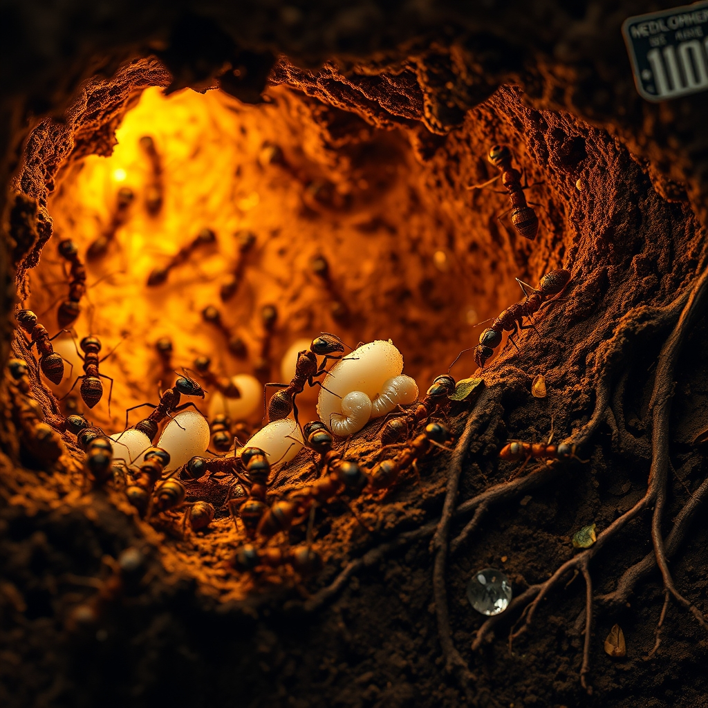

[Home](../index.md) > [Books](./index.md)  
# 🐜👑 Empire of Ants: The Hidden World and Extraordinary Lives of Earth's Tiny Conquerors  
  
[🛒 Empire of Ants: The Hidden World and Extraordinary Lives of Earth's Tiny Conquerors. As an Amazon Associate I earn from qualifying purchases.](https://amzn.to/3JGkqy9)  
  
🐜⚔️🌱 Ants, Earth's tiny conquerors, reveal strikingly complex and often brutal societies with surprising parallels to human civilization, from agriculture and warfare to social hierarchies and even vaccination.  
  
## 🏆 🐜 Foitzik & Fritsche's Ant Colony Strategy  
  
### 🏢 🐜 Social Structure & Organization  
* 👑 🐜 **Caste System:** Queen, workers (sterile females), soldiers, drones. Roles often age-dependent.  
* 🤝 🐜 **Division of Labor:** Essential for colony function. Fundamental split: nurses (brood care) vs. foragers (outside nest).  
* 📏 🐜 **Colony Size:** From dozens to millions, varying by species.  
* 🧠 🐜 **Decision-Making:** Collective, decentralized processes. Examples include bridge building and foraging route optimization.  
  
### 🗣️ 🐜 Communication & Navigation  
* 🧪 🐜 **Pheromones:** Chemical signals for paths, food, danger, and social cues.  
* 🤝 🐜 **Physical Contact:** Antennae touching, trophallaxis (food exchange) for information transfer.  
* 🧭 🐜 **Navigation:** Finely tuned systems, often combining chemical trails with visual landmarks and celestial cues.  
  
### ⚔️ 🐜 Warfare & Dominance  
* 🌎 🐜 **Inter-colony Conflict:** Territorial battles, resource competition, and predatory raids common.  
* 🦹 🐜 **Slavemaking Ants:** Recurrent raids on host colonies to steal worker brood; stolen workers then serve the slavemakers.  
* 🛡️ 🐜 **Defense:** Soldiers specialized for protection. Collective defense mechanisms.  
  
### 🧬 🐜 Evolution & Adaptation  
* ⏳ 🐜 **Ancient Lineage:** Ants present since the age of dinosaurs, demonstrating supreme staying power.  
* 🌿 🐜 **Ecological Impact:** Vital to ecosystems, influencing soil, seed dispersal, and pest control.  
* 💡 🐜 **Innovative Behaviors:** Aphid herding (milking honeydew), fungus farming (leaf-cutter ants), social distancing, and even vaccination.  
  
## ⚖️ 🐜 Critical Evaluation  
  
* 📖 🐜 Empire of Ants by Susanne Foitzik and Olaf Fritsche is widely praised as an accessible and engaging overview of ant biology and behavior, making complex science digestible for a general audience.  
* 👩‍🔬 🐜 The authors, particularly Susanne Foitzik (an evolutionary biologist with over 100 scientific papers on ants), bring significant academic authority and firsthand research experience to the subject. This strengthens the book's E-E-A-T (Expertise, Authoritativeness, Trustworthiness).  
* 🤝 🐜 The book effectively highlights striking parallels between ant societies and human civilizations, covering aspects like warfare, agriculture, slavery, communication, and city-building. Reviewers often note the surprisingly human quality of ant lives portrayed.  
* 🔬 🐜 While the book aims for broad appeal rather than deep academic rigor, its core assertions about ant social complexity align with modern myrmecological research, such as the conserved two-community social network structure (nurses vs. foragers) observed across diverse species.  
* ✏️ 🐜 The inclusion of personal anecdotes from the authors' fieldwork enhances the narrative without compromising factual integrity.  
* ✅ 🐜 **Verdict on Core Claim:** The book successfully demonstrates its core claim that ants are global superpowers and highly sophisticated architects of Earth whose hidden worlds exhibit an extraordinary level of social organization and adaptive genius. The evidence presented, backed by Foitzik's expertise and broad scientific consensus on ant behavior, convincingly supports this perspective.  
  
## 🔍 🐜 Topics for Further Understanding  
  
* 🦠 🐜 Ant microbiome research and its role in health and colony function.  
* 🌡️ 🐜 The impact of climate change and habitat loss on ant biodiversity and distribution.  
* 🧬 🐜 Advanced genetic and genomic studies revealing evolutionary pathways of eusociality in ants.  
* 🤖 🐜 Applications of swarm intelligence and ant colony optimization algorithms in robotics and AI.  
* 🧠 🐜 Detailed comparative studies of ant cognition and individual learning within collective systems.  
  
## ❓ 🐜 Frequently Asked Questions (FAQ)  
  
### 💡 🐜 Q: How do ants communicate effectively without language?  
✅ 🐜 A: Ants primarily communicate through chemical signals called pheromones, laid as trails or released to convey information about food, danger, and colony status. They also use tactile cues through antennae contact and trophallaxis (food sharing).  
  
### 💡 🐜 Q: What is the social structure within an ant colony?  
✅ 🐜 A: Ant colonies typically consist of a queen (or multiple queens) responsible for reproduction, sterile female workers who perform all tasks (foraging, nest maintenance, brood care), and male drones for mating. This division of labor is highly organized and adaptive.  
  
### 💡 🐜 Q: Do ants really wage war and enslave other ants?  
✅ 🐜 A: Yes, many ant species engage in territorial warfare, and some, known as slave-making ants, raid the nests of other species to capture their pupae. Once these pupae mature, they become slaves, performing duties for the slave-making colony.  
  
### 💡 🐜 Q: How long have ants existed on Earth?  
✅ 🐜 A: Ants have an ancient lineage, having walked the Earth since the age of the dinosaurs, demonstrating remarkable evolutionary staying power.  
  
## 📚 🐜 Book Recommendations  
  
### ➕ 🐜 Similar  
* [🐜 The Ants](./the-ants.md) by Bert Hölldobler and Edward O. Wilson: A classic, more academic exploration of ant biology.  
* 📖 🐜 Journey to the Ants by Bert Hölldobler and Edward O. Wilson: A more accessible overview from the renowned ant experts.  
* 📖 🐜 The Superorganism by Bert Hölldobler and Edward O. Wilson: Focuses on the collective intelligence of social insects.  
  
### ➖ 🐜 Contrasting  
* [👤🧬 The Selfish Gene](./the-selfish-gene.md) by Richard Dawkins: Explores evolution from a gene-centric view, contrasting with the superorganism concept.  
* [🌐🔗🧠📖 Thinking in Systems: A Primer](./thinking-in-systems.md) by Donella H. Meadows: Provides a broader framework for understanding complex interconnected systems.  
  
### 🔗 🐜 Related  
* [🌳🗣️ The Hidden Life of Trees: What They Feel, How They Communicate: Discoveries from a Secret World](./the-hidden-life-of-trees-what-they-feel-how-they-communicate-discoveries-from-a-secret-world.md) by Peter Wohlleben: Reveals the complex communication and social structures in forests.  
* 🦠 🐜 I Contain Multitudes by Ed Yong: Explores the microbial worlds within and around living beings, including insects.  
* 🧠 🐜 Other Minds by Peter Godfrey-Smith: Discusses the evolution of intelligence in cephalopods, offering another perspective on non-human cognition.  
  
## 🫵 🐜 What Do You Think?  
  
Which aspect of ant society do you find most surprising? What can humans learn from ants?