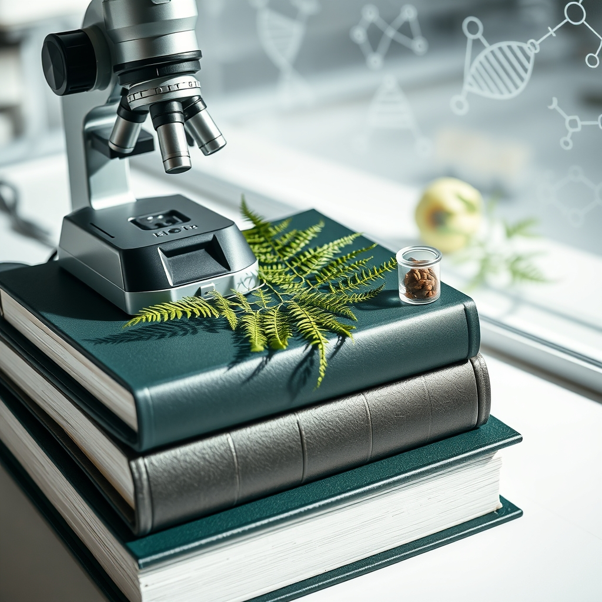

[Home](../index.md) > [Books](./index.md)  
# 📚🌿🔬 Encyclopedia of Applied Plant Sciences  
  
[🛒 Encyclopedia of Applied Plant Sciences. As an Amazon Associate I earn from qualifying purchases.](https://amzn.to/3ZjA0Ep)  
  
## 📖 Book Report: 🌿 Encyclopedia of Applied Plant Sciences  
  
### 🔎 Overview and Scope  
* 📚 The *Encyclopedia of Applied Plant Sciences* is a multi-volume reference work, published by Academic Press (an imprint of Elsevier). 📅 The first edition was published in 2003, edited by Brian Thomas, Denis J. Murphy, and Brian G. Murray. 🗓️ A second edition, reflecting significant advances, particularly in genomics and biotechnology, was published in 2016/2017.  
* 🌱 It aims to bridge foundational plant science knowledge with its practical applications in areas like agriculture, food production, and industry.  
* 🔬 The encyclopedia covers the core theories, knowledge, and techniques used by plant scientists. 🌾 It emphasizes the application of biological science advancements to produce sustainable food, feed, ingredients, and renewable raw materials.  
* 🌍 It also addresses ecological concerns, 🦠 plant pathology, 🧬 genetics, 🍃 physiology, 🧪 biochemistry, 🧬 biotechnology, and the ethical considerations surrounding modern plant science techniques.  
  
### ✨ Key Features  
* ✅ **Comprehensive Coverage:** 🌳 Addresses over 25 distinct areas of plant science, including abiotic stresses, crop improvement, biotechnology, photosynthesis, plant nutrition, pests and diseases, ecology, genetics, physiology, and ethics. 🌾 The second edition adds specific chapters on major crops and crop types.  
* 👨‍🔬 **Expert Contributions:** ✍️ Edited and written by a distinguished international group of experts.  
* 🗂️ **Organization:** 📝 Entries are designed to be concise and readable, with a well-organized format, thorough cross-referencing, and glossary sections for clear definitions of terms.  
* 🖼️ **Illustrations:** 📊 Features numerous tables, figures, and color plates in each volume.  
* 💻 **Accessibility:** 🖨️ Available in print (typically as a 3-volume set) and online via ScienceDirect, offering enhanced searchability and linking features.  
  
### 🎯 Target Audience  
* 👩‍🔬 Researchers, scientists, and academics in plant science, agriculture, biotechnology, and related fields.  
* 🎓 Students at the university level (advanced undergraduate and graduate).  
* 👨‍🌾 Horticulturists and professionals in industries relying on plant-based resources.  
* 🏢 Academic and research libraries.  
  
### ✅ Assessment  
* 💯 This encyclopedia serves as a valuable, authoritative resource connecting fundamental plant biology to real-world applications.  
* 👍 Reviewers praise its comprehensive scope, scientific rigor balanced with clarity, and timeliness, particularly regarding advances in genetics and biotechnology.  
* 📚 It is considered an essential addition to libraries supporting plant science and agricultural research.  
  
## 📚 Book Recommendations  
  
### ➕ Similar Works (Comprehensive & Applied Focus)  
* 🌱 **Plant Physiology and Development** by Lincoln Taiz et al.: 📖 A widely used, authoritative textbook focusing on the physiological processes of plants, often incorporating developmental aspects.  
* 🌳 **Biology of Plants** by Peter H. Raven et al.: 📖 A classic, comprehensive academic textbook covering all major aspects of plant biology, known for its clarity and illustrations.  
* 🌾 **Encyclopedia of Agriculture and Food Systems** (Elsevier): 📖 While broader than just plant science, it heavily overlaps in areas of crop production, soil science, and food systems, offering an applied perspective.  
* 🧬 **Plant Biotechnology: The genetic manipulation of plants** by Adrian Slater et al.: 📖 Focuses specifically on the techniques and applications of genetic modification in plants, a key area within applied plant science.  
  
### ➖ Contrasting Perspectives (Specialized or Theoretical)  
* 🌻 **[🌿🧑‍🌾 Botany for Gardeners](./botany-for-gardeners.md)** by Brian Capon / 🌼 **[🧑‍🌾🌿 A Gardener's Guide to Botany](./a-gardeners-guide-to-botany.md)** by Scott Zona: 📖 These books bridge botany and practical horticulture but are aimed at a less academic audience, focusing on information directly applicable to gardening.  
* 🌿 **Plant Systematics: A Phylogenetic Approach** by Walter S. Judd et al.: 📖 Concentrates on plant classification, evolution, and relationships, representing a more theoretical and less directly 'applied' area of botany.  
* 🌳 **From Plant Traits to Vegetation Structure** (Cambridge University Press): 📖 Explores ecological modeling and theoretical approaches to understanding plant communities based on traits, contrasting with the broader applied scope of the Encyclopedia.  
* 🔬 **Specialized Monographs (Various Publishers like Caister Academic Press, Frontiers):** 📖 Books focusing deeply on niche topics like *Plant-Microbe Interactions*, *Omics in Seed Development*, or *Genes, Genetics and Transgenics for Virus Resistance in Plants* offer depth in specific areas rather than breadth.  
  
### 💡 Creatively Related Reads (Interdisciplinary & Popular Science)  
* **[🪢🌾 Braiding Sweetgrass: Indigenous Wisdom, Scientific Knowledge, and the Teachings of Plants](./braiding-sweetgrass.md)** by Robin Wall Kimmerer: 📖 Blends indigenous perspectives, scientific knowledge, and personal reflection, offering a deeply humanistic and ecological view of plants.  
* **[🌳🗣️ The Hidden Life of Trees: What They Feel, How They Communicate: Discoveries from a Secret World](./the-hidden-life-of-trees-what-they-feel-how-they-communicate-discoveries-from-a-secret-world.md)** by Peter Wohlleben: 📖 A popular science book exploring the social networks and communication between trees, sparking wonder about plant behavior.  
* 🍎 **The Botany of Desire: A Plant's-Eye View of the World** by Michael Pollan: 📖 Explores the co-evolutionary relationship between humans and four key plants (apple, tulip, marijuana, potato), focusing on human desires they fulfill.  
* 🌳 **Finding the Mother Tree: Discovering the Wisdom of the Forest** by Suzanne Simard: 📖 A memoir and scientific exploration of forest ecology, focusing on the interconnectedness and communication within forest ecosystems via mycorrhizal networks.  
* 🥕 **Edible Plants: A Photographic Survey of the Wild Edible Botanicals of North America** by James Fike: 📖 Connects botany with foraging and survival, highlighting practical uses through photography and botanical information.  
* 🪴 **Houseplant Books (e.g., *Wild at Home* by Hilton Carter, *How to Make a Plant Love You* by Summer Rayne Oakes, *Urban Jungle* by Igor Josifovic & Judith de Graaff):** 📖 While focused on indoor gardening and aesthetics, these often incorporate basic plant care science and highlight the human connection to plants in living spaces.  
  
## 💬 [Gemini](../software/gemini.md) Prompt (gemini-2.5-pro-exp-03-25)  
> Write a markdown-formatted (start headings at level H2) book report, followed by a plethora of additional similar, contrasting, and creatively related book recommendations on Encyclopedia of Applied Plant Sciences. Be thorough in content discussed but concise and economical with your language. Structure the report with section headings and bulleted lists to avoid long blocks of text.