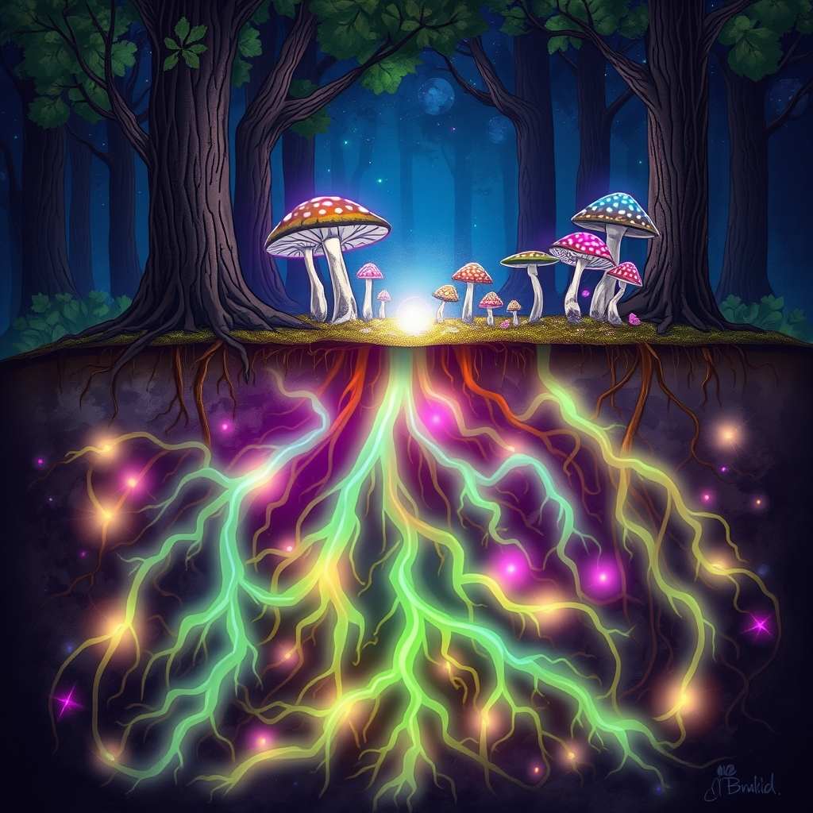

[Home](../index.md) > [Books](./index.md)  
# 🍄🌍🧠🔮 Entangled Life: How Fungi Make Our Worlds, Change Our Minds & Shape Our Futures  
  
[🛒 Entangled Life: How Fungi Make Our Worlds, Change Our Minds & Shape Our Futures. As an Amazon Associate I earn from qualifying purchases.](https://amzn.to/4n6kNAM)  
  
## 🍄 Book Report: Entangled Life  
  
### ✍️ Summary  
  
🌳 Merlin Sheldrake's *Entangled Life* takes readers on a deep dive into the mysterious and vital world of fungi. 🍄 Far from being mere mushrooms, fungi are revealed as a diverse kingdom of organisms that shape life on Earth in profound and often surprising ways. 🍂 The book explores their fundamental roles as decomposers, their intricate symbiotic relationships with plants and animals, their potential in bioremediation and medicine, and their impact on human history and consciousness. 🧠 Sheldrake blends scientific explanation with personal anecdotes and philosophical reflection, presenting fungi not just as biological entities but as a way to challenge our conventional understanding of individuality, intelligence, and the interconnectedness of life. 🕸️  
  
### 🔑 Key Themes  
  
* 🌳 **Mycelial Networks:** 🕸️ The book extensively details the vast, hidden networks of hyphae that constitute the majority of fungal life – the mycelium. 🍄 These networks act as crucial communication and nutrient-sharing systems within ecosystems, often referred to as the "wood wide web." 🌳  
* 🍂 **Decomposition and Nutrient Cycling:** ♻️ Fungi are highlighted as the planet's principal decomposers, breaking down organic matter and rocks, making nutrients available for other life forms, and playing a critical role in soil creation. 🌎  
* 🤝 **Symbiosis:** 🌱 A central theme is the ubiquitous symbiotic relationships fungi form, such as mycorrhizae with plants (essential for plant life on land) and the fascinating partnerships that create lichens, challenging notions of individual organisms. 🧪  
* 🤔 **Challenging Definitions of Life and Intelligence:** 🧠 Sheldrake uses fungi's network-based nature and their observed problem-solving abilities (like finding efficient routes through mazes) to question traditional, often anthropocentric, ideas of intelligence and what constitutes an individual organism. ❓  
* 🍄 **Psychedelics and Consciousness:** 😵‍💫 The book explores the history and impact of psychoactive fungi, discussing their cultural significance and their potential to alter human perception and understanding. 👁️  
* 🧪 **Fungal Potential:** 🔬 Sheldrake touches upon the myriad ways fungi are being explored for practical applications, including breaking down pollutants (bioremediation), producing materials, and developing new medicines. 💊  
  
### 🌟 Impact and Significance  
  
🍄 *Entangled Life* significantly elevates the profile of fungi, arguing for their fundamental importance in nearly all terrestrial ecosystems and processes. 🌎 It encourages readers to look beyond the visible mushroom and appreciate the unseen fungal networks that underpin much of the living world. 🌳 By presenting fungi as complex, interconnected, and often surprising organisms, the book prompts a reconsideration of our place within nature and the limitations of human-centric perspectives on biology and intelligence. 🌱 It is both a celebration of fungal diversity and a call to better understand and protect these vital life forms. 🍄  
  
## 📚 Additional Book Recommendations  
  
### 📖 Similar Reads (Nature, Biology, Interconnectedness)  
  
* **[🪢🌾 Braiding Sweetgrass: Indigenous Wisdom, Scientific Knowledge, and the Teachings of Plants](./braiding-sweetgrass.md)** by Robin Wall Kimmerer. 🌸 Like *Entangled Life*, this book beautifully weaves together scientific understanding with traditional knowledge and personal reflection to explore the reciprocal relationship between humans and the natural world, focusing on plants. 🌱  
* **[🌳🗣️ The Hidden Life of Trees: What They Feel, How They Communicate: Discoveries from a Secret World](./the-hidden-life-of-trees-what-they-feel-how-they-communicate-discoveries-from-a-secret-world.md)** by Peter Wohlleben. 🌲 Explores the complex social lives of trees and their interconnectedness, particularly through the mycorrhizal networks discussed in *Entangled Life*. 🍄  
* 🦠 **I Contain Multitudes: The Microbes Within Us and a Grander View of Life** by Ed Yong. 🧬 Shifts the focus from fungi to the equally vast and impactful world of microbes, exploring the symbiotic relationships between microorganisms and their hosts, including humans, and challenging the idea of the individual organism. 🧪  
* 🌍 **An Immense World: How Animal Senses Reveal the Hidden Realms Around Us** by Ed Yong. 🐾 While focusing on animals, this book similarly reveals unseen aspects of the world by exploring the diverse ways different creatures perceive their environment, offering a perspective beyond the human. 👁️  
* 🌿 **Gathering Moss: A Natural and Cultural History of Mosses** by Robin Wall Kimmerer. 💚 A focused exploration of another often-overlooked group of organisms, blending scientific detail with personal and cultural perspectives, much like Sheldrake does with fungi. 🍄  
* 🕸️ **The Secret Network of Nature: Hidden Connections That Explain Our World** by Peter Wohlleben. 🌳 Continues the exploration of interconnectedness in ecosystems, looking at the surprising relationships between various plants, animals, and even geographical features. 🗺️  
  
### ⚖️ Contrasting or Adjacent Perspectives  
  
* **[👤🧬 The Selfish Gene](./the-selfish-gene.md)** by Richard Dawkins. 🧫 Presents a gene-centric view of evolution, often emphasizing competition as a driving force, which offers a contrast to the cooperative and symbiotic relationships highlighted in *Entangled Life*. 🌱  
* 🐛 **Silent Earth: Averting the Insect Apocalypse** by Dave Goulson. 🌍 Focuses on the critical role and alarming decline of insects, another vital but often unappreciated group of organisms within ecosystems. 🐝  
* 🏙️ **Darwin Comes to Town: How the Urban Jungle Drives Evolution** by Menno Schilthuizen. 🏙️ Explores evolution and adaptation in urban environments, focusing on how human-altered landscapes impact species, offering a different lens on the interaction between life and its environment. 🧬  
  
### 🎨 Creatively Related Reads (Interconnectedness, Non-Human Intelligence, Deep Time, Philosophy)  
  
* 🕳️ **Underland: A Deep Time Journey** by Robert Macfarlane. ⏳ A lyrical and philosophical exploration of the world beneath our feet, including caves, mines, and the deep geological past, touching on themes of time, memory, and human impact on the earth, which resonates with the underground world of fungi. 🍄  
* 🌲 **Finding the Mother Tree: Discovering the Wisdom of the Forest** by Suzanne Simard. 👩‍🔬 A memoir and scientific account from the ecologist whose groundbreaking research revealed the complex communication and resource sharing among trees via fungal networks, providing a personal perspective on the "wood wide web." 🌳  
* 🧭 **The Invention of Nature: Alexander von Humboldt's New World** by Andrea Wulf. 🗺️ A biography of the pioneering scientist who saw nature as an interconnected global force, a perspective that aligns with the holistic view presented in *Entangled Life*. 🌍  
* 🤝 **The Social Instinct: How Cooperation Shaped the World** by Nichola Raihani. 🫂 Examines the science of cooperation across various species, including humans, providing a broader biological context for the symbiotic relationships seen in fungi. 🍄  
* 🐦 **Vesper Flights** by Helen Macdonald. 🦢 A collection of essays that explore the human relationship with the natural world through observations of birds and other wildlife, touching on themes of perception, wildness, and the limits of human understanding. 🧐  
* 🏜️ **Desert Notebooks: A Natural History of the Anthropocene** by Ben Ehrenreich. 🌵 Blends personal experience, history, and science to explore the complexities of life in the desert and the impact of human activity, offering a meditation on survival and interconnectedness in a harsh environment. ☀️  
* 🌊 **Spineless: The Science of Jellyfish and the Art of Growing a Backbone** by Juli Berwald. 🐠 Delves into the fascinating world of jellyfish, exploring their biology and ecology, and prompting reflection on the diversity and strangeness of life beyond familiar forms. 🐙  
  
## 💬 [Gemini](../software/gemini.md) Prompt (gemini-2.5-flash-preview-04-17)  
> Write a markdown-formatted (start headings at level H2) book report, followed by a plethora of additional similar, contrasting, and creatively related book recommendations on Entangled Life: How Fungi Make Our Worlds, Change Our Minds & Shape Our Futures. Be thorough in content discussed but concise and economical with your language. Structure the report with section headings and bulleted lists to avoid long blocks of text  
  
## 🐦 Tweet  
<blockquote class="twitter-tweet" data-theme="dark">
🍄🌍🧠🔮 Entangled Life: How Fungi Make Our Worlds, Change Our Minds &amp; Shape Our Futures  🍄 Mycelial Networks | ⚗️ Bioremediation | 🍄 Psychoactive Fungi | 🌳 Symbiotic Relationships | 🧠 Non-Human Intelligence<a href="https://t.co/jMNmTqe40S">https://t.co/jMNmTqe40S</a>
&mdash; Bryan Grounds (@bagrounds) <a href="https://twitter.com/bagrounds/status/1934739029221888131?ref_src=twsrc%5Etfw">June 16, 2025</a></blockquote>   
  
## 🦋 Bluesky    
<blockquote class="bluesky-embed" data-bluesky-uri="at://did:plc:i4yli6h7x2uoj7acxunww2fc/app.bsky.feed.post/3mhd2abbrw52a" data-bluesky-cid="bafyreicn6434ouqpxosxvnwft4ak3uiyypughbdd5ag623vjswg7qjpvim">
🍄🌍🧠🔮 Entangled Life: How Fungi Make Our Worlds, Change Our Minds &amp; Shape Our Futures  
  
#AI Q: 🍄 Are fungi intelligent?  
  
🍄 Mycelial Networks | 🌿 Symbiosis | 🧠 Consciousness | 🧪 Bioremediation  
https://bagrounds.org/books/entangled-life-how-fungi-make-our-worlds-change-our-minds-shape-our-futures
&mdash; <a href="https://bsky.app/profile/did:plc:i4yli6h7x2uoj7acxunww2fc?ref_src=embed">Bryan Grounds (@bagrounds.bsky.social)</a> <a href="https://bsky.app/profile/did:plc:i4yli6h7x2uoj7acxunww2fc/post/3mhd2abbrw52a?ref_src=embed">2026-03-18T08:15:02.101Z</a></blockquote>  
  
## 🐘 Mastodon    
<blockquote class="mastodon-embed" data-embed-url="https://mastodon.social/@bagrounds/116249178961051766/embed" style="background: #282c37; border-radius: 8px; border: 1px solid #393f4f; margin: 0; max-width: 540px; min-width: 270px; overflow: hidden; padding: 0;"> <a href="https://mastodon.social/@bagrounds/116249178961051766" target="_blank" style="align-items: center; color: #d9e1e8; display: flex; flex-direction: column; font-family: system-ui, -apple-system, BlinkMacSystemFont, 'Segoe UI', Oxygen, Ubuntu, Cantarell, 'Fira Sans', 'Droid Sans', 'Helvetica Neue', Roboto, sans-serif; font-size: 14px; justify-content: center; letter-spacing: 0.25px; line-height: 20px; padding: 24px; text-decoration: none;"> <svg xmlns="http://www.w3.org/2000/svg" xmlns:xlink="http://www.w3.org/1999/xlink" width="32" height="32" viewBox="0 0 79 75"><path d="M63 45.3v-20c0-4.1-1-7.3-3.2-9.7-2.1-2.4-5-3.7-8.5-3.7-4.1 0-7.2 1.6-9.3 4.7l-2 3.3-2-3.3c-2-3.1-5.1-4.7-9.2-4.7-3.5 0-6.4 1.3-8.6 3.7-2.1 2.4-3.1 5.6-3.1 9.7v20h8V25.9c0-4.1 1.7-6.2 5.2-6.2 3.8 0 5.8 2.5 5.8 7.4V37.7H44V27.1c0-4.9 1.9-7.4 5.8-7.4 3.5 0 5.2 2.1 5.2 6.2V45.3h8ZM74.7 16.6c.6 6 .1 15.7.1 17.3 0 .5-.1 4.8-.1 5.3-.7 11.5-8 16-15.6 17.5-.1 0-.2 0-.3 0-4.9 1-10 1.2-14.9 1.4-1.2 0-2.4 0-3.6 0-4.8 0-9.7-.6-14.4-1.7-.1 0-.1 0-.1 0s-.1 0-.1 0 0 .1 0 .1 0 0 0 0c.1 1.6.4 3.1 1 4.5.6 1.7 2.9 5.7 11.4 5.7 5 0 9.9-.6 14.8-1.7 0 0 0 0 0 0 .1 0 .1 0 .1 0 0 .1 0 .1 0 .1.1 0 .1 0 .1.1v5.6s0 .1-.1.1c0 0 0 0 0 .1-1.6 1.1-3.7 1.7-5.6 2.3-.8.3-1.6.5-2.4.7-7.5 1.7-15.4 1.3-22.7-1.2-6.8-2.4-13.8-8.2-15.5-15.2-.9-3.8-1.6-7.6-1.9-11.5-.6-5.8-.6-11.7-.8-17.5C3.9 24.5 4 20 4.9 16 6.7 7.9 14.1 2.2 22.3 1c1.4-.2 4.1-1 16.5-1h.1C51.4 0 56.7.8 58.1 1c8.4 1.2 15.5 7.5 16.6 15.6Z" fill="currentColor"/></svg> 
Post by @bagrounds@mastodon.social
 
View on Mastodon
 </a> </blockquote>   
