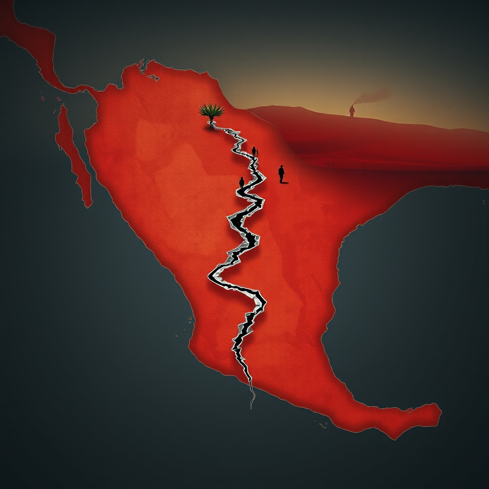

[Home](../index.md) > [Books](./index.md)  
# 👣🗺️💥 Everyone Who Is Gone Is Here: The United States, Central America, and the Making of a Crisis  
  
[🛒 Everyone Who Is Gone Is Here: The United States, Central America, and the Making of a Crisis. As an Amazon Associate I earn from qualifying purchases.](https://amzn.to/49cljXP)  
  
🌎✈️🛂 Decades of multifaceted U.S. intervention, political corruption, and socioeconomic instability in Central America—primarily El Salvador, Guatemala, and Honduras—intertwined to ignite the enduring migration crisis at the U.S. southern border, viewed through the deeply human stories of those impacted.  
  
## 🤖 AI Summary  
  
### 🗓️ Historical Roots of Migration  
* 🇺🇸 **U.S. Intervention (Cold War Era):** Decades of U.S. foreign policy shaping Central American politics. Support for right-wing governments and military regimes in El Salvador, Guatemala, and Nicaragua during civil wars.  
    * 📝 Examples: 1954 Guatemalan coup (CIA-backed), U.S. military and economic aid to Salvadoran government, funding of Contras in Nicaragua.  
    * 💥 Consequences: Widespread violence, human rights abuses, political instability, economic destruction.  
* ➡️ **Push Factors:**  
    * 🔪 **Violence:** Civil wars, state-sponsored violence, later gang violence (e.g., MS-13, originating in LA and deported back).  
    * 💸 **Economic Hardship:** Extreme poverty, lack of opportunities, low wages, unemployment, food insecurity, historical inequality, land ownership concentration.  
    * 🏛️ **Political Insecurity & Corruption:** Autocratic rule, weak institutions, governmental inability to address crises, impunity.  
    * 🌪️ **Natural Disasters:** Extreme weather events, droughts, hurricanes impacting agriculture and displacing populations.  
  
### 📜 U.S. Immigration Policy Evolution  
* 👨‍👩‍👧‍👦 **1980s-1990s:** Shift from single Mexican male migrants to families and unaccompanied minors from Central America. Reagan administration's harsh stance on asylum, often denying refugee status despite evidence of atrocities, leading to the sanctuary movement.  
* 🚨 **Post-9/11:** Increased border surveillance, policing, detention, and deportation.  
* 🚧 **Obama Administration:** Scrambled to build new detention centers and institute deterrence policies for Central American migrants.  
* 🧱 **Trump Administration:** Increasingly strict measures, metering asylum seekers, Migrant Protection Protocols (Remain in Mexico), family separations, cutting aid, border wall emphasis, Title 42.  
* 🕊️ **Biden Administration:** Initially aimed to reverse Trump policies, restore asylum, address root causes; established humanitarian parole programs and CBP One app. However, also continued some restrictive measures like Title 42 and expedited removals for certain groups.  
  
### 💔 Human Impact  
* 🗣️ Personal narratives central to illustrating the devastating effects of political decisions and perilous journeys. Migrants face kidnapping, La Bestia (freight train), family separation, and dangers at the border. Resilience of migrants and activists documented.  
  
## ⚖️ Evaluation  
* 📚 **Comprehensive Historical Context:** Everyone Who Is Gone Is Here provides a deeply reported, sweeping historical account of U.S. involvement in Central America from the Cold War to the present, effectively linking past interventions to current migration patterns. Blitzer's work is praised for its forensic detail and narrative approach, weaving personal stories with policy analysis.  
* 🚨 **Critique of U.S. Policy:** The book powerfully exposes the hypocrisy and schizophrenia of American policies and attitudes toward immigrants, highlighting how U.S.-backed meddling contributed to the destabilization of Central American nations. It argues that many current problems at the border are the inevitable 'harvest' from seeds sown by U.S. policy.  
* 🌍 **Focus on Northern Triangle:** While acclaimed for its depth regarding El Salvador, Guatemala, and Honduras, some critics note that the book's extensive focus on the Cold War origins and these three countries might limit its discussion of broader contemporary factors, such as changing demographics of migrants from other regions (e.g., Venezuela, Haiti) or wider global economic trends impacting migration today.  
* ⚖️ **Balance of Factors:** The book, while emphasizing the U.S. role, acknowledges that poverty, injustice, violence, and corruption in Central America also have homegrown roots. However, it often shows how U.S. actions exacerbated these internal issues or failed to support those trying to address them.  
* 📝 **Policy Implications:** The book does not offer easy solutions but is considered invaluable for understanding how the crisis developed, aiding in plotting a humane way forward.  
  
## 🔍 Topics for Further Understanding  
* 🌡️ The role of climate change as an accelerating factor in Central American migration beyond its historical context.  
* 🗺️ Comparative analysis of migration crises and root causes in other global regions and their parallels to Central America.  
* 💰 The long-term economic and social impacts of remittances on Central American economies.  
* 🤝 The effectiveness of current international aid and development programs in addressing the root causes of migration.  
* 😔 The psychological and societal impacts of deportation and family separation on migrant communities, both in the U.S. and Central America.  
* 🕵️‍♂️ The evolving strategies of human smuggling networks and their intersection with organized crime.  
* 🤝 The challenges and successes of integration and assimilation for Central American migrants in various U.S. cities and communities.  
  
## ❓ Frequently Asked Questions (FAQ)  
### 💡 Q: What is Everyone Who Is Gone Is Here: The United States, Central America, and the Making of a Crisis about?  
✅ 📖 A: Everyone Who Is Gone Is Here is a non-fiction book by Jonathan Blitzer that provides a detailed history of the current migration crisis at the U.S. southern border, arguing it stems from decades of U.S. involvement, political corruption, and socioeconomic instability in Central American countries like El Salvador, Guatemala, and Honduras, interwoven with personal migrant narratives.  
  
### 💡 Q: Who is the author of Everyone Who Is Gone Is Here?  
✅ ✍️ A: The author of Everyone Who Is Gone Is Here is Jonathan Blitzer, a staff writer for The New Yorker. He is an award-winning journalist known for his coverage of immigration, politics, and foreign affairs.  
  
### 💡 Q: What are the main causes of Central American migration discussed in Everyone Who Is Gone Is Here?  
✅ ➡️ A: Everyone Who Is Gone Is Here highlights key push factors for Central American migration, including extreme economic hardship, lack of opportunities, widespread violence (including gang violence), political instability, corruption, food insecurity, and the devastating effects of natural disasters. The book emphasizes how U.S. foreign policy has significantly contributed to these conditions.  
  
### 💡 Q: Does Everyone Who Is Gone Is Here cover U.S. immigration policy?  
✅ 📜 A: Yes, Everyone Who Is Gone Is Here extensively covers U.S. immigration policy from the 1980s to the present, including Reagan-era asylum policies, the rise of the sanctuary movement, and the stringent measures implemented by the Trump and Biden administrations, such as Remain in Mexico and Title 42.  
  
### 💡 Q: What historical period does Everyone Who Is Gone Is Here focus on?  
✅ 🗓️ A: Everyone Who Is Gone Is Here primarily focuses on the history of U.S. involvement in Central America from the 1980s to the present, tracing the origins of the migration crisis back to the Cold War-era civil conflicts in the Northern Triangle countries.  
  
## 📚 Book Recommendations  
  
### 👍 Similar  
* 📖 Inevitable Revolutions: The United States in Central America by Walter LaFeber (Focuses specifically on U.S. intervention in Central America from the early 20th century).  
* 🩸 The Blood of Brothers: Life and War in El Salvador by Stephen Kinzer (A historical account of the Salvadoran civil war and U.S. involvement).  
* 🏡 Our Own Backyard: The United States in Central America, 1977–1992 by William LeoGrande (Examines U.S. policy in Central America during a critical period).  
  
### 👎 Contrasting  
* 🛣️ The Devil's Highway: A True Story by Luis Alberto Urrea (Focuses on the immediate, perilous journey of migrants across the desert, emphasizing human cost over policy history).  
* 🚫 No Turning Back: The None of Us Are from Here Story by Mark Krikorian (Often presents a perspective critical of liberal immigration policies).  
* 🇺🇸 A Nation of Immigrants by John F. Kennedy (A classic, more optimistic view of immigration to the U.S.).  
  
### 🔗 Related  
* 🍎 Bitter Fruit: The Story of the American Coup in Guatemala by Stephen Schlesinger and Stephen Kinzer (Deep dive into the 1954 CIA-backed coup in Guatemala).  
* 🔫 The Killing Zone: The United States Wages Cold War in Latin America by Stephen G. Rabe (Examines U.S. Cold War policies across several Latin American countries).  
* 🧒 Tell Me How It Ends: An Essay in 40 Questions by Valeria Luiselli (Explores the U.S. immigration system through the lens of unaccompanied minors).  
  
## 🫵 What Do You Think?  
🤔 Which U.S. policy decision had the most profound and lasting impact on Central American migration, and how might acknowledging this history reshape current policy debates?