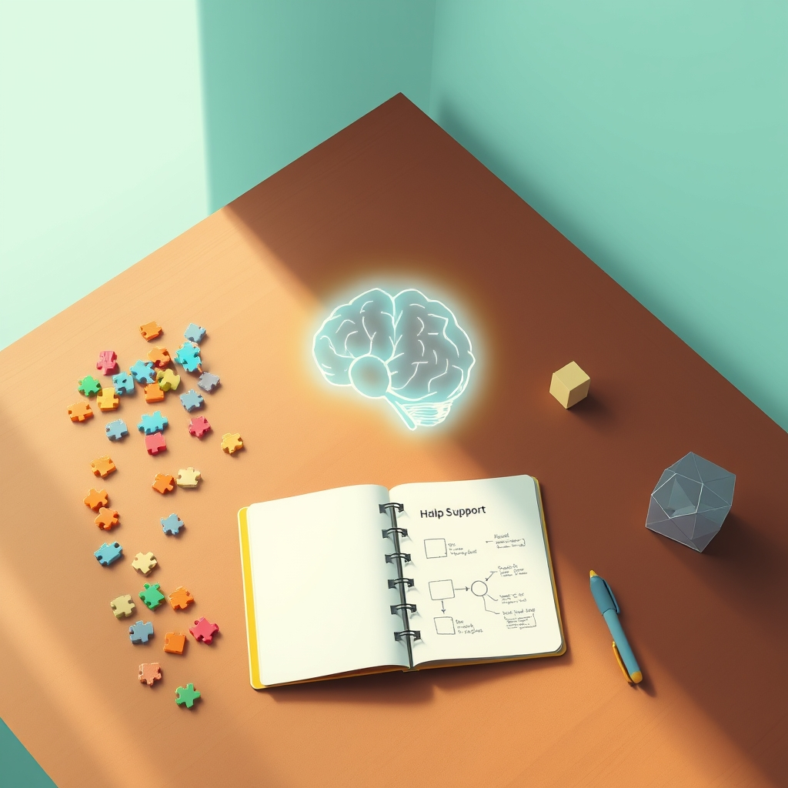

[Home](../index.md) > [Books](./index.md)  
# 🧠🧩🚧🧑‍🏫👩‍👧‍👦 Executive Function Dysfunction - Strategies for Educators and Parents  
  
[🛒 Executive Function Dysfunction - Strategies for Educators and Parents. As an Amazon Associate I earn from qualifying purchases.](https://amzn.to/3HDxFOl)  
  
## 🤖 AI Summary  
### 📖 Book Report: Executive Function 'Dysfunction' - Strategies for Educators and Parents  
### TL;DR 🎯✨  
This book provides practical strategies for educators 🧑‍🏫 and parents 👨‍👩‍👧‍👦 to support children 🧒 and adolescents 🧑‍🦱 with executive function challenges, focusing on understanding 🧠, accommodation 🤝, and intervention 🛠️.  
  
### New or Surprising Perspective 💡🌟  
Moyes emphasizes viewing executive function difficulties not as inherent "dysfunction" 🚫, but as areas needing targeted support 💖 and skill development 🌱. This reframing can shift perspectives from deficit-based thinking 📉 to a growth mindset 📈, highlighting the potential for improvement and adaptation 🔄. The book also provides a balanced approach ⚖️, considering both educational 🏫 and home environments 🏡, recognizing the importance of consistency across settings.  
  
### Deep Dive 🔍📚  
* **Topics Covered:**  
    * Understanding executive functions (working memory 🧠, cognitive flexibility 🤸‍♀️, inhibitory control 🛑, planning 📝, organization 📂, etc.).  
    * Identifying signs of executive function challenges in children and adolescents 🧐.  
    * Practical strategies for educators in classroom settings 🧑‍🏫.  
    * Techniques for parents to support executive function development at home 👨‍👩‍👧‍👦.  
    * Creating supportive environments and routines 🌈.  
    * Collaboration between educators, parents, and students 🤝.  
    * Strategies for managing specific challenges (e.g., time management ⏰, task initiation 🚀, emotional regulation 🧘).  
* **Methods and Research:**  
    * Draws on research in neuropsychology 🧠 and educational psychology 📚.  
    * Presents evidence-based strategies and interventions 🔬.  
    * Utilizes case studies and real-life examples to illustrate concepts 📖.  
    * Focuses on practical application of research findings 🛠️.  
* **Significant Theories and Mental Models:**  
    * Emphasis on the developmental nature of executive functions 👶➡️🧑‍🦱.  
    * Cognitive behavioral techniques for skill development 🧠🛠️.  
    * Importance of environmental modifications and scaffolding 🏗️.  
    * The concept of "metacognition" and teaching self-awareness 🧘.  
* **Prominent Examples:**  
    * Examples of classroom accommodations (e.g., visual schedules 🗓️, checklists ✅, breaking down tasks 🧩).  
    * Strategies for parents to create structured routines (e.g., morning and evening routines 🌅🌃, homework organization 📚).  
    * Case studies of students struggling with specific executive function challenges and the interventions that helped 🧑‍🎓➡️🏆.  
    * Example of teaching students to use self-talk to manage impulsive actions 🗣️🛑.  
* **Practical Takeaways 🛠️🌟:**  
    * **Educators:**  
        * Implement visual aids and organizational tools in the classroom. 📋🖼️  
        * Break down assignments into smaller, manageable steps. 🪜🧩  
        * Provide explicit instruction on time management and planning skills. ⏰📝  
        * Use positive reinforcement and feedback to encourage effort and progress. 👍👏  
        * Create flexible learning environments. 🧮🤸‍♀️  
    * **Parents:**  
        * Establish consistent daily routines and schedules. 🗓️⏰  
        * Create a designated study space with minimal distractions. 📚🤫  
        * Use checklists and visual reminders to support task completion. ✅👀  
        * Teach children to break down large tasks into smaller steps. 🧩🪜  
        * Practice problem solving skills together. 🤝🧠  
  
### Critical Analysis 🧐👍  
Moyes's book is a valuable resource for educators 🧑‍🏫 and parents 👨‍👩‍👧‍👦 seeking practical strategies to support children with executive function challenges. The book is well-organized 📂, clearly written ✍️, and grounded in research 🔬. The author's background in education and psychology lends credibility to her recommendations 👩‍🏫🧠. The practical, step-by-step guidance is particularly helpful for those looking to implement strategies immediately 🚀. The book's strength lies in its ability to translate complex concepts into actionable advice 💡➡️🛠️. It is a very accessible book.  
  
### Further Reading 📚✨  
* **Best Alternate Book (Same Topic):** "[Smart but Scattered](./smart-but-scattered.md)" by Peg Dawson and Richard Guare. 🧠🧩  
* **Best Tangentially Related Book:** "[Driven to Distraction](./driven-to-distraction.md) (Revised): Recognizing and Coping with Attention Deficit Disorder" by Edward M. Hallowell and John J. Ratey. 🤯🧠  
* **Best Diametrically Opposed Book:** Older parenting books that emphasize strict discipline without accommodations. 📏🚫🤝  
* **Best Fiction Book (Related Ideas):** "Percy Jackson & the Olympians" series by Rick Riordan. ⚡📖  
* **Best More General Book:** [🕳️🧠👶🏽 The Whole-Brain Child: 12 Revolutionary Strategies to Nurture Your Child's Developing Mind](./the-whole-brain-child.md) by Daniel J. Siegel and Tina Payne Bryson. 🧠👶  
* **Best More Specific Book:** "Late, Lost, and Unprepared: A Parents' Guide to Helping Children with Executive Functioning" by Joyce Cooper-Kahn and Laurie Dietzel. ⏰📚  
* **Best More Rigorous Book:** "Executive Functions in Children and Adolescents: A Practical Guide to Assessment and Intervention" by Joseph A. Allen. 🔬🧠  
* **Best More Accessible Book:** "Executive Function 101" by Lisa Meltzer. 📖💡  
  
## 💬 [Gemini](https://gemini.google.com) Prompt  
> Summarize the book: Executive Function 'Dysfunction' - Strategies for Educators and Parents. Start with a TL;DR - a single statement that conveys a maximum of the useful information provided in the book. Next, explain how this book may offer a new or surprising perspective. Follow this with a deep dive. Catalogue the topics, methods, and research discussed. Be sure to highlight any significant theories, theses, or mental models proposed. Summarize prominent examples discussed. Emphasize practical takeaways, including detailed, specific, concrete, step-by-step advice, guidance, or techniques discussed. Provide a critical analysis of the quality of the information presented, using scientific backing, author credentials, authoritative reviews, and other markers of high quality information as justification. Make the following additional book recommendations: the best alternate book on the same topic; the best book that is tangentially related; the best book that is diametrically opposed; the best fiction book that incorporates related ideas; the best book that is more general or more specific; and the best book that is more rigorous or more accessible than this book. Format your response as markdown, starting at heading level H3, with inline links, for easy copy paste. Use meaningful emojis generously (at least one per heading, bullet point, and paragraph) to enhance readability. Do not include broken links or links to commercial sites.