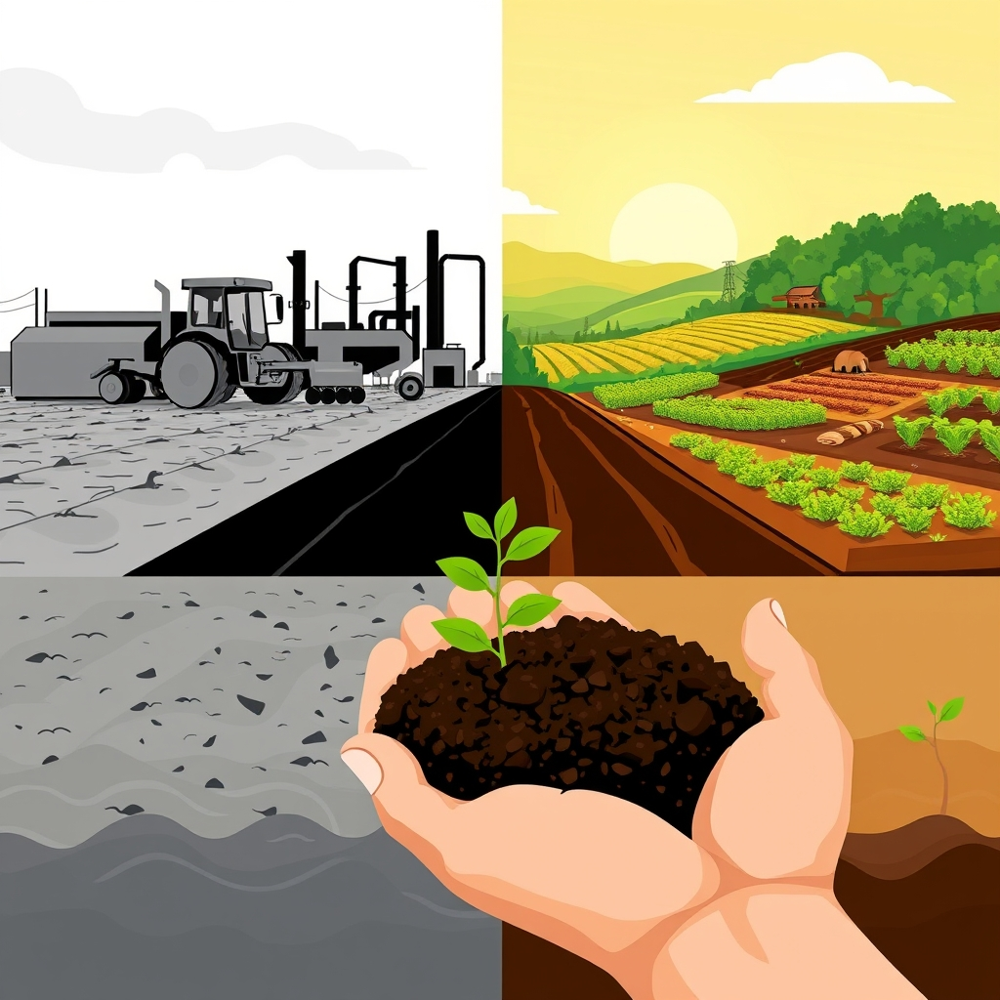

[Home](../index.md) > [Books](./index.md)  
# 🚜🧑‍🌾🌱 Farming for Us All: Practical Agriculture and the Cultivation of Sustainability  
  
[🛒 Farming for Us All: Practical Agriculture and the Cultivation of Sustainability. As an Amazon Associate I earn from qualifying purchases.](https://amzn.to/3FOaRuT)  
  
## 📚 Book Report: 🧑‍🌾 Farming for Us All: 🚜 Practical Agriculture and the 🌱 Cultivation of Sustainability  
  
*Farming for Us All: 🚜 Practical Agriculture and the 🌱 Cultivation of Sustainability* by Michael Mayerfeld Bell offers a deep sociological analysis of the challenges facing modern 🇺🇸 U.S. agriculture and explores the potential for sustainable alternatives. 🔍 Bell investigates why most farmers continue with conventional practices despite their detrimental impacts and why some are transitioning to sustainable methods.  
  
### 🔑 Key Themes and Arguments  
  
* 👨‍🌾 **Critique of Industrial Agriculture:** The book highlights the significant threats posed by modern, large-scale agriculture, including 🌍 environmental degradation (🌧️ climate change, habitat loss, ⛰️ soil erosion, 💧 groundwater depletion), 🍎 toxins in food, 🐷 inhumane animal treatment, 🧑‍ 노동자 farm worker exploitation, and 🍔 food insecurity amidst abundance.  
* ⚖️ **Systemic Constraints:** Bell argues that farmers are constrained by a powerful combination of 🏛️ markets, 📜 regulations, 💰 subsidies, and ⚙️ technology, which often incentivizes practices that undermine their own economic and social security, as well as the health of the 🏞️ land.  
* 👨‍🌾 **The Culture of Conventional Farming:** The book explores the reasons why many farmers adhere to conventional methods, suggesting that farming is a pressured endeavor where farmers often rely on established "recipes of knowledge" to navigate crises, even if they doubt their long-term effectiveness. 🤔 This reliance is tied to identity; "What you know is who you are."  
* 🤝 **The Importance of Social Relations:** A central argument is that cultivating sustainable farming requires fostering new social relations as much as adopting new techniques.  
* 🌾 **Case Study of Practical Farmers of Iowa (PFI):** Bell examines PFI as a model for a sustainable agriculture group that facilitates dialogue and collaboration among farmers, researchers, officials, and consumers. 🗣️ Through this dialogue, PFI members develop practical solutions for sustainable practices that support families, communities, economies, and environments.  
* 🗣️ **Practical Agriculture as Dialogue and Action:** The book defines "practical agriculture" as an approach where action is rooted in dialogue and dialogue informs action, creating a self-sustaining cycle.  
  
### 🔬 Methodology  
  
Bell's insights are based on extensive qualitative research, including years of close interaction and interviews with over 60 farm families in Iowa. The book employs a sociological and ethnographic perspective to understand the complexities of farmers' decisions and the social dynamics of the sustainable agriculture movement.  
  
### 📝 Conclusion  
  
*Farming for Us All* provides crucial insight into the sustainable agriculture movement in the United States, offering a hopeful perspective on the possibility of transforming how food is grown. 🌱 It makes a compelling case that fostering community and conversation is vital for the success of sustainable practices, making it essential reading for anyone concerned about the future of food and farming. 📚  
  
## ➕ Additional Book Recommendations  
  
### 🌱 Similar Books (Focus on Sustainable/Regenerative Agriculture & Agroecology)  
  
These books delve into the principles and practices of sustainable, organic, and regenerative farming, often from practical, ecological, or social perspectives. 🌍  
  
* ***🪨 Dirt to Soil: 👨‍🌾 One Family's Journey into Regenerative Agriculture*** by Gabe Brown. Shares a farmer's experience transitioning from conventional to regenerative practices, focusing on 🏞️ soil health.  
* ***🏞️ The Soil Will Save Us: 🧑‍🔬 How Scientists, Farmers, and Foodies Are Healing the Soil to Save the Planet*** by Kristin Ohlson. Explores the potential of healthy soil to combat 🌧️ climate change through carbon sequestration.  
* ***🌾 Agroecosystem Sustainability*** by Stephen R. Gliessman. Discusses the ecological basis for sustainable farming and provides case studies.  
* ***🌾 The One-Straw Revolution*** by Masanobu Fukuoka. Introduces natural farming methods and a philosophy of working in harmony with nature.  
* ***🏡 The Resilient Farm and Homestead: 💡 An Innovative Permaculture and Whole Systems Design Approach*** by Ben Falk. Focuses on permaculture principles for creating sustainable homesteads.  
* ***🌱 Natural Farming: 👨‍🌾 a Practical Guide*** by Pat Coleby. Provides practical guidance on natural farming methods.  
* ***🥬 The Market Gardener: 👨‍🌾 A Successful Grower's Handbook for Small-Scale Organic Farming*** by Jean-Martin Fortier. Offers methods for highly productive small-scale organic farming.  
* ***🥕 How to Grow More Vegetables: 🍓 And Fruits, Nuts, Berries, Grains and Other Crops Than You Ever Thought Possible on Less Land Than You Can Imagine*** by John Jeavons. A guide to biointensive gardening for high yields in small spaces.  
* ***🌱 The Organic No-Till Farming Revolution: 🚜 High-Production Methods for Small-Scale Farmers*** by Bryan O'Hara. Explores no-till techniques for organic systems.  
* ***🐑 Small-Scale Livestock Farming*** by Carol Ekarius. A practical guide for raising animals on a small farm with a focus on sustainable and ethical practices.  
* ***🌱 Eco-Farm, An Acres U.S.A. Primer: 🌾 The definitive guide to managing farm and ranch soil fertility, crops, fertilizers, weeds and insects while avoiding dangerous chemicals*** by Charles Walters. A foundational text for ecological farming.  
* ***🦠 Teaming with Microbes: 🧑‍🌾 A Gardener's Guide to the Soil Food Web*** by Jeff Lowenfels and Wayne Lewis. Explains the crucial role of soil biology.  
* ***🧑‍🤝‍🧑 Sharing the Harvest: 👨‍🌾 A Citizen's Guide to Community Supported Agriculture*** by Elizabeth Henderson. Focuses on the social and economic model of CSA.  
  
### ↔️ Contrasting Perspectives (Critiques, Alternatives, or Broader System Challenges)  
  
While direct endorsements of industrial agriculture as a *better* alternative to sustainability were not prevalent in the search results, these books offer different angles, critiques of aspects of the sustainable movement, or highlight the systemic challenges that conventional agriculture attempts to address, providing contrasting viewpoints or contexts. 🏗️  
  
* ***🌍 The End of Plenty: 🏁 The Race to Feed a Crowded World*** by Joel K. Bourne. Examines the global challenges of feeding a growing population amidst resource depletion and 🌧️ climate change, a problem industrial agriculture aims to solve, thus providing a context for understanding the scale and challenges conventional methods address, which contrasts with the focus on smaller-scale sustainability.  
* ***🏛️ Governing Agricultural Sustainability*** by Mattias MacNaghten and Joanna Carro-Ripalda. Discusses the complex governance questions surrounding agricultural sustainability, touching on differing perspectives and politics around technologies like GM crops.  
* ***🚜 Contested Agronomy: 🔬 Agricultural Research in a Changing World*** edited by James Sumberg and John Thompson. Explores the politics of agricultural research and different approaches to agronomy.  
* ***💀 Fatal Harvest: 😔 The Tragedy Of Industrial Agriculture*** by Andrew Kimbrell. While critical of industrial agriculture, its detailed expose provides a stark picture of the system that sustainable agriculture seeks to replace, highlighting the severity of the contrast.  
  
### 🎨 Creatively Related Books (Broader Contexts: Food Systems, Ecology, Society, Culture)  
  
These books offer related insights by exploring the wider food system, the ecological context of agriculture, the social and cultural dimensions of farming and food, or the historical forces shaping our relationship with the land. 📚  
  
* ***💔 The Unsettling of America: 🧑‍🤝‍🧑 Culture and Agriculture*** by Wendell Berry. A seminal work critiquing the destructive impact of industrial agriculture on culture, communities, and the land, emphasizing the connection between humans and the Earth. 🌍  
* ***🍎 The Good Food Revolution: 🌱 Growing Healthy Food, Healthy People, Healthy Communities*** by Will Allen. A memoir about transforming an urban food desert through sustainable farming and community building.  
* ***🌱 Nature's Matrix: 🔗 Linking Agriculture, Conservation and Food Sovereignty*** by Ivette Perfecto, John Vandermeer, and Angus Wright. Argues that conservation efforts should focus on the quality of the agricultural landscape surrounding natural habitats ("nature's matrix") and advocates for agroecological techniques and solidarity with small farmers. Incorporates ecological concepts like complex systems. 🌍  
* ***🥗 Diet for a Small Planet*** by Frances Moore Lappé. A classic exploring the environmental impact of meat consumption and advocating for plant-based diets.  
* ***🧑‍🤝‍🧑 Agri-Culture: 🔄 Reconnecting People, Land, and Nature*** by Jules Pretty. Discusses the cultural and social aspects of agriculture and the importance of reconnecting with nature.  
* ***🤔 The Virtues of Ignorance: 🌍 Complexity, Sustainability, and the Limits of Knowledge*** by Bill Vitek and Wes Jackson. Explores the complexities of ecological systems and the limits of our knowledge in managing them sustainably.  
* ***👑 The Final Empire: 💥 The Collapse of Civilization and the Seed of the Future*** by William H. Kotke. Provides a broad historical perspective on the relationship between empires and land degradation, offering a macro-level context for sustainable practices.  
* ***🌱 The Community Ecology of Herbivore Regulation in an Agroecosystem: 🧑‍🏫 Lessons from Complex Systems*** by Ivette Perfecto and John Vandermeer. A scientific text focusing on the ecological interactions within agricultural systems, particularly pest control, from a complex systems perspective.  
* ***🔄 Developing systems theory in soil agroecology: ⚙️ incorporating heterogeneity and dynamic instability***. An article exploring the application of complex systems theory to understanding soil processes in agroecology.  
* ***🌾 On Gold Hill: 📖 A Personal History of Wheat, Farming, and Family, from Punjab to California*** by Jaclyn Moyer. A personal story of organic farming intertwined with broader historical and societal issues.  
* ***🏡 Barnheart*** by Jenna Woginrich. A memoir about moving from city life to farming, focusing on sustainable living and reconnecting with nature.  
* ***🙏 This Life Is in Your Hands: 😢 One Dream, Sixty Acres, and a Family Undone*** by Melissa Coleman. A memoir offering a personal account of the challenges and realities of farming life.  
* ***🤔 Folks, This Ain't Normal: 🐔 A Farmer's Advice for Happier Hens, Healthier People, and a Better World*** by Joel Salatin. A farmer's perspective challenging conventional food systems and advocating for alternative methods.  
* ***🏞️ Living at Nature's Pace: 👨‍🌾 Farming and the American Dream*** by Gene Logsdon. Reflects on the satisfactions and realities of small-scale farming and rural life.  
* ***🤪 The Sheer Ecstasy of Being a Lunatic Farmer*** by Joel Salatin. Further thoughts from Joel Salatin on sustainable and holistic farming.  
  
## 💬 [Gemini](../software/gemini.md) Prompt (gemini-2.5-flash-preview-04-17)  
> Write a markdown-formatted (start headings at level H2) book report, followed by a plethora of additional similar, contrasting, and creatively related book recommendations on Farming for Us All: Practical Agriculture and the Cultivation of Sustainability. Be thorough in content discussed but concise and economical with your language. Structure the report with section headings and bulleted lists to avoid long blocks of text.  
  
## 🐦 Tweet  
<blockquote class="twitter-tweet" data-theme="dark">
🚜🧑‍🌾🌱 Farming for Us All: Practical Agriculture and the Cultivation of Sustainability  👨‍🌾 Industrial Critique | 🌍 Environmental Impact | 🏛️ Systemic Constraints | 🤔 Recipes of Knowledge | 🤝 Social Relations | 🌾 Iowa Case Study | 🗣️ Dialogue and Action<a href="https://t.co/rgwQNj7kcp">https://t.co/rgwQNj7kcp</a>
&mdash; Bryan Grounds (@bagrounds) <a href="https://twitter.com/bagrounds/status/1931461772839735685?ref_src=twsrc%5Etfw">June 7, 2025</a></blockquote> 