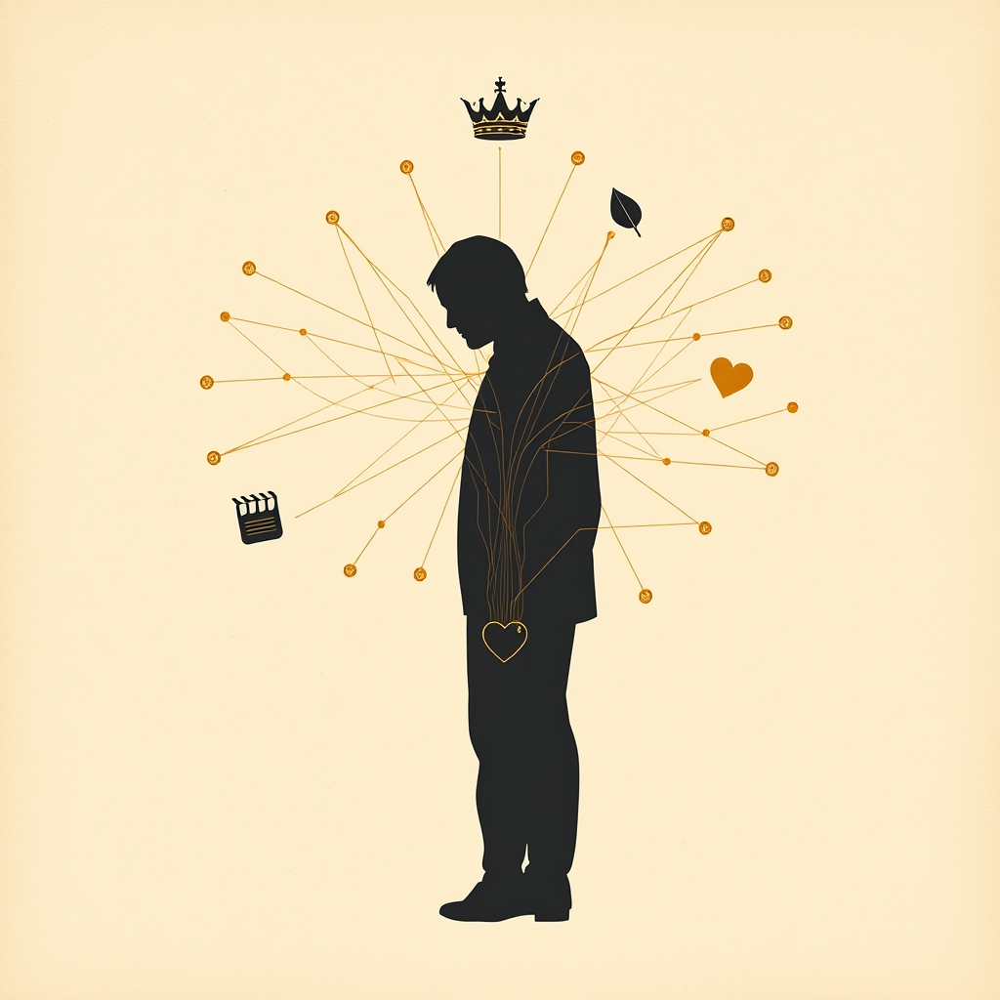

[Home](../index.md) > [Books](./index.md)  
# 👨‍👧‍👦❤️💪 Fatherhood: A History of Love and Power  
  
[🛒 Fatherhood: A History of Love and Power. As an Amazon Associate I earn from qualifying purchases.](https://amzn.to/4e3NtGg)  
  
## 📖 Book Report: 👨‍👧‍👦 Fatherhood: A History of Love and Power  
  
This report examines ✍️ Augustine Sedgewick's book, "👨‍👧‍👦 Fatherhood: A History of Love and Power," which offers a sweeping historical analysis 🕰️ of the concept and practice of fatherhood from the Bronze Age to the present 🎁.  
  
### 📝 Summary  
  
Sedgewick's book delves into the origins 🏛️ and transformations 🔄 of fatherhood throughout Western history 📜, arguing that it is not a static biological role 🧬 but a social construct 🏗️ deeply intertwined with power structures 💪 and evolving notions of masculinity. The author traces this evolution 👣 through the lives of notable historical figures 👤, using their experiences as fathers to illuminate broader societal changes 🌍 and persistent themes. The book challenges ⚔️ conventional understandings of fatherhood by highlighting the often-indistinguishable entanglement of love ❤️ and the exercise of power 💪 within the paternal role across different eras ⏳.  
  
### 🔑 Key Themes  
  
* 🏗️ **The Social Construction of Fatherhood:** The book posits that fatherhood is not merely a biological given 🧬 but has been shaped by cultural 🎭, economic 💰, and political 🏛️ forces over millennia ⏳.  
* ❤️💪 **Love and Power Entangled:** A central argument is the historical fusion 🤝 of the father's loving role ❤️ with his position of power 💪 and authority 👑 within the family 👨‍👩‍👧‍👦 and society 🌍.  
* ♂️ **Evolution of Masculinity:** Sedgewick explores how the expectations and performance of fatherhood have mirrored 🪞 and influenced 💡 the broader historical development of masculinity ♂️.  
* 👨‍🏫 **Emblematic Fathers:** The book utilizes the biographies 📖 of prominent figures such as Aristotle 🏛️, Henry VIII 👑, Charles Darwin 🧬, and Sigmund Freud 🧠 to illustrate key shifts 🔄 and continuities ♾️ in fatherhood.  
* ⚔️ **Challenging Fictions:** The narrative aims to dismantle 💥 idealized or simplistic views of fatherhood by exposing the complex 🧩 and often contradictory ☯️ realities of the role throughout history 📜.  
  
### 🔬 Analysis  
  
"👨‍👧‍👦 Fatherhood: A History of Love and Power" provides an ambitious 🚀 and thought-provoking 🤔 historical perspective 👁️ on a fundamental human experience 🧑‍🤝‍🧑. By examining fatherhood through a historical 📜 and biographical 📖 lens, Sedgewick reveals how deeply ingrained paternal roles are in the fabric of Western civilization 🏛️ and its power structures 💪. The use of well-known historical figures 👤 makes the abstract concept of historical change 🔄 more accessible 🔑 and relatable 🧑‍🤝‍🧑. The book's strength 💪 lies in its broad scope 🔭 and its persistent focus on the interplay 🤝 between the intimate experience of fathering and larger societal forces 🌍, offering a nuanced understanding 🤔 of how the past ⏳ continues to shape contemporary expectations and realities of fatherhood.  
  
## 📚 Additional Book Recommendations on Fatherhood  
  
Here is a selection of books 📚 that offer various perspectives 👁️ on fatherhood, including similar historical/sociological analyses 🔎, contrasting personal accounts 🗣️, and creatively related explorations 🗺️ through fiction ✍️ and memoir.  
  
### 🏛️ Similar Books (History, Sociology, Cultural Analysis)  
  
* ***👨‍👧‍👦 The Modernization of Fatherhood: A Social and Political History*** **by Ralph LaRossa:** A key work 🔑 by a prominent sociologist 🧑‍🏫 in the field, focusing on the evolution 🔄 of American fatherhood, particularly from World War I 🕊️ through the post-WWII era. LaRossa examines how social and economic changes 💰, as well as cultural influences 🎭 like magazines 📰 and the "fathercraft movement," shaped the image and practice of fatherhood.  
* ***⚔️ Of War and Men: World War II in the Lives of Fathers and Their Families*** **by Ralph LaRossa:** Explores the significant impact 💥 of World War II ⚔️ on fathers and families 👨‍👩‍👧‍👦, challenging stereotypes of fathers in the 1950s and examining themes like the effects of combat 💥 and the culture of fear 😨.  
* **[👨‍👩‍👧‍👦🇺🇸 Fatherhood in America: Social Work Perspectives on a Changing Society](./fatherhood-in-america-social-work-perspectives-on-a-changing-society.md)** **by Armon R. Perry**.  
* ***♂️ Making Men into Fathers: Men, Masculinities and the Social Politics of Fatherhood*** **edited by Barbara Hobson:** An academic collection 🧑‍🏫 exploring the social and political aspects of making men into fathers across different contexts 🌍, including discussions on compulsory fatherhood and the fatherhood responsibility movement.  
* ***❤️ Intimate Fatherhood: A Sociological Analysis*** **by Esther Dermott:** This book provides a sociological analysis 🔎 of contemporary fatherhood in Britain 🇬🇧, examining how ideas of "good fatherhood" relate to time use ⏰, finances 💰, emotion ❤️, and policy debates 🏛️, arguing for the centrality of the emotional father-child relationship.  
  
### 🗣️ Contrasting Books (Personal Accounts, Different Perspectives)  
  
* ***🧩 Pops: Fatherhood in Pieces*** **by Michael Chabon:** A collection of essays ✍️ offering a highly personal and often witty 😂 look at the author's experiences as a father. It provides an intimate contrast ☯️ to historical or sociological studies 🔎 by focusing on the subjective reality of modern fatherhood.  
* ***✊ The Beautiful Struggle: A Father, Two Sons and an Unlikely Road to Manhood*** **by Ta-Nehisi Coates:** A memoir exploring the author's relationship with his father 👴, a former Black Panther ✊, and their experiences in inner-city Baltimore. It offers a powerful perspective 👁️ on fatherhood within a specific cultural 🎭 and social context 🌍.  
* ***👶 Raising Raffi: Notes on Fatherhood*** **by Keith Gessen:** A candid memoir about the challenges and realities of co-parenting 🧑‍🤝‍🧑 in the modern era ⏳, providing a look 👁️ at the day-to-day experiences and evolving expectations of involved fatherhood.  
* ***👴 Father and Son*** **by Edmund Gosse:** A classic early 20th-century memoir detailing the difficult relationship between the author and his rigidly religious father ✝️. It offers a historical personal account 📜 that contrasts ☯️ with contemporary narratives of fatherhood.  
* ***👨🏿‍🦱 The Myth of the Missing Black Father*** **by Roberta Coles:** This book challenges ⚔️ the common stereotype of absent Black fathers 👨🏿‍🦱, providing a more nuanced look 👁️ at the roles and contributions of Black men in their children's lives, often in the face of systemic challenges 🚧.  
  
### 🎭 Creatively Related Books (Fiction and Essay Collections)  
  
* ***🛣️ The Road*** **by Cormac McCarthy:** While dystopian fiction 🤖, this novel features a powerful and poignant portrayal ❤️ of the bond between a father and son in a survival setting 🏕️, highlighting themes of protection 🛡️, love ❤️, and hope ✨ amidst despair 😔.  
* ***🕊️ To Kill a Mockingbird*** **by Harper Lee:** Features one of the most beloved father figures 👨‍👧‍👦 in literature 📚, Atticus Finch, who embodies integrity, moral courage 💪, and dedicated parenting in the face of prejudice 💔.  
* ***✍️ Stories of Fatherhood*** **edited by Diana Secker Tesdell:** An anthology of short stories ✍️ by various acclaimed authors exploring diverse fictional takes 🎭 on paternity, including themes of having, becoming, loving ❤️, and losing fathers.  
* ***✉️ Gilead*** **by Marilynne Robinson:** Written as a letter ✉️ from an elderly father to his young son, this novel is a meditative exploration of family history 👨‍👩‍👧‍👦, faith 🙏, and the complexities of a father's legacy 📜.  
* ***🍻 The Tender Bar*** **by J.R. Moehringer:** A memoir about growing up without a biological father but finding father figures among the patrons of a local bar 🍻. It explores the idea of chosen family 👨‍👩‍👧‍👦 and the different forms that paternal guidance can take.  
  
## 💬 [Gemini](../software/gemini.md) Prompt (gemini-2.5-flash-preview-04-17)  
> Write a markdown-formatted (start headings at level H2) book report, followed by a plethora of additional similar, contrasting, and creatively related book recommendations on Fatherhood: A History of Love and Power. Be thorough in content discussed but concise and economical with your language. Structure the report with section headings and bulleted lists to avoid long blocks of text.  
  
## 🐦 Tweet  
<blockquote class="twitter-tweet" data-theme="dark">
👨‍👧‍👦❤️💪 Fatherhood: A History of Love and Power  🏛️ Western History | ♂️ Masculinity | 👪 Social Role | 👑 Authority | 👤 Historical Figures<a href="https://t.co/suKBejIIPR">https://t.co/suKBejIIPR</a>
&mdash; Bryan Grounds (@bagrounds) <a href="https://twitter.com/bagrounds/status/1934366432302961148?ref_src=twsrc%5Etfw">June 15, 2025</a></blockquote> 