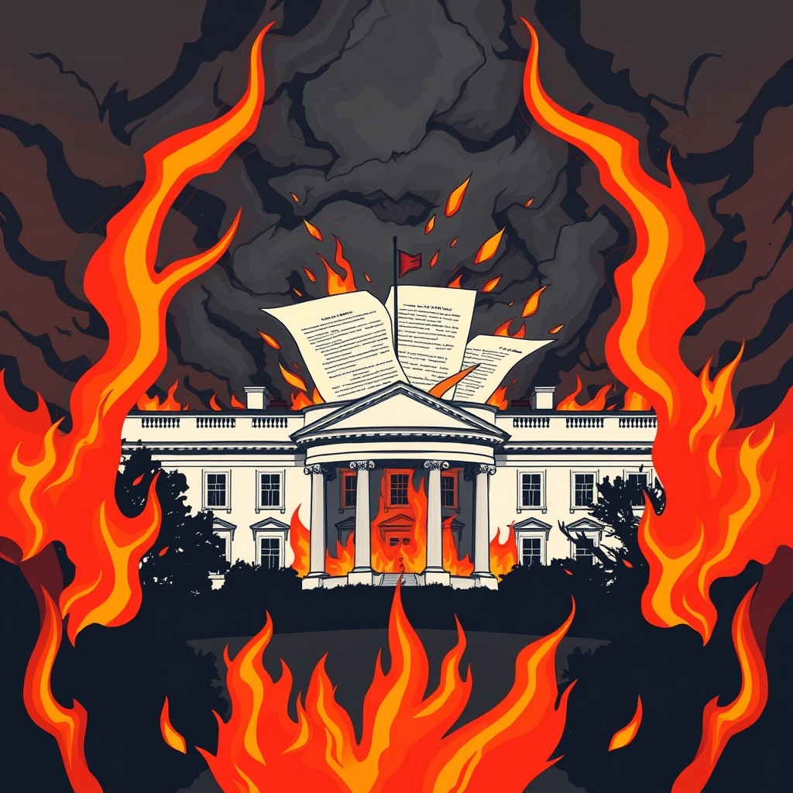

[Home](../index.md) > [Books](./index.md)  
# 🔥💣💥😡🤬 Fire and Fury: Inside the Trump White House  
  
[🛒 Fire and Fury: Inside the Trump White House. As an Amazon Associate I earn from qualifying purchases.](https://amzn.to/44dqshb)  
  
## 📖 Book Report: 🔥 Fire and Fury: Inside the Trump White House  
  
### 📝 Summary  
  
📖 "Fire and Fury: Inside the Trump White House" by Michael Wolff provides a controversial, behind-the-scenes account of the first year of 🇺🇸 Donald Trump's presidency. 🗣️ Based on extensive access and interviews, the book portrays a 😵 chaotic and dysfunctional White House populated by staffers who largely viewed the 👨‍💼 President as unfit for office. ⚔️ It details infighting among senior advisors like Steve Bannon, Reince Priebus, and Jared Kushner, and depicts Trump as easily influenced, often disengaged from policy, and driven by impulse and a need for validation. 🗓️ The narrative covers key early events, including the transition, the ➡️ firing of James Comey, and the initial responses to major policy challenges.  
  
### 🔑 Key Themes/Points  
  
* 😵‍💫 **Chaos and Dysfunction:** 🌪️ A central theme is the pervasive disarray within the White House during the initial year.  
* 🤔 **Staff Perceptions of Trump:** 👎 The book highlights the low regard many of Trump's own staff members allegedly held for his capabilities and grasp of policy.  
* 💥 **Internal Conflicts:** 🥊 Significant attention is given to the power struggles and rivalries between key figures like Steve Bannon and Jared Kushner.  
* 🎭 **Trump's Behavior and Style:** 🤳 Wolff describes Trump as impulsive, unpredictable, self-centered, and often reliant on superficial information rather than detailed briefings.  
* 🤯 **The Unlikely Presidency:** 😲 The book suggests that Trump and his campaign team were surprised by his victory and largely unprepared to govern.  
  
### 📰 Impact and Reception  
  
📢 Upon its release, "Fire and Fury" generated immediate and widespread media attention, partly due to the 🛡️ Trump administration's attempts to block its publication. 🥇 It quickly became a number one bestseller. ✍️ While reviewers acknowledged the book's juicy anecdotes and portrayal of a chaotic White House, 🤔 many expressed skepticism regarding the accuracy and sourcing of some specific claims. 🧐 Critics noted Wolff's history and questioned his methodology and the reliability of his unnamed sources. 💭 Despite criticism, the book's general picture of a turbulent early Trump presidency resonated with existing media reports and public perception for many.  
  
### ✍️ Author's Perspective/Methodology  
  
🎤 Michael Wolff, a journalist, claims to have conducted over 200 interviews with 🗣️ Donald Trump and White House staff and had extensive access to the West Wing, allowing him to observe events firsthand. 🎧 He reportedly audio-taped some conversations. 🕵️ His approach is characterized by an immersive, albeit controversial, fly-on-the-wall style aiming to capture the atmosphere and interactions within the administration.  
  
## 📚 Additional Book Recommendations  
  
### 📖 Similar Books (Focus on Trump Administration/Politics)  
  
* **[😱🤡🇺🇸 Fear: Trump in the White House](./fear.md) by Bob Woodward:** ⚖️ Similar to "Fire and Fury" in its focus on the internal dynamics and perceived dysfunction of the Trump White House, but generally regarded as more rigorously reported by a veteran investigative journalist.  
* **[⬆️🤥🏛️ A Higher Loyalty: Truth, Lies, and Leadership](./a-higher-loyalty-truth-lies-and-leadership.md) by James Comey:** 🕵️ Offers a firsthand account from the perspective of the former FBI Director who was fired by Trump, providing an insider's view of interactions with the President and the political climate.  
* 📖 **The Divider: Trump in the White House, 2017-2021 by Peter Baker and Susan Glasser:** 🗓️ Provides an extensive account covering the entire Trump presidency, offering a broad historical perspective based on numerous interviews.  
* **[👹🐍🛢️🇺🇸 Confidence Man: The Making of Donald Trump and the Breaking of America](./confidence-man-the-making-of-donald-trump-and-the-breaking-of-america.md) by Maggie Haberman:** 👤 Written by a long-time Trump observer, this book delves into Trump's background and career, providing context for his presidency based on deep sourcing.  
* 📖 **Unhinged: An Insider's Account of the Trump White House by Omarosa Manigault Newman:** 😠 Another tell-all from a former White House insider, offering a highly critical perspective on the President and his administration.  
  
### 📖 Contrasting Books (Different perspectives on Trump/Politics)  
  
* 📖 **Fifteen Years A Deplorable: A White House Memoir by Mike McCormick:** 👍 Written by a former White House stenographer, this book offers a pro-Trump perspective, focusing on perceived media bias and providing a different insider's view of events.  
* 📖 **Let Trump Be Trump: The Inside Story of His Rise to the Presidency by Corey Lewandowski and David Bossie:** 🎉 Written by former Trump campaign officials, this book presents a more favorable portrayal of Trump and his political rise.  
* 📖 **The Presidency of Donald J. Trump: A First Historical Assessment edited by Julian E. Zelizer:** 🎓 This book offers a more academic and varied assessment of the Trump presidency, featuring contributions from scholars with different perspectives, providing a contrast to journalistic narratives.  
  
### 💡 Creatively Related Books (Broader themes of presidency, media, etc.)  
  
* 📖 **All the President's Men by Bob Woodward and Carl Bernstein:** 📰 A classic of investigative journalism detailing the Watergate scandal. While about a different era, it's relevant for its focus on White House reporting, power, and political upheaval.  
* 📖 **The Man Who Owns the News: Inside the Secret World of Rupert Murdoch by Michael Wolff:** 📰 Another book by Michael Wolff that examines a powerful media figure, relevant for understanding the media landscape Trump operated within and Wolff's own focus.  
* 📖 **Behind the White House Curtain: A Senior Journalist's Story of Covering the President—and Why It Matters by Steven L Herman:** 🎤 Offers a perspective on covering the Trump White House from the viewpoint of a nonpartisan journalist, highlighting the challenges faced by the press during this period.  
* 📖 **The Last Politician: Inside Joe Biden's White House and the Struggle for America's Future by Franklin Foer:** 🇺🇸 Provides an insider account of the subsequent presidency, offering a point of comparison in terms of White House operations, challenges, and leadership style.  
* **[🏭🫡 Manufacturing Consent: The Political Economy of the Mass Media](./manufacturing-consent.md) by Edward S. Herman and Noam Chomsky:** 📚 While a more academic text, it provides a critical framework for analyzing how media operates and shapes public perception, offering a broader context for understanding the media dynamics described in "Fire and Fury."  
  
## 💬 [Gemini](../software/gemini.md) Prompt (gemini-2.5-flash-preview-04-17)  
> Write a markdown-formatted (start headings at level H2) book report, followed by a plethora of additional similar, contrasting, and creatively related book recommendations on Fire and Fury: Inside the Trump White House. Be thorough in content discussed but concise and economical with your language. Structure the report with section headings and bulleted lists to avoid long blocks of text.  
  
## 🐦 Tweet  
<blockquote class="twitter-tweet" data-theme="dark">
🔥💣💥😡🤬 Fire and Fury: Inside the Trump White House by <a href="https://twitter.com/MichaelWolffNYC?ref_src=twsrc%5Etfw">@MichaelWolffNYC</a>  🇺🇸📉 <a href="https://twitter.com/realDonaldTrump?ref_src=twsrc%5Etfw">@realDonaldTrump</a>&#39;s 1st Presidency | 🏛️ White House Dynamics | 🌪️ Chaos and Dysfunction | 🥴 Extreme Incompetence | 🗣️ Staff Opinions | 🥊 Internal Conflicts<a href="https://t.co/s3a89Vc8zn">https://t.co/s3a89Vc8zn</a>
&mdash; Bryan Grounds (@bagrounds) <a href="https://twitter.com/bagrounds/status/1938266897491087713?ref_src=twsrc%5Etfw">June 26, 2025</a></blockquote> 