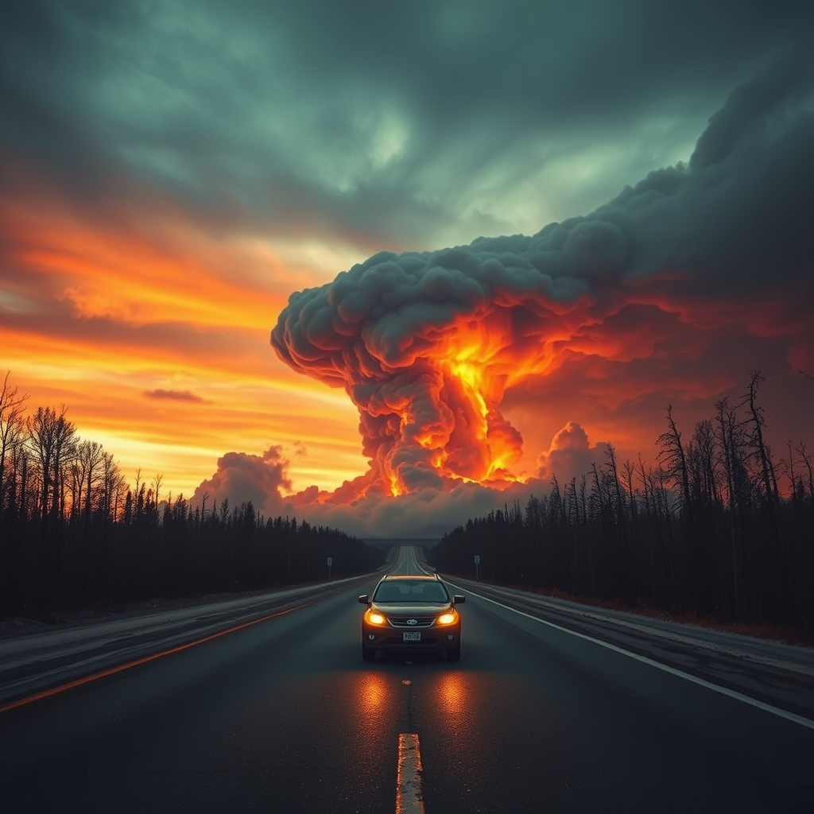

[🏡 Home](../index.md) > [📚 Books](./index.md)  
# 🔥⛈️ Fire Weather: A True Story from a Hotter World  
  
[🛒 Fire Weather: A True Story from a Hotter World. As an Amazon Associate I earn from qualifying purchases.](https://amzn.to/3JIwH4B)  
  
## 📚 Book Report: 🔥 Fire Weather: A True Story from a Hotter World  
  
### ✍️ Author  
🧑‍Author: John Vaillant  
  
### 📖 Genre  
📚 Genre: Narrative Non-fiction, 🧪 Environmental Science, 🌡️ Climate Change  
  
### ℹ️ Summary  
* 🔥 **Central Event:** Details the catastrophic May 2016 wildfire that engulfed Fort McMurray, Alberta, Canada, the hub of the Canadian oil sands industry.  
* 🗣️ **Narrative Focus:** Chronicles the harrowing experiences of residents during the sudden, massive evacuation (the largest single-day evacuation due to fire) and the efforts of firefighters battling an unprecedented blaze.  
* 🌍 **Broader Context:** Interweaves the fire's story with the history of fire's relationship with humanity, the development and impact of the fossil fuel industry (particularly Alberta's oil sands), the science of combustion, and the escalating threat of extreme wildfires in the era of climate change. Vaillant explores how the very industry driving Fort McMurray's economy contributed to the fire weather conditions that enabled the disaster.  
* 🗺️ **Scope:** Uses the Fort McMurray fire as a specific, terrifying case study to illustrate a global phenomenon – the arrival of the Pyrocene, an age defined by fire exacerbated by climate change.  
  
### 🔑 Key Themes  
* 🌡️ **Climate Change:** Demonstrates the tangible, destructive impacts of a warming planet on weather patterns and fire behavior.  
* 🛢️ **Fossil Fuels and Environment:** Explores the complex and often destructive relationship between resource extraction (specifically oil) and environmental catastrophe, highlighting the irony of the fire striking the heart of Canada's oil industry.  
* 🔥 **Modern Wildfires:** Describes the unique characteristics and uncontrollable nature of 21st-century megafires fueled by hotter, drier conditions and changes in the landscape.  
* 🧑‍🤝‍🧑🔥 **Humanity and Fire:** Examines the long, intertwined history of humans and fire, from an essential tool for civilization to an existential threat in the Petrocene Age.  
* 🤔 **Cognitive Dissonance & Inaction:** Addresses the human tendency towards inertia and denial even when faced with clear and present danger, both individually during the fire and collectively regarding climate action.  
* 💪 **Resilience and Vulnerability:** Showcases the extraordinary resilience of the evacuated community and first responders, while starkly illustrating human vulnerability to climate-driven disasters.  
  
### 🧐 Analysis  
* 👍 **Strengths:** Vaillant masterfully blends meticulous research, scientific explanation, historical context, and gripping, cinematic storytelling. The book effectively uses the Fort McMurray disaster as a microcosm to convey the urgency and scale of the global climate crisis. Its detailed portrayal of the fire itself is both terrifying and illuminating.  
* 🏆 **Recognition:** The book has received significant acclaim, winning the Baillie Gifford Prize for Non-fiction and being a finalist for the National Book Award for Nonfiction and the Pulitzer Prize for General Nonfiction.  
* 👎 **Critique:** Some readers might find the density of information across various fields (history, science, economics) demanding. Some critics have noted a potential lack of focus on individual human characters amidst the larger scientific and historical scope.  
  
### 🎯 Target Audience  
* 🌍 Readers interested in climate change, 🧪 environmental science, and 📰 disaster reporting.  
* 💡 Those seeking to understand the complex interplay between energy, industry, and the environment.  
* 📖 Fans of deeply researched, compelling narrative non-fiction.  
* 😟 Anyone concerned about the future impacts of a warming world.  
  
## 📚 Further Reading Recommendations  
  
### 📖 Similar Reads (Wildfires, Climate Change, Environmental Disasters)  
* 🔥 **_The Heat Will Kill You First: Life and Death on a Scorched Planet_** by Jeff Goodell: Explores the profound and often underestimated impacts of extreme heat driven by climate change.  
* 🌍 **_The Uninhabitable Earth: Life After Warming_** by David Wallace-Wells: A stark look at the potential cascading consequences of climate change across various aspects of life.  
* 🏠 **_The Great Displacement: Climate Change and the Next American Migration_** by Jake Bittle: Examines how climate impacts like wildfires, floods, and droughts are already forcing people to move within the US.  
* 🌲 **_Fire Season: Field Notes from a Wilderness Lookout_** by Philip Connors: A memoir offering a different perspective on fire, from the solitude of a fire lookout tower.  
* ⚡ **_California Burning: The Fall of Pacific Gas and Electric--and What It Means for America's Power Grid_** by Katherine Blunt: Investigates the role of utility infrastructure and management in California's devastating wildfires.  
* 🗣️ **_Before It's Gone: Stories from the Front Lines of Climate Change in Small-Town America_** by Jonathan Vigliotti: Journalistic accounts of various climate disasters impacting communities across the US.  
  
### ⚖️ Contrasting Perspectives (Resilience, Different Disasters, Critiques)  
* 🏜️ **_The Worst Hard Time_** by Timothy Egan: Chronicles the human experience and environmental factors of the Dust Bowl, another major North American ecological disaster driven by human activity and climate patterns.  
* 🌪️ **_Isaac's Storm_** by Erik Larson: Narrative non-fiction about the 1900 Galveston hurricane, focusing on meteorological hubris and the human cost of underestimating nature.  
* 🏥 **_Five Days at Memorial_** by Sheri Fink: Examines the harrowing ethical decisions made at a New Orleans hospital during Hurricane Katrina, focusing on human systems under extreme stress.  
* 💰 **_This Changes Everything: Capitalism vs. The Climate_** by Naomi Klein: Argues that the climate crisis requires a fundamental restructuring of our economic system.  
* **[💰🤥 Merchants of Doubt](./merchants-of-doubt.md)** by Naomi Oreskes & Erik M. Conway: Exposes the campaigns designed to obscure the scientific consensus on climate change and other health/environmental issues.  
* **[⛔🌎🔚 Not the End of the World: How We Can Be the First Generation to Build a Sustainable Planet](./not-the-end-of-the-world.md)** by Hannah Ritchie: Offers a data-driven, more optimistic perspective on environmental problems and potential solutions.  
  
### ✨ Creatively Related (Narrative Non-fiction Style, Human Psychology, Resource History)  
* 🐅 **_The Tiger: A True Story of Vengeance and Survival_** by John Vaillant: Another gripping narrative non-fiction work by the same author, exploring human-wildlife conflict in Russia's Far East.  
* 🌲 **_The Golden Spruce: A True Story of Myth, Madness, and Greed_** by John Vaillant: Vaillant's earlier work about a unique tree and the conflict over logging in British Columbia.  
* 🌊 **_The Johnstown Flood_** by David McCullough: Classic historical narrative detailing the 1889 dam failure and subsequent flood, known for its meticulous research and compelling storytelling.  
* ⛰️ **_Into Thin Air_** by Jon Krakauer: A first-person account of the 1996 Mount Everest disaster, exploring human ambition and failure in extreme environments.  
* 🦆 **_Ducks: Two Years in the Oil Sands_** by Kate Beaton: A graphic novel memoir offering a personal, ground-level perspective on life working in the Fort McMurray oil sands, touching on social and environmental costs.  
* 🧠 **_Active Hope: How to Face the Mess We're In with Unexpected Resilience and Creative Power_** by Joanna Macy & Chris Johnstone: Explores psychological and spiritual tools for dealing with overwhelming global crises like climate change.  
* 💧 **_Running Out: In Search of Water on the High Plains_** by Lucas Bessire: Blends memoir and reporting to explore the depletion of the Ogallala Aquifer and its impact on family and place.  
  
## 💬 [Gemini](../software/gemini.md) Prompt (gemini-2.5-pro-exp-03-25)  
> Write a markdown-formatted (start headings at level H2) book report, followed by a plethora of additional similar, contrasting, and creatively related book recommendations on Fire Weather. Be thorough in content discussed but concise and economical with your language. Structure the report with section headings and bulleted lists to avoid long blocks of text.  
  
## 🐘 Mastodon    
<blockquote class="mastodon-embed" data-embed-url="https://mastodon.social/@bagrounds/116484941572434357/embed" style="background: #282c37; border-radius: 8px; border: 1px solid #393f4f; margin: 0; max-width: 540px; min-width: 270px; overflow: hidden; padding: 0;"> <a href="https://mastodon.social/@bagrounds/116484941572434357" target="_blank" style="align-items: center; color: #d9e1e8; display: flex; flex-direction: column; font-family: system-ui, -apple-system, BlinkMacSystemFont, 'Segoe UI', Oxygen, Ubuntu, Cantarell, 'Fira Sans', 'Droid Sans', 'Helvetica Neue', Roboto, sans-serif; font-size: 14px; justify-content: center; letter-spacing: 0.25px; line-height: 20px; padding: 24px; text-decoration: none;"> <svg xmlns="http://www.w3.org/2000/svg" xmlns:xlink="http://www.w3.org/1999/xlink" width="32" height="32" viewBox="0 0 79 75"><path d="M63 45.3v-20c0-4.1-1-7.3-3.2-9.7-2.1-2.4-5-3.7-8.5-3.7-4.1 0-7.2 1.6-9.3 4.7l-2 3.3-2-3.3c-2-3.1-5.1-4.7-9.2-4.7-3.5 0-6.4 1.3-8.6 3.7-2.1 2.4-3.1 5.6-3.1 9.7v20h8V25.9c0-4.1 1.7-6.2 5.2-6.2 3.8 0 5.8 2.5 5.8 7.4V37.7H44V27.1c0-4.9 1.9-7.4 5.8-7.4 3.5 0 5.2 2.1 5.2 6.2V45.3h8ZM74.7 16.6c.6 6 .1 15.7.1 17.3 0 .5-.1 4.8-.1 5.3-.7 11.5-8 16-15.6 17.5-.1 0-.2 0-.3 0-4.9 1-10 1.2-14.9 1.4-1.2 0-2.4 0-3.6 0-4.8 0-9.7-.6-14.4-1.7-.1 0-.1 0-.1 0s-.1 0-.1 0 0 .1 0 .1 0 0 0 0c.1 1.6.4 3.1 1 4.5.6 1.7 2.9 5.7 11.4 5.7 5 0 9.9-.6 14.8-1.7 0 0 0 0 0 0 .1 0 .1 0 .1 0 0 .1 0 .1 0 .1.1 0 .1 0 .1.1v5.6s0 .1-.1.1c0 0 0 0 0 .1-1.6 1.1-3.7 1.7-5.6 2.3-.8.3-1.6.5-2.4.7-7.5 1.7-15.4 1.3-22.7-1.2-6.8-2.4-13.8-8.2-15.5-15.2-.9-3.8-1.6-7.6-1.9-11.5-.6-5.8-.6-11.7-.8-17.5C3.9 24.5 4 20 4.9 16 6.7 7.9 14.1 2.2 22.3 1c1.4-.2 4.1-1 16.5-1h.1C51.4 0 56.7.8 58.1 1c8.4 1.2 15.5 7.5 16.6 15.6Z" fill="currentColor"/></svg> 
Post by @bagrounds@mastodon.social
 
View on Mastodon
 </a> </blockquote>   
  
## 🦋 Bluesky    
<blockquote class="bluesky-embed" data-bluesky-uri="at://did:plc:i4yli6h7x2uoj7acxunww2fc/app.bsky.feed.post/3mklyg6ndzp2v" data-bluesky-cid="bafyreiexwyzkk5bx7eitqik7jb3v5ufo2jrpj5afth4rawjmyz4vibcoqa">
🔥⛈️ Fire Weather: A True Story from a Hotter World  
  
#AI Q: 🔥 Have extreme fires changed your view on climate action?  
  
🌡️ Climate Impacts | 🔥 Wildfires | 🛢️ Fossil Fuels | 📚 Narrative Non-fiction  
https://bagrounds.org/books/fire-weather
&mdash; <a href="https://bsky.app/profile/did:plc:i4yli6h7x2uoj7acxunww2fc?ref_src=embed">Bryan Grounds (@bagrounds.bsky.social)</a> <a href="https://bsky.app/profile/did:plc:i4yli6h7x2uoj7acxunww2fc/post/3mklyg6ndzp2v?ref_src=embed">2026-04-29T01:52:05.000Z</a></blockquote>