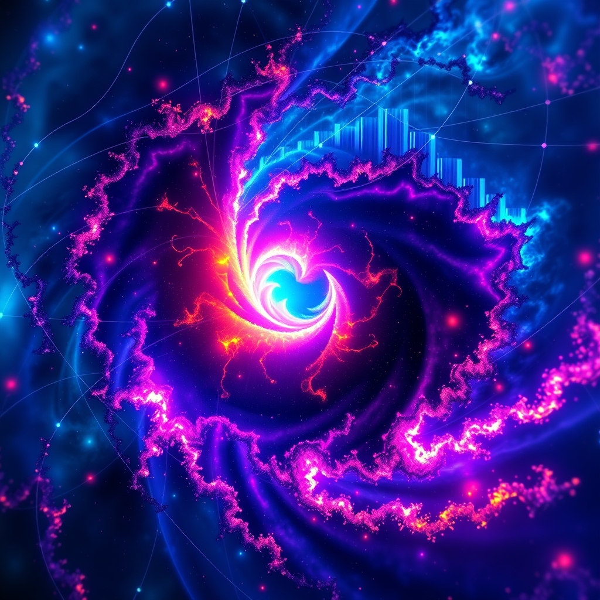

[Home](../index.md) > [Books](./index.md)  
# ♾️〰️📊 Fractals, Chaos, Power Laws: Minutes from an Infinite Paradise  
  
[🛒 Fractals, Chaos, Power Laws: Minutes from an Infinite Paradise. As an Amazon Associate I earn from qualifying purchases.](https://amzn.to/486VNUA)  
  
✨🌌💡 Connect fractals, chaos theory, and power laws, revealing universal self-similarity and underlying order in nature's seemingly infinite complexities, from art to finance.  
  
## 🤖 AI Summary  
  
### 🤖 Core Philosophy  
* **💫 Self-Similarity & Scaling:** Fundamental principle governing natural phenomena and human thought.  
* **🌀 Order in Chaos:** Deterministic systems, despite high sensitivity to initial conditions, exhibit underlying patterns and feedback loops.  
* **🔗 Interdisciplinary Connections:** Mathematics, physics, biology, music, finance, and art all reveal these fundamental laws.  
  
### 🔑 Key Concepts  
* **🌲 Fractals:** Infinitely complex, self-similar patterns across scales. Fractional dimensions.  
    * 🌱 Examples: Coastlines, snowflakes, trees, clouds, Mandelbrot set.  
* **🌪️ Chaos Theory:** Study of unpredictable, nonlinear, deterministic dynamical systems.  
    * **🦋 Sensitive Dependence:** Butterfly effect – small changes yield large divergences.  
    * **🌌 Strange Attractors:** Orbits in phase space with fractal structure, never repeating.  
* **📈 Power Laws:** Scale-invariant distributions where frequency of an event varies as a power of its size.  
    * 📊 No single average value; PDF is a straight line on log-log plot.  
    * 🌍 Examples: Earthquake magnitudes, word frequencies, city sizes.  
  
### ✅ Actionable Insights  
* **👁️ Pattern Recognition:** Seek self-similar patterns and scaling behavior in complex data.  
* **⚙️ System Dynamics:** Understand that systems with feedback can become chaotic, limiting long-term prediction but revealing inherent stability.  
* **🌍 Interdisciplinary Perspective:** Apply concepts from one field (e.g., physics) to understand phenomena in others (e.g., biology, finance).  
* **💻 Visual Exploration:** Utilize computer graphics to explore fractal geometry and chaotic attractors.  
  
## ⚖️ Evaluation  
  
* **🌍 Broad and Interdisciplinary:** The book offers a sweeping tour through psychophysics, quasicrystals, gambling, Bach concertos, Cantor sets, and concert hall design, illustrating connections between chaos theory, physics, biology, and mathematics.  
* **📖 Engaging and Accessible:** Schroeder's good-natured, humorous presentation, puns, and puzzles make abstract mathematics relatable to everyday experience. It's an inviting exposition for a literate but not highly scientific audience, forming a fine university-level introduction for those with algebra and some calculus.  
* **🎨 Richness of Illustrations:** Award-winning computer graphics, optical illusions, and numerous color and black-and-white illustrations clarify complex concepts.  
* **🧱 Foundational Text:** Described as a classic and foundational text in nonlinear science, providing an accessible introduction to complex systems mathematics.  
* **📚 Comparison to Other Works:** Resembles Mandelbrot's 1982 classic, [♾️🌿🔬 The Fractal Geometry of Nature](./the-fractal-geometry-of-nature.md), but is pitched at a broader audience and functions almost as a survey of the first decade's response to that manifesto.  
* **🔬 Scientific Validity:** The concepts of fractals, chaos theory, and power laws are widely accepted in scientific research for modeling irregular natural shapes and complex systems, including weather prediction, biological systems, financial markets, and ecological dynamics.  
* **📉 Limitations of Predictability:** Chaos theory highlights that while systems can be deterministic, their extreme sensitivity to initial conditions makes long-term prediction practically impossible, despite the presence of underlying patterns.  
* **↔️ Depth vs. Breadth:** While comprehensive in its range, some reviewers note that sections are only a few pages long, outlining aspects rather than systematically developing a body of theory, which might be dense in places.  
  
## 🔍 Topics for Further Understanding  
  
* **♾️ Multifractals and Scaling Exponents:** Deeper analysis of systems with varying fractal dimensions.  
* **🖥️ Computational Methods in Chaos:** Advanced algorithms for simulating chaotic systems and generating fractal images.  
* **🤖 Applications in Machine Learning:** How fractal dimensions and chaotic dynamics inform feature engineering or model interpretability.  
* **⚛️ Quantum Chaos:** Exploring chaotic behavior in quantum mechanical systems.  
* **🕸️ Network Theory and Complex Systems:** The role of power laws in the structure and dynamics of complex networks (e.g., social, biological).  
* **👾 Cellular Automata:** Discrete dynamical systems exhibiting complex, often chaotic and fractal, behavior.  
  
## ❓ Frequently Asked Questions (FAQ)  
  
### 💡 Q: What is Fractals, Chaos, Power Laws: Minutes from an Infinite Paradise about?  
✅ A:  Fractals, Chaos, Power Laws: Minutes from an Infinite Paradise by Manfred Schroeder explores the interconnected concepts of fractals, chaos theory, and power laws, demonstrating their pervasive presence and underlying order in diverse fields from physics and biology to music and art.  
  
### 💡 Q: Who is Manfred Schroeder, the author of Fractals, Chaos, Power Laws?  
✅ A: Manfred Schroeder (1926–2009) was a German physicist, a world-renowned authority on acoustics, and a distinguished member of the research staff at Bell Labs and Professor Emeritus at the University of Göttingen. He was hailed by Publishers Weekly as a modern Lewis Carroll for his engaging writing style.  
  
### 💡 Q: What are fractals as discussed in Fractals, Chaos, Power Laws?  
✅ A: Fractals are infinitely complex patterns that exhibit self-similarity across different scales. They often have non-integer, or fractional, dimensions and are found in natural shapes like coastlines, mountains, trees, and clouds, and arise from chaotic processes.  
  
### 💡 Q: How does Chaos Theory relate to Fractals, Chaos, Power Laws?  
✅ A: Chaos theory, a core topic in Fractals, Chaos, Power Laws, is the interdisciplinary study of deterministic dynamical systems that are highly sensitive to initial conditions, leading to seemingly unpredictable, irregular, yet patterned behavior. Fractals are often the visual identities or remnants of chaotic processes, as seen in strange attractors.  
  
### 💡 Q: What are power laws in the context of Fractals, Chaos, Power Laws?  
✅ A: Power laws describe a relationship where one quantity varies as a power of another, often resulting in distributions where a few large events are common, and many small events are rare. This book explores their prevalence in natural and social systems, where data cannot be meaningfully characterized by a simple average.  
  
### 💡 Q: Who is the target audience for Fractals, Chaos, Power Laws: Minutes from an Infinite Paradise?  
✅ A: The book is aimed at a literate but not highly scientific audience, particularly physicists, engineers, and other scientists with a mathematical background, including a grasp of algebra and some calculus. It serves as an excellent university-level introduction to fractal math and chaotic dynamics.  
  
## 📚 Book Recommendations  
  
### 📖 Similar Books  
* The Fractal Geometry of Nature by Benoit B. Mandelbrot  
* [🌪️💥🦋🆕 Chaos: Making a New Science](./chaos.md) by James Gleick  
* [💥🌀➡️⏳⚖️🕰️ ️ Sync: How Order Emerges From Chaos In The Universe, Nature, And Daily Life](./sync.md) by Steven Strogatz  
  
### ⚖️ Contrasting Books  
* The Drunkard's Walk: How Randomness Rules Our Lives by Leonard Mlodinow (focus on true randomness vs. deterministic chaos)  
* [🗺️❤️📐 Flatland: A Romance of Many Dimensions](./flatland-a-romance-of-many-dimensions.md) by Edwin A. Abbott (explores dimensions from a different, narrative perspective)  
  
### ➕ Related Books  
* [🔫🦠🔩 Guns, Germs, and Steel: The Fates of Human Societies](./guns-germs-and-steel-the-fates-of-human-societies.md) by Jared Diamond (macro-level patterns and their complex interactions)  
* The Elegant Universe by Brian Greene (exploring fundamental laws of physics and reality)  
* [🤔🐇🐢 Thinking, Fast and Slow](./thinking-fast-and-slow.md) by Daniel Kahneman (human decision-making and cognitive biases, which often involve non-linear and seemingly chaotic elements)  
  
## 🫵 What Do You Think?  
  
Which concept - fractals, chaos, or power laws - is most compelling? Where have you observed these patterns?