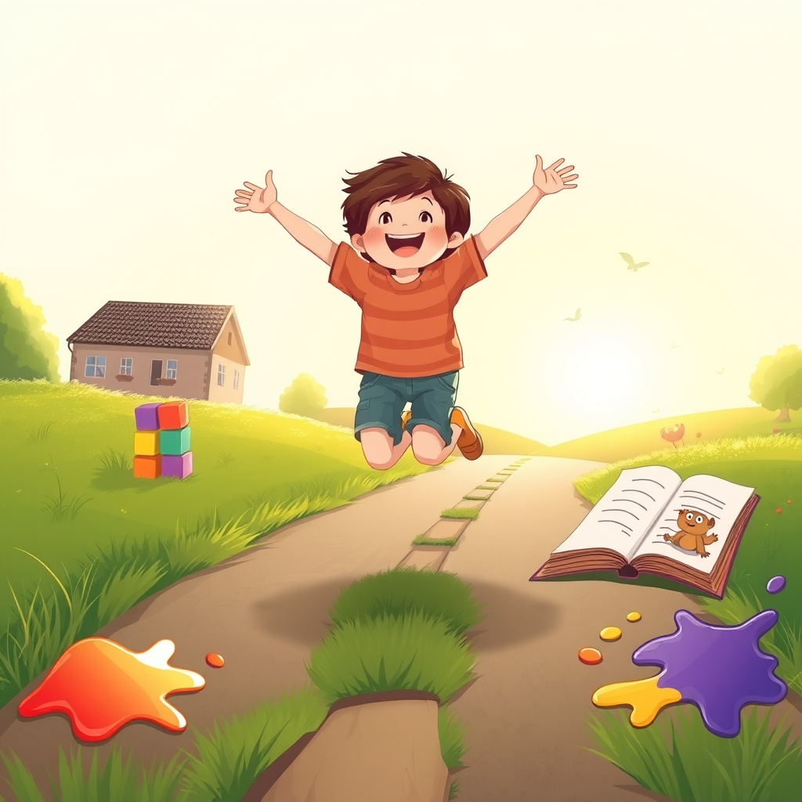

[Home](../index.md) > [Books](./index.md)  
# 🧒🎮 Free to Learn: Why Unleashing the Instinct to Play Will Make Our Children Happier, More Self-Reliant, and Better Students for Life  
  
[🛒 Free to Learn: Why Unleashing the Instinct to Play Will Make Our Children Happier, More Self-Reliant, and Better Students for Life. As an Amazon Associate I earn from qualifying purchases.](https://amzn.to/4o3eqNV)  
  
🤸‍♀️ Advocate for children's innate drive to learn through self-directed play. Compulsory schooling stifles curiosity and self-reliance, leading to calls for educational reform that prioritizes freedom and joy. 📚✨  
  
## 🏆 Peter Gray's Self-Directed Learning Strategy  
  
### 🧠 Core Philosophy  
* 🧠 **Innate Learning Drive:** Children born with curiosity, biologically predisposed to self-educate.  
* 🧩 **Play as Primary Means:** Free, self-directed play is crucial for developing problem-solving, social skills, emotional resilience, and control over one's life.  
* 🏫 **Critique of Compulsory Schooling:** Traditional education stifles natural development, independence, and intrinsic motivation through rigid structures, forced learning, and constant evaluation.  
* 🐒 **Evolutionary Perspective:** Draws parallels to hunter-gatherer societies where children learn through observation, imitation, and age-mixed play.  
  
### 🛠️ Actionable Principles  
* 🧑‍🏫 **Grant Autonomy:** Allow children to choose learning paths, pursue interests at their own pace.  
* 💪 **Foster Self-Reliance:** Empower children to make decisions, take risks, and learn from mistakes without excessive adult interference.  
* 🏞️ **Create Play-Rich Environments:** Provide opportunities for unstructured play and exploration.  
* 💖 **Embrace Trustful Parenting:** Trust children's natural abilities; provide sustenance, love, respect, and environmental conditions for development, not constant direction.  
* 📣 **Advocate for Alternatives:** Support educational models like Sudbury Valley School that prioritize self-directed learning.  
  
## ⚖️ Critical Evaluation  
  
* 🧪 **Evidence for Free Play Benefits:** Extensive research supports the benefits of unstructured play for cognitive, social, emotional, and physical development, aligning with Gray's core premise. Play enhances problem-solving, creativity, social interaction, emotional regulation, and self-confidence.  
* 👎 **Critique of Traditional Schooling Validated:** Many sources acknowledge that rigid, structured academic environments can reduce intrinsic motivation and lead to stress and anxiety in children. The decline in free play is linked to a rise in mental health issues among young people.  
* 🎭 **Balance Between Play and Structure:** While Gray champions free play, some educators suggest a blended approach, recognizing that structured learning can also teach discipline and foundational academic skills. The debate is often framed as a false dichotomy, as play and learning are inextricably interwoven, with both contributing to holistic development.  
* 👪 **Free-Range Parenting Considerations:** Gray's advocacy for children's autonomy aligns with free-range parenting concepts. However, critics of free-range parenting point to potential risks, legal issues depending on location, and the need for parents to assess a child's developmental readiness and provide essential skills for navigating unsupervised situations.  
* ✍️ **Reliance on Anecdotal Evidence and Idealization:** Some reviewers note Gray's reliance on anecdotal evidence and idealization of hunter-gatherer societies, suggesting that while compelling, his arguments could benefit from more diverse empirical data for broad applicability.  
* ✅ **Final Verdict:** Free to Learn presents a powerful and well-researched argument for the vital role of self-directed play in child development, challenging the foundations of conventional education. While its most extreme proposals for unschooling may not be universally practical or without potential downsides in modern society, its central message—that children possess an innate drive to learn and thrive with freedom—is strongly supported by developmental psychology and offers invaluable insights for parents and educators.  
  
## 🔍 Topics for Further Understanding  
  
* 🧠 **The neuroscience of play and its impact on brain development in adolescence.**  
* 🏫 **Integrating principles of self-directed learning within existing traditional school structures.**  
* 💻 **The role of technology and digital play in fostering creativity and problem-solving skills.**  
* 🌍 **Addressing socioeconomic disparities in access to free play environments and resources.**  
* 📈 **Long-term outcomes of unschooled individuals in diverse career paths and adult life.**  
* 😟 **Parental anxieties and societal pressures hindering the adoption of play-based and self-directed learning.**  
  
## ❓ Frequently Asked Questions (FAQ)  
  
### 💡 Q: What is the main argument of Peter Gray's Free to Learn?  
✅ A: Peter Gray argues that children are naturally curious and possess an innate drive to learn through self-directed play, and that compulsory schooling stifles this natural inclination, leading to negative outcomes for children's happiness and development.  
  
### 💡 Q: How does free play contribute to a child's development?  
✅ A: Free play helps children develop problem-solving skills, creativity, social competence, emotional regulation, self-confidence, and independence by allowing them to explore, experiment, and interact with their environment without adult direction.  
  
### 💡 Q: Does Free to Learn advocate for unschooling?  
✅ A: Yes, the book discusses and advocates for alternative educational models like unschooling and democratic schools (e.g., Sudbury Valley School) where children direct their own learning.  
  
### 💡 Q: What are the criticisms of traditional education according to Peter Gray?  
✅ A: Gray criticizes traditional schooling for stifling curiosity, undermining intrinsic motivation, interfering with self-direction and responsibility, fostering shame and anxiety through constant evaluation, and reducing the diversity of skills and knowledge.  
  
### 💡 Q: How can parents apply the principles of Free to Learn at home?  
✅ A: Parents can apply these principles by providing ample opportunities for unstructured play, creating a supportive environment that values curiosity over strict academic achievement, trusting children's instincts to learn, and allowing them freedom to explore their interests.  
  
## 📚 Book Recommendations  
  
### Similar Books  
* 📘 **Dumbing Us Down The Hidden Curriculum of Compulsory Schooling by John Taylor Gatto**  
* ☀️ **Summerhill A Radical Approach to Child Rearing by A.S. Neill**  
* 🕹️ **Play Power How Play Shapes What We Think, Feel, and Do by Alissa Quart**  
* 🌳 **Balanced and Barefoot How Unrestricted Outdoor Play Makes for Strong, Confident, and Capable Children by Angela J. Hanscom**  
  
### Contrasting Books  
* 🗣️ **The Read-Aloud Handbook by Jim Trelease**  
* 🐅 **Battle Hymn of the Tiger Mother by Amy Chua**  
* **[🌱🧘🏼‍♀️🏆 Mindset: The New Psychology of Success](./mindset.md) by Carol S. Dweck**  
  
### Related Books  
* **[🏎️⛽ Drive: The Surprising Truth About What Motivates Us](./drive-the-surprising-truth-about-what-motivates-us.md) by Daniel H. Pink**  
* 🌲 **Last Child in the Woods Saving Our Children from Nature-Deficit Disorder by Richard Louv**  
* **[❤️‍🔥💪 Grit: The Power of Passion and Perseverance](./grit-the-power-of-passion-and-perseverance.md) by Angela Duckworth**  
  
## 🫵 What Do You Think?  
🤔 Do you believe the benefits of self-directed play outweigh the perceived academic advantages of structured schooling? ❓ What's one practical step to integrate more free to learn principles into a child's life?