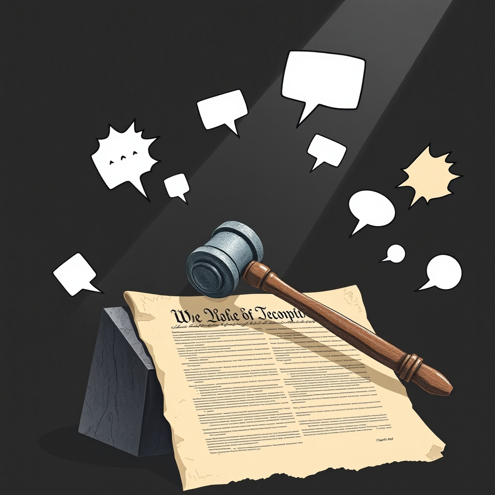

[Home](../index.md) > [Books](./index.md)  
# 🗽🗣️😠 Freedom for the Thought That We Hate: A Biography of the First Amendment  
  
[🛒 Freedom for the Thought That We Hate: A Biography of the First Amendment. As an Amazon Associate I earn from qualifying purchases.](https://amzn.to/4b1injh)  
  
🗽📜⚖️ The First Amendment's tumultuous journey and evolving interpretation, focusing on how free speech—even offensive speech—became a foundational American right through landmark Supreme Court cases and the enduring vision of justices like Holmes and Brandeis.  
  
## 🤖 AI Summary  
  
### 🤔 Core Philosophy  
* 📜 **First Amendment's Value:** Protection of even hateful or unpopular thought is paramount for a functioning democracy.  
* 📈 **Historical Evolution:** Free speech rights are not static; they emerged through a complex history of legal battles and judicial interpretation, especially in the 20th century.  
* 💪 **Judicial Courage:** Landmark expansions of free speech often resulted from courageous judges challenging prevailing societal fears and governmental pressures.  
* 🦅 **American Exceptionalism:** US free speech protections are broader than in most other Western democracies, particularly regarding hate speech.  
  
### 🏛️ Key Cases & Concepts  
* ⚖️ **Schenck v. United States (1919):** Introduced clear and present danger test for speech limitations during wartime.  
    * 🗣️ Initially a unanimous decision upholding conviction, but later Holmes and Brandeis used similar logic to advocate for broader speech protections in subsequent dissents.  
* ✍️ **Whitney v. California (1927):** Brandeis's influential concurrence advocated for more robust free speech protection, emphasizing counter-speech over suppression.  
* 📰 **New York Times Co. v. Sullivan (1964):** Crucial for press freedom, establishing a high bar for libel against public officials, requiring actual malice.  
* 📝 **New York Times Co. v. United States (1971) (Pentagon Papers):** Reinforced strong presumption against prior restraint on the press.  
  
### 🎯 Actionable Takeaways for a Sophisticated Audience  
* 🧐 **Scrutinize Speech Restrictions:** Be highly skeptical of government attempts to limit speech, especially during times of fear or crisis. Lewis warns against this post-9/11.  
* 🧠 **Understand Legal Precedent:** Grasp the historical context and evolution of First Amendment jurisprudence to argue for or against speech protections effectively.  
* 💬 **Advocate for Robust Debate:** Recognize that the constitutional framework prioritizes open exchange of ideas, even offensive ones, over censorship.  
* 🗞️ **Support Independent Journalism:** A free press acts as a check on government power, a principle articulated by Madison and upheld through key court cases.  
  
## ⚖️ Evaluation  
  
📈 Lewis's narrative effectively highlights the gradual, often contentious, evolution of First Amendment jurisprudence, demonstrating that robust free speech protections are a relatively modern development, largely solidified in the 20th century, particularly after 1919.  
📖 The book accurately positions the clear and present danger test from *Schenck v. United States* (1919) as a pivotal, if initially restrictive, moment that nevertheless laid groundwork for later, more expansive free speech doctrines. While *Schenck* upheld a conviction, it established a framework that evolved in subsequent dissents by Justices Holmes and Brandeis, eventually leading to greater protections.  
🦸 Lewis's emphasis on the role of heroic judges like Holmes and Brandeis in championing a broader interpretation of free speech aligns with common legal scholarship, recognizing their dissenting and concurring opinions as foundational for modern First Amendment law. Their shift in perspective helped move the Court towards protecting the thought that we hate.  
🌍 The book's assertion that American free speech protections are uniquely expansive compared to other democracies, particularly regarding hate speech, is widely supported. Many European nations, for instance, have stricter laws prohibiting hate speech.  
📜 Lewis accurately details how the First Amendment, originally applied only to the federal government, was incorporated to apply to the states through the Fourteenth Amendment's Due Process Clause, beginning with cases like *Gitlow v. New York* (1925).  
🏛️ The book's focus on historical Supreme Court cases (*Schenck*, *Whitney*, *Sullivan*, *Pentagon Papers*) is crucial for understanding the biography of the First Amendment, as these cases defined its scope and limits.  
🏆 Lewis's work is celebrated for making complex legal history accessible while maintaining scholarly rigor, reflecting his background as a Pulitzer Prize-winning journalist and Supreme Court reporter.  
  
## 🔍 Topics for Further Understanding  
  
🌐 **Free Speech in the Digital Age:** The impact of social media platforms, content moderation, online harassment, cancel culture, and the blurring lines between private platform policies and public square principles.  
💰 **Corporate Speech and Campaign Finance:** The evolution of First Amendment jurisprudence to include corporate speech, its implications for political spending, and debates over whether this aligns with the amendment's original intent.  
🗺️ **Global Perspectives on Free Speech:** A comparative analysis of free speech frameworks in other democratic nations (e.g., Germany, Canada, UK) and how they balance speech with other rights like dignity and equality, particularly regarding hate speech laws.  
📚 **The Marketplace of Ideas Theory Revisited:** Contemporary challenges to this foundational concept, including the spread of misinformation, disinformation, and the potential for a fragmented public discourse.  
🎓 **Free Speech on College Campuses:** Debates around academic freedom, trigger warnings, safe spaces, and the balance between protecting offensive speech and fostering inclusive educational environments.  
⚖️ **The Right to Be Forgotten vs. Freedom of the Press:** Exploring the tension between an individual's right to control personal information online and the public's right to access information, especially concerning historical journalistic reporting.  
  
## ❓ Frequently Asked Questions (FAQ)  
  
### 💡 Q: What is Freedom for the Thought That We Hate: A Biography of the First Amendment about?  
✅ A: Freedom for the Thought That We Hate: A Biography of the First Amendment by Anthony Lewis traces the historical development and evolving interpretations of freedom of speech and the press under the US Constitution's First Amendment, highlighting landmark Supreme Court cases and the roles of key justices.  
  
### 💡 Q: What does the title Freedom for the Thought That We Hate signify?  
✅ A: The title comes from Justice Oliver Wendell Holmes Jr.'s dissenting opinion in *United States v. Schwimmer* (1929), emphasizing that the most crucial test of free thought is its protection for ideas that are unpopular, offensive, or hateful to the majority.  
  
### 💡 Q: How did the First Amendment's interpretation change over time, according to Freedom for the Thought That We Hate?  
✅ A: The book illustrates that early interpretations of the First Amendment were often narrow, but they expanded significantly in the 20th century through Supreme Court decisions, moving from a clear and present danger test to a more robust protection for diverse forms of expression.  
  
### 💡 Q: Which Supreme Court cases are central to Freedom for the Thought That We Hate's narrative?  
✅ A: Anthony Lewis discusses pivotal cases such as *Schenck v. United States* (1919), *Whitney v. California* (1927), *New York Times Co. v. Sullivan* (1964), and *New York Times Co. v. United States* (1971), showing how each contributed to the modern understanding of free speech.  
  
### 💡 Q: Does Freedom for the Thought That We Hate discuss modern challenges to free speech?  
✅ A: While published in 2007, the book implicitly warns against government suppression during periods of fear and upheaval, a theme relevant to ongoing debates about balancing free speech with national security and societal concerns. Contemporary challenges like social media moderation and misinformation are extensions of these fundamental tensions.  
  
## 📚 Book Recommendations  
  
### 📖 Similar  
* 📚 Make No Law: The Sullivan Case and the First Amendment by Anthony Lewis  
* ❌ Unlearning Liberty: Campus Censorship and the End of American Debate by Greg Lukianoff  
* 📰 Speech, Print, and Power: Cultural Newspapers in the Early Republic by Sheila McIntyre  
  
### 🆚 Contrasting  
* 🗣️ Hate Speech: Why We Should Resist It with Free Speech, Not Censorship by Greg Lukianoff and Jacob Mchangama  
* 🤔 Kindly Inquisitors: The New Attacks on Free Thought by Jonathan Rauch  
* [🤕👶 The Coddling of the American Mind: How Good Intentions and Bad Ideas Are Setting Up a Generation for Failure](./the-coddling-of-the-american-mind-how-good-intentions-and-bad-ideas-are-setting-up-a-generation-for-failure.md) by Greg Lukianoff and Jonathan Haidt  
  
### 🤝 Related  
* 🎺 Gideon's Trumpet by Anthony Lewis  
* ❤️ The Soul of the First Amendment by Floyd Abrams  
* 🤝 Democracy and Disagreement by Amy Gutmann and Dennis Thompson  
  
## 🫵 What Do You Think?  
  
❓ Which historical Supreme Court case do you believe had the most profound impact on shaping modern free speech? Do you agree that American free speech protections are uniquely broad, and is that a strength or a weakness in today's digital landscape?