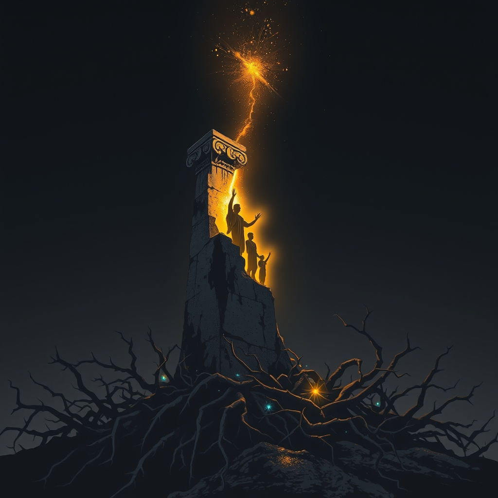

[Home](../index.md) > [Books](./index.md)  
# 🙏🚫🌍 God Is Not Great: How Religion Poisons Everything  
  
[🛒 God Is Not Great: How Religion Poisons Everything. As an Amazon Associate I earn from qualifying purchases.](https://amzn.to/4pIxPWA)  
  
## 📖 Book Report: ✝️ God Is Not Great: ☣️ How Religion Poisons Everything  
  
### 📝 Synopsis  
  
 Christopher Hitchens's 🗓️ 2007 book, ✝️ God Is Not Great: ☣️ How Religion Poisons Everything, 📢 serves as a comprehensive polemic against organized religion, 💥 arguing that it is a destructive force that has historically and continues to cause immense harm. 👨‍⚖️ Hitchens contends that religion is man-made, 🤔 irrational, and inherently hostile to free inquiry, ⚔️ often leading to violence, 😠 intolerance, and the subjugation of women and children. ✍️ Through a blend of personal anecdotes, 📜 historical examples, and critical analysis of religious texts, he systematically dismantles claims of divine inspiration and moral superiority associated with faith. 🌍 The book ultimately champions atheism and secular humanism, suggesting that humanity would be better off without religious belief 🙏 and can find meaning and morality through human reason and empathy.  
  
### 🔑 Key Themes  
  
* 🧑‍🎨 **Religion as a Human Construct:** ✍️ Hitchens argues that religious texts are clearly man-made, 🧐 riddled with historical inaccuracies, ⚔️ internal contradictions, and borrowings from earlier myths and cultures.  
* 🌱 **The Origins and Perpetuation of Faith:** 😥 He posits that religion largely persists due to humanity's inherent fear of mortality and the unknown.  
* ⚔️ **Religion and Violence/Oppression:** 📖 The book extensively details how religious motivations have led to numerous conflicts, 💥 atrocities, and acts of repression throughout history, from ancient times to modern events like the September 11 attacks 🏢 and the Lord's Resistance Army.  
* 🚫 **Rejection of Miracles and Divine Design:** ✨ Hitchens challenges the validity of all reported miracles as unverified and critiques the argument from design, 🧪 asserting that scientific advancements render religious explanations for the cosmos redundant and that the natural world exhibits flaws inconsistent with an omniscient creator.  
* 👿 **Religious Immorality:** 🔥 He contends that many religious doctrines, such as eternal punishment, blood sacrifice, and sexual repression, are not only outdated but "positively immoral," 🤕 leading to harm, particularly for children.  
* 🕊️ **Secular Morality and Reason:** 🎯 A central argument is that morality does not originate from religious teachings but rather from humanistic principles, ❤️ empathy, and social contracts. 🤔 Hitchens advocates for a morality based on reason, independent of divine commandments.  
  
### 🧍Author's Stance  
  
 Christopher Hitchens was a staunch antitheist, 🙅‍♂️ believing that organized religion is not merely false but actively harmful. 🥺 He viewed faith as an irrational belief not based on evidence, which often undermines critical thinking and scientific progress. 🗣️ As a leading figure in the "New Atheism" movement, he adopted a combative and polemical tone, employing wit and extensive historical knowledge to make his case. ✝️ Hitchens focused primarily on the Abrahamic religions (Judaism, Christianity, and Islam) due to his familiarity, but his criticisms extended to all forms of organized religion, including Eastern faiths. ❓ He often challenged believers to name a moral action that could only be performed by a person of faith, a challenge known as "Hitchens's Challenge," 🤔 arguing that secular individuals are equally, if not more, capable of ethical behavior.  
  
### 🌍 Impact and Significance  
  
 📚 God Is Not Great became a bestseller and solidified Hitchens's position as a prominent intellectual within the New Atheism movement, alongside figures like Richard Dawkins and Sam Harris. 📢 The book resonated with many who questioned the role of religion in society, sparking widespread debate and reinforcing secular viewpoints. 💡 It served as a call to reason, urging readers to scrutinize accepted dogmas and consider a world where meaning and purpose are derived from human effort and understanding rather than supernatural belief. mixed reviews, with some critics noting historical inaccuracies, its importance in contemporary discourse on religion and secularism is widely acknowledged.  
  
## 📚 Book Recommendations  
  
### 👍 Similar Books  
  
📚 These books share God Is Not Great's critical stance on religion, promoting atheism, secularism, and scientific reason.  
  
* **[❓✝️ The God Delusion](./the-god-delusion.md) by Richard Dawkins:** 🏛️ A cornerstone of the New Atheism movement, this book argues that belief in a supernatural creator is a delusion and that religion is harmful.  
* 💥 **The End of Faith: Religion, Terror, and the Future of Reason by Sam Harris:** 🤔 Harris critically examines the clash between religion and reason, particularly focusing on how religious belief can inspire violence and suspend rational thought.  
* ✨ **Breaking the Spell: Religion as a Natural Phenomenon by Daniel C. Dennett:** 🔬 This book explores the origins and evolution of religion from a scientific and philosophical perspective, seeking to understand why humans believe in God.  
* **[😈🌍🔬🕯️🌑 The Demon-Haunted World: Science as a Candle in the Dark](./the-demon-haunted-world.md) by Carl Sagan:** 🧪 Sagan champions scientific thinking and reason as a defense against pseudoscience and irrationality, offering a cautionary tale about abandoning critical thought.  
* 📜 **Why I Am Not a Christian by Bertrand Russell:** 🤔 A classic essay collection that articulates philosophical and ethical arguments against religious belief.  
  
### 👎 Contrasting Books  
  
📚 These recommendations offer perspectives that defend religion, explore faith, or critique New Atheism, providing counterarguments to the views presented in God Is Not Great.  
  
* 🙏 **The Experience of God: Being, Consciousness, Bliss by David Bentley Hart:** 🛡️ Hart offers a sophisticated defense of classical theism, critiquing modern atheism and arguing for a deeper understanding of God as "Being Itself."  
* ⚔️ **The Battle For God by Karen Armstrong:** 📖 This book provides a sympathetic and insightful historical account of how and why fundamentalist movements emerged in Judaism, Christianity, and Islam, exploring their motivations and goals.  
* 🇺🇸 **A New Religious America: How a "Christian Country" Has Become the World's Most Religiously Diverse Nation by Diana Eck:** 🏞️ Eck presents a portrait of the diverse religious landscape in modern America, highlighting the coexistence and interactions of various faiths.  
* 📖 **The Brothers Karamazov by Fyodor Dostoevsky:** 🎭 While a novel, this literary masterpiece deeply explores themes of faith, doubt, morality, and the existence of God through its complex characters and philosophical dialogues.  
  
### 🎨 Creatively Related Books  
  
📚 These books explore themes of secular morality, humanism, the search for meaning outside religion, or the philosophical underpinnings of ethics, offering different lenses through which to consider the human condition.  
  
* ❓ **Agnostic: A Spirited Manifesto by Lesley Hazleton:** 👐 Hazleton celebrates agnosticism not as indecision, but as an active, vibrant, and honest stance toward the mysteries of existence, embracing intellectual humility.  
* 📊 **The Moral Landscape: How Science Can Determine Human Values by Sam Harris:** 🧪 Harris argues that science can and should play a role in determining human values and morality, proposing that moral truths exist objectively and can be explored scientifically.  
* **[🏔️ The Myth of Sisyphus](./the-myth-of-sisyphus.md) by Albert Camus:** 🤔 This philosophical essay delves into absurdism, exploring humanity's search for meaning in a silent, indifferent universe and how one can find purpose and revolt against the absurd.  
* 📜 **The Good Book: A Humanist Bible by A. C. Grayling:** ✂️ Grayling compiles and curates selections from various philosophical, literary, and historical sources to create a secular alternative to traditional religious texts, offering wisdom for living a good life without supernatural belief.  
* 🤔 **Finding Purpose in a Godless World: Why We Care Even if the Universe Doesn't by Ralph Lewis:** ❤️ This book explores how humans create purpose and meaning in their lives without relying on theistic explanations, focusing on our intrinsic motivations and connections with others.  
  
## 💬 [Gemini](https://gemini.google.com) Prompt (gemini-2.5-flash)  
> Write a markdown-formatted (start headings at level H2) book report, followed by similar, contrasting, and creatively related book recommendations on God Is Not Great: How Religion Poisons Everything. Never quote or italicize titles. Be thorough but concise. Use section headings and bulleted lists to avoid long blocks of text.