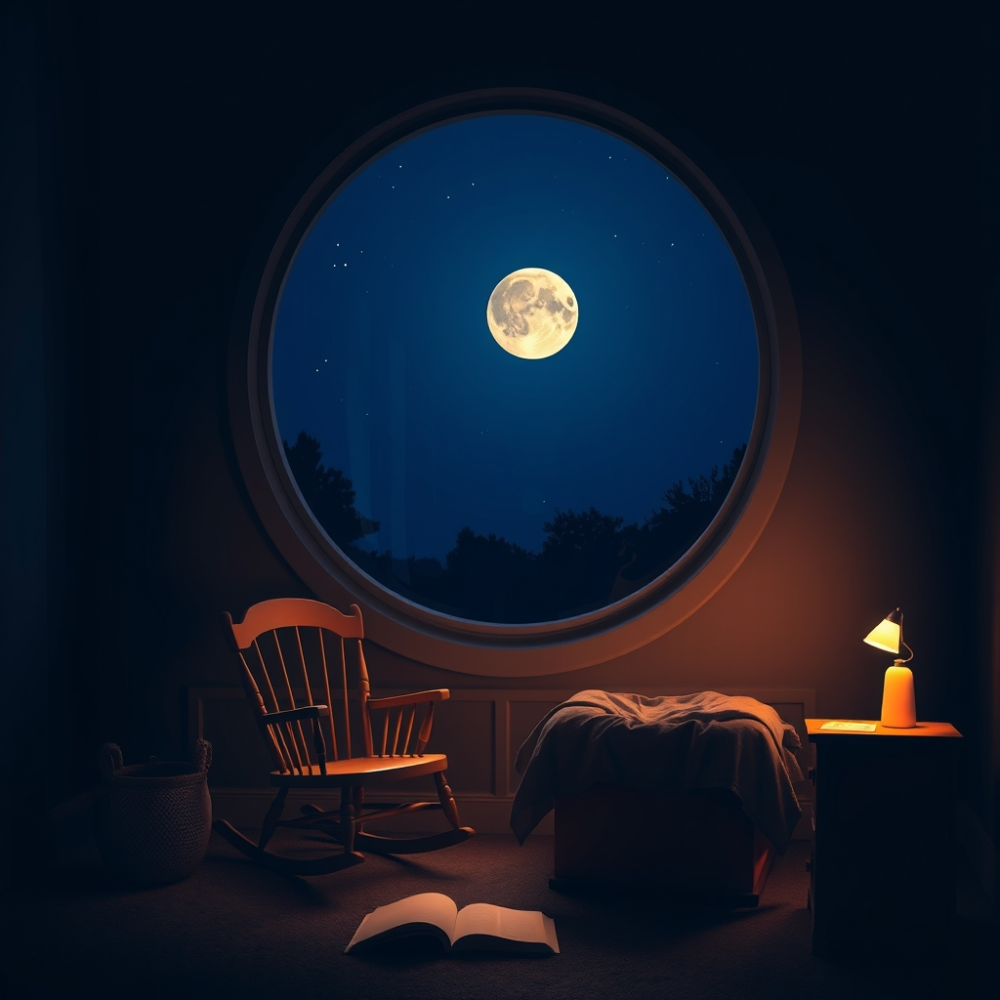

[Home](../index.md) > [Books](./index.md)  
# 🌙🛌 Goodnight Moon  
  
[🛒 Goodnight Moon. As an Amazon Associate I earn from qualifying purchases.](https://amzn.to/490VIAY)  
  
🌙 A timeless bedtime classic, gently guiding children through a soothing goodnight ritual to the familiar objects in their room, fostering a sense of peace and security.  
  
## 🤖 AI Summary  
### 🧠 Core Philosophy  
* **📖 Here-and-Now Storytelling:** Focus on children's immediate, everyday world.  
* **👶 Child-Centric Narrative:** Written from a child's perspective, emphasizing their language and experience.  
* **🔄 Ritual & Repetition:** Creates a comforting, predictable experience for winding down.  
  
### 🎯 Actionable Takeaways  
* **🛌 Establish Bedtime Routine:** Consistent rituals aid cognitive development, language skills, and emotional connection.  
* **💡 Create Soothing Environment:** Dim lights, quiet room, gentle voice for reading.  
* **👀 Encourage Observation:** The book acts as a scavenger hunt, prompting children to find objects.  
* **🗣️ Embrace Simple Language:** Repetitive wordplay helps children become familiar with new vocabulary.  
* **❤️ Foster Emotional Security:** The routine provides comfort and stability.  
  
## ⚖️ Evaluation  
* **📚 Goodnight Moon was a departure from earlier children's literature, which often focused on moralistic fairy tales and fantastical elements, instead embracing the here-and-now approach and everyday life.  
* **🚫 Initially, the book faced resistance; the influential New York Public Library children's librarian, Anne Carroll Moore, banned it from the NYPL collection from 1947 until 1972, deeming it overly sentimental and lacking educational value.  
* **📈 Despite initial poor sales, the book slowly gained popularity, becoming a bestseller during the post-World War II Baby Boom and selling over 40 million copies.  
* **🎶 Critics praise its rhythmic patterns, simple language, and ability to lull children to sleep, acting as a lullaby itself.  
* **🎨 The book's illustrations by Clement Hurd contribute to its timeless appeal, with subtle details like the changing clock and darkening room.  
* **👨‍👩‍👧 Its effectiveness in aiding children's emotional development and forming parent-child bonds is widely recognized.  
* **🌍 Some modern scholars note that while effective, the book's enduring popularity, like other anthropomorphic animal stories, may inadvertently limit exposure to diverse human characters in children's literature.  
  
## 🔍 Topics for Further Understanding  
* **✍️ The life and unconventional career of Margaret Wise Brown.  
* **💡 The here-and-now philosophy in early childhood education.  
* **📜 The history of children's literature censorship and gatekeeping.  
* **🧠 The psychological impact of bedtime routines on child development.  
* **🖼️ The evolution of children's book illustration and its influence.  
  
## ❓ Frequently Asked Questions (FAQ)  
### 💡 Q: What is the primary message of Goodnight Moon?  
✅ 😌 A: Goodnight Moon conveys a message of comfort, security, and the soothing power of a familiar bedtime ritual, helping children transition peacefully to sleep.  
  
### 💡 Q: Who wrote and illustrated Goodnight Moon?  
✅ ✍️ A: Goodnight Moon was written by Margaret Wise Brown and illustrated by Clement Hurd.  
  
### 💡 Q: Why was Goodnight Moon considered controversial or banned in the past?  
✅ ❌ A: Goodnight Moon was considered controversial by some, notably the head children's librarian at the New York Public Library, Anne Carroll Moore, who deemed it overly sentimental and lacking traditional educational value, leading to its exclusion from the NYPL for 25 years.  
  
### 💡 Q: What age group is Goodnight Moon best suited for?  
✅ 👶 A: Goodnight Moon is typically recommended for babies and young children, often from birth to four years old, due to its simple language, repetitive structure, and calming effect.  
  
### 💡 Q: How does Goodnight Moon contribute to a child's development?  
✅ 🌱 A: Goodnight Moon aids in language development through repetition, fosters cognitive skills by encouraging observation of objects, establishes comforting routines, and strengthens parent-child bonds through shared reading.  
  
## 📚 Book Recommendations  
### 🤝 Similar  
* **🐰 The Runaway Bunny by Margaret Wise Brown (also illustrated by Clement Hurd, featuring the same bunny from a picture in Goodnight Moon)  
* **🐶 Where's Spot? by Eric Hill  
* **🖐️ Pat the Bunny by Dorothy Kunhardt  
  
### ↔️ Contrasting  
* **👹 Where the Wild Things Are by Maurice Sendak (focuses on adventure and imagination rather than routine)  
* **[🐛🍎 The Very Hungry Caterpillar](./the-very-hungry-caterpillar.md) by Eric Carle (explores growth and transformation with a more complex narrative)  
* **😠 Alexander and the Terrible, Horrible, No Good, Very Bad Day by Judith Viorst  
  
### 🔗 Related  
* **📖 The Important Thing About Margaret Wise Brown by Mac Barnett (a biography about the author)  
* **[👦🟣🖍️ Harold and the Purple Crayon](./harold-and-the-purple-crayon.md) by Crockett Johnson (explores imagination and bedtime themes)  
* **🎵 Lullaby and Goodnight by Elizabeth D. Crawford (a collection of classic lullabies)  
  
## 🫵 What Do You Think?  
🤔 What aspects of Goodnight Moon resonate most with you or your children, and what other bedtime stories have become cherished rituals in your family?