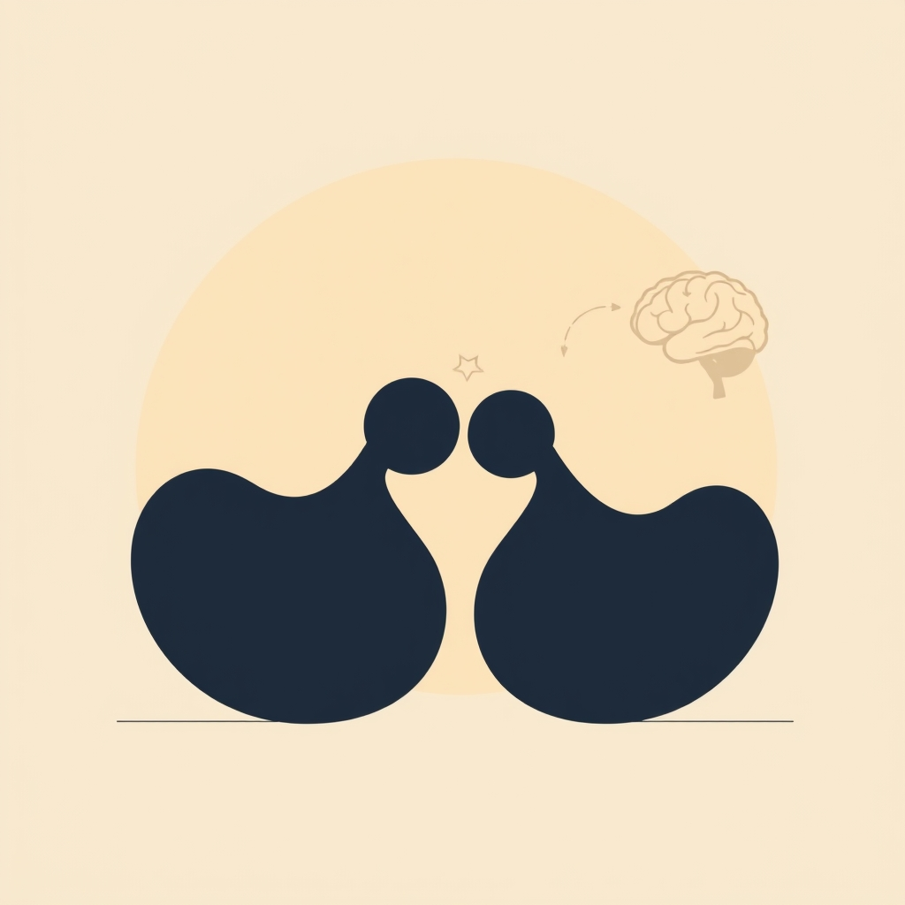

[Home](../index.md) > [Books](./index.md)  
# 📖🫂🥼 Handbook of Attachment: Theory, Research, and Clinical Applications  
  
[🛒 Handbook of Attachment: Theory, Research, and Clinical Applications. As an Amazon Associate I earn from qualifying purchases.](https://amzn.to/4kjOXP5)  
  
## 📖 Book Report: Handbook of Attachment: Theory, Research, and Clinical Applications  
  
### 📚 Overview  
📖 The *Handbook of Attachment*, edited by Jude Cassidy and Phillip R. Shaver, is widely considered the definitive, state-of-the-science reference work on attachment theory. 3️⃣ Now in its third edition, the handbook thoroughly integrates attachment theory, current research findings, and clinical applications. 🧑‍🤝‍🧑 It brings together leading researchers to provide a comprehensive overview of the field.  
  
### 🔑 Key Themes  
* 🌱 **Origins and Development:** 👶 Explores the foundational work of John Bowlby and Mary Ainsworth and the subsequent evolution of attachment theory.  
* 🧠 **Biological and Evolutionary Perspectives:** 🧬 Presents chapters examining attachment from biological, evolutionary, neurobiological, genetic, and psychoneuroimmunological viewpoints.  
* ⏳ **Lifespan Development:** 👶 Covers attachment processes from infancy through adulthood, including parent-child bonds, romantic relationships, and caregiving across the lifespan.  
* 👤 **Individual Differences:** 💔 Discusses the development and implications of different attachment patterns (secure, avoidant, ambivalent/resistant, disorganized).  
* ⚕️ **Clinical Applications:** 🏥 Addresses the implications of attachment for mental health, psychopathology, and psychotherapy, reviewing various attachment-oriented interventions for individuals, couples, and families.  
* 🔬 **Assessment:** 📊 Critically evaluates instruments and protocols used to measure attachment across different age groups.  
  
### 🏗️ Structure and Content  
* 🗂️ The handbook is organized into sections covering foundational theory, biological perspectives, attachment across the lifespan (infancy, childhood, adolescence, adulthood), clinical applications, and broader systems/contexts.  
* ✍️ It features contributions from numerous leading figures and experts in the field.  
* ✨ The third edition includes updates reflecting nearly a decade of advances, with new chapters on topics like genetics, epigenetics, psychoneuroimmunology, compassion, and the caregiving system.  
  
### 🎯 Target Audience  
* 👨‍⚕️ This handbook is essential reading for researchers, students (in psychology, psychiatry, child development, family studies), and mental health practitioners interested in attachment theory and its applications.  
* 🤓 While comprehensive and technically precise, its depth makes it a valuable reference manual for clinicians.  
  
### ⭐ Significance  
* 🏆 The *Handbook of Attachment* is hailed as an indispensable "must-have" reference and an "instant classic" across its editions.  
* 📈 It provides a stunningly broad and deep integration of theory, research, and practice, reflecting the maturation and significance of attachment theory in understanding human development and relationships.  
  
## 📚 Book Recommendations  
  
### 🫂 Similar Books (Comprehensive Attachment Focus)  
* 📚 **Attachment and Loss Trilogy by John Bowlby:** 👴 The foundational texts by the father of attachment theory. Includes *Volume 1: Attachment*, *Volume 2: Separation: Anxiety and Anger*, and *Volume 3: Loss: Sadness and Depression*.  
* 👩‍👧‍👦 **[👶🤔 Patterns of Attachment: A Psychological Study of the Strange Situation](./patterns-of-attachment-a-psychological-study-of-the-strange-situation.md) by Mary D. Salter Ainsworth et al.:** 📍 Details the landmark Baltimore study and methods (including the Strange Situation) that established attachment patterns.  
* 🏠 **[👨‍👩‍👧‍👦🛡️ A Secure Base: Parent-Child Attachment and Healthy Human Development](./a-secure-base-parent-child-attachment-and-healthy-human-development.md) by John Bowlby:** ❤️ Explores key concepts like the secure base and its role in healthy development.  
* ⚕️ **Attachment Theory in Practice: Emotionally Focused Therapy (EFT) with Individuals, Couples, and Families by Susan M. Johnson:** 🫂 Applies attachment principles specifically within the EFT framework.  
* 🌱 **Attachment Theory Applied: Fostering Personal Growth through Healthy Relationships by Mario Mikulincer and Phillip R. Shaver:** 🔬 Reviews attachment-based interventions across various domains, including therapy, education, and health.  
* 🧑‍ foster **Attachment Handbook for Foster Care and Adoption by Mary Beek and Gillian Schofield:** 👩‍👧‍👦 Focuses on applying attachment concepts in the context of foster care and adoption.  
  
### ⚖️ Contrasting Perspectives (Alternative/Complementary Frameworks)  
* 👨‍👩‍👧‍👦 **Families and Family Therapy by Salvador Minuchin:** 👨‍👩‍👧‍👦 A foundational text in structural family therapy, focusing on family systems, boundaries, and hierarchies rather than individual attachment history.  
* 🧠 **Cognitive Behavior Therapy: Basics and Beyond by Judith S. Beck:** 🤔 Focuses on thoughts, feelings, and behaviors in the present, offering a different lens than the developmental/relational focus of attachment theory. (While CBT can integrate attachment concepts, its core principles differ).  
* 🧒 **Childhood and Society by Erik Erikson:** 🧑‍🎓 Presents a psychosocial theory of development across the lifespan, focusing on stages and identity crises, which contrasts with Bowlby's focus on the primary caregiver bond.  
* 🧬 **Books on Behavior Genetics:** 🔬 Explore the influence of genetics on development and behavior, offering a different emphasis than attachment's focus on caregiving experiences (though the Handbook does include chapters integrating genetics).  
* 🩹 **Schema Therapy: A Practitioner's Guide by Jeffrey E. Young, Janet S. Klosko & Marjorie E. Weishaar:** 💔 While related to attachment issues, Schema Therapy focuses on identifying and changing maladaptive schemas developed in childhood, offering a distinct therapeutic model.  
  
### ✨ Creatively Related Reads  
* 🧠 **Affect Regulation and the Origin of the Self by Allan N. Schore:** 🧬 Explores the neurobiology of emotional development and the role of early relationships in shaping the brain and self, complementing attachment theory with a deep dive into neuroscience.  
* 🗣️ **Affect Regulation, Mentalization, and the Development of the Self by Peter Fonagy et al.:** 🧠 Integrates attachment theory with concepts of mentalization (understanding mental states) and affect regulation, particularly relevant for understanding personality disorders.  
* **[🫂 Hold Me Tight: Seven Conversations for a Lifetime of Love](./hold-me-tight-seven-conversations-for-a-lifetime-of-love.md) by Sue Johnson:** ❤️ A practical guide for couples based on Emotionally Focused Therapy (EFT), which is heavily grounded in attachment science, translating theory into relational practice.  
* ❤️ **Wired for Love: How Understanding Your Partner's Brain and Attachment Style Can Help You Defuse Conflict and Build a Secure Relationship by Stan Tatkin:** 🧠 Blends attachment theory with neuroscience for a practical couples' guide.  
* **[🧑‍❤️‍🧑🔗 Attached: The New Science of Adult Attachment and How It Can Help You Find - and Keep - Love](./attached-the-new-science-of-adult-attachment-and-how-it-can-help-you-find-and-keep-love.md) by Amir Levine and Rachel S.F. Heller:** 🧑‍🤝‍🧑 A popular science book translating adult attachment research into practical advice for romantic relationships.  
* **[🤕🎼🧠 The Body Keeps the Score: Brain, Mind, and Body in the Healing of Trauma](./the-body-keeps-the-score-brain-mind-and-body-in-the-healing-of-trauma.md) by Bessel van der Kolk:** 🧠 While focused on trauma, it deeply explores how adverse experiences (often related to attachment disruptions) impact the mind and body.  
* **[🤱🏼🤿🪞🌱 Parenting from the Inside Out: How a Deeper Self-Understanding Can Help You Raise Children Who Thrive](./parenting-from-the-inside-out-how-a-deeper-self-understanding-can-help-you-raise-children-who-thrive.md) by Daniel J. Siegel and Mary Hartzell:** 🧑‍🍼 Connects parents' own childhood experiences (including attachment patterns) with their current parenting practices, integrating neuroscience and attachment.  
* 💞 **Polysecure: Attachment, Trauma and Consensual Nonmonogamy by Jessica Fern:** 🧑‍🤝‍🧑 Applies attachment theory principles to the specific context of consensual nonmonogamous relationships.  
* 🎭 **Fiction Exploring Attachment Themes:** 📖 Novels like *The Language of Flowers* by Vanessa Diffenbaugh or Robin Hobb's *Farseer Trilogy* can offer narrative explorations of how early relationships and attachment styles shape characters' lives and relationships. ✍️ Dostoevsky's *Notes from Underground* also explores relational dynamics influenced by background.".  
  
## 💬 [Gemini](../software/gemini.md) Prompt (gemini-2.5-pro-exp-03-25)  
> Write a markdown-formatted (start headings at level H2) book report, followed by a plethora of additional similar, contrasting, and creatively related book recommendations on Handbook of Attachment: Theory, Research, and Clinical Applications. Be thorough in content discussed but concise and economical with your language. Structure the report with section headings and bulleted lists to avoid long blocks of text.  
  
## 🦋 Bluesky    
<blockquote class="bluesky-embed" data-bluesky-uri="at://did:plc:i4yli6h7x2uoj7acxunww2fc/app.bsky.feed.post/3mgu65oqyim2i" data-bluesky-cid="bafyreieprt53scr27uqt3e4bk677v6ozgaxqhwajby37beoovqwf6xihtq">
📖🫂🥼 Handbook of Attachment: Theory, Research, and Clinical Applications  
  
#AI Q: 🔗 Does attachment affect your choices?  
  
🧠 Neuroscience | 🫂 Relationships | 🌱 Child Development | ⚕️ Clinical Psychology  
https://bagrounds.org/books/handbook-of-attachment-theory-research-and-clinical-applications
&mdash; <a href="https://bsky.app/profile/did:plc:i4yli6h7x2uoj7acxunww2fc?ref_src=embed">Bryan Grounds (@bagrounds.bsky.social)</a> <a href="https://bsky.app/profile/did:plc:i4yli6h7x2uoj7acxunww2fc/post/3mgu65oqyim2i?ref_src=embed">2026-03-12T10:15:14.360Z</a></blockquote>  
## 🐘 Mastodon    
<blockquote class="mastodon-embed" data-embed-url="https://mastodon.social/@bagrounds/116215677834340523/embed" style="background: #282c37; border-radius: 8px; border: 1px solid #393f4f; margin: 0; max-width: 540px; min-width: 270px; overflow: hidden; padding: 0;"> <a href="https://mastodon.social/@bagrounds/116215677834340523" target="_blank" style="align-items: center; color: #d9e1e8; display: flex; flex-direction: column; font-family: system-ui, -apple-system, BlinkMacSystemFont, 'Segoe UI', Oxygen, Ubuntu, Cantarell, 'Fira Sans', 'Droid Sans', 'Helvetica Neue', Roboto, sans-serif; font-size: 14px; justify-content: center; letter-spacing: 0.25px; line-height: 20px; padding: 24px; text-decoration: none;"> <svg xmlns="http://www.w3.org/2000/svg" xmlns:xlink="http://www.w3.org/1999/xlink" width="32" height="32" viewBox="0 0 79 75"><path d="M63 45.3v-20c0-4.1-1-7.3-3.2-9.7-2.1-2.4-5-3.7-8.5-3.7-4.1 0-7.2 1.6-9.3 4.7l-2 3.3-2-3.3c-2-3.1-5.1-4.7-9.2-4.7-3.5 0-6.4 1.3-8.6 3.7-2.1 2.4-3.1 5.6-3.1 9.7v20h8V25.9c0-4.1 1.7-6.2 5.2-6.2 3.8 0 5.8 2.5 5.8 7.4V37.7H44V27.1c0-4.9 1.9-7.4 5.8-7.4 3.5 0 5.2 2.1 5.2 6.2V45.3h8ZM74.7 16.6c.6 6 .1 15.7.1 17.3 0 .5-.1 4.8-.1 5.3-.7 11.5-8 16-15.6 17.5-.1 0-.2 0-.3 0-4.9 1-10 1.2-14.9 1.4-1.2 0-2.4 0-3.6 0-4.8 0-9.7-.6-14.4-1.7-.1 0-.1 0-.1 0s-.1 0-.1 0 0 .1 0 .1 0 0 0 0c.1 1.6.4 3.1 1 4.5.6 1.7 2.9 5.7 11.4 5.7 5 0 9.9-.6 14.8-1.7 0 0 0 0 0 0 .1 0 .1 0 .1 0 0 .1 0 .1 0 .1.1 0 .1 0 .1.1v5.6s0 .1-.1.1c0 0 0 0 0 .1-1.6 1.1-3.7 1.7-5.6 2.3-.8.3-1.6.5-2.4.7-7.5 1.7-15.4 1.3-22.7-1.2-6.8-2.4-13.8-8.2-15.5-15.2-.9-3.8-1.6-7.6-1.9-11.5-.6-5.8-.6-11.7-.8-17.5C3.9 24.5 4 20 4.9 16 6.7 7.9 14.1 2.2 22.3 1c1.4-.2 4.1-1 16.5-1h.1C51.4 0 56.7.8 58.1 1c8.4 1.2 15.5 7.5 16.6 15.6Z" fill="currentColor"/></svg> 
Post by @bagrounds@mastodon.social
 
View on Mastodon
 </a> </blockquote>   
