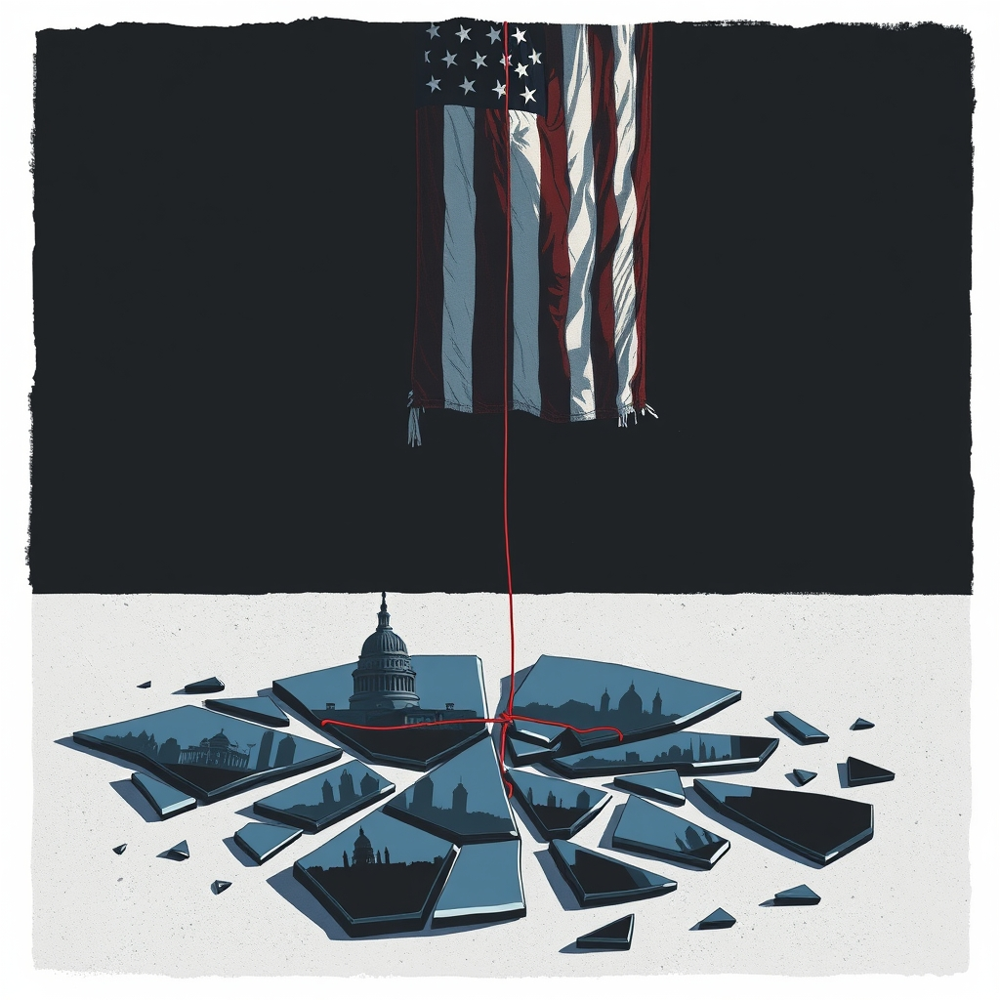

[Home](../index.md) > [Books](./index.md)  
# 🇺🇸⚠️ Harbingers: What January 6 and Charlottesville Reveal About Rising Threats to American Democracy  
  
[🛒 Harbingers: What January 6 and Charlottesville Reveal About Rising Threats to American Democracy. As an Amazon Associate I earn from qualifying purchases.](https://amzn.to/3SRdP4Q)  
  
## 📖 Book Report: 📢 Harbingers: What January 6 and Charlottesville Reveal About Rising Threats to American Democracy  
  
*Harbingers: What January 6 and Charlottesville Reveal About Rising Threats to American Democracy* ✍️ by Timothy J. Heaphy offers a penetrating look at two pivotal events in recent American history through the eyes of a lead investigator. Drawing on his experience overseeing inquiries into both the 2017 white supremacist rally in Charlottesville ✊ and the January 6, 2021, attack on the U.S. Capitol 🏛️, Heaphy connects these seemingly disparate events as indicators, or "harbingers," of escalating 🚨 threats to the foundations of American democracy.  
  
### 🔑 Key Themes and Content  
  
The book delves into the underlying factors that contributed to the violence 💥 and instability witnessed in Charlottesville and on January 6th. Heaphy provides an insider's account 🗣️ of the investigations, detailing the process of gathering evidence 🔍, interviewing individuals involved (from planners to bystanders), and navigating the political landscape surrounding these events.  
  
Central themes explored include:  
  
* 🚨 **Rising Threats to American Democracy:** The core argument is that Charlottesville and January 6th are not isolated incidents but symptoms of deeper issues imperiling democratic institutions.  
* 😡 **Cynicism and Anger:** Heaphy highlights the pervasive cynicism and anger fueling these movements and the increasing lack of trust 🤔 in institutions among a growing number of Americans.  
* 🌐 **Misinformation and Isolation:** The book examines the role of misinformation and the isolation of individuals within information bubbles 💬 as contributing factors to radicalization and distrust.  
* 😠 **Political Violence:** As a foremost expert on American political violence, Heaphy analyzes how and why these events turned violent and the potential for future episodes if the underlying causes are not addressed.  
* 🗳️ **Importance of Civic Engagement:** The author suggests that widespread civic engagement is essential to safeguarding democratic values and restoring faith in institutions.  
* ⚖️ **Accountability and Deterrence:** The book underscores the importance of criminal and civil penalties for perpetrators as a means of deterring future attacks.  
  
Heaphy structures the narrative by taking readers through the investigative process, offering a unique perspective 👓 gained from his direct involvement. He aims to provide context and understanding of these events to help avoid similar occurrences in the future. The book also touches upon potential solutions, including combating misinformation and finding ways to better engage disaffected citizens.  
  
### 📚 Significance  
  
*Harbingers* is a significant contribution to understanding the contemporary challenges facing American democracy. By connecting Charlottesville and January 6th, Heaphy argues for recognizing a 🔄 पैटर्न of increasing political instability and the erosion of democratic norms. His perspective as a lead investigator offers a grounded and detailed examination of the events and their implications.  
  
## ➕ Additional Book Recommendations  
  
### 📖 Similar Books (Focus on Threats to Democracy and Political Violence)  
  
* **[🗳️🏛️☠️ How Democracies Die](./how-democracies-die.md)** by Steven Levitsky and Daniel Ziblatt: Examines how democracies can erode from within through the subtle weakening of norms and institutions.  
* 🇺🇸 **Four Threats: The Recurring Crises of American Democracy** by Suzanne Mettler and Robert C. Lieberman: Explores historical instances of threats to American democracy, including polarization, racism, inequality, and executive power, arguing that their confluence today poses a significant danger.  
* 🚫 **Attack from Within: How Disinformation is Sabotaging America** by Barbara McQuade: Discusses the impact of disinformation on American democracy and how to combat it, a theme also present in *Harbingers*.  
* 🗳️ **The Steal: The Attempt to Overturn the 2020 Election and the People Who Stopped It** by Mark Bowden and Matthew Teague: Documents the efforts to challenge the 2020 election results, providing context for the events of January 6th.  
* 🏛️ **Tyranny of the Minority: Why American Democracy Reached the Breaking Point** by Steven Levitsky and Daniel Ziblatt: Argues that the U.S. Constitution's structure can allow partisan minority factions to undermine majority rule.  
  
### ⚖️ Contrasting Books (Different Perspectives or Focus)  
  
* 📢 **January 6: How Democrats Used the Capitol Protest to Launch a War on Terror Against the Political Right** by Julie Kelly: Offers a different interpretation of the January 6th event, focusing on the response and its implications for political conservatives.  
* ✝️ **The Harbinger** by Jonathan Cahn: While sharing a similar title, this book is a prophetic novel that draws connections between ancient biblical events and modern occurrences, interpreting them through a religious lens. This contrasts sharply with Heaphy's fact-based, investigative approach.  
  
### 🎨 Creatively Related Books (Broader Context or Specific Aspects)  
  
* 💔 **Unthinkable: Trauma, Truth, and the Trials of American Democracy** by Jamie Raskin: A memoir by Congressman Jamie Raskin, detailing his personal grief and his experience as a lead impeachment manager after the January 6th attack. Provides a deeply personal perspective on the political events.  
* 😠 **White Rural Rage: The Threat to American Democracy** by Thomas Schaller and Paul Waldman: Explores the anger and political behavior of white rural voters, offering potential insights into some of the sentiment contributing to the events discussed in *Harbingers*.  
* 🗺️ **Secret Charlottesville: A Guide to the Weird, Wonderful, and Obscure** by Marijean Oldham: While not directly about the political violence, this book offers a look into the city of Charlottesville itself, providing a sense of the place that was the site of the 2017 rally.  
* 📜 **Books on the history of Charlottesville & Albemarle:** Exploring the deeper history of Charlottesville and the surrounding area can provide valuable context for understanding the roots of some of the issues that surfaced in 2017.  
  
## 💬 [Gemini](../software/gemini.md) Prompt (gemini-2.5-flash-preview-04-17)  
> Write a markdown-formatted (start headings at level H2) book report, followed by a plethora of additional similar, contrasting, and creatively related book recommendations on Harbingers: What January 6 and Charlottesville Reveal About Rising Threats to American Democracy. Be thorough in content discussed but concise and economical with your language. Structure the report with section headings and bulleted lists to avoid long blocks of text.