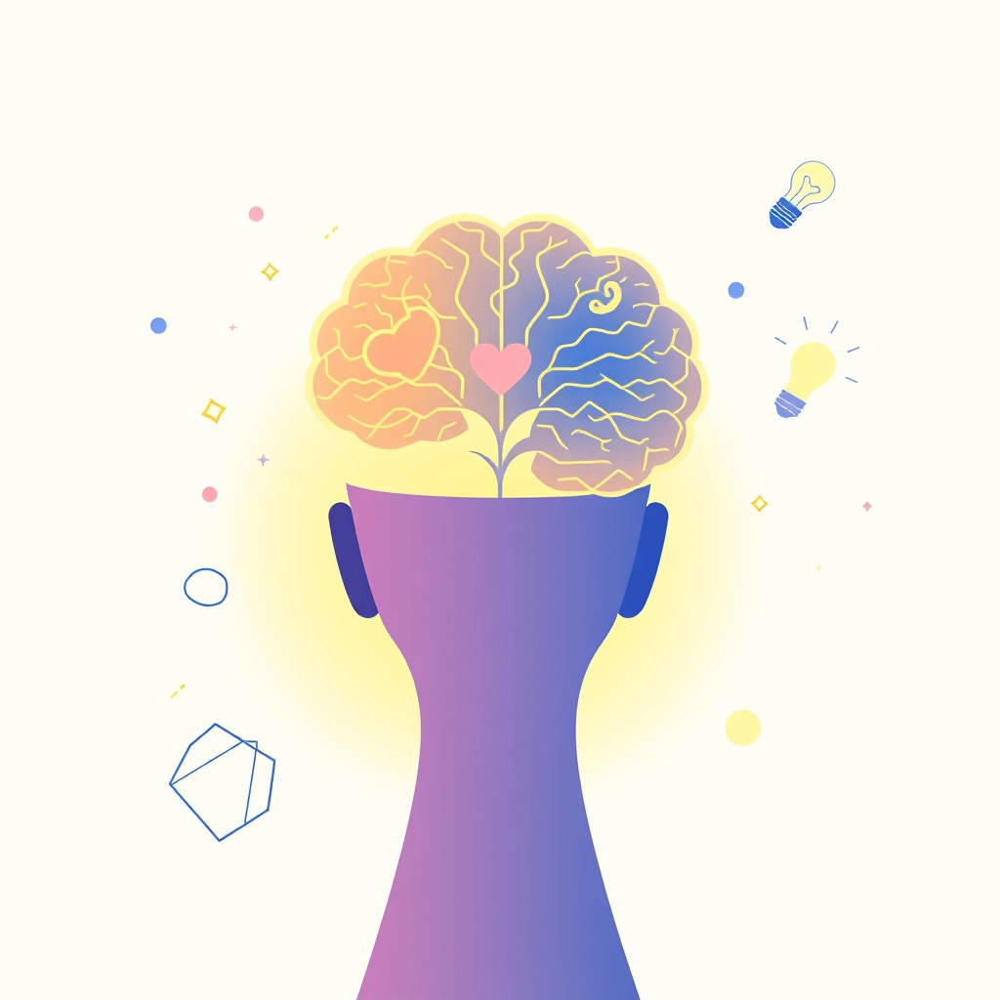

[Home](../index.md) > [Books](./index.md)  
# 🧠💡😊 Healthy Brain, Happy Life: A Personal Program to Activate Your Brain and Do Everything Better  
  
[🛒 Healthy Brain, Happy Life: A Personal Program to Activate Your Brain and Do Everything Better. As an Amazon Associate I earn from qualifying purchases.](https://amzn.to/4sQree1)  
  
🧠💡😊 Practical strategies for improving memory, mood, and attention, advocating for intentional lifestyle changes to foster neuroplasticity and a more joyful existence.  
  
## 🤖 AI Summary  
  
### ✨ Core Philosophy  
* 🧠 **Brain Plasticity:** Brain constantly changes based on experience.  
* 🧘‍♀️ **Mind-Body Connection:** Brain and body are interdependent; physical state affects cognitive/emotional well-being.  
* 🚀 **Intentional Action:** Deliberate steps drive neuroplasticity and personal transformation.  
  
### 🎯 Actionable Steps  
* 🏃‍♀️ **Exercise:**  
    * ⏱️ Aerobic activity: 30 mins, most days.  
    * 📈 Boosts neurogenesis, memory, mood, stress protection.  
    * 💖 Activates brain's reward system, potentially curbing addiction.  
* 🧘 **Mindfulness/Meditation:**  
    * 🌱 Start small: 5 mins daily.  
    * 🧠 Enhances attention, self-awareness, compassion, emotional regulation.  
    * 📊 Induces structural brain changes (e.g., increased gray matter, reduced amygdala reactivity).  
* 🍎 **Nutrition:**  
    * 🍽️ Prioritize brain-healthy diet.  
    * 🐟 Focus on omega-3s, antioxidants, B vitamins.  
    * 🍇 Mediterranean, DASH, and MIND diets are beneficial.  
* 📚 **Learning & Creativity:**  
    * ✏️ Engage in new learning activities.  
    * 🎨 Foster creativity, which is a widespread brain function.  
    * 🕺 Movement enhances divergent thinking.  
* 🤝 **Social Connection:**  
    * 🫂 Actively seek social opportunities.  
    * 😊 Reduces stress, improves well-being.  
* 🚫 **Stress Management:**  
    * 🔍 Identify and manage stress triggers.  
    * 🌬️ Use techniques like deep breathing, journaling, time outdoors.  
    * 📉 Chronic stress shrinks prefrontal cortex, increases amygdala activity.  
* 😴 **Sleep:**  
    * 🛌 Aim for 7-9 hours quality sleep nightly.  
    * 🧼 Brain repairs, processes emotions, clears toxins during sleep.  
  
## ⚖️ Evaluation  
  
* 🧠 **Neuroplasticity:** The book's emphasis on neuroplasticity is strongly supported by scientific consensus, which acknowledges the brain's remarkable capacity to change structure and function in response to experience throughout life.  
* 💪 **Exercise Benefits:** The positive impact of aerobic exercise on memory, mood, and cognitive function, including increasing neurogenesis and protecting against stress, is widely validated by neuroscience research.  
* 🧘‍♀️ **Meditation & Mindfulness:** The claims regarding meditation's ability to drive brain plasticity, enhance attention, improve emotional regulation, and create structural changes (e.g., increased gray matter, reduced amygdala activity) are consistent with numerous scientific studies.  
* 🍏 **Nutrition's Role:** The importance of diet for brain health, recommending omega-3 fatty acids and specific eating patterns like the Mediterranean, DASH, and MIND diets, aligns with current scientific understanding and expert consensus statements.  
* 📉 **Stress Impact:** The book's discussion of chronic stress's detrimental effects on brain structure and function (e.g., shrinking the prefrontal cortex) is well-supported by neurological research. Practical stress management techniques like those suggested are also widely recommended.  
* ✅ **Distinction from Controversial Approaches:** Unlike some popular brain health authors who face criticism for unproven diagnostic methods or supplements (e.g., Dr. Daniel Amen's use of SPECT scans for psychiatric diagnosis), Dr. Suzuki's book, based on her personal research and widely accepted neuroscience, avoids such controversies.  
  
## 🔍 Topics for Further Understanding  
  
* 🔬 The specific neurobiological mechanisms of different types of meditation (e.g., Vipassana vs. Transcendental Meditation).  
* 🦠 The role of the gut microbiome in brain health and mood regulation.  
* 🎮 Advanced cognitive training techniques beyond general learning, such as dual N-back or specialized memory sports.  
* 💤 The impact of specific sleep stages (e.g., REM vs. deep sleep) on memory consolidation and emotional processing.  
* 🧬 Detailed exploration of genetic predispositions and how they interact with lifestyle interventions for brain health.  
* 💡 The neuroscience of creativity and deliberate practices for enhancing creative output in diverse fields.  
* 🚻 Hormonal influences on neuroplasticity and cognitive function across the lifespan.  
  
## ❓ Frequently Asked Questions (FAQ)  
  
### 💡 Q: What is the main message of Healthy Brain, Happy Life: A Personal Program to Activate Your Brain and Do Everything Better?  
✅ A: Healthy Brain, Happy Life emphasizes that through consistent physical exercise, mindfulness practices, and intentional lifestyle choices, individuals can significantly enhance their brain's function, improve memory and mood, and achieve greater overall happiness.  
  
### 💡 Q: Does Healthy Brain, Happy Life provide actionable steps for improving brain function?  
✅ A: Yes, Healthy Brain, Happy Life offers a personal program with highly actionable advice, focusing on incorporating aerobic exercise and meditation into daily routines, alongside recommendations for nutrition, social engagement, and stress management to foster neuroplasticity.  
  
### 💡 Q: Is the advice in Healthy Brain, Happy Life supported by scientific research?  
✅ A: Healthy Brain, Happy Life is written by a neuroscientist, Dr. Wendy Suzuki, and blends personal anecdotes with cutting-edge scientific research, particularly on the powerful connection between exercise, learning, memory, and cognitive abilities.  
  
### 💡 Q: What is neuroplasticity and how does Healthy Brain, Happy Life relate to it?  
✅ A: Neuroplasticity is the brain's ability to change its structure and function in response to experience, and Healthy Brain, Happy Life highlights how intentional actions like exercise and meditation can actively drive this process, leading to improved cognitive and emotional well-being.  
  
### 💡 Q: Are there brain hacks or quick exercises mentioned in Healthy Brain, Happy Life?  
✅ A: Healthy Brain, Happy Life includes practical, short exercises, referred to as 4-minute Brain Hacks, designed to engage the mind and improve memory, learning, and efficiency.  
  
## 📚 Book Recommendations  
  
### 📖 Similar Books  
* [🧠🔄🏆 The Brain That Changes Itself: Stories of Personal Triumph from the Frontiers of Brain Science](./the-brain-that-changes-itself.md) by Norman Doidge  
* [⚡🧠🏃 Spark: The Revolutionary New Science of Exercise and the Brain](./spark-the-revolutionary-new-science-of-exercise-and-the-brain.md) by John J. Ratey  
* 🔄 Rewire Your Brain by John B. Arden  
  
### ↔️ Contrasting Books  
* ⚠️ Change Your Brain, Change Your Life by Daniel G. Amen (Note: Often criticized by the scientific community for methodology)  
* [🤔🐇🐢 Thinking, Fast and Slow](./thinking-fast-and-slow.md) by Daniel Kahneman (Focuses on cognitive biases rather than actionable brain training)  
  
### 🔗 Related Books  
* [⚛️🔄 Atomic Habits: An Easy & Proven Way to Build Good Habits & Break Bad Ones](./atomic-habits.md) by James Clear (For building sustainable routines)  
* [🌱🧘🏼‍♀️🏆 Mindset: The New Psychology of Success](./mindset.md) by Carol S. Dweck (For adopting a growth mindset for learning)  
* [🔄🧠💪 The Power of Habit: Why We Do What We Do in Life and Business](./the-power-of-habit.md) by Charles Duhigg (Explores the science of habit formation)  
  
## 🫵 What Do You Think?  
  
🤔 Which of the Brain Hacks from Healthy Brain, Happy Life resonates most with your current routine, and what new habit are you most motivated to implement for a healthier brain?