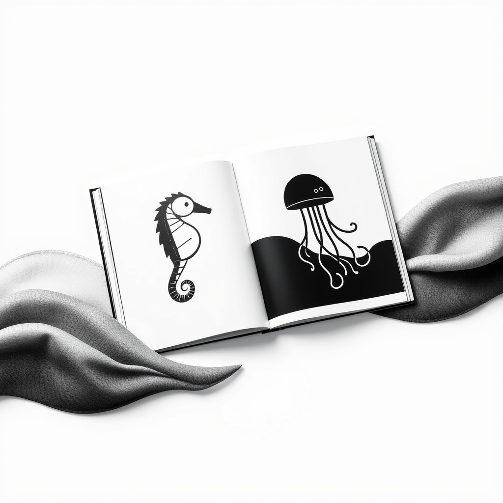

[Home](../index.md) > [Books](./index.md)  
# 👶🦓🌊 Hello, Ocean Friends: A Black-and-White Board Book for Babies That Helps Visual Development  
  
[🛒 Hello, Ocean Friends: A Black-and-White Board Book for Babies That Helps Visual Development. As an Amazon Associate I earn from qualifying purchases.](https://amzn.to/3HJL9bm)  
  
## 📖 Book Report: 👋 Hello, Ocean Friends: A Black-and-White Board Book for Babies That Helps Visual Development  
  
*Hello, Ocean Friends* is a board book specifically designed to support the visual development of infants through the use of high-contrast black and white imagery. 👩‍🔬 Written and developed by duopress labs, with illustrations by Violet Lemay (and sometimes credited to Julissa Mora), this book is part of a series focused on high-contrast experiences for young babies.  
  
### 🎯 Content and Purpose  
  
* 👶 **Target Audience:** The book is aimed at babies, typically from newborn up to around 3-4 years old, during the crucial period of visual development.  
* 👀 **Visual Stimulation:** The primary purpose is to provide visual stimulation for infants. 👶 Newborns have limited color vision and focus best on high-contrast patterns and images, particularly black and white. 🧠 This contrast helps stimulate their optic nerves, improve focus, and develop eye muscles and visual pathways.  
* 🌊 **Introduction to Ocean Life:** The book introduces young readers to various ocean creatures such as starfish, jellyfish, dolphins, seahorses, crabs, and turtles.  
* 🗣️ **Simple Text:** It pairs the illustrations with simple greetings, like "Hi there, starfish" and "Hola, jellyfish," sometimes incorporating different languages. 🗣️ This simple text aids in early language exposure and helps babies begin connecting images with words.  
* 📚 **Format:** As a board book, it is designed to be durable and easy for little hands to handle, with sturdy pages and rounded corners for safety. 2️⃣0️⃣ It typically contains 20 pages.  
  
### 🧠 Developmental Benefits  
  
* 👁️ **Visual Development:** The high-contrast images are specifically beneficial for newborns' developing eyesight, helping them to focus and track images more easily.  
* 💡 **Cognitive Development:** Engaging with the images stimulates the baby's brain, supporting cognitive growth and helping them begin to recognize and process the world around them. 🤝 Making connections between images in the book and real-world objects is an important communication building block.  
* 🤩 **Engagement:** The bold, clear illustrations are designed to capture babies' attention and keep them engaged. 👂 Reading aloud also provides auditory stimulation, further aiding brain development.  
  
## 📚 Additional Book Recommendations  
  
### 👯 Similar Books (High-Contrast for Infants)  
  
* 📖 **Other books in the "High-Contrast Books" series by duopress labs:**  
    * 🐛 *Hello, Garden Bugs*  
    * 🐻 *Hello, Baby Animals*  
    * 🌎 *Hello, My World*  
    * 😴 *Hello, Bedtime*  
    * ⚽ *Baby Loves Sports*  
* 👀 **Look, Look!** by Peter Linenthal. A classic high-contrast book featuring simple shapes and images.  
* 🤸 **Tummy Time!** by Mama Makes Books. Often features high-contrast images in a fold-out format suitable for tummy time.  
* 🎨 **Baby's Black and White Contrast Book** by Tabitha Paige. Features black and white fine art and an accordion format for tummy time.  
  
### 🆚 Contrasting Books (Focus on Color, Detail, or Different Concepts)  
  
* 🐻 **Brown Bear, Brown Bear, What Do You See?** by Bill Martin Jr. and Eric Carle. 🌈 Uses bright colors and simple, recognizable animals to introduce colors and patterns.  
* **[🐛🍎 The Very Hungry Caterpillar](./the-very-hungry-caterpillar.md)** by Eric Carle. Features vibrant collage illustrations and a simple narrative, engaging senses through die-cut pages.  
* 🐶 **Where's Spot?** by Eric Hill. A classic lift-the-flap book that encourages interaction and introduces simple prepositions, utilizing color illustrations.  
* 🐠 **Ocean Friends: Touch & Feel Board Book** (Little Hippo Books version). 🖐️ While also ocean-themed, this version incorporates soft, colorful illustrations and touch-and-feel textures, contrasting with the primary black-and-white focus of *Hello, Ocean Friends*.  
* 📸 **Any book featuring realistic photographs of animals or objects.** 🖼️ These would contrast with the stylized, high-contrast illustrations.  
  
### 💡 Creatively Related Books (Expanding on Ocean Theme or Greetings)  
  
* 🐳 **Commotion in the Ocean** by Giles Andreae. A collection of rhyming poems about various ocean creatures, suitable for toddlers and preschoolers.  
* 🐴 **Mister Seahorse** by Eric Carle. Features colorful illustrations and a simple story about different male sea creatures caring for eggs, with translucent pages that hide other animals.  
* 👋 **Hello, World! Ocean Life** by Jill McDonald. An introductory book about ocean life with bright, simple illustrations and basic facts.  
* 🧭 **Ocean Anatomy** by Julia Rothman. A visually rich non-fiction book exploring ocean life and concepts through detailed illustrations and facts, suitable for slightly older children to share with an adult.  
* 👐 **Interactive ocean-themed board books** with lift-the-flaps or sliders, such as *I'm Thinking of an Ocean Animal* or *Little Blue Boat*. These encourage hands-on interaction.  
* 🌐 **Books introducing greetings in multiple languages** (if the "Hola" aspect of *Hello, Ocean Friends* resonated).  
  
## 💬 [Gemini](../software/gemini.md) Prompt (gemini-2.5-flash-preview-04-17)  
> Write a markdown-formatted (start headings at level H2) book report, followed by a plethora of additional similar, contrasting, and creatively related book recommendations on Hello, Ocean Friends: A Black-and-White Board Book for Babies That Helps Visual Development. Be thorough in content discussed but concise and economical with your language. Structure the report with section headings and bulleted lists to avoid long blocks of text.  
  
## 🐦 Tweet  
<blockquote class="twitter-tweet" data-theme="dark">
👶🦓🌊 Hello, Ocean Friends: A Black-and-White Board Book for Babies That Helps Visual Development  👁️‍🗨️ Visual Stimulation | 👶 Infants | 🐬 Ocean Life | 🗣️ Early Language | 📚 Board Book | 🧠 Cognitive Growth<a href="https://t.co/Gn22TzCq6J">https://t.co/Gn22TzCq6J</a>
&mdash; Bryan Grounds (@bagrounds) <a href="https://twitter.com/bagrounds/status/1930867480341454884?ref_src=twsrc%5Etfw">June 6, 2025</a></blockquote> 