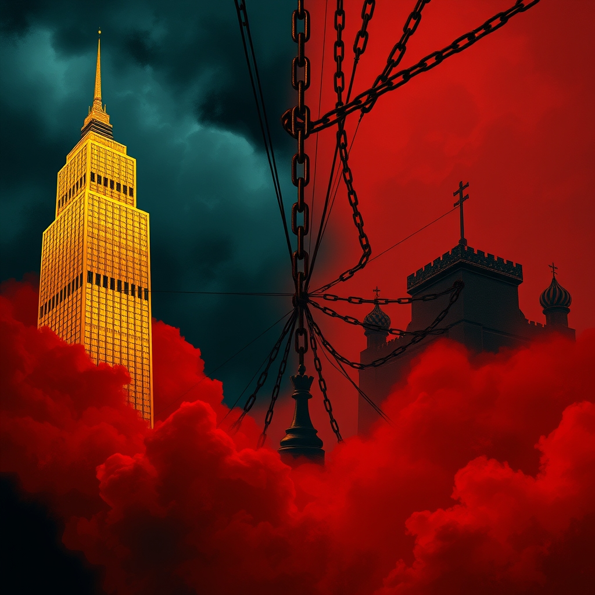

[Home](../index.md) > [Books](./index.md)  
# 🏛️👹🇺🇸🏰👹🇷🇺 House of Trump, House of Putin: The Untold Story of Donald Trump and the Russian Mafia  
  
[🛒 House of Trump, House of Putin: The Untold Story of Donald Trump and the Russian Mafia. As an Amazon Associate I earn from qualifying purchases.](https://amzn.to/40jb28x)  
  
## 📖 Book Report: 🏠 House of Trump, 🇷🇺 House of Putin by Craig Unger  
  
*House of Trump, House of Putin: The Untold Story of Donald Trump and the Russian Mafia*, by Craig Unger, 🕵️ investigates the long-standing connections between 💰 Donald Trump, 🇷🇺 Vladimir Putin, and figures allegedly linked to 🇷🇺 Russian organized crime. 📚 The book argues that these relationships, cultivated over decades, played a significant role in Trump's rise to power.  
  
### 🔑 Key Arguments and Content  
  
* 📅 **Decades-Long Relationship:** 🗓️ The book traces the interactions between Trump and various Russian figures back to the 1970s, highlighting Trump's early ventures in New York real estate and subsequent financial difficulties as potential entry points for Russian money.  
* 💸 **Russian Mafia and Money Laundering:** 🧺 A central thesis is that Trump-branded real estate was used as a vehicle for laundering billions of dollars for the Russian Mafia and associated individuals for decades. 🏢 The book details instances like the purchase of Trump Tower condos with alleged laundered money.  
* 🎯 **Putin's Strategy:** 🇷🇺 Unger posits that Vladimir Putin and his associates strategically targeted and cultivated individuals, including Trump, within the West as part of a long-term mission to undermine Western democracy and restore Russia's global standing.  
* 🤝 **Compromise and Influence:** ⚖️ The book suggests that Trump's financial entanglements and desire for wealth made him vulnerable to Russian influence, arguing that these connections explain his policies and actions that appear to align with Russian interests, such as undermining the Western Alliance.  
* 🕸️ **Intertwined Networks:** 🔗 Unger illustrates the blurring lines between Russian state power, oligarchs, and organized crime, suggesting that working with one often meant dealing with the others.  
  
### ❗ Significance  
  
* ⭐ *House of Trump, House of Putin* presents a comprehensive, albeit controversial, narrative linking Trump's business dealings to Russian state interests and criminal networks.  
* 📰 The book utilizes previous reporting and original investigation to weave a story that some reviewers found more alarming than the details in the Steele dossier.  
* ❄️ Unger argues that the Cold War did not end but merely evolved, with financial and political infiltration becoming key strategies.  
  
### 🗣️ Reception  
  
The book is a 🥇 *New York Times* bestseller. 📰 Reviews have described it as "damning, terrifying and enraging," and a "bombshell." 🧐 It has also faced skepticism, particularly regarding the strength of the evidence presented to support some of its most significant claims.  
  
## 📚 Additional Book Recommendations  
  
### 📖 Similar Reads (Focus on Trump, Russia, Corruption, Organized Crime)  
  
* **[🇷🇺🪝🇺🇸 American Kompromat: How the KGB Cultivated Donald Trump, and Other Tales of Sex, Greed, Power, and Treachery](./american-kompromat-how-the-kgb-cultivated-donald-trump-and-other-tales-of-sex-greed-power-and-treachery.md)** by Craig Unger: Unger's follow-up book, delving further into the alleged cultivation of Trump by Russian intelligence.  
* **[🇷🇺🤫🇺🇸 Collusion: Secret Meetings, Dirty Money, and How Russia Helped Donald Trump Win](./collusion-secret-meetings-dirty-money-and-how-russia-helped-donald-trump-win.md)** by Luke Harding: Explores the connections between the Trump campaign and Russia, drawing on the author's experience as a journalist in Moscow.  
* ⚠️ **Red Notice: A True Story of High Finance, Murder, and One Man's Fight for Justice** by Bill Browder: Details the corruption and danger within the Russian financial system and the lengths Putin's regime will go to protect itself.  
* 👑 **The New Tsar: The Rise and Reign of Vladimir Putin** by Steven Lee Myers: Provides a comprehensive biography of Vladimir Putin and his consolidation of power in Russia.  
* **[💸🌍 Kleptopia: How Dirty Money Is Conquering the World](./kleptopia-how-dirty-money-is-conquering-the-world.md)** by Tom Burgis: Investigates the global flow of illicit finance and its corrosive effects on democracy, with connections to Russia and other authoritarian states.  
  
### ⚖️ Contrasting Reads (Different Perspectives or Challenges to Unger's Thesis)  
  
* 📄 Books focusing on the findings of official investigations, such as the Mueller Report itself or analyses of it, which may draw different conclusions or emphasize different aspects of the Trump-Russia inquiry.  
* 👍 Works offering a more favorable perspective on Donald Trump's presidency or his relationship with Russia, arguing against the notion of compromise or illicit ties. (Specific titles would depend on the desired viewpoint, potentially including Trump's own books or works by his supporters).  
* 🤔 Books critically analyzing the evidence and arguments presented in works like *House of Trump, House of Putin*, perhaps questioning the strength of the connections or offering alternative explanations.  
  
### ✨ Creatively Related Reads (Fiction and Non-Fiction on Related Themes)  
  
* 👨‍👩‍👧‍👦 **The Godfather** by Mario Puzo: A classic fictional exploration of organized crime, power, and family dynamics, relevant for its portrayal of mafia structures and operations.  
* 🕵️ **Tinker Tailor Soldier Spy** by John le Carré: A masterful espionage novel that delves into the complexities of intelligence work, betrayal, and the Cold War, touching on themes of infiltration and double agents.  
* ⛓️ **Gulag Archipelago** by Aleksandr Solzhenitsyn: A monumental work detailing the Soviet forced labor camp system, providing crucial historical context for the nature of the Soviet state and its methods.  
* 💥 **The Looming Tower: Al-Qaeda and the Road to 9/11** by Lawrence Wright: While focused on a different subject, this book's in-depth investigation into the origins and rise of a complex, dangerous entity mirrors Unger's meticulous approach to uncovering hidden networks.  
* 📰 **All the President's Men** by Carl Bernstein and Bob Woodward: The classic account of the Watergate investigation, illustrating the power of investigative journalism to uncover political corruption and abuse of power.  
  
## 💬 [Gemini](../software/gemini.md) Prompt (gemini-2.5-flash-preview-04-17)  
> Write a markdown-formatted (start headings at level H2) book report, followed by a plethora of additional similar, contrasting, and creatively related book recommendations on House of Trump, House of Putin: The Untold Story of Donald Trump and the Russian Mafia. Be thorough in content discussed but concise and economical with your language. Structure the report with section headings and bulleted lists to avoid long blocks of text.  
  
## 🐦 Tweet  
<blockquote class="twitter-tweet" data-theme="dark">
🏛️👹🇺🇸🏰👹🇷🇺 House of Trump, House of Putin: The Untold Story of Donald Trump and the Russian Mafia  💰 Money Laundering | 🇷🇺 Organized Crime | 🤝 Undermining Democracy | 🏢 Real Estate | 🕵️‍♂️ Intelligence | 💸 Financial Entanglements<a href="https://twitter.com/craigunger?ref_src=twsrc%5Etfw">@craigunger</a><a href="https://t.co/2M2CwFHg5f">https://t.co/2M2CwFHg5f</a>
&mdash; Bryan Grounds (@bagrounds) <a href="https://twitter.com/bagrounds/status/1944579772442423663?ref_src=twsrc%5Etfw">July 14, 2025</a></blockquote> 