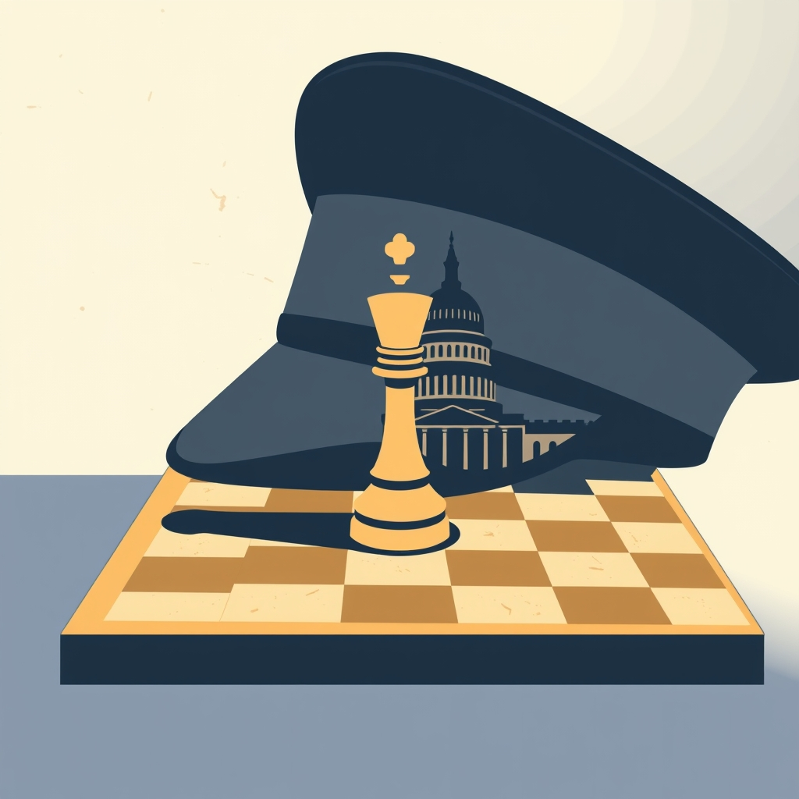

[Home](../index.md) > [Books](./index.md)  
# 🇺🇸🪖♟️🔍⚖️🕊️🤝 How Ike Led: The Principles Behind Eisenhower's Biggest Decisions  
  
[🛒 How Ike Led: The Principles Behind Eisenhower's Biggest Decisions. As an Amazon Associate I earn from qualifying purchases.](https://amzn.to/4dOJKMN)  
  
## 📖 Book Report: How Ike Led: The Principles Behind Eisenhower's Biggest Decisions  
  
### 📝 Summary  
  
👩‍🦳 Susan Eisenhower's *How Ike Led: The Principles Behind Eisenhower's Biggest Decisions* offers a compelling examination of Dwight D. Eisenhower's leadership, drawing on his core principles to illuminate the rationale behind his most significant choices during his extensive military career and two terms as president. 🧑‍🎓 Combining historical analysis, biographical detail, and personal insights from his granddaughter, the book presents Eisenhower as a strategic leader who prioritized facts, accountability, and national unity. 🧭 It explores how his character, discipline, and unique approach, often termed the "Middle Way," enabled him to navigate complex challenges from the battlefields of World War II to the political landscape of the Cold War era.  
  
### ⭐ Key Principles of Eisenhower's Leadership  
  
* 🧠 **Strategic Thinking:** Eisenhower was a strategic, not merely operational, leader, consistently focusing on the long game and understanding the broader implications and consequences of decisions.  
* 🔎 **Fact-Based Decision Making:** He relied on a rigorous pursuit of facts and sought diverse perspectives, often appointing strong debaters to explore issues thoroughly before making a decision.  
* ✅ **Accountability:** A bedrock principle for Eisenhower was taking full personal responsibility for his decisions, famously demonstrated by the note he prepared in case the D-Day invasion failed.  
* ⚖️ **The "Middle Way":** As president, Eisenhower championed a centrist approach, seeking national unity and outcomes that benefited the whole country rather than catering to political extremes.  
* 🕊️ **Humility and Self-Mastery:** Despite his immense power, Eisenhower remained humble and worked to control a formidable temper, prioritizing the nation's welfare over personal recognition. 🚫 He avoided making emotional decisions.  
* 🤝 **Putting Others First:** He devoted himself to the mission and the well-being of his team and the nation above personal considerations, showing respect for people at all levels.  
  
### 🤔 Discussed Decisions and Examples  
  
👩‍🏫 Susan Eisenhower illustrates these principles through key moments in Eisenhower's career:  
  
* ⚔️ **World War II:** His leadership as Supreme Allied Commander, including the planning and execution of D-Day.  
* 🥶 **Cold War Crises:** His handling of events such as the Korean War, the Suez Crisis, and the Hungarian Uprising.  
* 🏛️ **Domestic Policies:** Decisions related to the Interstate Highway System, the Space Race, and navigating a divided Congress.  
* ✊🏿 **Civil Rights:** His actions during the integration of schools in Little Rock, Arkansas, and his earlier efforts to desegregate the military blood supply and schools in Washington D.C..  
* 🤫 **McCarthyism:** His strategic approach to undermining Senator Joseph McCarthy without directly engaging him and providing him further platform.  
* 👨‍⚖️ **Supreme Court Appointments:** His belief in appointing justices from diverse ideological viewpoints, including a Democrat.  
  
### ✍️ Author's Perspective  
  
🙋‍♀️ As Eisenhower's granddaughter, Susan Eisenhower brings a unique and personal dimension to the narrative, offering insights and anecdotes that enrich the understanding of the man behind the public figure. 📚 Her perspective, combined with extensive research and interviews, provides a nuanced portrait of Eisenhower's character and how his upbringing and experiences shaped his leadership philosophy.  
  
## 📚 Additional Book Recommendations  
  
### 👍 Similar Books (Focus on Eisenhower, Presidential Leadership, Strategic Decision Making)  
  
* **On Eisenhower's Leadership and Life:**  
    * 👴 *Eisenhower on Leadership: Ike's Enduring Lessons in Total Victory Management* by Alan Axelrod and Peter Georgescu: Explores Eisenhower's leadership lessons applicable to various contexts.  
    * 🤝 *Eisenhower and the Art of Collaborative Leadership* by Anthony J. Dimaggio: Examines Eisenhower's skill in team-building and working through formal structures.  
    * 🕵️ *The Hidden-Hand Presidency: Eisenhower as Leader* by Fred I. Greenstein: A foundational text in Eisenhower revisionism, arguing for his purposeful, behind-the-scenes leadership style.  
    * ⭐ *Eisenhower: Soldier and President* by Stephen E. Ambrose: A comprehensive biography covering his entire career.  
    * 📖 *Crusade in Europe: A Personal Account of World War II* by Dwight D. Eisenhower: Eisenhower's own account of the war, offering direct insight into his strategic thinking and leadership challenges.  
* **On Presidential Leadership Styles:**  
    * 👑 *The Presidential Difference: Leadership Style from FDR to Barack Obama* by Fred I. Greenstein: Analyzes the leadership styles of modern presidents using a consistent framework.  
    * 🇺🇸 *Inventing the Job of President: Leadership Style from George Washington to Andrew Jackson* by Fred I. Greenstein: Extends the analysis of presidential leadership styles to the early American presidents.  
    * 🤝 *Leadership in the Modern Presidency* edited by Fred I. Greenstein: A collection of essays assessing the leadership and organizational talents of presidents.  
    * 🗣️ *The President's Club: Inside the World's Most Exclusive Fraternity* by Nancy Gibbs and Michael Duffy: Explores the relationships and interactions between former and current presidents, offering insights into the unique fraternity of the presidency.  
* **On Strategic Decision Making:**  
    * [🤔💡⚖️✅ Decisive: How to Make Better Choices in Life and Work](./decisive-how-to-make-better-choices-in-life-and-work.md) by Chip Heath and Dan Heath: Provides a framework for making better decisions by overcoming common biases.  
    * [🎲🤔 Thinking in Bets: Making Smarter Decisions When You Don't Have All the Facts](./thinking-in-bets-making-smarter-decisions-when-you-dont-have-all-the-facts.md) by Annie Duke: Uses poker as a metaphor to teach probabilistic thinking and decision-making under uncertainty.  
    * 🎯 *Good Strategy Bad Strategy: The Difference and Why It Matters* by Richard P. Rumelt: Defines what constitutes good strategy and identifies the hallmarks of bad strategy.  
    * 🗺️ *The Decision Book: Fifty Models for Strategic Thinking* by Mikael Krogerus and Roman Tschäppeler: Presents 50 different models for strategic thinking and decision-making.  
  
### 🆚 Contrasting Books (Different Leadership Styles or Contexts)  
  
* **Contrasting Presidential Styles:**  
    * 🎭 Fred I. Greenstein's *The Presidential Difference* series can be used to contrast Eisenhower's style with those of presidents who were less emotionally intelligent, less strategic, or more overtly political.  
* **Decision Making in Different Contexts:**  
    * ❓ *Uncertain Perceptions: U.S. Cold War Crisis Decision Making* by Robert B. McCalla: Examines the role of misperceptions in U.S. decision-making during Cold War crises, offering a different perspective on the challenges of the era.  
  
### 💡 Creatively Related Books (Themes and Contexts)  
  
* **Cold War Context and Strategy:**  
    * 🥶 *Mysteries of the Cold War* edited by Stephen J. Cimbala: Revisits key policy puzzles and decision-making anomalies of the Cold War.  
    * 🧊 *The Great Cold War* by Gordon Barrass: Explores the Cold War through the lens of how each side interpreted the other's intentions.  
    * 🕵️‍♂️ *Strategic Intelligence in the Cold War and Beyond* by Jefferson Adams: Examines the role of intelligence during the Cold War.  
    * 📉 *The Falling Dominoes Book: Unraveling the Domino Theory in US Cold War Strategy*: Focuses on a specific strategic concept that influenced US policy during the Cold War.  
    * 🇷🇺 *Soviet Decisionmaking for National Security* by Jiri Valenta: Analyzes the Soviet process for national security decisions during the Cold War, providing a contrasting viewpoint.  
* **Military Leadership and Strategy:**  
    * ⚔️ [🎨⚔️ The Art of War](./the-art-of-war.md) by Sun Tzu: A classic treatise on military strategy with timeless principles applicable to leadership.  
    * 🪖 *Patton: A Genius for War* by Carlo D'Este: A biography of General George S. Patton, offering a contrasting, more flamboyant leadership style to Eisenhower's.  
* **Psychology of Decision Making:**  
    * [🤔🐇🐢 Thinking, Fast and Slow](./thinking-fast-and-slow.md) by Daniel Kahneman: Explains the two systems of thought that influence decision-making, providing a scientific basis for understanding cognitive processes.  
    * [⚡🚫💭 Blink: The Power of Thinking Without Thinking](./blink-the-power-of-thinking-without-thinking.md) by Malcolm Gladwell: Explores the power of rapid cognition and instantaneous judgments.  
    * [👉🤏 Nudge: Improving Decisions about Health, Wealth, and Happiness](./nudge.md) by Richard H. Thaler and Cass R. Sunstein: Examines how subtle changes in the way choices are presented can influence decision-making.  
  
## 💬 [Gemini](../software/gemini.md) Prompt (gemini-2.5-flash-preview-04-17)  
> Write a markdown-formatted (start headings at level H2) book report, followed by a plethora of additional similar, contrasting, and creatively related book recommendations on How Ike Led: The Principles Behind Eisenhower's Biggest Decisions. Be thorough in content discussed but concise and economical with your language. Structure the report with section headings and bulleted lists to avoid long blocks of text.  
  
## 🐦 Tweet  
<blockquote class="twitter-tweet" data-theme="dark">
🇺🇸🪖♟️🔍⚖️🕊️🤝 How Ike Led: The Principles Behind Eisenhower’s Biggest Decisions  🗝️ Principles | 🪖 Leadership | 🤔 Decisions<a href="https://t.co/wa2o25L5lV">https://t.co/wa2o25L5lV</a>
&mdash; Bryan Grounds (@bagrounds) <a href="https://twitter.com/bagrounds/status/1930658046415675889?ref_src=twsrc%5Etfw">June 5, 2025</a></blockquote> 