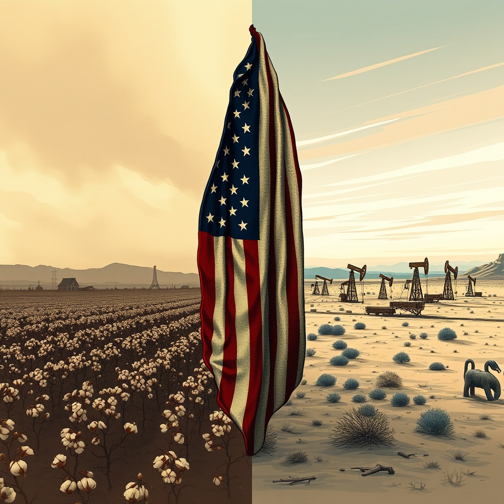

[Home](../index.md) > [Books](./index.md) | [🏛️🇺🇸📖 Heather Cox Richardson](../people/heather-cox-richardson.md)  
# 🇺🇲⚔️ How the South Won the Civil War: Oligarchy, Democracy, and the Continuing Fight for the Soul of America  
  
[🛒 How the South Won the Civil War: Oligarchy, Democracy, and the Continuing Fight for the Soul of America. As an Amazon Associate I earn from qualifying purchases.](https://amzn.to/3WDO8qn)  
  
⚔️💸🇺🇸 Despite the Union's military victory, the South's oligarchic, anti-democratic ideology of white male supremacy spread west after the Civil War, ultimately shaping American politics and society through today's conservative movement.  
  
## 🏆 Heather Cox Richardson's How the South Won the Civil War Strategy  
  
### 👑 Oligarchic Principles  
* 🧍 Hierarchy, Not Equality: Power concentrated among wealthy white men.  
* 🔓 Freedom Redefined: Individual liberty for elites, often built on subjugation of others.  
* 🛡️ States' Rights as Shield: Local control used to maintain racial and economic subordination.  
* 🚫 Anti-Federal Intervention: Resistance to national efforts promoting civil rights or economic redistribution.  
  
### ➡️ Post-Civil War Transmission  
* 🌍 Western Expansion: Southern ideology found new fertile ground in the American West.  
    * 🤠 Myth of the Cowboy: Replaced the yeoman farmer as icon of rugged individualism, often masking corporate power and racial violence.  
    * ⛏️ Extractive Industries: Mining, cattle, oil industries fostered concentrated wealth and power, mirroring Southern plantation systems.  
    * 😠 Racial Subordination: Juan Crow laws and violence against Native Americans, Mexicans, and Chinese reinforced hierarchies.  
* 🗳️ Political Realignment: Southern Democrats, alienated by civil rights, shifted to the Republican Party.  
  
### ⏳ Enduring Legacy  
* Conservative Movement: Adopted and championed oligarchic ideals, prioritizing business interests and limited government.  
* 📣 Weaponized Language: Concepts like individual liberty and small government deployed to dismantle regulations and social safety nets.  
* Unequal Inequality: Continual efforts to limit voting rights and economic opportunity for marginalized groups.  
  
## ⚖️ Critical Evaluation  
  
* 🎯 Core Claim Validation: Richardson's central argument posits that the South's oligarchic, hierarchical principles, based on racial and social subordination, were not definitively vanquished by the Civil War but instead found new life and influence, particularly in the American West, continuing to shape national politics and ultimately manifest in modern conservative movements and threats to democracy.  
* 📜 Broad Historical Synthesis: Reviewers commend Richardson's ambitious and stunning analytical scope, effectively drawing connections between the antebellum South, Western expansion, Reconstruction, the Southern Strategy, and contemporary political dynamics.  
* 📅 Contemporary Relevance: The book is widely recognized as a book for our times, offering valuable historical context for understanding current political crises, including the rise of specific political figures and movements.  
* ✅ Evidential Support: Richardson marshals strong support for her thesis by linking diverse elements from personal connections to congressional voting patterns, demonstrating how oligarchs used imagery like the independent cowboy to maintain power.  
* 🤔 Minor Critiques: While largely praised, some analyses suggest that Richardson occasionally extends her thesis into popular culture in ways that may slightly undermine her argument, such as questioning the relevance of The Wizard of Oz. Another critique notes that more explicit exploration of how these ideas manifested (or didn't) in the Northeast could have further strengthened the narrative.  
* 💯 Final Verdict: Heather Cox Richardson's How the South Won the Civil War offers a compelling, well-supported, and critically important reinterpretation of American history, powerfully demonstrating the enduring struggle between democratic ideals and the persistent influence of oligarchic principles throughout the nation's development. Its insightful connections between historical events and current political challenges make it a highly valuable contribution to understanding the continuing fight for the soul of America.  
  
## 🔍 Topics for Further Understanding  
  
* 🌐 The global phenomenon of democratic backsliding and authoritarian creep.  
* 🧠 The psychological and sociological underpinnings of adherence to hierarchical social structures.  
* 💰 The impact of concentrated wealth and corporate lobbying on legislative processes and policy outcomes.  
* 🔄 Alternative historical interpretations of the Civil War's aftermath and Reconstruction's failures.  
* 📚 The role of education and public discourse in countering historical revisionism and promoting democratic values.  
  
## ❓ Frequently Asked Questions (FAQ)  
  
### 💡 Q: What is the main argument of How the South Won the Civil War?  
✅ A: Heather Cox Richardson argues that the Confederacy's oligarchic ideology, emphasizing hierarchy over equality, was not vanquished by the Civil War but instead spread westward and continues to influence American politics, undermining democratic principles today.  
  
### 💡 Q: How does How the South Won the Civil War connect the South and the American West?  
✅ A: Richardson contends that after the Civil War, Southern oligarchic ideals found a new home in the West, where extractive industries and the myth of the independent cowboy fostered similar hierarchical systems, often at the expense of racial minorities.  
  
### 💡 Q: What is the Southern Strategy mentioned in How the South Won the Civil War?  
✅ A: The Southern Strategy refers to a Republican Party electoral tactic from the 1960s onward, aimed at gaining support from white Southern voters by appealing to racial tensions and conservative values, thereby realigning the region's political loyalties.  
  
### 💡 Q: Does How the South Won the Civil War discuss the legacy of Jim Crow?  
✅ A: Yes, the book connects the post-Reconstruction era's Jim Crow laws, which institutionalized racial segregation and disenfranchisement, to the broader theme of persistent oligarchy and the suppression of democratic rights for non-white populations.  
  
## 📚 Book Recommendations  
  
### 👍 Similar  
* [🏛️☀️⬆️ Democracy Awakening: 📝 Notes on the State of 🇺🇸 America](./democracy-awakening.md) by Heather Cox Richardson  
* [🧑🏿⛓️🙈 The New Jim Crow: Mass Incarceration in the Age of Colorblindness](./the-new-jim-crow-mass-incarceration-in-the-age-of-colorblindness.md) by Michelle Alexander  
* [🇺🇸📖 These Truths: A History of the United States](./these-truths-a-history-of-the-united-states.md) by Jill Lepore  
  
### 👎 Contrasting  
* 📖 The Myth of the Lost Cause Why the South Fought the Civil War and Why the North Won by Gary W. Gallagher  
* 📖 Albion's Seed Four British Folkways in America by David Hackett Fischer  
  
### 🔗 Related  
* [💰🤫 Dark Money: The Hidden History of the Billionaires Behind the Rise of the Radical Right](./dark-money-the-hidden-history-of-the-billionaires-behind-the-rise-of-the-radical-right.md) by Jane Mayer  
* 📖 Stamped From the Beginning The Definitive History of Racist Ideas in America by Ibram X. Kendi  
  
## 🫵 What Do You Think?  
  
🤔 Which historical period discussed in How the South Won the Civil War do you find most impactful on today's political landscape, and why?.