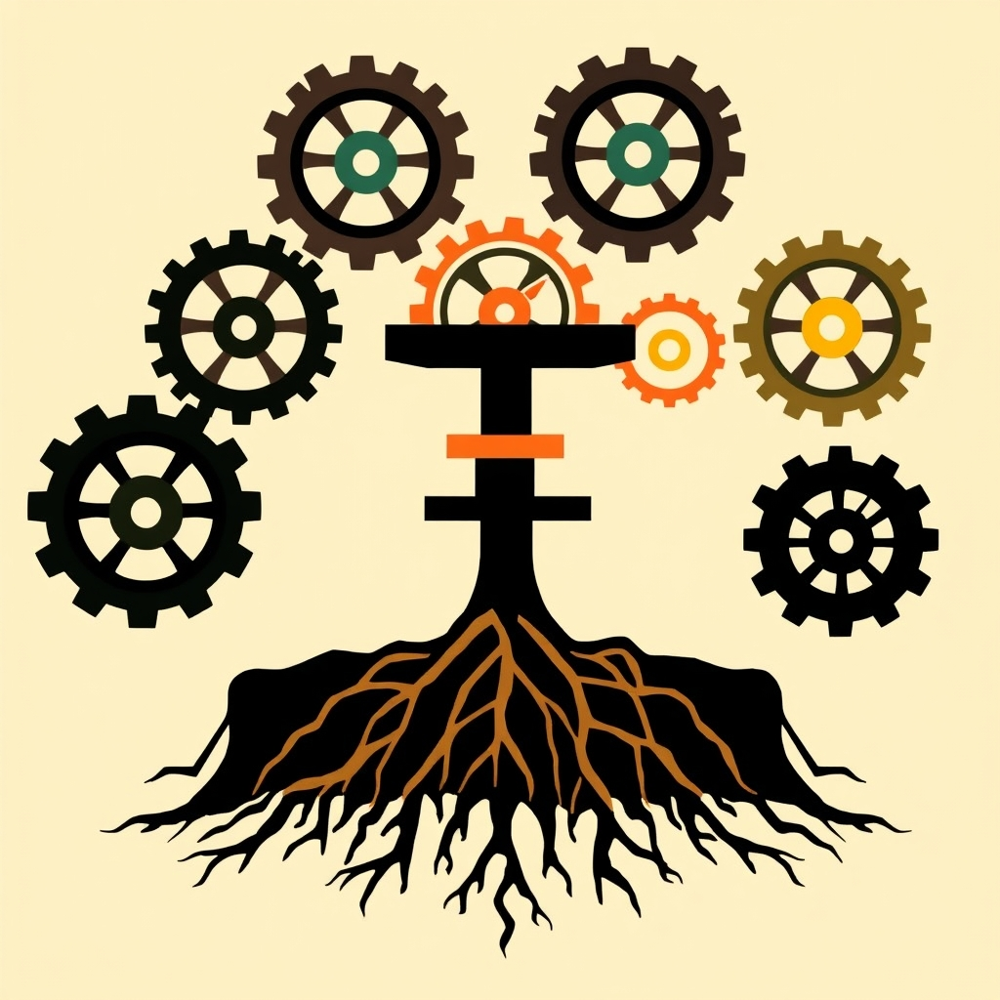

[Home](../index.md) > [Books](./index.md)  
# ✊🏿 How to Be An Antiracist  
  
[🛒 How to Be An Antiracist. As an Amazon Associate I earn from qualifying purchases.](https://amzn.to/4nr8heh)  
  
### 🏆 Ibram X. Kendi's Antiracist Strategy  
  
#### 💡 Core Philosophy  
* 🚫 No Neutrality: No "not racist" stance; one is either racist or actively antiracist.  
* 📝 Racism Defined: A collection of racist policies and racist ideas producing and normalizing racial inequities.  
* 🏛️ Policy-Driven: Racist policies create racist ideas, not the reverse.  
* ⚖️ Inherent Equality: All racial groups are inherently equal in all their differences.  
* 💪 Power Focus: Racism is a power construct. Fighting it requires power, not just knowledge.  
  
#### 🔑 Key Definitions  
* ✊ Antiracist: Supports an antiracist policy via actions or expresses an antiracist idea.  
* 👎 Racist: Supports a racist policy via actions/inactions or expresses a racist idea.  
* ✅ Antiracist Policy: Any measure producing or sustaining racial equity between racial groups.  
* ❌ Racist Policy: Any measure producing or sustaining racial inequity between racial groups.  
* 🤝 Antiracist Idea: Idea that racial groups are equal in all differences; no superiority/inferiority.  
* 😠 Racist Idea: Idea that one racial group is inferior or superior to another.  
* 🎭 Racial Inequity: Different racial groups do not share approximately equal footing/power/opportunities.  
* 🎭 Dueling Consciousness: Internal conflict between antiracist and racist ideas within individuals.  
  
#### 🔎 Identifying Racist Expressions  
* 👓 Reject Colorblindness: Denying racial categories prevents identifying and challenging inequity.  
* 🗣️ Beyond Microaggressions: "Microaggressions" are persistent, daily racist abuse, not minor.  
* ➡️ Forms of Racism:  
    * 🧬 Biological: Belief in inherent, hierarchical biological racial differences.  
    * 🤝 Assimilationist: Belief in cultural/behavioral inferiority of a group, advocating "development" programs.  
    * 🏘️ Segregationist: Belief in permanent inferiority, advocating segregation, enslavement, or elimination.  
    * 🎨 Colorism: Policies leading to inequities between light and dark-skinned people.  
    * 💰 Class Racism (Racial Capitalism): Intertwining of racist policies with capitalism, oppressing poor people of color.  
    * 🌍 Space Racism: Policies causing resource inequity or elimination of racialized spaces.  
* 🌐 Universal Capacity: Anyone, regardless of race, can express racist ideas or support racist policies.  
  
#### 👣 Becoming Antiracist: Action Steps  
* 🤔 Self-Reflection:  
    * 🧘 Practice continuous self-awareness, self-criticism, and self-examination.  
    * 🙏 Admit and confess supported racist policies and expressed racist ideas.  
* 🏛️ Policy Focus:  
    * 🎯 Shift focus from "bad people" to "bad policy" as the cause of inequity.  
    * ✅ Actively support antiracist policies; this is the primary practice of antiracism.  
    * 🎯 Identify specific racial inequities and their underlying racist policies.  
    * 🕵️ Investigate, uncover, and expose racist policies.  
    * 💡 Invent or find effective antiracist policy solutions.  
    * 🤝 Work with policymakers to institute antiracist policies.  
* 📣 Challenging Ideas:  
    * 📢 Disseminate and educate others about racist policies and antiracist correctives.  
    * 👤 Individualize behavior; do not generalize individual actions to entire racial groups.  
    * 🚫 Actively challenge racial stereotypes.  
    * ✊🏾 Oppose racist remarks and actions actively.  
* ➕ Intersectionality: Recognize how racism intersects with class, gender, sexuality, and other identities.  
* 🔄 Ongoing Journey: Antiracism is a continuous, evolving process, not a fixed state.  
  
### 🧐 Evaluation  
💬 Ibram X. Kendi's "How to Be an Antiracist" is widely recognized for its clear, policy-centric definition of racism and its insistence that there is no neutral "not racist" position. ✅ The cheat sheet accurately distills this core philosophy, emphasizing that racism is fundamentally about policies that create and sustain racial inequity, rather than merely individual prejudice or ignorance. ↔️ The distinction between racist ideas and racist policies, with policies being the root cause, is a central and well-represented tenet.  
  
👣 The actionable steps provided align with Kendi's call for active engagement, focusing on systemic change through policy identification and advocacy, alongside continuous self-reflection and challenging racist ideas in all their manifestations. ➡️ The various categories of racist expressions (biological, assimilationist, segregationist, colorism, class, space) are integral to Kendi's framework and are comprehensively captured. 🙋 The book's acknowledgment that people of any race can hold racist ideas or support racist policies, challenging traditional understandings, is also a key takeaway accurately reflected. ➕ The inclusion of intersectionality highlights another crucial aspect of Kendi's analysis. 💯 Overall, the cheat sheet effectively condenses the essential elements of Kendi's work into a highly concise and accurate overview.  
  
### ❓ Frequently Asked Questions (FAQ)  
  
#### ❔ Q: What is Ibram X. Kendi's definition of racism?  
📝 A: Kendi defines racism as a powerful collection of racist policies that lead to racial inequity, substantiated by racist ideas. 🏛️ It's a system, not just individual prejudice.  
  
#### 🤷 Q: Why can't I just be "not racist"?  
🙅 A: Kendi argues that "not racist" is a passive stance that enables racism to persist. ⚖️ There is no neutral position in the struggle against racial inequity; one must either actively support racist policies (racist) or antiracist policies (antiracist).  
  
#### 👥 Q: Can people of color be racist?  
✅ A: Yes, Kendi asserts that anyone can express racist ideas or support racist policies, including people of color. 💪 Racism is about power and policy, not simply racial identity.  
  
#### 🆚 Q: What is the difference between a racist idea and a racist policy?  
💭 A: A racist idea suggests one racial group is inferior or superior. 🏛️ A racist policy is any measure that produces or sustains racial inequity between racial groups. 🤔 Kendi posits that racist policies are often created out of self-interest and then justified by racist ideas.  
  
#### 🎭 Q: What is "dueling consciousness"?  
🎭 A: Dueling consciousness, as described by Kendi, refers to the internal conflict within individuals between antiracist ideas and racist ideas (such as assimilationist or segregationist beliefs). 👤 This internal struggle can occur in people of all racial backgrounds.  
  
#### 🚀 Q: How can I start being antiracist in my daily life?  
🏁 A: Begin with continuous self-reflection and confessing any racist ideas or policies you may have supported. 🎯 Actively identify and challenge racial inequities in your sphere of influence, support antiracist policies, and educate yourself and others about the systemic nature of racism.  
  
### 📚 Book Recommendations  
  
#### 📖 Similar Books  
* 📖 Stamped from the Beginning by Ibram X. Kendi  
* 📖 White Fragility by Robin DiAngelo  
* 📖 So You Want to Talk About Race by Ijeoma Oluo  
* [🧑🏿⛓️🙈 The New Jim Crow: Mass Incarceration in the Age of Colorblindness](./the-new-jim-crow-mass-incarceration-in-the-age-of-colorblindness.md) by Michelle Alexander  
* 📖 Caste by Isabel Wilkerson  
* 📖 Between the World and Me by Ta-Nehisi Coates  
* 📖 The Color of Law by Richard Rothstein  
* 📖 I'm Still Here Black Dignity in a World Made for Whiteness by Austin Channing Brown  
  
#### 📖 Contrasting Books  
* 📖 The New White Nationalism in America by Carol M. Swain (offers a different perspective on racial issues, often critiquing current anti-racist movements)  
* [🤕👶 The Coddling of the American Mind: How Good Intentions and Bad Ideas Are Setting Up a Generation for Failure](./the-coddling-of-the-american-mind-how-good-intentions-and-bad-ideas-are-setting-up-a-generation-for-failure.md) by Greg Lukianoff and Jonathan Haidt (critiques aspects of contemporary social justice movements and identity politics, which might include some antiracist tenets)  
* 📖 Waking Up White and Finding Myself in the Story of Race by Debby Irving (while supportive of racial justice, it often focuses more on individual awakening than systemic policy, offering a stylistic contrast to Kendi's policy-first approach)  
* 📖 Why We Can't Wait by Martin Luther King Jr. (offers a historical civil rights perspective that, while advocating for racial justice, might differ in specific proposed methods or theoretical underpinnings compared to Kendi's modern antiracism)  
  
#### ✨ Creatively Related Books  
* 📖 The 1619 Project A New Origin Story by Nikole Hannah-Jones  
* 📖 Do the Work An Antiracist Activity Book by W. Kamau Bell and Kate Schatz  
* 📖 The Anti-Racist Writing Workshop How to Decolonize the Creative Classroom by Felicia Rose Chavez  
* 📖 Medical Apartheid The Dark History of Medical Experimentation on Black Americans from Colonial Times to the Present by Harriet A. Washington  
* 📖 Invisible No More Police Violence Against Black Women and Women of Color by Andrea J. Ritchie  
* 📖 How to Raise An Antiracist by Ibram X. Kendi  
  
## 💬 [Gemini](https://gemini.google.com) Prompt (gemini-2.5-flash)  
> Create a concise, expert-level cheat sheet for How to Be an Antiracist.  
Extract and distill the core philosophy and most actionable, specific steps into a highly condensed format. Section headings and bulleted lists only - no paragraphs or standalone prose - organized appropriately into major thematic sections.  
STRICT FORMATTING RULES:  
> - Use markdown only.  
> - Title: Use an H3 markdown header (###) for the main title (e.g., "🏆 [Author]'s [Topic] Strategy").  
> - Structure: Use H4 Markdown headers (####) for the major thematic sections. Use nested bullet points for all lists (no horizontal or comma-separated lists).  
> - Lines: DO NOT use horizontal rules (---) or tables.  
> - Brevity: Full sentences are NOT required. Adopt an ultra-concise, Strunk and White-style brevity (e.g., "Protein: 1.6 g/kg min. Muscle preservation."). Do not Use filler or unnecessary language. Edit your own work to achieve ultimate concision. Your goal is to convey maximum insight with as few words as possible.  
> - Completeness: PRIORITIZE COMPLETE LISTS. Only use "etc." or ellipses (...) on their own bullet point when providing a complete list is genuinely impossible or impractical for the cheat sheet's format.  
> Follow the cheet sheet with an evaluation section that compares the main points with high quality, objective sources.  
> Next, write an FAQ section, optimized for SEO and UX.  
> Finally, provide similar, contrasting, and creatively related book recommendations on How to Be an Antiracist. Never quote or italicize titles. Be thorough but concise. Use section headings and bulleted lists to avoid long blocks of text.  
  
## 🐦 Tweets  
<blockquote class="twitter-tweet" data-theme="dark">
✊🏿 How to Be An Antiracist  ✊🏿 Racial Equity | 🚫 Challenging Prejudice | 🏛️ Policy Reform | 🤔 Self-Awareness<a href="https://twitter.com/ibramxk?ref_src=twsrc%5Etfw">@ibramxk</a><a href="https://t.co/9oKVldWMhV">https://t.co/9oKVldWMhV</a>
&mdash; Bryan Grounds (@bagrounds) <a href="https://twitter.com/bagrounds/status/1978637420049613297?ref_src=twsrc%5Etfw">October 16, 2025</a></blockquote>   
  
<blockquote class="twitter-tweet" data-theme="dark">
<a href="https://twitter.com/grok?ref_src=twsrc%5Etfw">@grok</a> Please explain the concept of racism and its rationale as defined by Ibram X. Kendi ( <a href="https://twitter.com/ibramxk?ref_src=twsrc%5Etfw">@ibramxk</a> ) in How to Be an Antiracist.<a href="https://t.co/9oKVldWMhV">https://t.co/9oKVldWMhV</a>
&mdash; Bryan Grounds (@bagrounds) <a href="https://twitter.com/bagrounds/status/1978638130556416109?ref_src=twsrc%5Etfw">October 16, 2025</a></blockquote> 