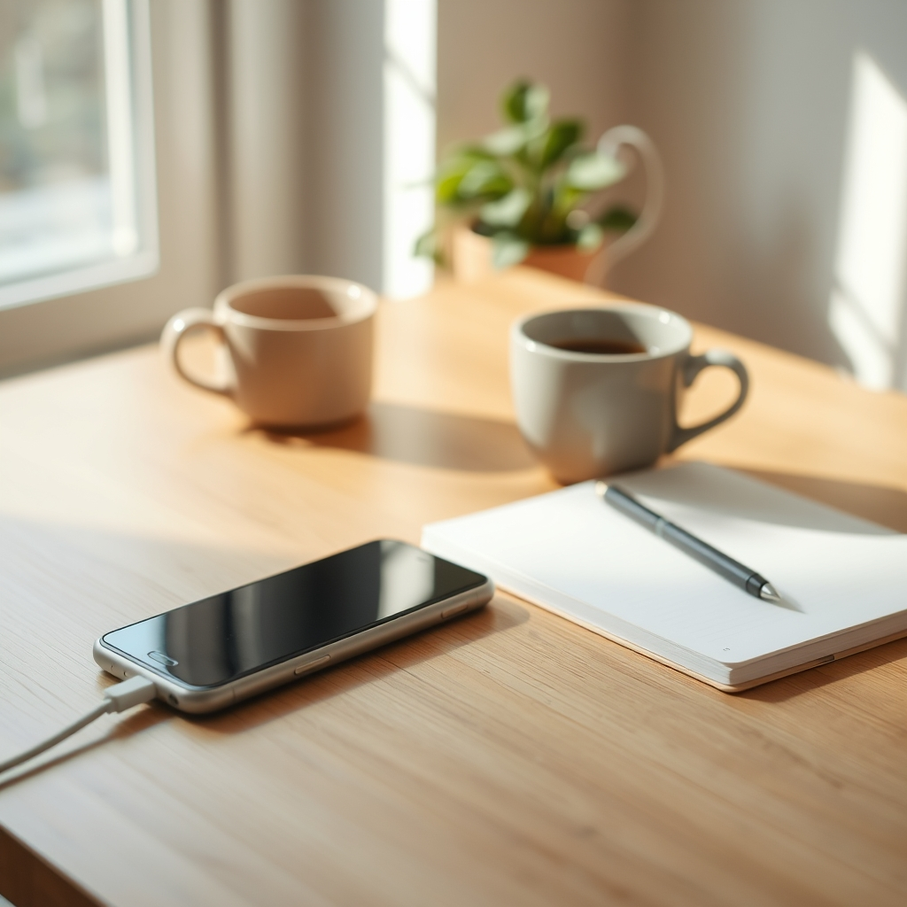

[Home](../index.md) > [Books](./index.md)  
# 📱💔 How to Break Up with Your Phone: The 30-Day Plan to Take Back Your Life  
  
[🛒 How to Break Up with Your Phone: The 30-Day Plan to Take Back Your Life. As an Amazon Associate I earn from qualifying purchases.](https://amzn.to/3J8wcAP)  
  
### 🏆 Catherine Price's How to Break Up with Your Phone Cheat Sheet  
  
#### 🎯 Core Philosophy  
* ✨ **Intentionality:** Shift from mindless phone use to purposeful engagement.  
* 🌱 **Reclaim Life:** Goal is to live more, not just use phone less.  
* 🤝 **Redefine Relationship:** Build a healthy, conscious relationship with technology. Not abstinence, but balance.  
* 🧠 **Understand Addiction:** Recognize phones and apps are designed to be addictive (dopamine, notifications).  
* 🔄 **Neuroplasticity:** Brain damage from overuse is reversible; attention can be rebuilt.  
  
#### 🗓️ The 30-Day Plan: Actionable Steps  
  
##### ⏰ **Phase 1: The Wake-Up & Technology Triage (Weeks 1-2)**  
* 📊 **Assess Usage:**  
    * 📱 Day 1-2: Download a tracking app (e.g., Moment, Offtime). Monitor pickups, screen time.  
    * ✍️ Day 2: Journal your relationship with your phone (what you love/dislike, observed changes).  
    * 🤔 Day 3: Pay attention to feelings before, during, after use. Note interruptions.  
    * 🧐 Day 4: Review tracking data. Confront reality of usage.  
* ⚙️ **Optimize Device Settings:**  
    * 🔕 Turn off most notifications. Allow only essential calls, select messages, calendar.  
    * 📲 Delete distracting social media apps from phone.  
    * ➡️ Move tempting apps off home screen/dock.  
    * ⚫ Change screen to grayscale.  
* 🚧 **Establish Boundaries:**  
    * 📵 Create phone-free zones (e.g., bedroom, dinner table).  
    * ⏳ Implement phone-free times (e.g., first hour of morning, last hour before bed).  
    * ⏰ Do not use phone as alarm clock.  
  
##### 🧠 **Phase 2: Reclaiming Your Brain & New Relationship (Weeks 3-4)**  
* 🧘 **Mindfulness & Attention:**  
    * 😌 Day 15-16: Practice "Stop, Breathe, Be" technique. Pause before instinctively reaching for phone.  
    * 🎯 Day 17-18: Exercise attention. Focus on a single task, meditate.  
* 💔 **Trial Separation:**  
    * ✍️ Day 19: Prepare for a 24-hour phone-free period (inform others, set auto-replies).  
    * 📵 Day 20-21: Undertake a full 24-hour phone detox. Keep a notepad for thoughts/tasks.  
    * 💭 Day 22-23: Reflect on the separation. What did you like/dislike?  
* 🎨 **Cultivate Alternatives:**  
    * 🤸 Fill freed time with real-life activities: hobbies, physical activity, creative pursuits, in-person social interaction.  
    * 🌟 Actively pursue things you "always wanted to do."  
* ❤️ **Forge New Relationship:**  
    * 🧹 Day 24-26: "Tidy up" remaining digital habits.  
    * ✨ Define your ideal long-term relationship with your phone. What purpose does it serve?  
    * 📜 Create a "Phone Manifesto" outlining your rules and intentions for ongoing use.  
  
#### ❓ The Three W's  
* 👉 Before picking up phone, ask:  
    * 🤔 **What For?** Purpose of picking it up.  
    * ⏰ **Why Now?** Urgency of this moment.  
    * 💡 **What Else?** Alternative activities.  
  
### ✅ Evaluation  
  
Catherine Price's "How to Break Up with Your Phone" is widely praised for its practical, actionable, and evidence-based approach to digital well-being. Reviewers and summaries consistently highlight several core strengths that align with high-quality, objective sources on technology addiction and behavioral change.  
  
* 🔬 **Evidence-Based Foundation:** The book effectively explains the psychological mechanisms behind smartphone addiction, such as dopamine release and the design tactics used by app developers to keep users hooked. This aligns with scientific consensus on behavioral addiction and tech's impact on the brain. Many sources confirm that excessive phone use negatively impacts attention span, focus, memory, and contributes to increased anxiety and stress.  
* 🪜 **Practical 30-Day Plan:** The structured, day-by-day plan is a key differentiator. Rather than vague advice, it offers concrete steps, making the daunting task of reducing phone reliance manageable. This step-by-step guidance, including suggestions like tracking usage, disabling notifications, and implementing phone-free zones, is echoed in recommendations from digital wellness experts and therapists.  
* 🎯 **Focus on Intentionality, Not Abstinence:** The book's philosophy of "breaking up to make up" and fostering an intentional, healthier long-term relationship with technology, rather than complete abandonment, is highly valued. This realistic approach acknowledges that smartphones are integrated into modern life and aims for balance, which is often more sustainable than strict digital detoxes.  
* 🌍 **Holistic Approach:** Price's method extends beyond just phone usage, incorporating mindfulness, attention exercises, and encouraging engagement in real-life activities to fill the void left by reduced screen time. This comprehensive strategy is supported by research indicating that replacing old habits with new, positive ones is crucial for behavioral change.  
  
Some reviews note that the "wake-up" section on why phones are addictive might be familiar to those already seeking to reduce their usage, suggesting the book's main value lies in its practical "break-up" section. However, even for informed readers, the structured plan and psychological insights provide a strong framework for action.  
  
### ❓ Frequently Asked Questions (FAQ)  
  
#### 📱 Q: What is "How to Break Up with Your Phone"?  
A: It's a 30-day evidence-based plan by Catherine Price designed to help individuals reduce smartphone reliance and build a healthier, more intentional relationship with technology, ultimately taking back control of their lives.  
  
#### 🚫 Q: Is the goal to completely stop using my phone?  
A: No, the goal is not abstinence. It's about developing an intentional, healthy relationship with your phone, understanding its addictive design, and making it a tool that enhances your life rather than a source of distraction or anxiety.  
  
#### 🧠 Q: Why are smartphones and apps so addictive?  
A: Smartphones and apps are intentionally designed to be habit-forming by leveraging psychological principles, such as variable rewards and notification systems, which trigger dopamine release in the brain and encourage compulsive checking.  
  
#### ✨ Q: What are the main benefits of breaking up with your phone?  
A: Benefits include improved mental health, better focus and attention span, enhanced ability to think deeply and form memories, reduced anxiety, better sleep, and more presence in real-life relationships and activities.  
  
#### 🗓️ Q: What kind of steps does the 30-day plan involve?  
A: The plan involves practical steps like tracking your usage, adjusting phone settings (e.g., turning off notifications, grayscale screen), deleting distracting apps, establishing phone-free zones and times, practicing mindfulness, taking a 24-hour digital detox, and finding alternative activities to fill your time.  
  
#### 💼 Q: What if I need my phone for work or emergencies?  
A: The plan is flexible. You can tailor it to your needs, for example, by creating a VIP list for essential contacts or setting specific times for work-related phone use, while still implementing boundaries in other areas of your life.  
  
#### 💡 Q: How is this book different from other digital detox guides?  
A: Catherine Price's book provides a structured, step-by-step 30-day program, moving from understanding phone's addictive nature to implementing practical changes and ultimately building a sustainable, healthier relationship with technology. It's often praised for its "how-to" practicality.  
  
### 📚 Book Recommendations  
  
#### 📴 Similar Books (Digital Minimalism & Detox)  
* [📱⬇️🧘 Digital Minimalism: Choosing a Focused Life in a Noisy World](./digital-minimalism-choosing-a-focused-life-in-a-noisy-world.md) by Cal Newport  
    * 🎯 Advocates for intentional technology use, minimizing digital clutter.  
* 🔗 Irresistible: The Rise of Addictive Technology and the Business of Keeping Us Hooked by Adam Alter  
    * 🧠 Explores the psychology behind behavioral addictions, including technology.  
* ❌ Ten Arguments for Deleting Your Social Media Accounts Right Now by Jaron Lanier  
    * 🗣️ A strong critique of social media and its negative societal impacts.  
* 🤔 Stolen Focus: Why You Can't Pay Attention—and How to Think Deeply Again by Johann Hari  
    * 🧐 Examines the causes of declining attention spans in the modern world.  
* 🗣️ Reclaiming Conversation: The Power of Talk in a Digital Age by Sherry Turkle  
    * 💬 Discusses how digital communication impacts face-to-face interaction and empathy.  
* 🗓️ 24/6: Giving Up Screens One Day a Week to Get More Time, Creativity, and Connection by Tiffany Shlain  
    * ✨ A guide to implementing a weekly digital Sabbath for enhanced well-being.  
* 💔 Disconnected: Technology Addiction & the Search for Authenticity in Virtual Life by Nicole M Radziwill  
    * 🥺 Addresses technology addiction and the quest for real-life connection.  
  
#### 🖥️ Contrasting Books (Understanding Design & Broader Tech Impact)  
* [🎣📱 Hooked: How to Build Habit-Forming Products](./hooked-how-to-build-habit-forming-products.md) by Nir Eyal  
    * ⚙️ Explains the "Hook Model" of creating addictive products, offering insight into what Price's book aims to counteract.  
* [📱🧠 The Shallows: What the Internet Is Doing to Our Brains](./the-shallows-what-the-internet-is-doing-to-our-brains.md) by Nicholas Carr  
    * 🌊 A deep dive into the neurological and cognitive effects of internet use.  
* 📧 A World Without Email: Reimagining Work in an Age of Communication Overload by Cal Newport  
    * 💼 Proposes strategies for reducing email and messaging dependency in professional settings.  
  
#### 🎨 Creatively Related Books (Habits, Mindfulness, & Real-World Engagement)  
* [⚛️🔄 Atomic Habits: An Easy & Proven Way to Build Good Habits & Break Bad Ones](./atomic-habits.md) by James Clear  
    * 🪜 Practical framework for building good habits and breaking bad ones, applicable to phone use.  
* [🤿💼 Deep Work: Rules for Focused Success in a Distracted World](./deep-work.md) by Cal Newport  
    * ✨ Strategies for focused, undistracted work in a world full of digital interruptions.  
* 💊 Dopamine Nation: Finding Balance in the Age of Indulgence by Anna Lembke  
    * ⚖️ Explores the neuroscience of addiction and the pursuit of pleasure in an overstimulating world.  
* ✋ Handmade: Creative Focus in the Age of Distraction by Gary Rogowski  
    * 🧶 Encourages slowing down and engaging in tangible, creative activities away from screens.  
* 😟 Notes on a Nervous Planet by Matt Haig  
    * 😔 Reflections on anxiety and mental health in the digital age.  
* 😴 Sacred Rest: Recover Your Life, Renew Your Energy, Restore Your Sanity by Saundra Dalton-Smith  
    * 💤 Explores different types of rest needed for holistic well-being, relevant to balancing screen time with restorative activities.  
  
## 💬 [Gemini](https://gemini.google.com) Prompt (gemini-2.5-flash)  
> Create a concise, expert-level cheat sheet for How to Break Up with Your Phone: The 30-Day Plan to Take Back Your Life.  
Extract and distill the core philosophy and most actionable, specific steps into a highly condensed format. Section headings and bulleted lists only - no paragraphs or standalone prose - organized appropriately into major thematic sections.  
STRICT FORMATTING RULES:  
> - Use markdown only.  
> - Title: Use an H3 markdown header (###) for the main title (e.g., "🏆 [Author]'s [Topic] Strategy").  
> - Structure: Use H4 Markdown headers (####) for the major thematic sections. Use nested bullet points for all lists (no horizontal or comma-separated lists).  
> - Lines: DO NOT use horizontal rules (---) or tables.  
> - Brevity: Full sentences are NOT required. Adopt an ultra-concise, Strunk and White-style brevity (e.g., "Protein: 1.6 g/kg min. Muscle preservation."). Do not Use filler or unnecessary language. Edit your own work to achieve ultimate concision. Your goal is to convey maximum insight with as few words as possible.  
> - Completeness: PRIORITIZE COMPLETE LISTS. Only use "etc." or ellipses (...) on their own bullet point when providing a complete list is genuinely impossible or impractical for the cheat sheet's format.  
> Follow the cheet sheet with an evaluation section that compares the main points with high quality, objective sources.  
> Next, write an FAQ section, optimized for SEO and UX.  
> Finally, provide similar, contrasting, and creatively related book recommendations on How to Break Up with Your Phone: The 30-Day Plan to Take Back Your Life. Never quote or italicize titles. Be thorough but concise. Use section headings and bulleted lists to avoid long blocks of text.