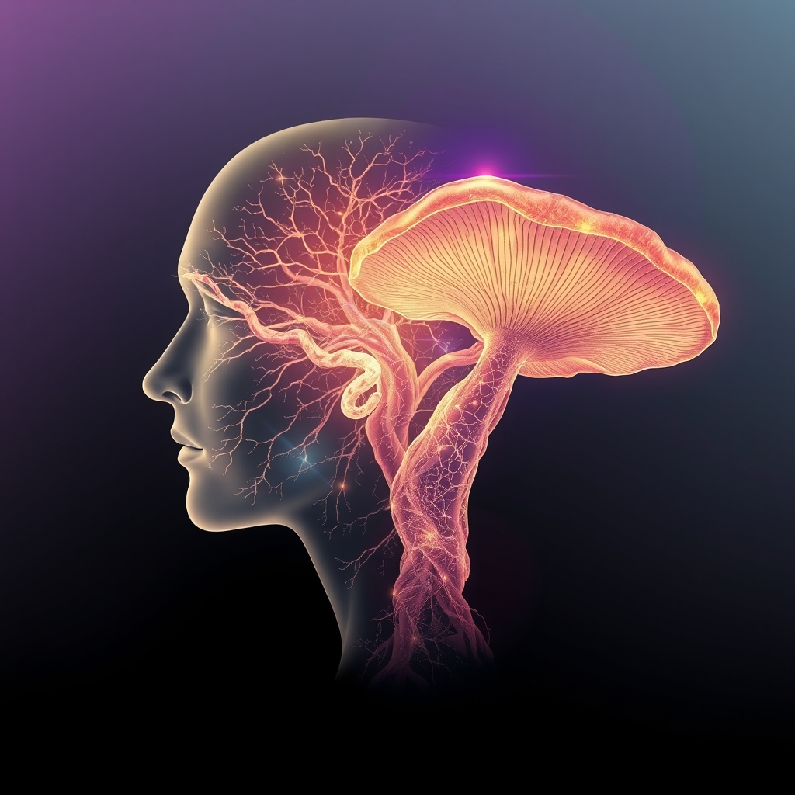

[Home](../index.md) > [Books](./index.md)  
# 🧠🍄 How to Change Your Mind: What the New Science of Psychedelics Teaches Us About Consciousness, Dying, Addiction, Depression, and Transcendence  
  
[🛒 How to Change Your Mind: What the New Science of Psychedelics Teaches Us About Consciousness, Dying, Addiction, Depression, and Transcendence. As an Amazon Associate I earn from qualifying purchases.](https://amzn.to/4kFyVyO)  
  
## 📖 Book Report: How to Change Your Mind  
  
## 🧠 Summary and Key Themes  
  
Michael Pollan's 🍄 *How to Change Your Mind* is a comprehensive exploration of the history, science, and therapeutic potential of psychedelic substances, specifically 🧪 LSD and 🍄 psilocybin. Pollan, initially a skeptical 📰 journalist, embarks on a 🗺️ journey that includes delving into the suppressed 📜 history of psychedelic research, understanding the 🧠 neuroscience behind their effects, and personally experiencing several guided 🍄 psychedelic trips. The book argues for a "renaissance" in the scientific understanding and potential clinical application of these compounds, challenging the negative stigma that has surrounded them since the 🎸 counterculture movement of the 1960s.  
  
Key themes explored in the book include:  
  
* 📜 **The Suppressed History of Psychedelic Research:** Pollan recounts the promising initial wave of research in the mid-20th century that explored psychedelics for treating various 🧠 mental health conditions like 😟 anxiety, 😥 depression, and 💊 addiction. This early research was largely halted due to the political and cultural backlash of the ☮️ 1960s.  
* 🧠 **The Neuroscience of Psychedelics:** The book examines how these substances affect the 🧠 brain, particularly the temporary dissolution of the 👤 ego and the increased interconnectedness of 🌐 brain networks. Pollan discusses the concept of the Default Mode Network (DMN) and how its reduced activity under the influence of psychedelics may correlate with the subjective experience of ego dissolution and altered states of 🤯 consciousness.  
* 🏥 **Therapeutic Potential:** Pollan highlights the promising results from recent clinical trials investigating the use of 🍄 psilocybin and 🧪 LSD, often in conjunction with therapy 🛋️, for conditions such as end-of-life 😟 anxiety in 🎗️ cancer patients, treatment-resistant 😥 depression, and 💊 addiction. The book suggests that the unique capacity of psychedelics to occasion ✨ "mystical experiences" or profound shifts in perspective may be key to their therapeutic effects.  
* 🚶 **Personal Exploration:** Pollan integrates his own experiences as a "reluctant psychonaut" into the narrative, offering a first-person perspective on the subjective effects of different 🍄 psychedelic substances. These personal accounts illustrate the concepts discussed and add a memoiristic layer to the scientific and historical reporting.  
* 🤔 **Consciousness and the Self:** The book delves into the philosophical implications of psychedelic experiences, particularly regarding the nature of 🤔 consciousness, the 👤 self, and the potential for ✨ transcendence. Pollan explores how temporarily disrupting the sense of a fixed self or ego can lead to new insights and perspectives.  
  
Pollan's writing blends scientific 📰 reporting, historical 📜 narrative, and personal 🚶 memoir to provide a balanced and accessible overview of a complex and often stigmatized topic. He makes a compelling case for the responsible re-examination of psychedelics as powerful tools for understanding the 🧠 mind and potentially treating 😟 mental suffering.  
  
## 📚 Additional Book Recommendations  
  
### 🧠 Similar Themes (Psychedelics, Consciousness Science)  
  
* 📖 ***The Psychedelic Explorer's Guide: Safe, Therapeutic, and Sacred Journeys*** by James Fadiman. A practical guide by a pioneering researcher, offering protocols for using psychedelics for spiritual, therapeutic, and problem-solving purposes.  
* 📖 ***Acid Test: LSD, Ecstasy, and the Power to Heal*** by Tom Shroder. Explores the therapeutic use of MDMA and other psychedelics through compelling patient stories and researcher perspectives.  
* 📖 ***Sacred Knowledge: Psychedelics and Religious Experiences*** by William A. Richards. A deep dive into the overlap between psychedelic experiences and mystical or religious consciousness by a clinical psychologist who has conducted psychedelic research since the 1960s.  
* 📖 ***DMT: The Spirit Molecule: A Doctor's Revolutionary Research into the Biology of Near-Death and Mystical Experiences*** by Rick Strassman. Chronicles the author's research into DMT and its profound effects on consciousness, often resulting in experiences perceived as spiritual or otherworldly.  
* 📖 ***This Is Your Mind on Plants*** by Michael Pollan. Pollan's follow-up book exploring other psychoactive plants like opium, caffeine, and mescaline, continuing his interest in the human relationship with mind-altering substances.  
* 📖 ***The Immortality Key: The Secret History of the Religion with No Name*** by Brian C. Muraresku. Investigates the potential historical use of psychedelic substances in ancient Greek religious rituals.  
* 📖 ***Good Chemistry: The Science of Connection from Soul to Psychedelics*** by Julie Holland. A look at the role of connection in mental well-being and how substances, including psychedelics, can affect it.  
* 📖 ***The Doors of Perception & Heaven and Hell*** by Aldous Huxley. Classic essays detailing Huxley's own experiences with mescaline and his reflections on altered states of consciousness, perception, and reality.  
  
### ⚔️ Contrasting Perspectives (Critiques, Alternative Approaches)  
  
* 📖 ***Unbroken Brain: A Revolutionary New Way of Understanding Addiction*** by Maia Szalavitz. Offers a different perspective on addiction, viewing it as a learning disorder rather than a moral failing, which can provide a contrasting view to the potential of psychedelics in addiction treatment.  
* 📖 ***Against Empathy: The Case for Rational Compassion*** by Paul Bloom. While not directly about psychedelics, this book challenges the uncritical embrace of empathy and could offer a contrasting view on the subjective emotional shifts sometimes reported during psychedelic experiences.  
* **[🤕🎼🧠 The Body Keeps the Score: Brain, Mind, and Body in the Healing of Trauma](./the-body-keeps-the-score-brain-mind-and-body-in-the-healing-of-trauma.md)** by Bessel van der Kolk. Focuses on the physiological impact of trauma and various therapeutic approaches, including somatic therapies, which can be seen as alternative or complementary methods for addressing mental health without psychedelics.  
* **[🔬🧘🏼‍♀️🧠 Altered Traits: Science Reveals How Meditation Changes Your Mind, Brain, and Body](./altered-traits-science-reveals-how-meditation-changes-your-mind-brain-and-body.md)** by Daniel Goleman and Richard Davidson. Explores the science of meditation and its long-term effects on the brain and consciousness, offering a non-pharmacological path to altering the mind.  
  
### ✨ Creatively Related (Philosophy, Anthropology, Neuroscience, Psychology)  
  
* 📖 ***The Anthropology of the Brain: Consciousness, Culture, and Free Will*** by Roger Bartra. Explores consciousness from an anthropological perspective, arguing that it's linked to external symbolic systems and culture, providing a broader context for understanding how substances might influence the mind within a cultural framework.  
* 📖 ***Food of the Gods: A Radical History of Plants, Psychedelics, and Human Evolution*** by Terence McKenna. A highly speculative but influential work proposing that the consumption of psilocybin mushrooms played a significant role in the evolution of human consciousness and language ("the stoned ape theory").  
* **[😀📜 The Happiness Hypothesis: Finding Modern Truth in Ancient Wisdom](./the-happiness-hypothesis-finding-modern-truth-in-ancient-wisdom.md)** by Jonathan Haidt. Blends ancient philosophical wisdom with modern psychological research on happiness, offering different frameworks for understanding well-being and the human mind.  
* **[🌊🧘🧠📈 Flow: The Psychology of Optimal Experience](./flow-the-psychology-of-optimal-experience.md)** by Mihaly Csikszentmihalyi. Explores the state of "flow," a state of optimal consciousness characterized by absorption and enjoyment, which can be compared or contrasted with the altered states induced by psychedelics.  
* 📖 ***The Teachings of Don Juan: A Yaqui Way of Knowledge*** by Carlos Castaneda. A controversial but widely read work exploring shamanism and altered states of consciousness through hallucinogenic plants within a specific cultural context.  
* 📖 ***Beyond Anxiety*** by Martha Beck. Offers a new approach to anxiety, viewing it as a potential doorway to creativity and higher consciousness, drawing on psychology and personal experience.  
* 📖 ***An Unquiet Mind: A Memoir of Moods and Madness*** by Kay Redfield Jamison. A memoir by a clinical psychologist about her own experience with bipolar disorder, offering a personal account of navigating significant mood and consciousness alterations.  
* **[🍄🌍🧠🔮 Entangled Life: How Fungi Make Our Worlds, Change Our Minds & Shape Our Futures](./entangled-life-how-fungi-make-our-worlds-change-our-minds-shape-our-futures.md)** by Merlin Sheldrake. While focused on fungi broadly, this book includes discussion of psilocybin-containing mushrooms and the profound impact fungi have on ecosystems and potentially on human consciousness, offering a biological and ecological perspective.  
  
## 💬 [Gemini](../software/gemini.md) Prompt (gemini-2.5-flash-preview-04-17)  
> Write a markdown-formatted (start headings at level H2) book report, followed by a plethora of additional similar, contrasting, and creatively related book recommendations on How to Change Your Mind: What the New Science of Psychedelics Teaches Us About Consciousness, Dying, Addiction, Depression, and Transcendence. Be thorough in content discussed but concise and economical with your language. Structure the report with section headings and bulleted lists to avoid long blocks of text.