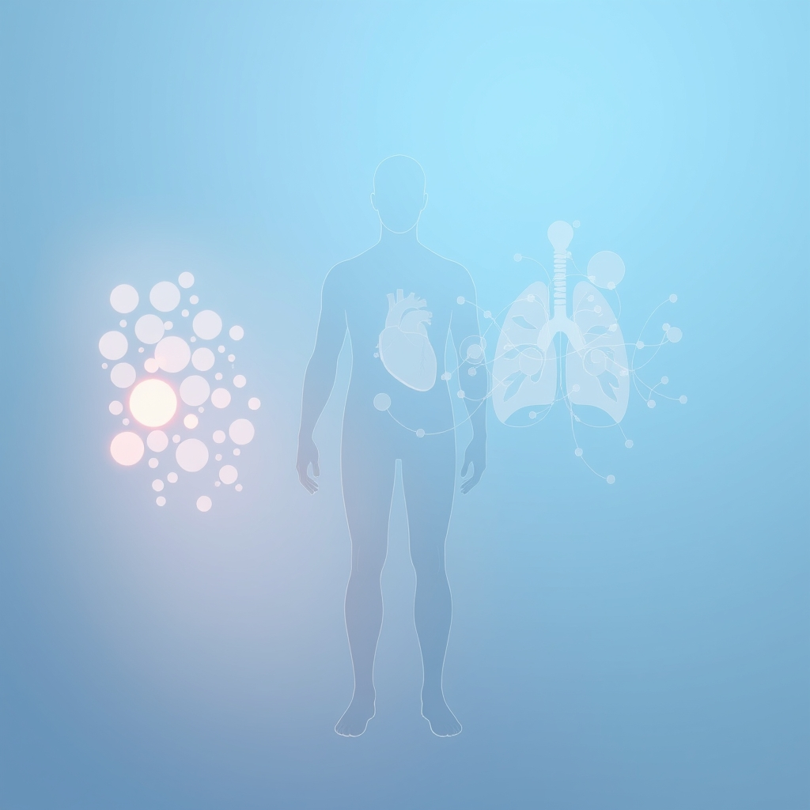

[Home](../index.md) > [Books](./index.md)  
# 🧑‍⚕️🧩 Human Physiology: From Cells to Systems  
  
[🛒 Human Physiology: From Cells to Systems. As an Amazon Associate I earn from qualifying purchases.](https://amzn.to/3SZ9TyW)  
  
## 📖 Book Report: Human Physiology: From Cells to Systems  
  
### ℹ️ Overview  
  
* 👤 **Author:** Lauralee Sherwood.  
* 🎯 **General Description/Purpose:** 📚 "Human Physiology: From Cells to Systems" is a comprehensive textbook designed to introduce students to the functional mechanisms of the human body. 🏡 It organizes material around the core principle of homeostasis, explaining how the body maintains a stable internal environment crucial for cell and organ function.  
* 🧑‍🎓 **Target Audience:** 🏫 This book is primarily intended for undergraduate students majoring in biological sciences, life sciences, and allied health fields, including those pursuing careers in nursing, physical therapy, and medical technology.  
  
### 🔑 Key Topics Covered  
  
🩺 The textbook systematically explores the various levels of human physiological organization, beginning with fundamental concepts and progressing to integrated organ systems. 🧬 Key areas typically covered include:  
  
* 👋 An introduction to the field of physiology and the crucial concept of homeostasis.  
* 🔬 Detailed coverage of cell physiology, including the structure and function of the plasma membrane and the generation of membrane potential.  
* 🧠 The fundamental principles governing neural and hormonal communication throughout the body.  
* ⚕️ In-depth examination of major organ systems, such as:  
    * 🧠 The central and peripheral nervous systems.  
    * 💪 The physiology of muscle tissue.  
    * ❤️ The cardiovascular system, encompassing the heart, blood vessels, and blood dynamics.  
    * 🩸 The composition and function of blood and the body's defense mechanisms.  
    * 🫁 The respiratory system.  
    * 🚽 The urinary system and the regulation of fluid and acid-base balance.  
    * 🍕 The digestive system.  
    * 🌡️ Mechanisms of energy balance and temperature regulation.  
    * hormone The endocrine system and its various glands.  
    * 🤰 The male and female reproductive systems.  
* 🧑‍⚕️ Integration of physiological concepts with real-world applications, pathophysiology, and clinical scenarios.  
* 🏃‍♀️ Specific attention is often given to the physiology of exercise.  
  
### 💪 Strengths/Approach  
  
* 🏡 **Central Theme of Homeostasis:** The book's organization around homeostasis provides a unifying framework that helps students understand the interconnectedness and integrated function of different body systems.  
* 🗣️ **Accessible Language:** Author Lauralee Sherwood is known for her clear and straightforward writing style, utilizing analogies and relatable examples to simplify complex physiological concepts.  
* 🎨 **Strong Visual Program:** The text features a robust art program with detailed illustrations, diagrams, and process-oriented figures designed to aid visual learners in grasping difficult concepts. 🖍️ A supplementary coloring book is also available.  
* ✍️ **Effective Pedagogy:** 🤔 The inclusion of features like section-end questions, boxes highlighting concepts, challenges, controversies, and the physiological impacts of exercise supports student learning and reinforces key ideas. 🗂️ Some editions may also include study aids like cards.  
* 🧱 **Solid Foundational Text:** 📚 It is widely regarded as an effective resource for students to build a strong understanding of core physiological principles.  
  
### 🧪 Potential Use Cases  
  
* 📚 Serving as the primary textbook for undergraduate courses in human physiology across various science and health disciplines.  
* 🚀 Providing an accessible starting point for students new to the study of human physiology.  
* 🔍 Acting as a valuable reference for students and professionals seeking clear explanations of physiological mechanisms.  
  
## ➕ Additional Book Recommendations  
  
### 📚 Similar Textbooks  
  
* 🩺 **Guyton and Hall Textbook of Medical Physiology:** ⚕️ A long-standing and highly detailed textbook widely used in medical schools, known for its comprehensive coverage of physiological principles and their relevance to disease.  
* 🫁 **Berne and Levy Physiology:** Another rigorous and detailed text frequently used in medical physiology programs, offering in-depth explanations of physiological mechanisms.  
* 🔗 **Human Physiology: An Integrated Approach by Dee Unglaub Silverthorn:** 📖 This textbook emphasizes the interconnectedness of body systems and employs a storytelling approach with a focus on clinical examples.  
* 🦴 **Principles of Anatomy and Physiology by Gerard J. Tortora:** 📚 While covering both anatomy and physiology, this book provides a thorough treatment of physiological concepts, also structured around homeostasis, and is known for its excellent illustrations.  
* 📝 **Ganong's Review of Medical Physiology:** 📑 A more concise review book that covers the essential concepts of medical physiology, often used as a supplement or for exam preparation.  
  
### ⚖️ Contrasting Approaches  
  
* 🤓 **Costanzo Physiology:** ⭐️ A popular review book offering a more streamlined and exam-focused presentation of key physiological concepts, particularly useful for medical students.  
* 🔬 **Medical Physiology by Boron & Boulpaep:** 📚 A highly detailed and extensive textbook that delves deeply into the cellular and molecular basis of physiological processes, often used for advanced study.  
* 🏥 **Ross & Wilson Anatomy and Physiology in Health and Illness:** 👩‍⚕️ Geared towards students in nursing and allied health, this book integrates fundamental anatomy and physiology with basic pathology and common diseases.  
* ✏️ **Hole's Essentials of Human Anatomy and Physiology by David Shier:** 📖 This text offers a less detailed, more introductory overview suitable for shorter courses or students with less prior science background.  
  
### ✨ Creatively Related  
  
* 🎨 **Anatomy Coloring Books:** 🌈 Resources like coloring books based on textbooks (such as one available for Sherwood's text) offer an interactive and visual method for learning anatomical structures and physiological pathways.  
* 🧑‍🎨 **The Way We Work: Getting to Know the Amazing Human Body by David Macaulay:** 📖 This book uses engaging illustrations to explain the functions of the human body in a way that is accessible and fascinating for a broad audience, including younger learners.  
* 📜 **Books on the History of Medicine:** 🕰️ Exploring the evolution of our understanding of the human body and its functions, through books like "Exploring the History of Medicine," can provide rich historical context to contemporary physiology.  
* 🏋️‍♂️ **Books on Specialized Physiology:** 🚴 Delving into areas like exercise physiology, environmental physiology, or the physiology of specific organ systems can demonstrate the application of core principles in particular contexts.  
* 📰 **Popular Science Books about the Body:** 📖 Many books for general readers explore fascinating aspects of human biology, disease, or the latest physiological research in an engaging and non-textbook format. (Specific titles would vary widely but represent a valid category).  
* 🧬 **Texts on Cellular and Molecular Biology:** 🦠 Given the "Cells to Systems" approach, books focusing specifically on cell biology, biochemistry, or molecular biology provide essential foundational knowledge for understanding physiological mechanisms at the smallest scales. (Specific titles would depend on the desired level of detail).  
  
## 💬 [Gemini](../software/gemini.md) Prompt (gemini-2.5-flash-preview-04-17)  
> Write a markdown-formatted (start headings at level H2) book report, followed by a plethora of additional similar, contrasting, and creatively related book recommendations on Human Physiology: From Cells to Systems. Be thorough in content discussed but concise and economical with your language. Structure the report with section headings and bulleted lists to avoid long blocks of text.  
  
## 🐦 Tweet  
<blockquote class="twitter-tweet" data-theme="dark">
🧑‍⚕️🧩 Human Physiology: From Cells to Systems  🧬 Cell Function | ❤️ Organ Systems | 🧠 Neural Communication | 🌡️ Temperature Regulation | 🩺 Clinical Applications<a href="https://t.co/T6cJKg4nm7">https://t.co/T6cJKg4nm7</a>
&mdash; Bryan Grounds (@bagrounds) <a href="https://twitter.com/bagrounds/status/1935118032747249880?ref_src=twsrc%5Etfw">June 17, 2025</a></blockquote> 